<div align="center">
    <br>
</div>
<h3 align="center"> Universidad Peruana de Ciencias Aplicadas </h3>

<h3 align="center">Carrera de  Ingeniería de Software </h3>

<h3 align="center">1ASI0729 </h3>
<h3 align="center">Desarrollo de Aplicaciones Open Source</h3>
<h3 align="center"> NRC </h3>
<h3 align="center"> 7747 </h3>

<h3 align="center">Informe del Trabajo Final</h3>


<h3 align="center"> Docente</h3>
<h3 align="center">Bautista Ubillús, Efraín Ricardo </h3>


<h3 align="center"> Equipo </h3>
<h3 align="center">TerraNova</h3>

<h3 align="center"> Proyecto</h3>
<h3 align="center"> TerraNova Platform </h3>

<h3 align="center"> Integrantes </h3>

<div align="center">

| Code | Member |
| :---: | :--- |
| u20241f246 | Atauje Barreto, Alexander Sebastián |
| u202215188 | Egocheaga Suyo, Miguel Angel |
| u202116018 | Orellana Rodríguez, Mel Andree |
| U20231h171 | Vera Solsol, Nayely Macarena |
| u202318001 |Raymundo Villarroel, Abigail Nadhim |

</div>

<h3 align="center">Periodo 202620</h3>
<h3 align="center">Agosto, 2026</h3>


<div style="page-break-after: always;"></div>

## Registro de Versiones del Informe

<div align="center">

| Versión |    Fecha    |                Autor                |                                                                                                Descripción de modificación                                                                                                |
|:-------:|:----------:|:-----------------------------------:|:-------------------------------------------------------------------------------------------------------------------------------------------------------------------------------------------------------------------------:|
| [Versión] | [DD-MM-AAAA] | [Apellidos, Nombres] | [Descripción del cambio o aporte] |

</div>

## Project Report Collaboration Insights

<div align="center">

| Integrante | Tareas Asignadas |
|---|---|
| [Nombre Completo 1] | [Lista de tareas realizadas] |
| [Nombre Completo 2] | [Lista de tareas realizadas] |
| [Nombre Completo 3] | [Lista de tareas realizadas] |
| [Nombre Completo 4] | [Lista de tareas realizadas] |
| [Nombre Completo 5] | [Lista de tareas realizadas] |

</div>


El proceso de colaboración en el informe se realizó mediante commits constantes al repositorio de la organización.


## Tabla de Contenidos

* [Capítulo I: Introducción](#capítulo-i-introducción)
  * [1.1. Startup Profile](#11-startup-profile)
    * [1.1.1. Descripción de la Startup](#111-descripción-de-la-startup)
    * [1.1.2. Perfiles de integrantes del equipo](#112-perfiles-de-integrantes-del-equipo)
  * [1.2. Solution Profile](#12-solution-profile)
    * [1.2.1. Antecedentes y problemática](#121-antecedentes-y-problemática)
    * [1.2.2. Lean UX Process](#122-lean-ux-process)
      * [1.2.2.1. Lean UX Problem Statements](#1221-lean-ux-problem-statements)
      * [1.2.2.2. Lean UX Assumptions](#1222-lean-ux-assumptions)
      * [1.2.2.3. Lean UX Hypothesis Statements](#1223-lean-ux-hypothesis-statements)
      * [1.2.2.4. Lean UX Canvas](#1224-lean-ux-canvas)
  * [1.3. Segmentos objetivo](#13-segmentos-objetivo)
* [Capítulo II: Requirements Elicitation & Analysis](#capítulo-ii-requirements-elicitation--analysis)
  * [2.1. Competidores](#21-competidores)
    * [2.1.1. Análisis competitivo](#211-análisis-competitivo)
    * [2.1.2. Estrategias y tácticas frente a competidores](#212-estrategias-y-tácticas-frente-a-competidores)
  * [2.2. Entrevistas](#22-entrevistas)
    * [2.2.1. Diseño de entrevistas](#221-diseño-de-entrevistas)
    * [2.2.2. Registro de entrevistas](#222-registro-de-entrevistas)
    * [2.2.3. Análisis de entrevistas](#223-análisis-de-entrevistas)
  * [2.3. Needfinding](#23-needfinding)
    * [2.3.1. User Personas](#231-user-personas)
    * [2.3.2. User Task Matrix](#232-user-task-matrix)
    * [2.3.3. User Journey Mapping](#233-user-journey-mapping)
    * [2.3.4. Empathy Mapping](#234-empathy-mapping)
  * [2.4. Big Picture Event Storming](#24-big-picture-event-storming)
  * [2.5. Ubiquitous Language](#25-ubiquitous-language)
* [Capítulo III: Requirements Specification](#capítulo-iii-requirements-specification)
  * [3.1. User Stories](#31-user-stories)
  * [3.2. Impact Mapping](#32-impact-mapping)
  * [3.3. Product Backlog](#33-product-backlog)
* [Capítulo IV: Product Design](#capítulo-iv-product-design)
  * [4.1. Style Guidelines](#41-style-guidelines)
    * [4.1.1. General Style Guidelines](#411-general-style-guidelines)
    * [4.1.2. Web Style Guidelines](#412-web-style-guidelines)
  * [4.2. Information Architecture](#42-information-architecture)
    * [4.2.1. Organization Systems](#421-organization-systems)
    * [4.2.2. Labeling Systems](#422-labeling-systems)
    * [4.2.3. SEO Tags and Meta Tags](#423-seo-tags-and-meta-tags)
    * [4.2.4. Searching Systems](#424-searching-systems)
    * [4.2.5. Navigation Systems](#425-navigation-systems)
  * [4.3. Landing Page UI Design](#43-landing-page-ui-design)
    * [4.3.1. Landing Page Wireframe](#431-landing-page-wireframe)
    * [4.3.2. Landing Page Mock-up](#432-landing-page-mock-up)
  * [4.4. Web Applications UX/UI Design](#44-web-applications-uxui-design)
    * [4.4.1. Web Applications Wireframes](#441-web-applications-wireframes)
    * [4.4.2. Web Applications Wireflow Diagrams](#442-web-applications-wireflow-diagrams)
    * [4.4.3. Web Applications Mock-ups](#443-web-applications-mock-ups)
    * [4.4.4. Web Applications User Flow Diagrams](#444-web-applications-user-flow-diagrams)
  * [4.5. Web Applications Prototyping](#45-web-applications-prototyping)
  * [4.6. Domain-Driven Software Architecture](#46-domain-driven-software-architecture)
    * [4.6.1. Design-Level Event Storming](#461-design-level-event-storming)
    * [4.6.2. Software Architecture Context Diagram](#462-software-architecture-context-diagram)
    * [4.6.3. Software Architecture Container Diagrams](#463-software-architecture-container-diagrams)
    * [4.6.4. Software Architecture Components Diagrams](#464-software-architecture-components-diagrams)
  * [4.7. Software Object-Oriented Design](#47-software-object-oriented-design)
    * [4.7.1. Class Diagrams](#471-class-diagrams)
  * [4.8. Database Design](#48-database-design)
    * [4.8.1. Database Diagrams](#481-database-diagrams)
* [Capítulo V: Product Implementation, Validation & Deployment](#capítulo-v-product-implementation-validation--deployment)
  * [5.1. Software Configuration Management](#51-software-configuration-management)
    * [5.1.1. Software Development Environment Configuration](#511-software-development-environment-configuration)
    * [5.1.2. Source Code Management](#512-source-code-management)
    * [5.1.3. Source Code Style Guide & Conventions](#513-source-code-style-guide--conventions)
    * [5.1.4. Software Deployment Configuration](#514-software-deployment-configuration)
  * [5.2. Landing Page, Services & Applications Implementation](#52-landing-page-services--applications-implementation)
    * [5.2.1. Sprint 1](#521-sprint-1)
      * [5.2.1.1. Sprint Planning 1](#5211-sprint-planning-1)
      * [5.2.1.2. Aspect Leaders and Collaborators](#5212-aspect-leaders-and-collaborators)
      * [5.2.1.3. Sprint Backlog 1](#5213-sprint-backlog-1)
      * [5.2.1.4. Development Evidence for Sprint Review](#5214-development-evidence-for-sprint-review)
      * [5.2.1.5. Execution Evidence for Sprint Review](#5215-execution-evidence-for-sprint-review)
      * [5.2.1.6. Services Documentation Evidence for Sprint Review](#5216-services-documentation-evidence-for-sprint-review)
      * [5.2.1.7. Software Deployment Evidence for Sprint Review](#5217-software-deployment-evidence-for-sprint-review)
      * [5.2.1.8. Team Collaboration Insights during Sprint](#5218-team-collaboration-insights-during-sprint)
    * [5.2.2. Sprint 2](#522-sprint-2)
      * [5.2.2.1. Sprint Planning 2](#5221-sprint-planning-2)
      * [5.2.2.2. Aspect Leaders and Collaborators](#5222-aspect-leaders-and-collaborators)
      * [5.2.2.3. Sprint Backlog 2](#5223-sprint-backlog-2)
      * [5.2.2.4. Development Evidence for Sprint Review](#5224-development-evidence-for-sprint-review)
      * [5.2.2.5. Execution Evidence for Sprint Review](#5225-execution-evidence-for-sprint-review)
      * [5.2.2.6. Services Documentation Evidence for Sprint Review](#5226-services-documentation-evidence-for-sprint-review)
      * [5.2.2.7. Software Deployment Evidence for Sprint Review](#5227-software-deployment-evidence-for-sprint-review)
      * [5.2.2.8. Team Collaboration Insights during Sprint](#5228-team-collaboration-insights-during-sprint)
    * [5.2.3. Sprint 3](#523-sprint-3)
      * [5.2.3.1. Sprint Planning 3](#5231-sprint-planning-3)
      * [5.2.3.2. Aspect Leaders and Collaborators](#5232-aspect-leaders-and-collaborators)
      * [5.2.3.3. Sprint Backlog 3](#5233-sprint-backlog-3)
      * [5.2.3.4. Development Evidence for Sprint Review](#5234-development-evidence-for-sprint-review)
      * [5.2.3.5. Execution Evidence for Sprint Review](#5235-execution-evidence-for-sprint-review)
      * [5.2.3.6. Services Documentation Evidence for Sprint Review](#5236-services-documentation-evidence-for-sprint-review)
      * [5.2.3.7. Software Deployment Evidence for Sprint Review](#5237-software-deployment-evidence-for-sprint-review)
      * [5.2.3.8. Team Collaboration Insights during Sprint](#5238-team-collaboration-insights-during-sprint)
    * [5.2.4. Sprint 4](#524-sprint-4)
      * [5.2.4.1. Sprint Planning 4](#5241-sprint-planning-4)
      * [5.2.4.2. Aspect Leaders and Collaborators](#5242-aspect-leaders-and-collaborators)
      * [5.2.4.3. Sprint Backlog 4](#5243-sprint-backlog-4)
      * [5.2.4.4. Development Evidence for Sprint Review](#5244-development-evidence-for-sprint-review)
      * [5.2.4.5. Execution Evidence for Sprint Review](#5245-execution-evidence-for-sprint-review)
      * [5.2.4.6. Services Documentation Evidence for Sprint Review](#5246-services-documentation-evidence-for-sprint-review)
      * [5.2.4.7. Software Deployment Evidence for Sprint Review](#5247-software-deployment-evidence-for-sprint-review)
      * [5.2.4.8. Team Collaboration Insights during Sprint](#5248-team-collaboration-insights-during-sprint)
  * [5.3. Validation Interviews](#53-validation-interviews)
    * [5.3.1. Diseño de Entrevistas](#531-diseño-de-entrevistas)
    * [5.3.2. Registro de Entrevistas](#532-registro-de-entrevistas)
    * [5.3.3. Evaluaciones según heurísticas](#533-evaluaciones-según-heurísticas)
  * [5.4. Video About-the-Product](#54-video-about-the-product)
* [Conclusiones y Recomendaciones](#conclusiones-y-recomendaciones)
* [Video App Validation](#video-app-validation)
* [Video About the product](#video-about-the-product)
* [Video About the team](#video-about-the-team)
* [Glosario](#glosario)
* [Bibliografía](#bibliografía)
* [Anexos](#anexos)


# Student Outcome

<div align="center">
  <table style="width:100%; border-collapse: collapse; font-family: Arial, sans-serif; font-size: 14px;">
    <thead>
      <tr style="background-color: #f2f2f2; text-align: center;">
        <th style="border: 1px solid #dddddd; padding: 12px; width: 25%;">Criterio específico</th>
        <th style="border: 1px solid #dddddd; padding: 12px; width: 45%;">Acciones realizadas</th>
        <th style="border: 1px solid #dddddd; padding: 12px; width: 30%;">Conclusiones</th>
      </tr>
    </thead>
    <tbody>
      <tr>
        <td style="border: 1px solid #dddddd; padding: 10px; font-weight: bold; vertical-align: top;">
          Trabaja en equipo para proporcionar liderazgo en forma conjunta.
        </td>
        <td style="border: 1px solid #dddddd; padding: 10px; vertical-align: top;">
          <ul>
            <li><b>[Entrega] - [Nombre del Integrante]:</b> [Descripción de la acción realizada]</li>
          </ul>
        </td>
        <td style="border: 1px solid #dddddd; padding: 10px; vertical-align: top;">
          [Conclusión sobre el criterio]
        </td>
      </tr>
      <tr>
        <td style="border: 1px solid #dddddd; padding: 10px; font-weight: bold; vertical-align: top;">
          Crea un entorno colaborativo e inclusivo, establece metas, planifica tareas y cumple objetivos.
        </td>
        <td style="border: 1px solid #dddddd; padding: 10px; vertical-align: top;">
          <ul>
            <li><b>[Entrega] - [Nombre del Integrante]:</b> [Descripción de la acción realizada]</li>
          </ul>
        </td>
        <td style="border: 1px solid #dddddd; padding: 10px; vertical-align: top;">
          [Conclusión sobre el criterio]
        </td>
      </tr>
    </tbody>
  </table>
</div>


# Capítulo I: Introducción

## 1.1. Startup Profile
### 1.1.1. Descripción de la Startup
### 1.1.2. Perfiles de integrantes del equipo

## 1.2. Solution Profile
### 1.2.1. Antecedentes y problemática
### 1.2.2. Lean UX Process
#### 1.2.2.1. Lean UX Problem Statements
#### 1.2.2.2. Lean UX Assumptions
#### 1.2.2.3. Lean UX Hypothesis Statements
#### 1.2.2.4. Lean UX Canvas

## 1.3. Segmentos objetivo

# Capítulo II: Requirements Elicitation & Analysis

## 2.1. Competidores
### 2.1.1. Análisis competitivo
### 2.1.2. Estrategias y tácticas frente a competidores

## 2.2. Entrevistas
### 2.2.1. Diseño de entrevistas
### 2.2.2. Registro de entrevistas
### 2.2.3. Análisis de entrevistas

## 2.3. Needfinding
### 2.3.1. User Personas
### 2.3.2. User Task Matrix
### 2.3.3. User Journey Mapping
### 2.3.4. Empathy Mapping

## 2.4. Big Picture Event Storming

## 2.5. Ubiquitous Language

# Capítulo III: Requirements Specification

## 3.1. User Stories

## 3.2. Impact Mapping

## 3.3. Product Backlog

# Capítulo IV: Product Design

## 4.1. Style Guidelines
### 4.1.1. General Style Guidelines
### 4.1.2. Web Style Guidelines

## 4.2. Information Architecture
### 4.2.1. Organization Systems
### 4.2.2. Labeling Systems
### 4.2.3. SEO Tags and Meta Tags
### 4.2.4. Searching Systems
### 4.2.5. Navigation Systems

## 4.3. Landing Page UI Design
### 4.3.1. Landing Page Wireframe
### 4.3.2. Landing Page Mock-up

## 4.4. Web Applications UX/UI Design
### 4.4.1. Web Applications Wireframes
### 4.4.2. Web Applications Wireflow Diagrams
### 4.4.3. Web Applications Mock-ups
### 4.4.4. Web Applications User Flow Diagrams

## 4.5. Web Applications Prototyping

## 4.6. Domain-Driven Software Architecture

Allpatek permite que un comerciante contrate una parcela y el trabajo de un agricultor durante una temporada. La arquitectura organiza las funciones necesarias para publicar parcelas, establecer contratos, registrar pagos y consultar el avance del cultivo.

Se utiliza **Domain-Driven Design (DDD)** para agrupar el sistema según sus responsabilidades de negocio. Cada grupo se denomina **bounded context**: un área con datos y reglas propios. Para este proyecto se proponen cinco áreas:

| Bounded context | Responsabilidad | Ejemplo en Allpatek |
|---|---|---|
| Users and Profiles | Usuarios, perfiles y calificaciones. | El comerciante consulta la experiencia previa de un agricultor. |
| Land Management | Parcelas, fotografías y disponibilidad. | El agricultor publica una parcela para una temporada. |
| Season Contracting | Contratos, aceptación de condiciones e hitos. | Ambas partes acuerdan fechas, costos y etapas del trabajo. |
| Payments and Plans | Pagos y planes de suscripción propuestos. | Se consulta un abono o el pago correspondiente a un hito. |
| Crop Monitoring | Avances, evidencias y alertas climáticas. | El agricultor registra la siembra y el comerciante recibe una actualización. |

Estos módulos se implementarán dentro de una misma API Spring Boot. Se comunicarán mediante sus servicios, manteniendo la responsabilidad de cada uno. Por ejemplo, Contratos consulta la disponibilidad de Parcelas y el estado de Pagos para determinar si puede activar un acuerdo. n8n se utiliza como herramienta de automatización para documentos y mensajes.

**Base de la propuesta.** Se utiliza el nombre Allpatek empleado en los capítulos I, II y IV. Se consideran los roles agricultor y comerciante, sin excluir a familias ni negocios. Los planes de suscripción proceden del capítulo IV y las calificaciones, WhatsApp y el uso con conectividad limitada proceden del capítulo I. Son funciones propuestas, no capacidades ya implementadas.

Los términos de cada contrato deben aclarar qué producción recibirá el comerciante y qué ocurre ante una pérdida de cosecha. La arquitectura permite registrar estas condiciones, pero no presupone una cantidad garantizada ni la eliminación del riesgo agrícola. Tampoco se consideran definitivos los precios de los planes, el número de hitos o el proveedor de pagos.

### 4.6.1. Design-Level Event Storming

El **Design-Level EventStorming** permite recorrer lo que sucede en el negocio y relacionarlo con las funciones del sistema. Se identifican las acciones, sus resultados y las reglas necesarias. Esta propuesta detalla el Big Picture Event Storming del capítulo II y se relaciona con US02, US07, US21, US08, US09, US04 y US03 del capítulo III.

| Elemento | Qué significa | Ejemplo |
|---|---|---|
| Actor | Persona o servicio que participa. | Agricultor, comerciante o servicio de pagos. |
| Command | Acción que se solicita. | PublishPlot: publicar una parcela. |
| Event | Hecho que ya ocurrió. | PaymentConfirmed: pago confirmado. |
| Aggregate | Objeto principal que controla un grupo de datos y reglas. | Contract controla las condiciones y los hitos del acuerdo. |
| Policy | Regla que indica cuándo debe ocurrir otra acción. | Después de confirmar el pago y las aceptaciones, activar el contrato. |
| Query / Read model | Información que se consulta sin modificarla. | Parcelas disponibles o estado de un contrato. |

El flujo principal es: el agricultor publica una parcela; el comerciante consulta el catálogo y envía una propuesta; el agricultor la acepta o presenta una contraoferta; se realiza una reserva temporal; ambas partes aceptan las mismas condiciones; se verifica el pago; se activa el contrato y se envía el PDF. Durante la temporada, el agricultor registra avances y el comerciante revisa los hitos acordados.


*Figura 4.6.1. Propuesta de EventStorming para el flujo principal.* [Diagrama editable](assets/chapter-04/architecture/01-eventstorming.puml).

Los agregados principales son User, Plot, Proposal, Reservation, Contract, Payment y ProgressUpdate. Las consultas iniciales son SearchPlots, GetProposal, GetReservation, GetContract, GetPayments y GetProgress. Los contratos relacionan el catálogo con pagos y seguimiento, manteniendo el acuerdo como referencia común.

Las reglas principales son:

- Una propuesta puede recibir una contraoferta y vence si el comerciante no responde dentro del plazo acordado. Una reserva temporal evita que una misma parcela se ofrezca a dos comerciantes mientras se confirma el pago.
- Una parcela no puede asignarse a dos contratos activos con fechas superpuestas. La API revisa la disponibilidad también al confirmar la contratación.
- El contrato se activa cuando ambas partes aceptaron las mismas condiciones y se verificó el pago correspondiente. Si se cambian las condiciones antes de la activación, deben aceptarse nuevamente.
- El agricultor registra evidencias con fecha y ubicación; el comerciante revisa los criterios del hito. Un rechazo debe incluir una observación que permita corregirlo.
- La aprobación de un hito y la confirmación de su desembolso son hechos diferentes. El estado del pago se actualiza según el resultado del proveedor.
- Los criterios de pago por labor deben distinguir el trabajo realizado del rendimiento de la cosecha, de acuerdo con el modelo del capítulo I.
- Una falla de correo no anula un contrato ni debe duplicar un pago.

**Validación colaborativa pendiente:** el recorrido ya se relaciona con el Big Picture Event Storming y las historias disponibles. Aún falta realizar y evidenciar la sesión de diseño del equipo con su fecha, participantes, enlace y capturas reales del tablero. En ella se revisarán los límites de cada área y las preguntas abiertas.

### 4.6.2. Software Architecture Context Diagram

El diagrama de contexto muestra Allpatek como un sistema completo: quién lo utiliza y con qué servicios externos se comunica. El agricultor publica parcelas y reporta labores. El comerciante consulta ofertas, contrata una temporada y revisa los avances. Los servicios externos permiten verificar pagos, obtener información meteorológica y enviar mensajes.

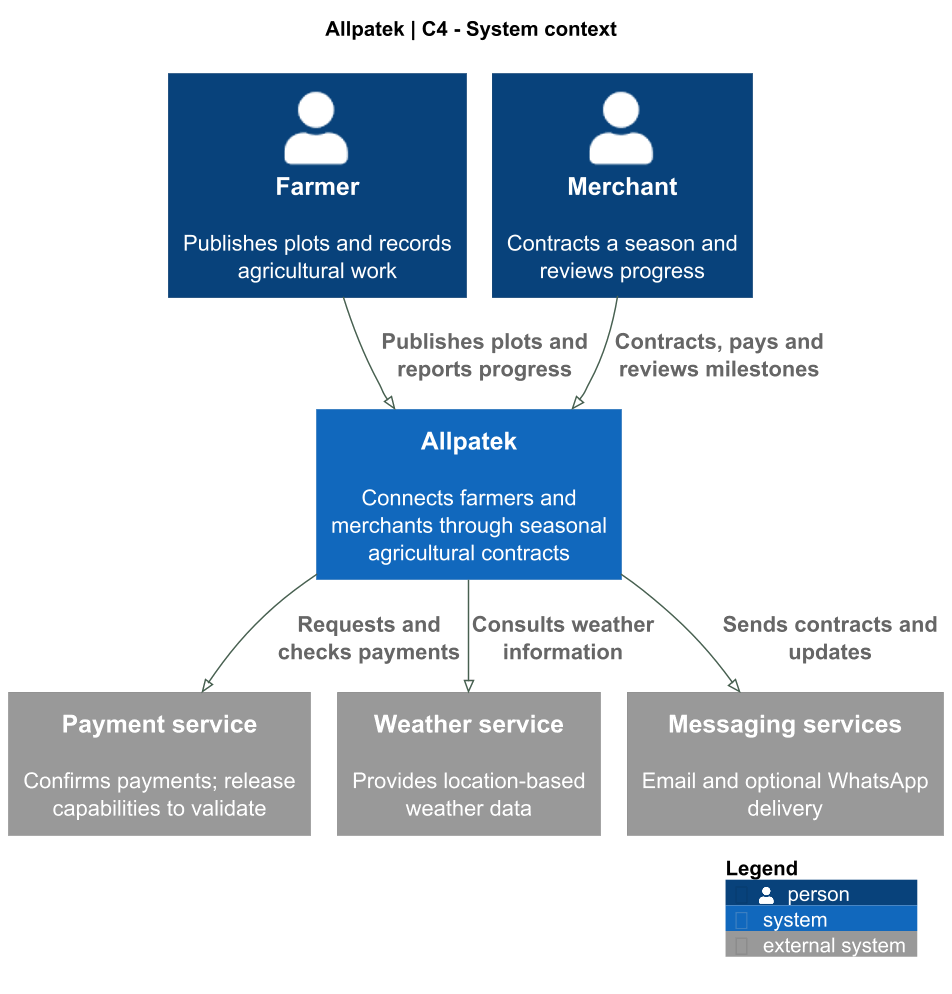

*Figura 4.6.2. Diagrama de contexto de Allpatek.* [Diagrama editable](assets/chapter-04/architecture/02-context.puml).

Esta vista ayuda a reconocer el alcance del producto. Los proveedores concretos todavía deben seleccionarse. La custodia real de fondos descrita en los prototipos depende de las capacidades del proveedor; una demostración con pagos simulados deberá identificarse como tal.

### 4.6.3. Software Architecture Container Diagrams

El diagrama de contenedores muestra las aplicaciones y almacenes que forman la solución. En C4, la palabra *container* se refiere a una aplicación o almacén de datos; no exige utilizar Docker.

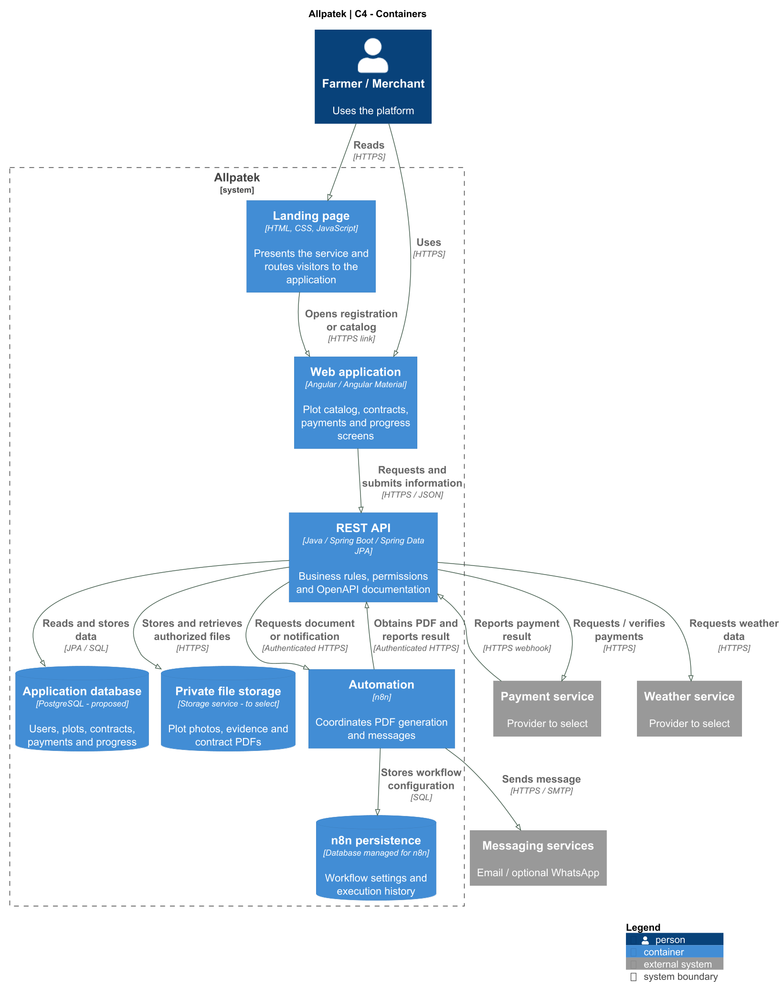

*Figura 4.6.3. Aplicaciones y almacenamiento de Allpatek.* [Diagrama editable](assets/chapter-04/architecture/03-containers.puml).

| Elemento | Función | Tecnología propuesta |
|---|---|---|
| Landing page | Presentar el negocio y dirigir al registro o catálogo. | HTML5, CSS3 y JavaScript. |
| Web application | Mostrar las pantallas que utilizan agricultores y comerciantes. | Angular, TypeScript y Angular Material. |
| REST API | Procesar solicitudes, validar reglas y administrar información. | Java, Spring Boot y Spring Data JPA; documentación OpenAPI/Swagger. |
| Base de datos | Guardar usuarios, parcelas, contratos, pagos y avances. | PostgreSQL, como propuesta a confirmar con el equipo. |
| Almacenamiento de archivos | Conservar fotos, evidencias y documentos PDF. | Servicio privado de almacenamiento por seleccionar. |
| n8n | Coordinar la generación del documento y el envío de mensajes. | Flujos de automatización n8n, con su almacenamiento de configuración. |

La aplicación Angular se comunica con la API; la API consulta y guarda los datos. Los archivos se entregan únicamente a usuarios autorizados. n8n recibe una solicitud de la API, obtiene el documento y coordina su envío. Para generar el PDF, se propone que n8n invoque un servicio Java de la API que utilice los datos del contrato.

La interfaz tendrá inglés como idioma predeterminado y español latinoamericano como alternativa, conforme al enunciado. Las pantallas contemplarán uso con teclado, etiquetas claras, contraste y adaptación a móviles. Para la conectividad limitada se propone conservar borradores de avances y enviarlos al recuperar conexión; pagos y aceptación de contratos requieren conexión.

### 4.6.4. Software Architecture Components Diagrams

Los componentes permiten ver cómo se organiza cada aplicación por dentro. En la API, los **controladores** reciben solicitudes, los **servicios** realizan las operaciones del negocio y los **repositorios** consultan o guardan datos. Cada módulo mantiene sus propias reglas. En la figura, el bloque Repositories resume los repositorios de las cinco áreas.

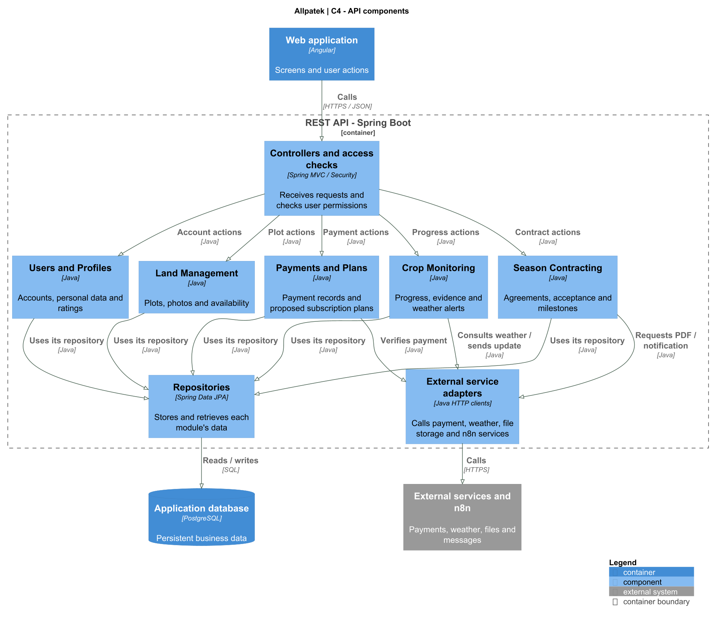

*Figura 4.6.4-A. Componentes de la API.* [Diagrama editable](assets/chapter-04/architecture/04-api-components.puml).

Por ejemplo, una solicitud de contratación llega al controlador, pasa al servicio de contratos y se guarda mediante su repositorio. Cuando la operación necesita pagos, clima o mensajes, utiliza la integración correspondiente. Los servicios de Contratos, Parcelas, Pagos y Seguimiento se consultan entre sí cuando el proceso lo requiere.

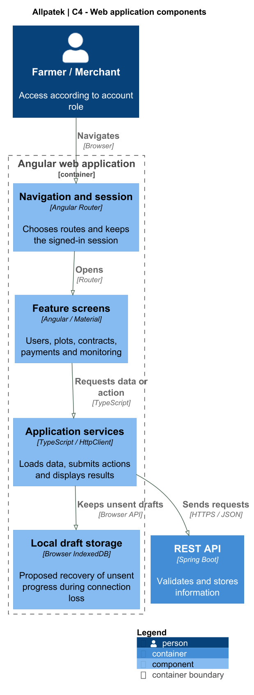

*Figura 4.6.4-B. Componentes de la aplicación web.* [Diagrama editable](assets/chapter-04/architecture/05-web-components.puml).

La navegación abre las pantallas según el usuario. Los servicios de Angular solicitan información a la API y muestran sus resultados. Guardar un borrador local permite recuperar un avance aún no enviado; no significa que el servidor ya lo haya registrado.

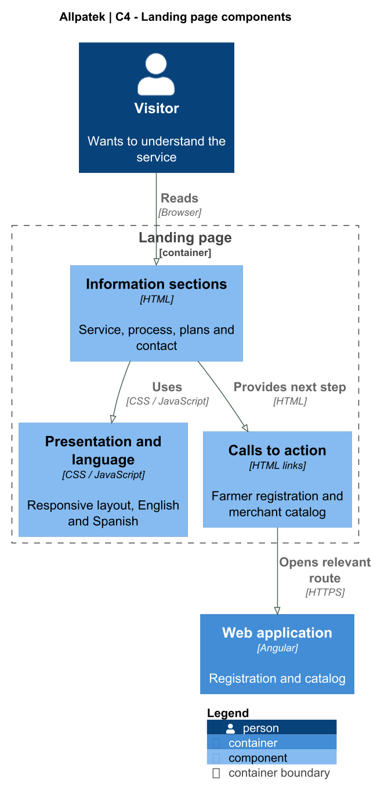

*Figura 4.6.4-C. Componentes de la landing page.* [Diagrama editable](assets/chapter-04/architecture/06-landing-components.puml).

Las secciones presentan el servicio, mientras los estilos y el idioma mantienen una experiencia consistente. Los botones principales conducen a la vista correspondiente de la aplicación.

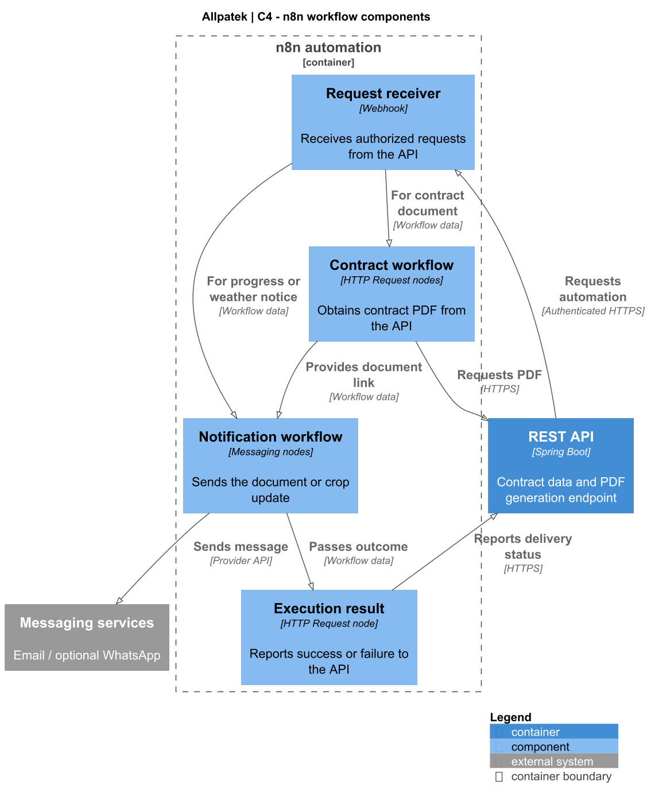

*Figura 4.6.4-D. Componentes de la automatización.* [Diagrama editable](assets/chapter-04/architecture/07-n8n-components.puml).

Un flujo solicita el PDF del contrato; otro envía avisos de avance o clima. Ambos informan si el envío fue exitoso. El correo será el canal inicial; WhatsApp se integrará si el equipo confirma su proveedor y alcance.

Los almacenes se detallan en el diseño de datos de 4.8. La base propia de n8n guarda su configuración y ejecuciones; no reemplaza la base de contratos y pagos de Allpatek.

## 4.7. Software Object-Oriented Design

El diseño orientado a objetos representa los elementos del negocio mediante clases. Cada clase reúne información y operaciones relacionadas. Por ejemplo, Contract conserva las fechas de la temporada y permite registrar su aceptación o cierre.

Se proponen clases agrupadas en los mismos cinco módulos de la arquitectura. Los atributos se muestran con **-** para indicar acceso privado y los métodos con **+** para indicar acceso público. Las relaciones señalan cómo se conectan las clases y cuántos elementos pueden participar. Las enumeraciones agrupan valores permitidos, como los roles de usuario o estados de contrato.

### 4.7.1. Class Diagrams

Los diagramas siguientes corresponden al modelo de negocio de la API Java. Se incluye una interfaz Repository representativa por módulo para mostrar cómo se separa la consulta de datos de las clases del negocio. Las referencias entre módulos utilizan identificadores, como merchantId o contractId.

#### Users and Profiles

User representa a una persona registrada y su rol. Review guarda la calificación que una parte deja a la otra al terminar un contrato. Esto recoge la reputación bidireccional propuesta en el capítulo I.

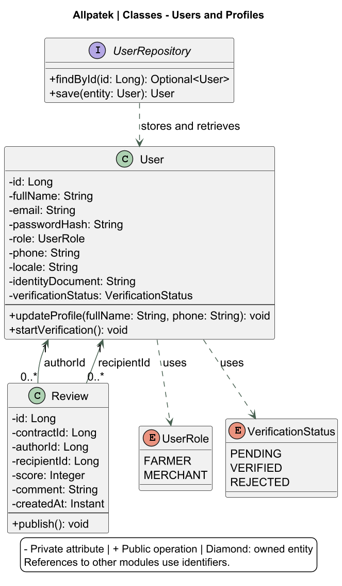

*Figura 4.7.1. Clases de Users and Profiles.* [Diagrama editable](assets/chapter-04/architecture/08-classes-users.puml).

#### Land Management

Plot reúne los datos de la parcela, cultivo, costo orientativo y disponibilidad. PlotPhoto permite conservar varias fotografías y distinguir la principal, como solicita el formulario del capítulo IV.

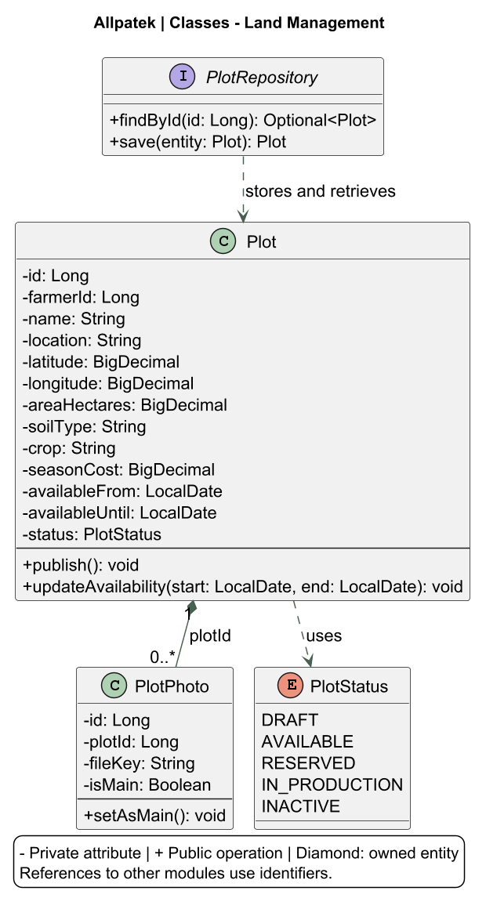

*Figura 4.7.2. Clases de Land Management.* [Diagrama editable](assets/chapter-04/architecture/09-classes-plots.puml).

#### Season Contracting

Contract guarda las partes, fechas, importe y condiciones de la temporada. Milestone representa una etapa con sus criterios de aprobación e importe. Los hitos pertenecen al contrato y no existen de manera independiente.

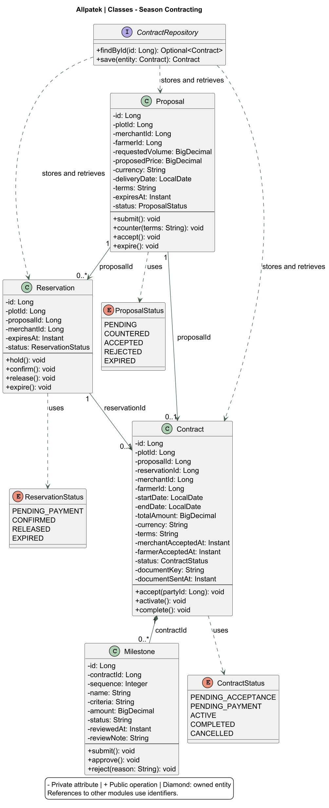

*Figura 4.7.3. Clases de Season Contracting.* [Diagrama editable](assets/chapter-04/architecture/10-classes-contracts.puml).

#### Payments and Plans

Payment registra una operación y su resultado. SubscriptionPlan y Subscription representan los planes mensuales de los prototipos. Su inclusión permite conectar el diseño con esas pantallas; los precios y la decisión de cobrar planes o comisiones siguen pendientes.

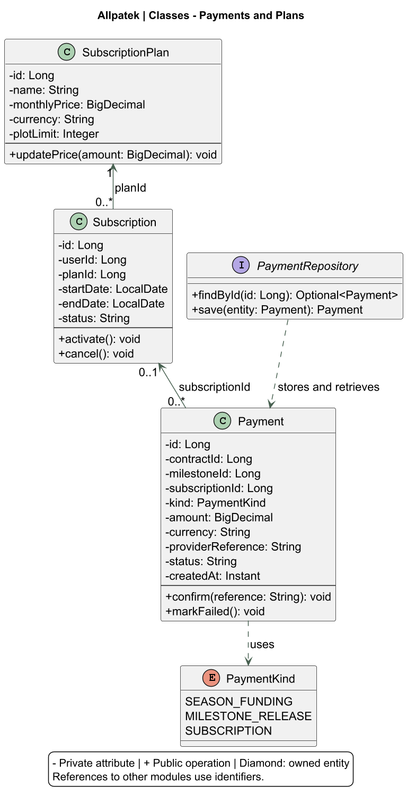

*Figura 4.7.4. Clases de Payments and Plans.* [Diagrama editable](assets/chapter-04/architecture/11-classes-payments.puml).

#### Crop Monitoring

ProgressUpdate registra el trabajo y sus evidencias. WeatherAlert conserva una alerta con fuente y fecha. Se agrupan aquí para que el usuario consulte tanto el avance del cultivo como la información climática de su parcela.

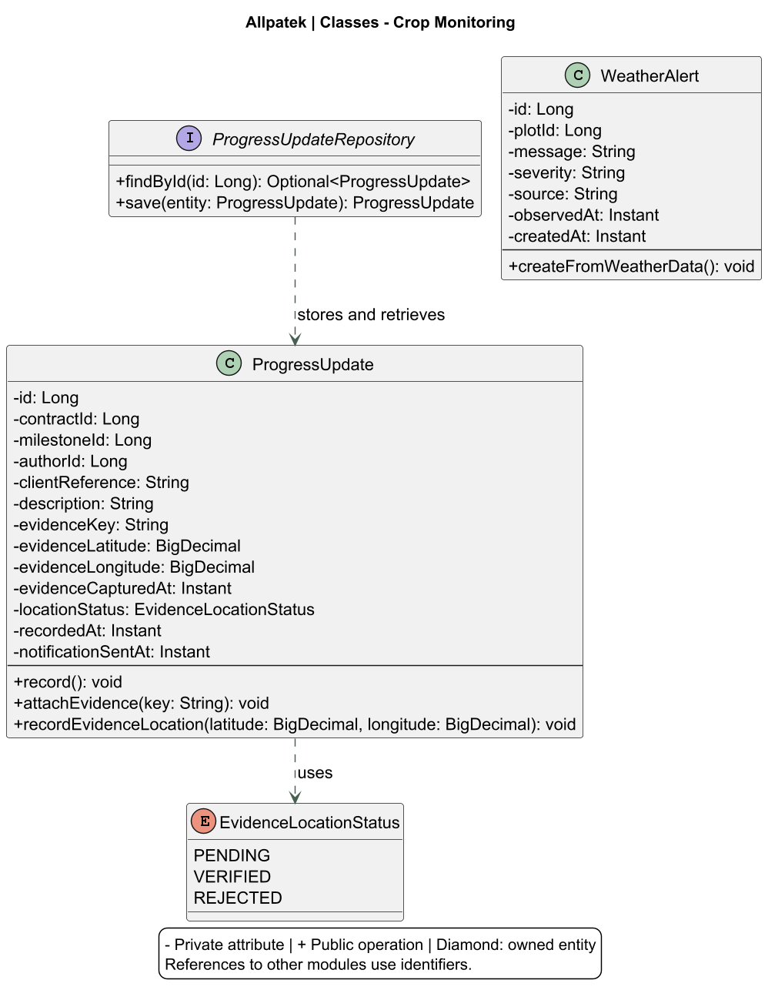

*Figura 4.7.5. Clases de Crop Monitoring.* [Diagrama editable](assets/chapter-04/architecture/12-classes-monitoring.puml).

La UI de Angular utilizará componentes y servicios para presentar estos datos; su organización aparece en 4.6.4-B. La landing y los flujos n8n no incorporan clases de negocio propias. Por eso los diagramas de dominio se concentran en la API y no repiten las mismas reglas en cada producto.

## 4.8. Database Design

La base de datos conserva la información de Allpatek y relaciona sus elementos mediante identificadores. Se utiliza un modelo relacional para representar usuarios, parcelas, contratos, hitos, pagos y seguimiento.

Cada tabla tiene una **clave primaria (PK)** que identifica sus registros. Las **claves foráneas (FK)** relacionan tablas; por ejemplo, plot_id permite conocer la parcela de un contrato. Los importes se representan con DECIMAL y los archivos mediante una clave de almacenamiento, evitando guardar fotografías completas en los registros del negocio.

### 4.8.1. Database Diagrams

Los diagramas presentan las tablas de cada área con columnas, tipos y relaciones. El asterisco identifica campos obligatorios; UQ identifica valores únicos. Las tablas grises pertenecen a otros módulos y se muestran resumidas para explicar la relación. Un campo opcional acepta NULL.

#### Users and Profiles

User representa a una persona registrada y su rol. Review guarda la calificación que una parte deja a la otra al terminar un contrato. Esto recoge la reputación bidireccional propuesta en el capítulo I.

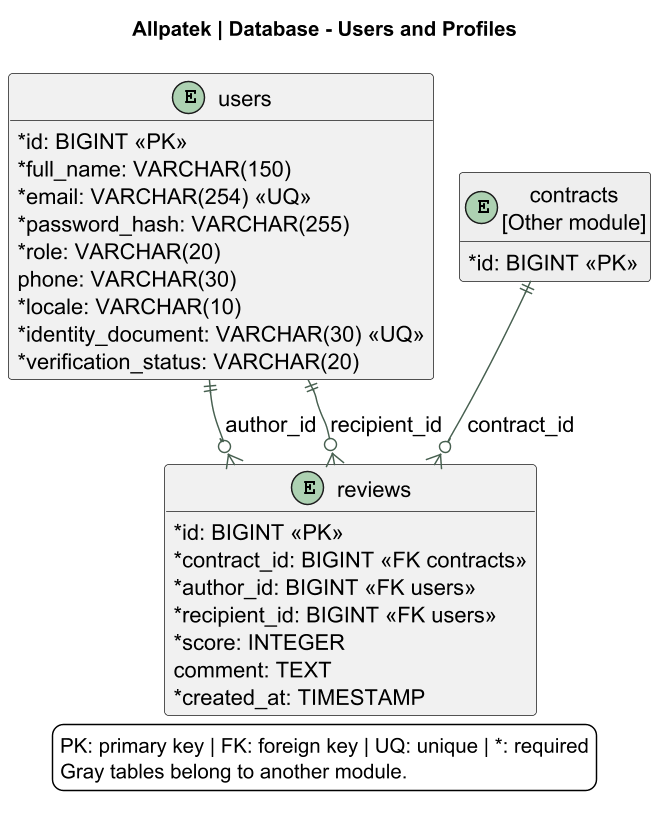

*Figura 4.8.1. Tablas de Users and Profiles.* [Diagrama editable](assets/chapter-04/architecture/13-database-users.puml).

#### Land Management

Plot reúne los datos de la parcela, cultivo, costo orientativo y disponibilidad. PlotPhoto permite conservar varias fotografías y distinguir la principal, como solicita el formulario del capítulo IV.

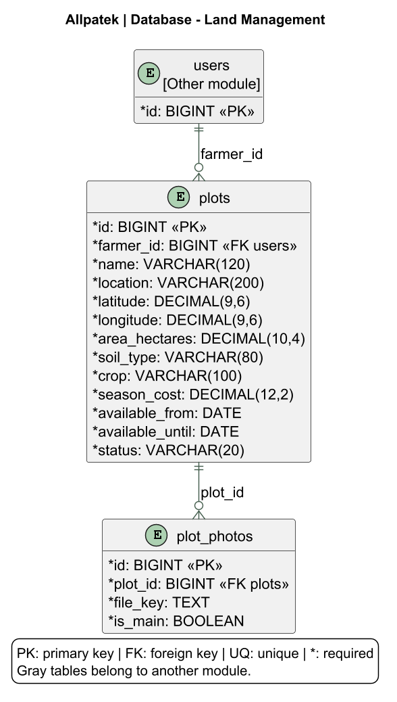

*Figura 4.8.2. Tablas de Land Management.* [Diagrama editable](assets/chapter-04/architecture/14-database-plots.puml).

#### Season Contracting

Contract guarda las partes, fechas, importe y condiciones de la temporada. Milestone representa una etapa con sus criterios de aprobación e importe. Los hitos pertenecen al contrato y no existen de manera independiente.

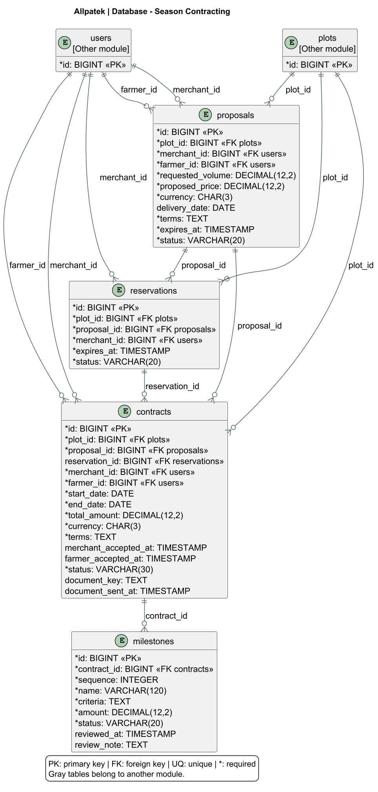

*Figura 4.8.3. Tablas de Season Contracting.* [Diagrama editable](assets/chapter-04/architecture/15-database-contracts.puml).

#### Payments and Plans

Payment registra una operación y su resultado. SubscriptionPlan y Subscription representan los planes mensuales de los prototipos. Su inclusión permite conectar el diseño con esas pantallas; los precios y la decisión de cobrar planes o comisiones siguen pendientes.

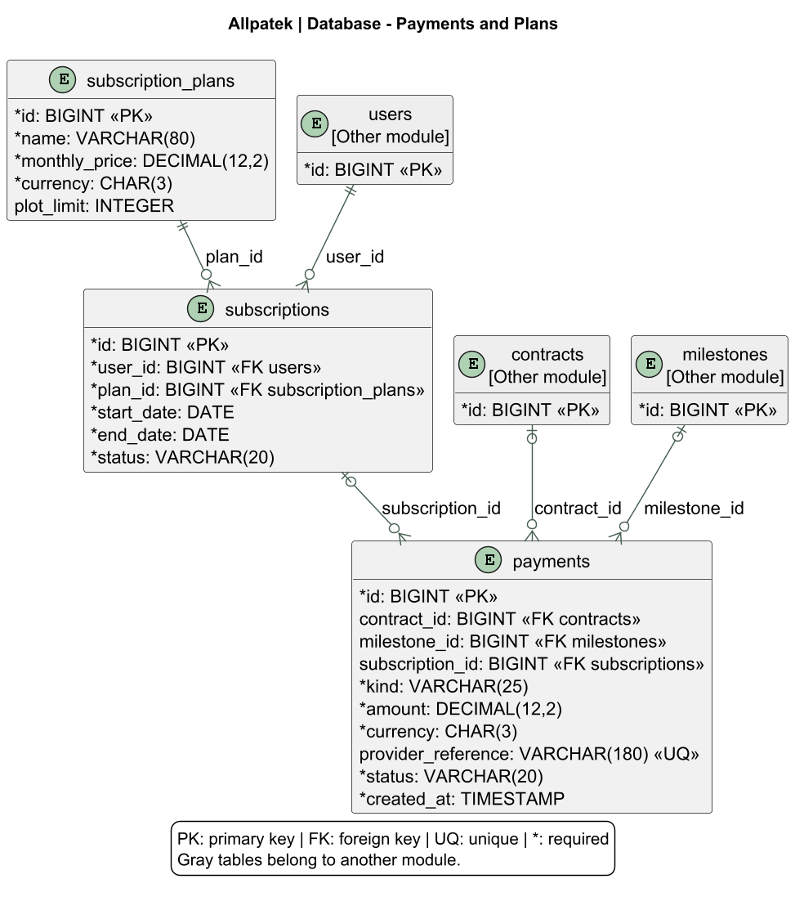

*Figura 4.8.4. Tablas de Payments and Plans.* [Diagrama editable](assets/chapter-04/architecture/16-database-payments.puml).

#### Crop Monitoring

ProgressUpdate registra el trabajo y sus evidencias. WeatherAlert conserva una alerta con fuente y fecha. Se agrupan aquí para que el usuario consulte tanto el avance del cultivo como la información climática de su parcela.

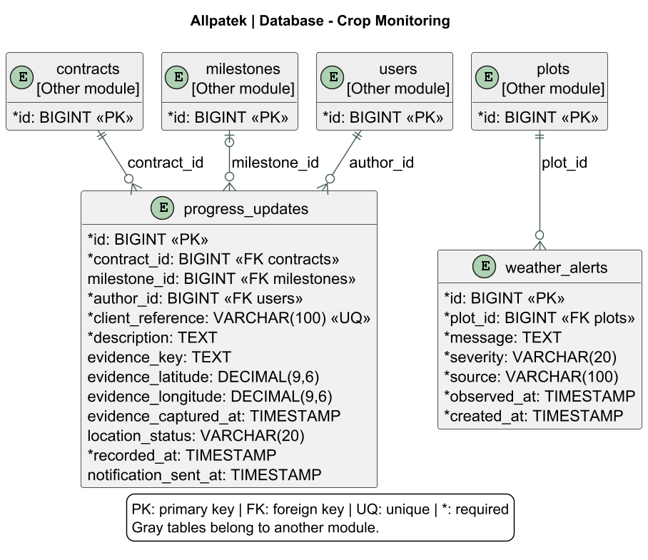

*Figura 4.8.5. Tablas de Crop Monitoring.* [Diagrama editable](assets/chapter-04/architecture/17-database-monitoring.puml).

#### Relaciones y reglas principales

| Relación o dato | Regla que se aplicará |
|---|---|
| Usuario y parcelas | Un agricultor puede registrar varias parcelas. Solo su propietario puede modificarlas. |
| Parcela y contratos | Una parcela conserva varios contratos históricos; sus temporadas activas no se superponen. |
| Contrato e hitos | Un contrato tiene varios hitos ordenados. Su suma debe coincidir con el importe pactado. |
| Aceptación y condiciones | Se guardan las fechas de aceptación de ambas partes. Cambiar condiciones antes de activar exige volver a aceptarlas; un acuerdo activo conserva las condiciones pactadas. |
| Pago y destino | SEASON_FUNDING se vincula a un contrato; MILESTONE_RELEASE a un contrato y uno de sus hitos; SUBSCRIPTION solo a una suscripción. Los campos opcionales permiten estos tres casos, que la API debe validar. |
| Confirmación de pagos | Una referencia de proveedor no se registra dos veces. Un hito no se desembolsa dos veces ni por encima del importe acordado. Las liberaciones acumuladas no superan los fondos confirmados de la temporada. |
| Plan y suscripción | Un plan puede tener varias suscripciones. Sus precios y límites son configurables, no datos fijos en el código. |
| Avance e hito | Un avance pertenece a un contrato y puede asociarse a uno de sus hitos. La API verifica que ambos correspondan al mismo acuerdo. |
| Avances sin conexión | client_reference identifica el borrador enviado para evitar crear dos registros cuando se reintenta la misma carga. |
| Calificación | Se permite una calificación por autor y contrato, dirigida a la otra parte y con puntuación de 1 a 5, al finalizar la temporada. |
| Fotografías | Una parcela puede tener varias fotos y una sola principal. El formulario actual exige al menos tres para publicar. |
| Alertas y mensajes | Las alertas indican fuente y fecha. Las marcas de envío permiten identificar documentos y avances pendientes de notificar. |

Los roles y estados se validarán contra sus valores permitidos. Las áreas e importes deben ser positivos y la fecha final posterior a la inicial. Los correos serán únicos. Las comprobaciones de disponibilidad y saldo se realizarán dentro de una transacción que evite conflictos entre solicitudes simultáneas. Estos son criterios del diseño; todavía no son pruebas ejecutadas sobre una aplicación.

#### Correspondencia con el informe del equipo

| Función documentada | Procedencia | Diseño relacionado |
|---|---|---|
| Catálogo y publicación de parcelas | Capítulos I y IV | Plot, PlotPhoto y Land Management. |
| Contratación y documento automático | Capítulos I y IV | Contract, Payments y flujo n8n. |
| Seguimiento y pagos por hitos | Capítulo IV | Milestone, ProgressUpdate y Payment. |
| Calificaciones entre participantes | Capítulo I | Review en Users and Profiles. |
| Planes mensuales | Capítulo IV | SubscriptionPlan y Subscription, pendientes de confirmación comercial. |
| Avisos por correo y WhatsApp | Capítulo I | Flujos n8n y servicios de mensajería. |
| Conectividad limitada | Capítulo I | Borradores locales de avances y envío posterior. |
| Alertas climáticas | Capítulo IV | WeatherAlert e integración meteorológica. |

Antes de cerrar la versión del informe, el equipo debe unificar las condiciones de producción, la secuencia de aceptación y pago, el número de hitos y los planes comerciales. La firma dibujada en los prototipos y el PDF enviado representan pasos de la experiencia, pero no se presentan aquí como una certificación de firma digital. Las recomendaciones con IA y el inicio de sesión social requieren confirmación de alcance; no se añaden automáticamente a esta arquitectura.

#### Referencias de diseño

- Brown, S. (s. f.). *C4 model: Container diagram y Component diagram*. https://c4model.com/diagrams/container y https://c4model.com/diagrams/component
- Brandolini, A. (s. f.). *EventStorming*. https://www.eventstorming.com/
- n8n. (s. f.). *Webhook node*. https://docs.n8n.io/integrations/builtin/core-nodes/n8n-nodes-base.webhook/

Estas referencias se consolidarán en la bibliografía general del informe. Las figuras son propuestas propias para Allpatek, elaboradas con PlantUML, herramienta admitida por el enunciado. Los repositorios SmilingCups se consultaron como referencia de organización por áreas, conservando las tecnologías exigidas en este curso.

# Capítulo V: Product Implementation, Validation & Deployment

## 5.1. Software Configuration Management


La gestión de la configuración del software en el proyecto garantiza el control de cambios, asegurando la integridad, trazabilidad y consistencia del código fuente. Asimismo, facilita la coordinación del trabajo en equipo entre las capas de frontend y backend mediante el uso de buenas prácticas de ingeniería de software y el control de versiones alineado a los principios de Domain-Driven Design (DDD). Este enfoque permite estructurar el desarrollo separando responsabilidades según el Lenguaje Ubicuo, los Contextos Delimitados y los modelos de dominio.

### 5.1.1. Software Development Environment Configuration

Para respaldar el ciclo de vida de la aplicación, el equipo seleccionó herramientas y entornos que optimizan la comunicación, diseño, desarrollo, despliegue y documentación. Estas soluciones garantizan un flujo de trabajo ágil y escalable sobre una arquitectura desacoplada basada en Angular y Java (Spring Boot) bajo la metodología DDD.
Las herramientas se organizan según las principales actividades del ciclo de vida del software:

### Project Management y Requirements Management

* **Trello:** Es la herramienta principal utilizada para la gestión visual del proyecto mediante tableros Kanban. Permite organizar tareas en listas y tarjetas (Backlog, En Proceso, Revisión, Finalizado), ordenando las historias de usuario y tareas de desarrollo por *Bounded Contexts* (Contextos Delimitados) del dominio, facilitando el seguimiento del avance del desarrollo entre el frontend y backend.
* **Microsoft OneDrive:** Actúa como el almacenamiento centralizado en la nube para alojar y resguardar archivos pesados, evidencias visuales del desarrollo y los videos demostrativos o explicativos del proyecto. Permite generar enlaces de acceso directo que se vinculan en la documentación técnica para su revisión.

### Product UX/UI Design

* **Figma:** Es la herramienta principal para el diseño de la interfaz de usuario (UI) y la experiencia de usuario (UX). Se emplea para construir wireframes, prototipos interactivos y el sistema de diseño (*Design System*) alineado a los flujos y casos de uso definidos por el dominio en Angular.
* **Miro:** Se utiliza como pizarra virtual colaborativa para facilitar dinámicas de *Event Storming*, mapeo de contextos delimitados (*Context Mapping*), modelado de flujos de navegación y diagramación conceptual del dominio previa a la implementación.

### Software Development

* **Visual Studio Code:** Es el editor de código utilizado para el desarrollo de la Landing Page del proyecto mediante HTML, CSS y JavaScript. Asimismo, se utiliza como entorno para la redacción estructurada de la documentación técnica en formato **Markdown**, ofreciendo soporte para extensiones de previsualización sintáctica.
* **IntelliJ IDEA:** Es el entorno de desarrollo integrado (IDE) utilizado de manera exclusiva para el desarrollo del Backend en Java (Spring Boot) siguiendo los patrones tácticos de DDD (Entidades, Agregados, Objetos de Valor, Repositorios, Servicios de Dominio y Casos de Uso). Proporciona herramientas avanzadas para la gestión de dependencias con Maven/Gradle, refactorización de código, depuración de servicios RESTful y ejecución de pruebas unitarias y de integración.
* **Git:** Es el sistema de control de versiones distribuido utilizado para gestionar el código fuente del proyecto. Permite registrar el historial de cambios, administrar ramas de desarrollo (*branching*) y garantizar la consistencia del código.
* **GitHub:** Es la plataforma en la nube utilizada para alojar los repositorios del proyecto (separando frontend y backend o por contextos delimitados). Facilita la revisión de código (*Pull Requests*), el control de versiones de la documentación redactada en Markdown y la integración del trabajo colaborativo.
* **Node.js & npm / Angular CLI:** Entorno de ejecución y gestor de paquetes utilizados para administrar las dependencias del frontend de la aplicación web en Angular, compilar los componentes del sistema y ejecutar el servidor de desarrollo local.
* **JDK (Java Development Kit):** Entorno de desarrollo para la compilación y ejecución de la lógica de negocio orientada al dominio y APIs del backend basadas en Java.

### Software Deployment

* **GitHub Pages / Vercel / Netlify:** Servicios utilizados para el despliegue y alojamiento de la Landing Page y la aplicación frontend construida en Angular, garantizando un acceso rápido y disponibilidad pública.
* **Railway / Render:** Plataformas PaaS en la nube utilizadas para el despliegue del entorno backend en Java y la base de datos relacional, permitiendo la exposición de las APIs REST a través de endpoints seguros en producción.

### Software Documentation

* **Markdown:** Es el lenguaje de marcado ligero utilizado como estándar para la redacción colaborativa y estructurada de toda la documentación técnica del proyecto, incluyendo la especificación del Lenguaje Ubicuo (*Ubiquitous Language*), informes técnicos, guías del sistema y entregables académicos en el repositorio.
* **Swagger / Open API:** Herramienta integrada en el backend en Java para la documentación y prueba interactiva de las APIs RESTful expuestas por cada *Bounded Context*. Permite visualizar los endpoints, esquemas de DTOs y probar los servicios directamente desde una interfaz web.
* **Postman:** Utilizado para la realización de pruebas de integración y validación manual de los servicios REST antes de ser consumidos por la aplicación en Angular.


### 5.1.2. Source Code Management


Para llevar un control claro de los cambios y trabajar en equipo de forma ordenada, utilizamos **Git** para el control de versiones y **GitHub** como plataforma centralizada donde alojamos el código. 

Organizamos el proyecto en repositorios independientes según cada producto digital:

* **Landing Page (HTML, CSS y JS):** [Link del Repositorio](https://github.com/TuOrganizacion/tu-proyecto-landing-page)
* **Web Services (Java / Spring Boot):** [Link del Repositorio](https://github.com/TuOrganizacion/tu-proyecto-landing-page)
* **Frontend Web Application (Angular):** [Link del Repositorio](https://github.com/TuOrganizacion/tu-proyecto-landing-page)


#### Estrategia de Trabajo: GitFlow

Adoptamos el flujo de trabajo **GitFlow** para organizar el desarrollo en diferentes ramas según el propósito de cada cambio:

1. **Ramas Principales**
   * `main`: Mantiene únicamente el código estable y probado que está listo para producción.
   * `develop`: Funciona como la rama de integración continua donde se consolidan las funcionalidades listas para la próxima entrega.

2. **Ramas Temporales**
   * **Feature Branches (`feature/*`):** Las creamos a partir de `develop` para construir nuevas funcionalidades o historias de usuario asociadas a un contexto delimitado (*Bounded Context*).
     * **Convención:** `feature/<bounded-context>-<descripcion-corta>`
     * *Ejemplo:* `feature/iam-user-authentication`
   * **Release Branches (`release/*`):** Se generan desde `develop` cuando tenemos un grupo de funcionalidades listas para publicar. Las usamos para realizar pruebas finales y ajustes menores antes de pasar a producción.
     * **Convención:** `release/vX.Y.Z`
     * *Ejemplo:* `release/v1.0.0`
   * **Hotfix Branches (`hotfix/*`):** Nacen directamente de `main` para corregir errores urgentes detectados en producción. Una vez resuelto el problema, la rama se integra tanto en `main` como en `develop`.
     * **Convención:** `hotfix/vX.Y.Z-<descripcion-corta>`
     * *Ejemplo:* `hotfix/v1.0.1-fix-login-error`


#### Versionado Semántico (Semantic Versioning 2.0.0)

Para etiquetar los lanzamientos (*Releases*) en la rama `main`, seguimos la regla `vX.Y.Z` (`vMAJOR.MINOR.PATCH`):

* **MAJOR (X):** Se incrementa cuando introducimos cambios grandes que rompen la compatibilidad con versiones anteriores.
* **MINOR (Y):** Se incrementa al añadir nuevas funcionalidades de manera retrocompatible.
* **PATCH (Z):** Se incrementa cuando aplicamos correcciones puntuales de errores (*bug fixes*).


#### Estándar de Commits (Conventional Commits)

Escribimos los mensajes de commit de forma clara y uniforme para que cualquier miembro del equipo entienda qué se cambió de un vistazo:

`<tipo>(<alcance>): <descripción corta>`

* **Tipos comunes:**
  * `feat`: Nueva funcionalidad.
  * `fix`: Corrección de un error.
  * `docs`: Cambios en la documentación.
  * `style`: Ajustes estéticos o de formato sin cambios en la lógica (CSS, espacios, comas).
  * `refactor`: Mejoras al código que no cambian su comportamiento ni arreglan errores.
  * `test`: Creación o modificación de pruebas.
  * `chore`: Mantenimiento de configuraciones, dependencias o herramientas.

* **Ejemplos prácticos:**
  * `feat(iam): add user registration service in Java backend`
  * `fix(landing): resolve responsive navigation bar overflow`
  * `refactor(shared): optimize Angular HTTP interceptor handling`
  * `test(iam): add unit tests for authentication aggregate`
  * `docs(scm): update GitFlow branching strategy documentation`


### 5.1.3. Source Code Style Guide & Conventions

Para garantizar la mantenibilidad, legibilidad y consistencia del código a lo largo del proyecto, el equipo adopta estándares de desarrollo y guías de estilo reconocidas por la industria para cada uno de los lenguajes utilizados. Toda la nomenclatura en el código fuente (nombres de variables, clases, métodos, funciones, interfaces, componentes, archivos y comentarios) se escribe exclusivamente en **inglés**.


#### 1. General Naming Conventions

Independientemente del lenguaje de programación, se aplican las siguientes reglas generales para la nomenclatura de elementos:

* **CamelCase (`camelCase`):** Utilizado para variables, atributos, parámetros de métodos y nombres de funciones en JavaScript, TypeScript y Java.
* **PascalCase (`PascalCase`):** Utilizado para nombres de clases, interfaces, enums, componentes de Angular, anotaciones y tipos personalizados.
* **Kebab-Case (`kebab-case`):** Utilizado para nombres de archivos, carpetas, selectores de componentes de Angular, clases CSS y atributos personalizados de HTML.
* **Screaming Snake Case (`UPPER_SNAKE_CASE`):** Utilizado para constantes y valores inmutables en Java y TypeScript.


#### 2. HTML & CSS Style Guide

Se adoptan los principios de la **Google HTML/CSS Style Guide** y la **W3C HTML Style Guide**:

* **Sintaxis y Estructura HTML:**
  * Uso obligatorio de HTML5 semántico (`<header>`, `<nav>`, `<main>`, `<section>`, `<footer>`).
  * Nombres de etiquetas, atributos y valores en minúsculas.
  * Uso de comillas dobles (`"..."`) en todos los valores de los atributos.
  * Indentación de 2 espacios sin tabulaciones.

* **Estilos CSS:**
  * Adoptar la metodología **BEM (Block Element Modifier)** para la nomenclatura de clases (`block__element--modifier`).
  * Evitar la regla `!important` y limitar el anidamiento excesivo en preprocesadores.
  * Agrupar propiedades CSS en orden lógico (Posicionamiento, Box Model, Tipografía, Visuales).


#### 3. JavaScript & TypeScript Style Guide (Angular)

Se aplican la **Google TypeScript Style Guide** y la guía oficial **Angular Coding Style Guide**:

* **Naming Conventions:**
  * **Interfaces:** Denominadas en `PascalCase` sin prefijo `I` (ejemplo: `User`, no `IUser`).
  * **Componentes y Servicios:** Sufijos explícitos en el nombre de la clase y archivo (ejemplo: `user-profile.component.ts` -> `UserProfileComponent`).
  * **Observables:** Sufijo `$` al final de la variable (ejemplo: `userData$`).

* **Buenas Prácticas:**
  * Declarar tipos explícitos para variables, parámetros de funciones y retornos, evitando el uso de `any`.
  * Mantener inmutabilidad mediante el uso preferente de `const` sobre `let` (evitando `var`).
  * Estructura de archivos modular basada en componentes y lógica orientada a *Bounded Contexts*.


#### 4. Java & Spring Boot Style Guide

Se adoptan la **Google Java Style Guide** y los estándares recomendados en **Spring Boot Features**:

* **Naming Conventions:**
  * **Clases:** `PascalCase` representando sustantivos en inglés (ejemplo: `UserRepository`, `AuthenticationService`).
  * **Métodos:** `camelCase` representando verbos u acciones (ejemplo: `findUserById`, `calculateTotalAmount`).
  * **Paquetes:** Nombres en minúsculas en singular (ejemplo: `com.company.project.domain.model`).

* **Estructura Arquitectónica con DDD:**
  * **Layered Packages:** Organización por capas respetando DDD (`domain`, `application`, `infrastructure`, `interfaces`).
  * **Entidades y Agregados:** Modelado de objetos de dominio encapsulados sin exponer la lógica interna directamente mediante setters indiscriminados.
  * **Spring Annotations:** Uso explícito de estereotipos de Spring (`@RestController`, `@Service`, `@Repository`) y constructor injection mediante `final` fields o Lombok (`@RequiredArgsConstructor`).


### 5.1.4. Software Deployment Configuration

En esta sección el equipo especifica la configuración del despliegue de la solución, incluyendo los procedimientos necesarios para que, a partir de los repositorios de código fuente, se pueda realizar la publicación exitosa de los productos digitales que componen el sistema: Landing Page, Frontend Web Application y Web Services (Backend) junto con su Base de Datos.

La solución se encuentra estructurada bajo una arquitectura desacoplada, donde cada componente es desplegado de manera independiente utilizando plataformas especializadas en la nube, lo que permite mejorar la escalabilidad, disponibilidad y mantenimiento del sistema.

#### Componentes de Despliegue

* **Landing Page:** desplegada en **GitHub Pages**.
* **Frontend Web Application (Angular):** desplegada en **Netlify**.
* **Backend Web Services (Java / Spring Boot) + Base de Datos (PostgreSQL/MySQL):** desplegados en **Railway**.


#### 1. Control de Versiones

El proyecto utiliza **Git** como sistema de control de versiones y **GitHub** como plataforma para la gestión de repositorios independientes por cada producto digital.

**Estrategia de ramas (GitFlow):**
* `main`: contiene la versión estable lista para producción.
* `develop`: integra las funcionalidades en desarrollo.
* `feature/*`: ramas destinadas al desarrollo de nuevas funcionalidades por contexto delimitado.
* `hotfix/*`: ramas destinadas a correcciones críticas en producción.


#### 2. Despliegue de Landing Page (GitHub Pages)

La Landing Page es una solución web estática desarrollada con HTML, CSS y JavaScript.

**Pasos de despliegue:**

1. **Inicializar y preparar el repositorio**
    ```bash
    git init
    git add .
    git commit -m "feat(landing): initial release for deployment"
    ```
2. **Conectar el repositorio con GitHub**
    ```bash
    git branch -M main
    git remote add origin [https://github.com/TuOrganizacion/landing-page.git](https://github.com/TuOrganizacion/landing-page.git)
    git push -u origin main
    ```
3. **Configurar GitHub Pages**
    * Ir a **Settings** del repositorio en GitHub.
    * Acceder a la sección **Pages**.
    * Seleccionar:
        * **Source:** Deploy from a branch
        * **Branch:** `main`
        * **Folder:** `/ (root)`
    * **Resultado público:** `https://TuOrganizacion.github.io/landing-page/`


#### 3. Despliegue del Frontend Web Application (Angular en Netlify)

El frontend está desarrollado con Angular y se despliega en Netlify mediante integración continua con GitHub.

**Pasos de despliegue:**

1. **Subir el código al repositorio de GitHub**
    ```bash
    git add .
    git commit -m "feat(frontend): prepare angular production build"
    git push origin main
    ```
2. **Configurar en Netlify**
    * Acceder a: [https://www.netlify.com/](https://www.netlify.com/)
    * Seleccionar **Add new site** → **Import an existing project**.
    * Conectar con la cuenta de GitHub.
    * Seleccionar el repositorio correspondiente al frontend en Angular.
3. **Configurar el build**
    * **Branch to deploy:** `main`
    * **Build command:** `npm run build` *(o `ng build --configuration production`)*
    * **Publish directory:** `dist/<nombre-proyecto>/browser`
4. **Configurar la regla de redirección (SPA Rewrites)**
    * Incluir un archivo `_redirects` en la carpeta de activos de Angular con la regla:
        ```text
        /*    /index.html   200
        ```
5. **Configurar variables de entorno**
    * En el panel de Netlify (*Site configuration* → *Environment variables*):
        * `NG_APP_API_URL` = `https://tu-backend.up.railway.app/api/v1`
6. **Despliegue**
    * Netlify ejecuta el proceso de build automáticamente tras cada push a `main`.
    * Se genera una URL pública accesible para los usuarios finales.


#### 4. Configuración de Base de Datos (PostgreSQL / MySQL en Railway)

Antes de iniciar el backend, se aprovisiona la base de datos relacional dentro de Railway.

**Pasos de configuración:**

1. **Crear servicio de base de datos**
    * En el dashboard de Railway, seleccionar **New Project** (o dentro del proyecto existente).
    * Elegir **Provision PostgreSQL** (o **Provision MySQL**).
2. **Obtener las credenciales generadas**
    * En la pestaña **Variables** o **Connect** del servicio de la base de datos, Railway genera automáticamente:
        * `PGHOST` / `MYSQLHOST`
        * `PGDATABASE` / `MYSQLDATABASE`
        * `PGUSER` / `MYSQLUSER`
        * `PGPASSWORD` / `MYSQLPASSWORD`
        * `PGPORT` / `MYSQLPORT`
        * `DATABASE_URL` / `MYSQL_URL`


#### 5. Despliegue de Web Services (Backend Java / Spring Boot en Railway)

El backend está desarrollado en Java utilizando Spring Boot y se despliega en Railway conectado a la base de datos provisionada.

**Pasos de despliegue:**

1. **Subir el backend a GitHub**
    ```bash
    git add .
    git commit -m "feat(backend): setup spring boot for deployment"
    git push origin main
    ```
2. **Crear servicio de backend en Railway**
    * Acceder al proyecto existente en Railway donde se encuentra la base de datos.
    * Seleccionar **New** → **GitHub Repo**.
    * Elegir el repositorio del backend en Java.
3. **Configurar variables de entorno**
    * En la pestaña **Variables** del servicio Java en Railway, configurar:
        * `SPRING_PROFILES_ACTIVE` = `prod`
        * `SPRING_DATASOURCE_URL` = `jdbc:postgresql://${{Postgres.PGHOST}}:${{Postgres.PGPORT}}/${{Postgres.PGDATABASE}}`
        * `SPRING_DATASOURCE_USERNAME` = `${{Postgres.PGUSER}}`
        * `SPRING_DATASOURCE_PASSWORD` = `${{Postgres.PGPASSWORD}}`
        * `PORT` = `${{PORT}}`
4. **Despliegue automático**
    * Railway detecta el proyecto Maven/Java a través del archivo `pom.xml` y ejecuta automáticamente:
        * **Compilation & Build:** `./mvnw clean package -DskipTests`
        * **Execution:** `java -jar target/*.jar`
    * **Resultado público:** `https://tu-backend.up.railway.app`


#### 6. Integración de Componentes

El sistema funciona de la siguiente manera:
1. La **Landing Page** actúa como punto de entrada inicial, promocionando la solución y redirigiendo al usuario al Frontend Web.
2. El **Frontend Web Application (Angular)** consume las APIs del backend mediante peticiones HTTP RESTful.
3. El **Backend Web Services (Java / Spring Boot)** procesa la lógica de negocio estructurada en capas bajo DDD y gestiona las transacciones.
4. La **Base de Datos (Railway)** almacena la información de forma persistente y segura.


#### 7. Consideraciones de Despliegue

* Uso obligatorio de variables de entorno para la configuración sensible (credenciales, llaves secretas, URLs de conexión).
* Configuración de **CORS (Cross-Origin Resource Sharing)** en Spring Boot para permitir únicamente la comunicación desde el dominio del frontend en Netlify.
* Separación clara entre entornos de desarrollo (`application-dev.yml`) y producción (`application-prod.yml`).
* Prohibición estricta de incluir credenciales o tokens dentro del código fuente subido a GitHub.
* Verificación periódica de la disponibilidad de endpoints mediante la documentación interactiva con Swagger/OpenAPI.
* Preservación del versionado semántico en las entregas para asegurar la compatibilidad entre el frontend y backend.


## 5.2. Landing Page, Services & Applications Implementation
### 5.2.1. Sprint 1

El Sprint 1 se enfocó en el desarrollo e implementación de la Landing Page de Allpatek, la cual constituye el primer punto de contacto con los usuarios potenciales. Su objetivo fue comunicar de manera clara la propuesta de valor del sistema centrada en la gestión de seguridad ciudadana. Durante este sprint, se integraron las secciones principales (presentación, funcionalidades, beneficios y llamadas a la acción) siguiendo los wireframes del Capítulo IV y priorizando estándares de usabilidad, diseño responsivo y consistencia visual.

#### 5.2.1.1. Sprint Planning 1


<table>
  <tr>
    <th colspan="5">Sprint #</th>
    <th colspan="8">Sprint 1</th>
  </tr>
  <tr>
    <td colspan="13"><strong>Sprint Planning Background</strong></td>
  </tr>
  <tr>
    <td colspan="5">Date</td>
    <td colspan="8">2026-09-14</td>
  </tr>
  <tr>
    <td colspan="5">Time</td>
    <td colspan="8">4:00 PM</td>
  </tr>
  <tr>
    <td colspan="5">Location</td>
    <td colspan="8">Reunión virtual vía Google Meet</td>
  </tr>
  <tr>
    <td colspan="5">Prepared By</td>
    <td colspan="8">Orellana Rodriguez, Mel Andree</td>
  </tr>
  <tr>
    <td colspan="5">Attendees (to planning meeting)</td>
    <td colspan="8">Alexander Sebastián, Miguel Angel, Mel Andree, Nayely Macarena, Abigail Nadhim</td>
  </tr>
  <tr>
    <td colspan="5">Sprint n-1 Review Summary</td>
    <td colspan="8">No aplica - Este es el primer Sprint del proyecto.</td>
  </tr>
  <tr>
    <td colspan="5">Sprint n-1 Retrospective Summary</td>
    <td colspan="8">No aplica - Este es el primer Sprint del proyecto.</td>
  </tr>
  <tr>
    <td colspan="13"><strong>Sprint Goal & User Stories</strong></td>
  </tr>
  <tr>
    <td colspan="5">Sprint 1 Goal</td>
    <td colspan="8"><strong>Our focus is on</strong> presenting ALLPATEK’s guaranteed agricultural production model, fee-by-milestone structure, and service offerings through a responsive static landing page with lead capture capabilities. <strong>We believe it delivers</strong> initial market reach, brand credibility, and clear commercial orientation <strong>to</strong> prospective agricultural producers and B2B grain merchants. <strong>This will be confirmed when</strong> visitors can navigate through all service overview sections, compare commercial plans, and submit a technical proposal request in under 3 steps with zero UI validation errors.</td>
  </tr>
  <tr>
    <td colspan="5">Sprint 1 Velocity</td>
    <td colspan="8">30 story points</td>
  </tr>
  <tr>
    <td colspan="5">Sum of Story Points</td>
    <td colspan="8">30 story points</td>
  </tr>
</table>


#### 5.2.1.2. Aspect Leaders and Collaborators


<table>
    <thead>
      <tr style="background-color: #f2f2f2;">
        <th style="border: 1px solid #dddddd; padding: 10px;">Team Member</th>
        <th style="border: 1px solid #dddddd; padding: 10px;">GitHub Username</th>
        <th style="border: 1px solid #dddddd; padding: 10px;">Header / Navbar</th>
        <th style="border: 1px solid #dddddd; padding: 10px;">Hero</th>
        <th style="border: 1px solid #dddddd; padding: 10px;">Services</th>
        <th style="border: 1px solid #dddddd; padding: 10px;">How It Works</th>
        <th style="border: 1px solid #dddddd; padding: 10px;">Testimonials</th>
        <th style="border: 1px solid #dddddd; padding: 10px;">Team</th>
        <th style="border: 1px solid #dddddd; padding: 10px;">Contact Form</th>
        <th style="border: 1px solid #dddddd; padding: 10px;">Footer</th>
        <th style="border: 1px solid #dddddd; padding: 10px;">Plans</th>
      </tr>
    </thead>
    <tbody>
      <tr>
        <td style="border: 1px solid #dddddd; padding: 8px;">Atauje Barreto, Alexander Sebastián</td>
        <td style="border: 1px solid #dddddd; padding: 8px;">Alexander1Alexander2</td>
        <td style="border: 1px solid #dddddd; padding: 8px;">C</td>
        <td style="border: 1px solid #dddddd; padding: 8px;">C</td>
        <td style="border: 1px solid #dddddd; padding: 8px;">L</td>
        <td style="border: 1px solid #dddddd; padding: 8px;">L</td>
        <td style="border: 1px solid #dddddd; padding: 8px;">C</td>
        <td style="border: 1px solid #dddddd; padding: 8px;">C</td>
        <td style="border: 1px solid #dddddd; padding: 8px;">C</td>
        <td style="border: 1px solid #dddddd; padding: 8px;">C</td>
        <td style="border: 1px solid #dddddd; padding: 8px;">C</td>
      </tr>
      <tr>
        <td style="border: 1px solid #dddddd; padding: 8px;">Egocheaga Suyo, Miguel Angel</td>
        <td style="border: 1px solid #dddddd; padding: 8px;">MiguelAngel0107</td>
        <td style="border: 1px solid #dddddd; padding: 8px;">L</td>
        <td style="border: 1px solid #dddddd; padding: 8px;">L</td>
        <td style="border: 1px solid #dddddd; padding: 8px;">C</td>
        <td style="border: 1px solid #dddddd; padding: 8px;">C</td>
        <td style="border: 1px solid #dddddd; padding: 8px;">C</td>
        <td style="border: 1px solid #dddddd; padding: 8px;">C</td>
        <td style="border: 1px solid #dddddd; padding: 8px;">C</td>
        <td style="border: 1px solid #dddddd; padding: 8px;">C</td>
        <td style="border: 1px solid #dddddd; padding: 8px;">C</td>
      </tr>
      <tr>
        <td style="border: 1px solid #dddddd; padding: 8px;">Orellana Rodríguez, Mel Andree</td>
        <td style="border: 1px solid #dddddd; padding: 8px;">melandree8</td>
        <td style="border: 1px solid #dddddd; padding: 8px;">C</td>
        <td style="border: 1px solid #dddddd; padding: 8px;">C</td>
        <td style="border: 1px solid #dddddd; padding: 8px;">C</td>
        <td style="border: 1px solid #dddddd; padding: 8px;">C</td>
        <td style="border: 1px solid #dddddd; padding: 8px;">C</td>
        <td style="border: 1px solid #dddddd; padding: 8px;">L</td>
        <td style="border: 1px solid #dddddd; padding: 8px;">C</td>
        <td style="border: 1px solid #dddddd; padding: 8px;">C</td>
        <td style="border: 1px solid #dddddd; padding: 8px;">C</td>
      </tr>
      <tr>
        <td style="border: 1px solid #dddddd; padding: 8px;">Raymundo Villarroel, Abigail Nadhim</td>
        <td style="border: 1px solid #dddddd; padding: 8px;">AbigailRV</td>
        <td style="border: 1px solid #dddddd; padding: 8px;">C</td>
        <td style="border: 1px solid #dddddd; padding: 8px;">C</td>
        <td style="border: 1px solid #dddddd; padding: 8px;">C</td>
        <td style="border: 1px solid #dddddd; padding: 8px;">C</td>
        <td style="border: 1px solid #dddddd; padding: 8px;">C</td>
        <td style="border: 1px solid #dddddd; padding: 8px;">C</td>
        <td style="border: 1px solid #dddddd; padding: 8px;">L</td>
        <td style="border: 1px solid #dddddd; padding: 8px;">L</td>
        <td style="border: 1px solid #dddddd; padding: 8px;">C</td>
      </tr>
      <tr>
        <td style="border: 1px solid #dddddd; padding: 8px;">Vera Solsol, Nayely Macarena</td>
        <td style="border: 1px solid #dddddd; padding: 8px;">Macaxprogram29</td>
       <td style="border: 1px solid #dddddd; padding: 8px;">C</td>
        <td style="border: 1px solid #dddddd; padding: 8px;">C</td>
        <td style="border: 1px solid #dddddd; padding: 8px;">C</td>
        <td style="border: 1px solid #dddddd; padding: 8px;">C</td>
        <td style="border: 1px solid #dddddd; padding: 8px;">L</td>
        <td style="border: 1px solid #dddddd; padding: 8px;">C</td>
        <td style="border: 1px solid #dddddd; padding: 8px;">C</td>
        <td style="border: 1px solid #dddddd; padding: 8px;">C</td>
        <td style="border: 1px solid #dddddd; padding: 8px;">L</td>
      </tr>
    </tbody>
  </table>


#### 5.2.1.3. Sprint Backlog 1


El **Sprint 1** tuvo como objetivo principal la maquetación, diseño responsivo, lógica de interacción y despliegue público de la **Landing Page estática e informativa de ALLPATEK**, la cual sirve como punto de contacto inicial para comunicar la propuesta de valor del modelo *Agro-as-a-Service* e incentivar la captación de productores agrícolas y compradores B2B.

Para la gestión y control del flujo de trabajo, las tareas se organizaron y monitorearon interactivamente mediante la herramienta de gestión de proyectos **GitHub Projects**.

#### Tablero de Control del Sprint 1 (Sprint Board)

<p align="center">
  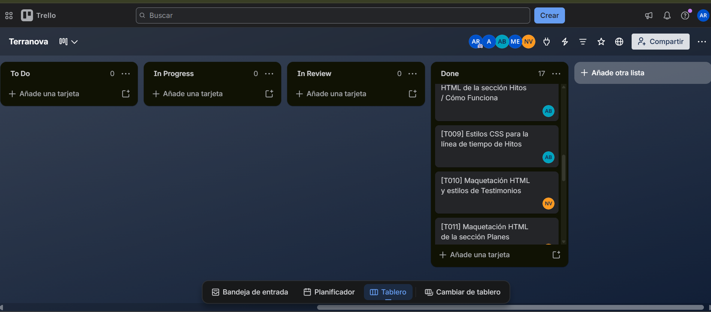
</p>

* **Figura 5.2.1.3.1.** *Captura del tablero del Sprint 1 en la herramienta de control mostrando el estado de desarrollo.*

* **URL Pública del Board del Sprint 1:** [Enlace de Trello Sprint 1](https://trello.com/invite/b/6aa216c035a4a46c6bd2f3f0/ATTI885bbe2f06b7915f27146102eb51b6dfDBBD1DE6/terranova)


#### Tabla de Control de Estado del Sprint Backlog 1

A continuación, se detalla la descomposición de las Historias de Usuario de la Landing Page asignadas al Sprint 1 en sus respectivas tareas técnicas (*Work-items / Tasks*), distribuidas según las ramas de desarrollo por componente (*feature branches*) y los líderes asignados a cada sección:

| Sprint | User Story ID | User Story Title | Task ID | Task Title | Description | Estimation (Hours) | Assigned To | Status |
| :---: | :---: | :--- | :---: | :--- | :--- | :---: | :--- | :---: |
| **Sprint 1** | **US24** | Consultar la propuesta de valor de ALLPATEK | **T001** | Inicialización del repositorio y estructura base | Configurar el repositorio oficial, convención de commits y estructura de carpetas HTML/CSS/JS inicial. | 3 | Mel Andree | Done |
| **Sprint 1** | **US31** | Recorrer las áreas informativas del sitio | **T002** | Maquetación HTML del Header y Navbar | Construir la estructura semántica en HTML5 del logo, menú de navegación principal y contenedor superior (`feature/header-navbar`). | 4 | Miguel Angel | Done |
| **Sprint 1** | **US38** | Consultar el sitio desde un dispositivo móvil | **T003** | Estilos CSS y responsive design para Header/Navbar | Aplicar la paleta de colores, tipografía y adaptabilidad móvil para el menú desplegable y navegación. | 4 | Miguel Angel | Done |
| **Sprint 1** | **US24** | Consultar la propuesta de valor de ALLPATEK | **T004** | Maquetación HTML de la sección Hero | Construir la estructura semántica del Hero Section con propuesta de valor y botones CTA (`feature/hero`). | 4 | Miguel Angel | Done |
| **Sprint 1** | **US24** | Consultar la propuesta de valor de ALLPATEK | **T005** | Estilos CSS y métricas clave para la sección Hero | Diseñar el estilo visual de la sección principal, fondo responsivo e insignias de métricas clave. | 4 | Miguel Angel | Done |
| **Sprint 1** | **US32** | Conocer los servicios de producción garantizada | **T006** | Maquetación HTML de la sección Servicios | Crear la estructura de cuadrícula para las tarjetas explicativas del modelo de custodia financiera Escrow (`feature/servicios`). | 4 | Alexander Sebastián | Done |
| **Sprint 1** | **US40** | Evaluar la protección de fondos antes de comprometer capital | **T007** | Estilos CSS para el grid de Servicios | Aplicar sombras, bordes y estilos de contraste visual para las tarjetas de servicios de la plataforma. | 4 | Alexander Sebastián | Done |
| **Sprint 1** | **US33** | Entender el esquema de pagos por hitos | **T008** | Maquetación HTML de la sección Hitos / Cómo Funciona | Construir la secuencia del flujo de trabajo por hitos y desembolsos progresivos (`feature/hitos`). | 4 | Alexander Sebastián | Done |
| **Sprint 1** | **US41** | Entender cómo se garantiza el cobro al productor | **T009** | Estilos CSS para la línea de tiempo de Hitos | Diseñar la línea de tiempo visual y los conectores gráficos entre los pasos del proceso Escrow. | 3 | Alexander Sebastián | Done |
| **Sprint 1** | **US34** | Revisar experiencias de comerciantes y productores | **T010** | Maquetación HTML y estilos de Testimonios | Diseñar las tarjetas de reseñas y valoraciones de compradores B2B y productores agrícolas (`feature/testimonios`). | 4 | Nayely Macarena | Done |
| **Sprint 1** | **US35** | Comparar planes de producción según escala | **T011** | Maquetación HTML de la sección Planes | Estructurar las tarjetas comparativas de planes de producción y suscripción agrícola (`feature/planes`). | 3 | Nayely Macarena | Done |
| **Sprint 1** | **US35** | Comparar planes de producción según escala | **T012** | Estilos CSS y destacado del plan recomendado | Resaltar el plan principal mediante etiquetas, bordes especiales e indicadores de precio. | 3 | Nayely Macarena | Done |
| **Sprint 1** | **US36** | Conocer al equipo detrás de la plataforma | **T013** | Maquetación HTML y estilos de la sección Equipo | Estructurar la cuadrícula de perfiles del equipo técnico (*Aspect Leaders*) con sus tarjetas y enlaces (`feature/equipo`). | 3 | Mel Andree | Done |
| **Sprint 1** | **US25** | Solicitar una propuesta técnica desde el sitio | **T014** | Maquetación HTML del Formulario de Contacto | Construir los campos de captura para datos de contacto, empresa y requerimiento de propuesta técnica (`feature/contacto`). | 3 | Abigail Nadhim | Done |
| **Sprint 1** | **US39** | Iniciar una cotización de parcela | **T015** | Estilos CSS y lógica JS para validación de formulario | Diseñar estados hover/focus y programar la validación visual en cliente para campos obligatorios. | 4 | Abigail Nadhim | Done |
| **Sprint 1** | **US37** | Consultar canales, horarios y datos de atención | **T016** | Maquetación HTML y estilos CSS del Footer | Construir el pie de página en columnas con datos institucionales, enlaces secundarios y copyright (`feature/footer`). | 3 | Abigail Nadhim | Done |
| **Sprint 1** | **US38** | Consultar el sitio desde un dispositivo móvil | **T017** | Optimización responsive y media queries globales | Ajustar estilos globales CSS para adaptar todas las secciones a pantallas móviles y tabletas. | 4 | Mel Andree | Done |


#### 5.2.1.4. Development Evidence for Sprint Review

| Repository | Branch | Commit Id | Commit Message | Commit Message Body | Committed on (Date) |
| --- | --- | --- | --- | --- | --- |
| allpatek-website | main | 3a8eb3fc0a4d5d77f5f11fc5858b905740023dea | feat:implementing the basic structure in html | Set up foundational HTML document with semantic boilerplate elements. | 07/09/2026 |
| allpatek-website | main | d787382ba7a0d210d9468ed9158274697bbe9545 | feat: basic structure for implementing css | Create initial styles.css file and reset basic layout properties. | 07/09/2026 |
| allpatek-website | main | 36bc9f66d672055aeb50d9696bccb8a4a899396b | feat: initial script in Javascript | Initialize main.js script file for handling web page interactions. | 07/09/2026 |
| allpatek-website | main | ac648453b501b0aa0310d6cb9f5c62f63b98c35b | feat: adding images for the views | Add initial image assets for landing page sections into assets folder. | 07/09/2026 |
| allpatek-website | feature/services | 2fee825338dbf3028991a8c8064c8a519249ca2a | feat: add services section content in index.html | Add HTML grid container and cards for Escrow services section. | 10/09/2026 |
| allpatek-website | feature/services | 08261cfea0463728390afb709160b733cb40cca5 | feat: add styles for services section in styles.css | Apply CSS styles, card colors, and layout for services grid. | 10/09/2026 |
| allpatek-website | feature/how-it-works | 4b0288336be0a4160051bb113fd5187fe758be3b | feat: add how it works milestones section content in index.html | Add HTML timeline markup for Escrow milestone workflow steps. | 10/09/2026 |
| allpatek-website | feature/how-it-works | 18f98fd9dfc69ee59953c12e2e31b0791354c1d3 | feat: add styles for how it works section in styles.css | Add CSS rules for milestone timeline design and visual connectors. | 10/09/2026 |
| allpatek-website | feature/how-it-works | 103271ba9d95fbe7e93536d4adec038f31e5c716 | feat: fix styles for the functionality section in styles.css | Adjust spacing and alignment for how-it-works section elements. | 10/09/2026 |
| allpatek-website | feature/services | 7b4d3ff51fec3110e4572aff657027dfc1b4224b | fix: isolate services styles by removing shared section tokens in styles.css | Refactor CSS selectors to prevent style leaks across sections. | 10/09/2026 |
| allpatek-website | feature/hero | 4386868b588b1290595b674860361703b72f6dce | feat(hero): add hero section and key metrics | Implement hero section markup with call-to-action and metric badges. | 11/09/2026 |
| allpatek-website | feature/header-navbar | d31ba2ddbb7ed0c07039bf94385c700c2dc7fe7e | feat(header-navbar): add header markup and styles | Add sticky navigation bar with logo, menu links, and action button. | 11/09/2026 |
| allpatek-website | feature/hero | 2c8d7db171aaa467e04d962666a4b43b9c3662f8 | fix(hero): correct styling and mobile layout | Fix hero background alignment and font sizes on mobile viewports. | 11/09/2026 |
| allpatek-website | feature/header-navbar | c096c5242ffc431eaf514a9216b2295465ecd927 | fix(header-navbar): correct styling and mobile menu behavior | Resolve hamburger menu toggle and navigation bar overlay issues. | 11/09/2026 |
| allpatek-website | feature/team | 94c016bbf24fbd08af641f1d72c477c9775143a2 | feat: add team members data file | Add structured JSON file containing engineering team profile info. | 11/09/2026 |
| allpatek-website | feature/team | 6a93b1ec811af094e27c7a7708f9edbc779eca6e | feat: add team members section markup | Add HTML structure for displaying team members cards section. | 11/09/2026 |
| allpatek-website | feature/team | 02ed6554d1c2fc03abcc066db1ca4d5212df0400 | feat: add layout and styling for team members section | Style team cards layout, member avatars, and social links. | 11/09/2026 |
| allpatek-website | feature/global-styles-and-responsive | a303af90b73a246c4ca18b1462879bab34bf209f | feat: add global styles and responsive design media queries | Add media queries for desktop, tablet, and mobile breakpoints. | 11/09/2026 |
| allpatek-website | feature/contact-form | 758ac7435eefb27d5f2c4abb571f7fd78aab06bc | feat: add contact section with form for proposals | Build contact section markup with proposal form input fields. | 12/09/2026 |
| allpatek-website | feature/contact-form | ab115ba0373d6e15a0c9e95620fb9dae60c12352 | feat: add styles for contact form layout and design | Apply styles for contact form fields, focus states, and submit button. | 12/09/2026 |
| allpatek-website | feature/footer | caff03637654950bf1a9e01f35119e71a4c1d05f | feat: add footer section with navigation and contact info | Create footer HTML markup with links, copyright notice, and social icons. | 12/09/2026 |
| allpatek-website | feature/footer | d572abe14decc53b6b5713cd188e03ab452e1a05 | feat: add footer styles to styles.css | Style footer dark layout, column alignments, and text links. | 12/09/2026 |
| allpatek-website | feature/testimonials | 0be1ba338ca60770468686f8b572786a6773cd20 | feat: add testimonials and plans sections to index.html | Add HTML cards for user reviews and subscription pricing plans. | 13/09/2026 |
| allpatek-website | feature/testimonials | 0423bca629431b5a78632b64e25b1d0f03005b68 | feat: add styles for reviews and plans sections | Style pricing plan tables, highlight featured plan, and customer reviews. | 13/09/2026 |
| allpatek-website | develop | f5068cc6cca4ce74601b14b55cf927104884d510 | Merge branch 'feature/global-styles-and-responsive' into develop | Merge global styles and responsive design features into develop branch. | 13/09/2026 |
| allpatek-website | develop | c5f10dbe1ed05c6d1e8d6b7bf298064b4076fc03 | Merge branch 'feature/header-navbar' into develop | Merge header navigation bar component features into develop branch. | 13/09/2026 |
| allpatek-website | develop | 2291646184c9876bfc9fac92199468ea73bb64d7 | Merge branch 'feature/hero' into develop | Merge hero section features and key metrics into develop branch. | 13/09/2026 |
| allpatek-website | develop | b22c4a209fa9219449f978053c15d2166d9e7349 | Merge branch 'feature/services' into develop | Merge Escrow services section features into develop branch. | 13/09/2026 |
| allpatek-website | develop | 68413828fe042d51133837dba8514a51243ccb9e | Merge branch 'feature/how-it-works' into develop | Merge how-it-works milestone workflow features into develop branch. | 13/09/2026 |
| allpatek-website | develop | 7f046503874b08f53b1e375614e5bb31819a5571 | Merge branch 'feature/testimonials' into develop | Merge customer testimonials section features into develop branch. | 13/09/2026 |
| allpatek-website | develop | 62db8f58b21ceb0b2fa324732550f72892eb328b | Merge branch 'feature/team' into develop | Merge team profile section features into develop branch. | 13/09/2026 |
| allpatek-website | develop | e5e145d965d4a6de348db6bbbaff2bf6e4bd098e | Merge branch 'feature/contact-form' into develop | Merge contact section and proposal form features into develop branch. | 13/09/2026 |
| allpatek-website | develop | a425cfea58eddf7c207bb5536791fe2fa7b791da | Merge branch 'feature/footer' into develop | Merge footer section features into develop branch. | 13/09/2026 |


#### 5.2.1.5. Execution Evidence for Sprint Review


Durante el desarrollo del **Sprint 1**, el equipo logró implementar y desplegar exitosamente la versión inicial de la **Landing Page de ALLPATEK**, la cual funciona como el primer punto de contacto e interacción con los clientes potenciales (Comercializadores y Agricultores). En esta iteración se completaron e integraron todas las secciones estratégicas planificadas en el Sprint Backlog, asegurando la consistencia del Design System, la adaptabilidad a dispositivos móviles (*Responsive Design*) y el cumplimiento de los estándares de accesibilidad visual y contraste.

A continuación se presenta la evidencia gráfica con las capturas de las principales secciones implementadas en el entorno público de ejecución:

#### Vistas Principales de la Landing Page

* **Header y Encabezado Principal (Hero Section):** Muestra el menú de navegación persistente con el logotipo institucional de ALLPATEK, la propuesta de valor centrada en el modelo *Agro-as-a-Service* y el botón de llamada a la acción (*CTA*) "Empieza Ahora".

<p align="center">
  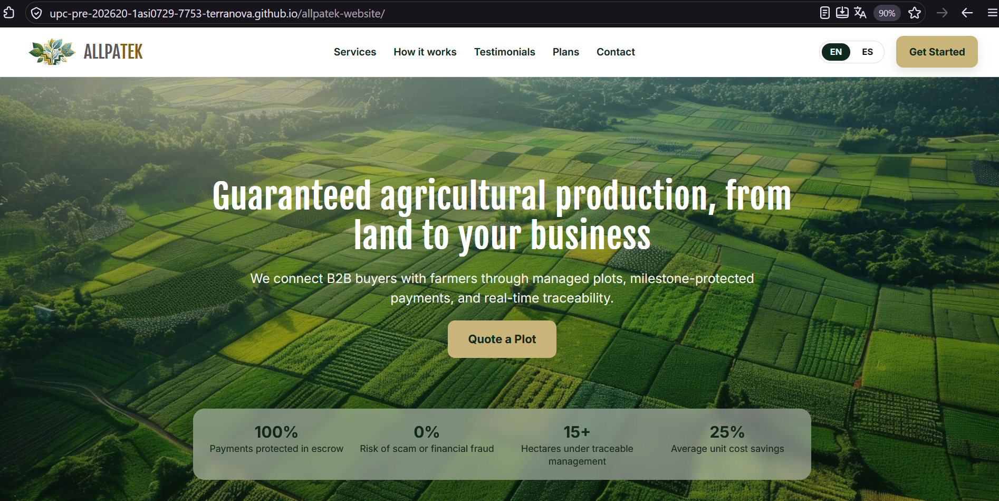
</p>

* **Sección de Servicios y Custodia Escrow:** Presenta las tarjetas explicativas del modelo de custodia financiera y la liberación progresiva de pagos por hitos validados con evidencias de campo.

<p align="center">
  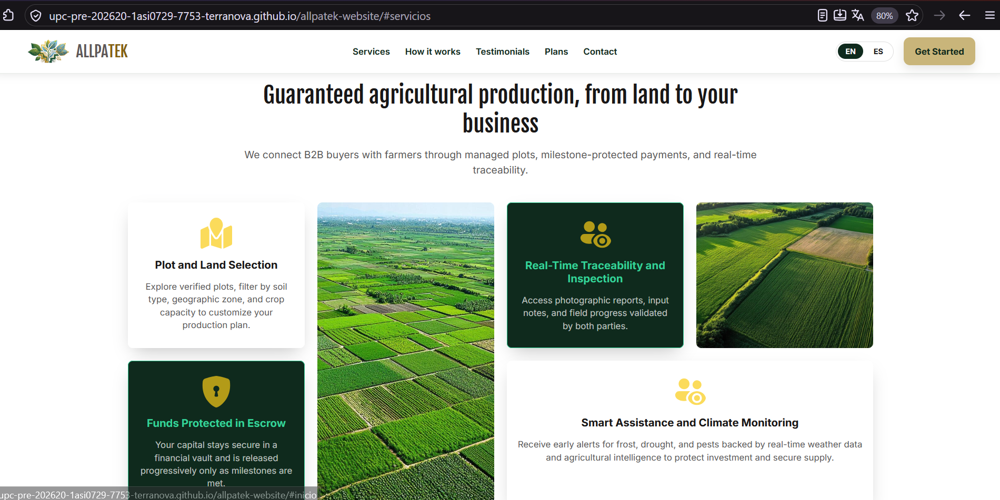
</p>

* **Proceso de Funcionamiento (How It Works) y Testimonios:** Muestra el diagrama secuencial paso a paso del flujo de contratación, acompañado por la cuadrícula de testimonios y valoraciones de usuarios.

<p align="center">
  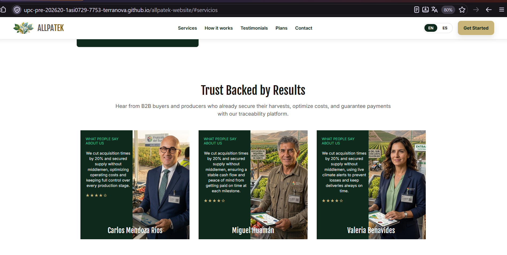
</p>

* **Planes de Producción y Formulario de Contacto:** Detalla las alternativas de suscripción por escala de cultivo y el formulario de captura para solicitudes de propuesta técnica y cotización de parcelas.

<p align="center">
  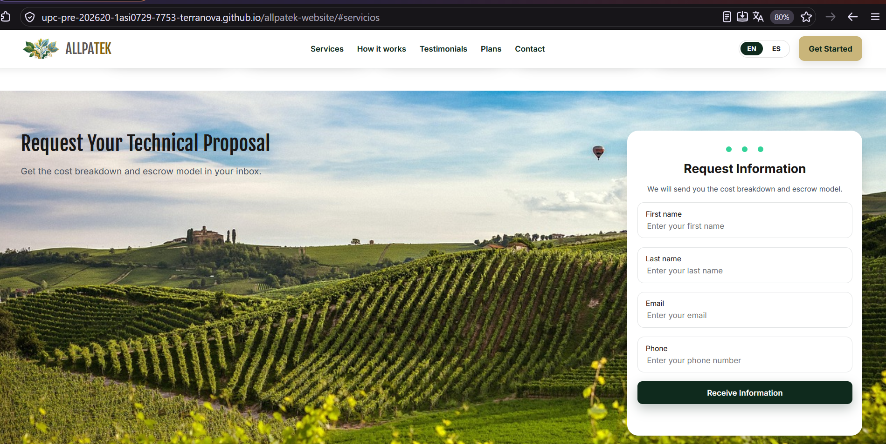
</p>


#### Video Demostrativo de Visualización y Navegación

Para profundizar en la revisión de la ejecución de este Sprint, el equipo preparó una presentación en video donde se ilustra y explica en detalle el recorrido interactivo, las transacciones visuales (*smooth scroll*), las animaciones de componentes y la navegación fluida lograda en la Landing Page:

* **Enlace al Video de Evidencia:** [Ver Demostración de Navegación del Sprint 1](https://upcedupe-my.sharepoint.com/:v:/g/personal/u202116018_upc_edu_pe/IQApudu7-aW0R6zofbarn9-pAd96aUTXm_GwyTKAwac5l90?nav=eyJyZWZlcnJhbEluZm8iOnsicmVmZXJyYWxBcHAiOiJPbmVEcml2ZUZvckJ1c2luZXNzIiwicmVmZXJyYWxBcHBQbGF0Zm9ybSI6IldlYiIsInJlZmVycmFsTW9kZSI6InZpZXciLCJyZWZlcnJhbFZpZXciOiJNeUZpbGVzTGlua0NvcHkifX0&e=7oUJHv)
* **Duración:** ~03:30 min.
* **Contenido:** Recorrido por la Landing Page, validación de diseño *responsive* en vista de escritorio y móvil, interacción con botones CTA y prueba de captura del formulario de contacto.


#### 5.2.1.6. Services Documentation Evidence for Sprint Review


#### 5.2.1.7. Software Deployment Evidence for Sprint Review

Durante el desarrollo del **Sprint 1**, el equipo llevó a cabo la configuración del entorno de despliegue y la publicación pública de la **Landing Page estática de ALLPATEK**, la cual constituye el sitio web informativo y de adquisición inicial para potenciales Comercializadores y productores agrícolas. Para esta iteración, el proceso de despliegue se gestionó en su totalidad a través del servicio de almacenamiento estático **GitHub Pages**, garantizando un acceso público continuo y seguro mediante certificado TLS/SSL.

A continuación, se describen los pasos de configuración ejecutados en el repositorio, la evidencia visual del estado activo del servicio y la matriz con la dirección de acceso al sitio web.


#### 1. Resumen del Proceso de Despliegue en GitHub Pages

1. **Configuración de la Rama de Publicación:** Se configuró el repositorio oficial de la organización para realizar el despliegue automático (*Deploy from a branch*) tomando como fuente la rama principal `main` y asignando el directorio raíz (`/root`) para la compilación de los archivos estáticos (`index.html`, hojas de estilo CSS e imágenes del proyecto).
2. **Generación de Dominio y Certificación SSL:** Se verificó la generación del certificado de seguridad de capa de transporte (HTTPS/TLS) y la asignación del nombre de dominio público provisto por la infraestructura de GitHub.


#### 2. Evidencia Gráfica del Despliegue

A continuación se presenta la captura de pantalla que confirma la ejecución exitosa del flujo de publicación de GitHub Pages dentro del panel de administración del repositorio:

<p align="center">
  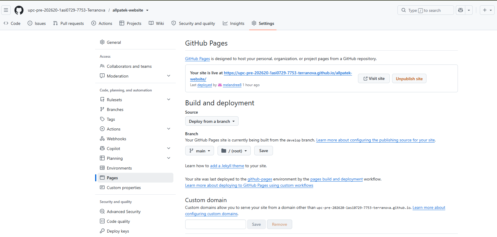
</p>

#### 3. Enlace Público del Producto Desplegado

| Producto Digital | Entorno / Hosting | Fuente de Despliegue | Estado de Publicación | Dirección URL de Acceso Público |
| :--- | :--- | :---: | :---: | :--- |
| **Landing Page** | GitHub Pages | Rama `main` (`/root`) | **Active / Live** | [https://upc-pre-202620-1asi0729-7753-terranova.github.io/allpatek-report/](https://upc-pre-202620-1asi0729-7753-terranova.github.io/allpatek-report/) |


#### 5.2.1.8. Team Collaboration Insights during Sprint

Durante el desarrollo del **Sprint 1**, el equipo **TerraNova** estableció una dinámica de trabajo colaborativa, inclusiva y altamente distribuida para cumplir con la implementación y publicación de la Landing Page estática e informativa de la plataforma **ALLPATEK**. El proceso de desarrollo se gestionó mediante la plataforma **GitHub**, adoptando una estrategia de ramificación por aspectos de la interfaz web (`feature/header-navbar`, `feature/hero`, `feature/services`, `feature/how-it-works`, `feature/testimonials`, `feature/team`, `feature/contact-form`, `feature/footer`, `feature/plans`) para permitir el trabajo en paralelo de todos los miembros del equipo.

Para asegurar la trazabilidad del código fuente y el control de cambios, se aplicó la guía de trabajo basada en el estándar **Conventional Commits** con mensajes redactados estrictamente en inglés. La consolidación del progreso se realizó mediante la revisión continua y la integración de ramas hacia la rama principal de integración, garantizando una participación activa y equitativa de todos los integrantes.


#### 1. Evidencia Analítica de Colaboración en GitHub (Analytics & Contributors)


A continuación, se presentan las capturas de los analíticos extraídos de la pestaña *Insights / Contributors* y *Commits* del repositorio oficial, los cuales evidencian la distribución del trabajo, la frecuencia de commits y las adiciones de código realizadas por cada estudiante:

<p align="center">
  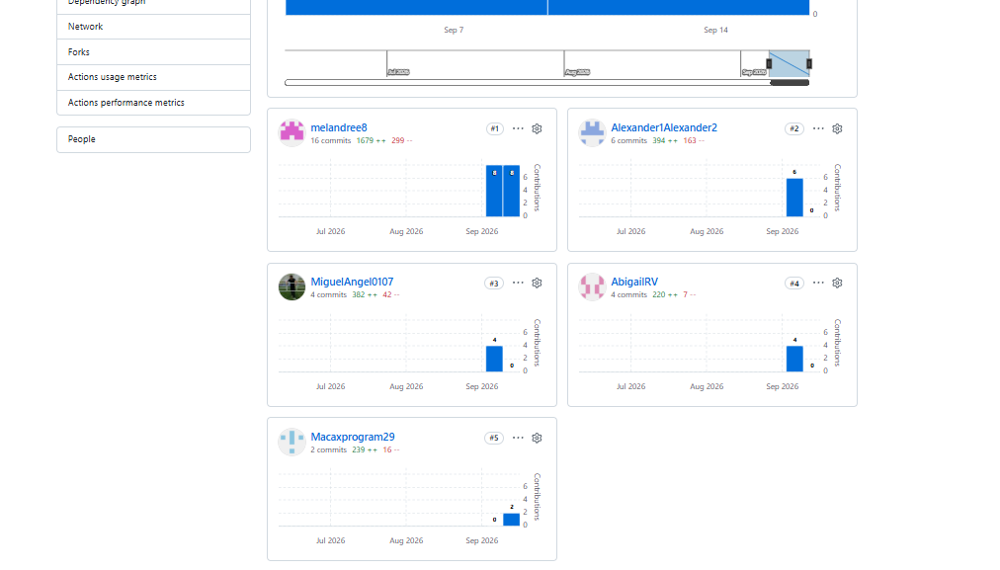
</p>

* **Figura 5.2.1.8.1.** *Métricas de contribuciones por usuario en GitHub Insights, mostrando la participación activa y constante de todos los miembros del equipo durante el desarrollo del Sprint 1.*

<p align="center">
  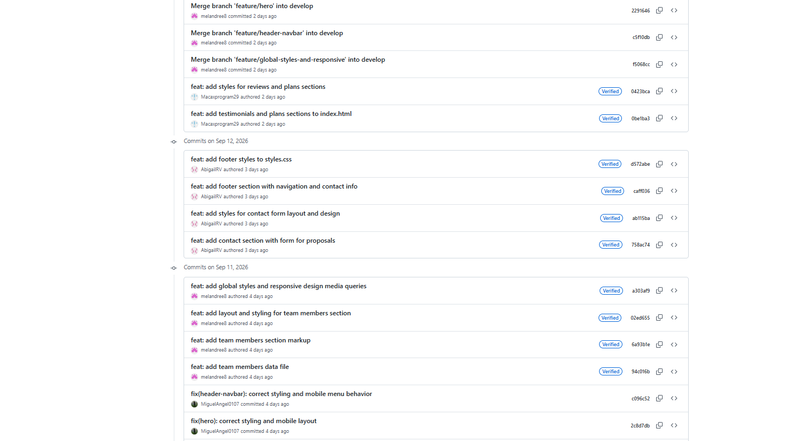
</p>

* **Figura 5.2.1.8.2.** *Grafo de red y flujo de commits en GitHub, evidenciando el uso de ramas de funcionalidades por componente y la integración hacia la rama de desarrollo.*


#### 2. Resumen de Contribuciones por Integrante

En la siguiente tabla se resumen las actividades y entregables específicos asumidos por cada miembro del equipo durante el desarrollo del producto en este Sprint:

| Integrante del Equipo | Usuario en GitHub | Rol / Producto Asignado | Tareas y Secciones Implementadas |
| :--- | :--- | :--- | :--- |
| **Atauje Barreto, Alexander Sebastián** | Alexander1Alexander2 | Developer / Aspect Leader | Maquetación y desarrollo del Header/Navbar, Hero Section y Testimonios. Configuración inicial de la estructura HTML/CSS. |
| **Egocheaga Suyo, Miguel Angel** | MiguelAngel0107 | Developer / Aspect Leader | Desarrollo de la sección de Servicios (Custodia Escrow) y el flujo descriptivo de Funcionamiento (How It Works). |
| **Orellana Rodríguez, Mel Andree** | melandree8 | Repository Admin / Aspect Leader | Configuración del repositorio, implementación de la sección de Equipo (Team), Planes de Producción y gestión de despliegue en GitHub Pages. |
| **Raymundo Villarroel, Abigail Nadhim** | AbigailRV | Developer / Aspect Leader | Maquetación y desarrollo del Formulario de Contacto/Cotización técnica y la sección del Footer. |
| **Vera Solsol, Nayely Macarena** | Macaxprogram29 | Developer / Aspect Leader | Desarrollo de la sección de Testimonios y soporte en la adaptabilidad responsive de la barra de navegación. |


### 5.2.2. Sprint 2
#### 5.2.2.1. Sprint Planning 2
#### 5.2.2.2. Aspect Leaders and Collaborators
#### 5.2.2.3. Sprint Backlog 2
#### 5.2.2.4. Development Evidence for Sprint Review
#### 5.2.2.5. Execution Evidence for Sprint Review
#### 5.2.2.6. Services Documentation Evidence for Sprint Review
#### 5.2.2.7. Software Deployment Evidence for Sprint Review
#### 5.2.2.8. Team Collaboration Insights during Sprint
### 5.2.3. Sprint 3
#### 5.2.3.1. Sprint Planning 3
#### 5.2.3.2. Aspect Leaders and Collaborators
#### 5.2.3.3. Sprint Backlog 3
#### 5.2.3.4. Development Evidence for Sprint Review
#### 5.2.3.5. Execution Evidence for Sprint Review
#### 5.2.3.6. Services Documentation Evidence for Sprint Review
#### 5.2.3.7. Software Deployment Evidence for Sprint Review
#### 5.2.3.8. Team Collaboration Insights during Sprint
### 5.2.4. Sprint 4
#### 5.2.4.1. Sprint Planning 4
#### 5.2.4.2. Aspect Leaders and Collaborators
#### 5.2.4.3. Sprint Backlog 4
#### 5.2.4.4. Development Evidence for Sprint Review
#### 5.2.4.5. Execution Evidence for Sprint Review
#### 5.2.4.6. Services Documentation Evidence for Sprint Review
#### 5.2.4.7. Software Deployment Evidence for Sprint Review
#### 5.2.4.8. Team Collaboration Insights during Sprint

## 5.3. Validation Interviews
### 5.3.1. Diseño de Entrevistas
### 5.3.2. Registro de Entrevistas
### 5.3.3. Evaluaciones según heurísticas

## 5.4. Video About-the-Product

# Conclusiones y recomendaciones

## Conclusiones
## Recomendaciones

# Video About-the-Team

# Bibliografía

# Anexos
