<div align="center">
    <br>
</div>

<p align="center">Universidad Peruana de Ciencias Aplicadas</p>
<p align="center">Carrera de Ingeniería de Software</p>

<h3 align="center"><b>1ASI0729</b></h3>
<h3 align="center"><b>Desarrollo de Aplicaciones Open Source</b></h3>
<p align="center">NRC</p>
<h3 align="center"><b>7753</b></h3>

<h3 align="center">Informe del Trabajo Final</h2>

<p align="center">Docente</p>
<h3 align="center"><b>Bautista Ubillús, Efraín Ricardo</b></h3>


<p align="center">Equipo</p>
<h3 align="center"><b>TerraNova</b></h3>

<p align="center">Proyecto</p>
<h3 align="center"><b>Allpatek </b></h3>


<h3 align="center"><b>Integrantes</b></h3>

<p align="center">
  <b>Código</b> &nbsp;&nbsp;&nbsp;&nbsp;&nbsp;&nbsp;&nbsp;&nbsp;&nbsp;&nbsp;&nbsp;&nbsp;&nbsp;&nbsp; <b>Apellidos y Nombres</b><br>
  u20241f246 &nbsp;&nbsp;&nbsp;&nbsp;&nbsp;&nbsp; Atauje Barreto, Alexander Sebastián<br>
  u202215188 &nbsp;&nbsp;&nbsp;&nbsp;&nbsp;&nbsp; Egocheaga Suyo, Miguel Angel<br>
  u202116018 &nbsp;&nbsp;&nbsp;&nbsp;&nbsp;&nbsp; Orellana Rodríguez, Mel Andree<br>
  U20231h171 &nbsp;&nbsp;&nbsp;&nbsp;&nbsp;&nbsp; Vera Solsol, Nayely Macarena<br>
  u202318001 &nbsp;&nbsp;&nbsp;&nbsp;&nbsp;&nbsp; Raymundo Villarroel, Abigail Nadhim
</p>

<br>

<h3 align="center"><b>Período 202620</b></h3>

<h3 align="center"><b>Septiembre 2026</b></h3>


<div style="page-break-after: always;"></div>

## Registro de Versiones del Informe

| Versión | Fecha | Autor | Descripción de modificación |
|:-------:|:----------:|:-----------------------------------:|:-------------------------------------------------------------------------------------------------------------------------------------------------------------------------------------------------------------------------:|
| AV1 | 06/09/2026 | Orellana Rodríguez, Mel Andree | Redacción de General Style Guidelines y Web Style Guidelines |
| AV1 | 06/09/2026 | Orellana Rodríguez, Mel Andree | Definición de Organization, Labeling, Searching y Navigation Systems |
| AV1 | 06/09/2026 | Orellana Rodríguez, Mel Andree | Configuración de SEO Tags y Meta Tags |
| AV1 | 06/09/2026 | Orellana Rodríguez, Mel Andree | Elaboración de Wireframes y Mock-ups de Landing Page |
| AV1 | 06/09/2026 | Orellana Rodríguez, Mel Andree | Diseño de Wireframes y Mock-ups de la aplicación web |
| AV1 | 06/09/2026 | Orellana Rodríguez, Mel Andree | Creación de diagramas Wireflow y User Flow |
| AV1 | 06/09/2026 | Orellana Rodríguez, Mel Andree | Desarrollo del prototipo interactivo de la aplicación web |
| AV1 | 14/09/2026 | Alexander | Redacción de Startup Profile: Descripción de la Startup y Perfiles de integrantes del equipo |
| AV1 | 14/09/2026 | Alexander | Elaboración de Solution Profile: Antecedentes y problemática del sector agrícola |
| AV1 | 14/09/2026 | Alexander | Definición del Lean UX Process: Problem Statements, Assumptions, Hypothesis Statements y Lean UX Canvas |
| AV1 | 14/09/2026 | Alexander | Redacción y caracterización detallada de los Segmentos Objetivo y referencias en formato APA 7 |
| AV1 | 14/09/2026 | Alexander | Maquetación HTML5 e implementación de estilos CSS Grid para la sección Servicios de la Landing Page |
| AV1 | 14/09/2026 | Alexander | Maquetación HTML5 e implementación de estilos CSS para la sección Hitos / Cómo Funciona |
| AV1 | 14/09/2026 | Alexander | Modularización, refactorización de código CSS y gestión de commits en ramas de GitHub (`feature/services`, `feature/how-it-works`) |
| AV1 | 13/09/2026 | Raymundo Villarroel, Abigail Nadhim | Elaboración de Competidores: Análisis Competitivo, SWOT y Estrategias/Tácticas frente a Agromercado, VeryAgro y Procesadora Perú |
| AV1 | 13/09/2026 | Raymundo Villarroel, Abigail Nadhim | Diseño, Registro y Análisis de Entrevistas para los segmentos de Agricultor Familiar y Comprador Urbano |
| AV1 | 13/09/2026 | Raymundo Villarroel, Abigail Nadhim | Elaboración de Needfinding en UXPressia: User Personas, User Task Matrix, User Journey Mapping (As-Is) y Empathy Mapping |
| AV1 | 13/09/2026 | Raymundo Villarroel, Abigail Nadhim | Modelado del Big Picture Event Storming (Mermaid) y redacción del glosario de Ubiquitous Language |
| AV1 | 13/09/2026 | Raymundo Villarroel, Abigail Nadhim | Maquetación HTML5 y CSS de las secciones de Contacto y Footer de la Landing Page, con gestión de commits en ramas de GitHub (`feature/contact-form`, `feature/footer`) |
| AV1 | 10/09/2026 | Egocheaga Suyo, Miguel Angel | Diseño de la arquitectura guiada por dominio, EventStorming de diseño y diagramas C4 de contexto, contenedores y componentes. |
| AV1 | 10/09/2026 | Egocheaga Suyo, Miguel Angel | Diseño orientado a objetos, diagramas de clases, diseño de base de datos y diagramas de base de datos. |
| AV1 | 11/09/2026 | Egocheaga Suyo, Miguel Angel | Implementación y ajustes responsivos de Header/Navbar y Hero de la Landing Page, con HTML5, CSS3 y JavaScript. |
| AV1 | 14/09/2026 | Vera Solsol, Nayely Macarena | Elaboración del Impact Mapping |
| AV1 | 14/09/2026 | Vera Solsol, Nayely Macarena | Diseñar y actualizar los User Stories |
| AV1 | 13/09/2026 | Vera Solsol, Nayely Macarena | Elaboracion del Product Backlog | 


## Project Report Collaboration Insights

| Integrante | Tareas Asignadas |
|---|---|
| Atauje Barreto, Alexander Sebastián | Introduction, Startup Profile, Startup Description, Team Member Profiles, Solution Profile, Background & Problematic, Lean UX Process (Problem Statements, Assumptions, Hypothesis Statements, Lean UX Canvas), Target Segments, Services Section (HTML5 & CSS Grid Layout), Milestones / How It Works Section (HTML5 & CSS Layout), Landing Page Modularization & GitHub Branch Management |
| Egocheaga Suyo, Miguel Angel | Domain-Driven Software Architecture (Chapter 4.6), Design-Level EventStorming, Software Architecture Context, Container and Component Diagrams, Software Object-Oriented Design, Class Diagrams, Database Design and Database Diagrams; Landing Page Header/Navbar and Hero Section implementation, responsive styles and navigation behavior (HTML5, CSS3 and JavaScript). |
| Orellana Rodríguez, Mel Andree | Style Guidelines, General Style Guidelines, Web Style Guidelines, Information Architecture, Organization Systems, Labeling Systems, SEO Tags and Meta Tags, Searching Systems, Navigation Systems, Landing Page UI Design, Landing Page Wireframe, Landing Page Mock-up, Web Applications UX/UI Design, Web Applications Wireframes, Web Applications Wireflow Diagrams, Web Applications Mock-ups, Web Applications User Flow Diagrams, Web Applications Prototyping |
| Vera Solsol, Nayely Macarena | Impact Mapping, User Stories and Product Backlog (Chapter 3) |
| Raymundo Villarroel, Abigail Nadhim | Requirements Elicitation & Analysis (Chapter 2): Competitors, Competitive Analysis Landscape & SWOT, Competitive Strategies and Tactics, Interviews (Design, Record and Analysis for both segments), User Personas, User Task Matrix, User Journey Mapping (As-Is), Empathy Mapping, Big Picture Event Storming (Mermaid), Ubiquitous Language; Landing Page Contact Section and Footer Section (HTML5 & CSS) |

El proceso de colaboración en el informe se realizó mediante commits constantes al repositorio de la organización.


## Tabla de Contenidos

* [Capítulo I: Introducción](#capítulo-i-introducción)
  * [1.1. Startup Profile](#11-startup-profile)
    * [1.1.1. Descripción de la Startup](#111-descripción-de-la-startup)
    * [1.1.2. Perfiles de integrantes del equipo](#112-perfiles-de-integrantes-del-equipo)
  * [1.2. Solution Profile](#12-solution-profile)
    * [1.2.1. Antecedentes y problemática](#121-antecedentes-y-problemática)
    * [1.2.2. Lean UX Process](#122-lean-ux-process)
      * [1.2.2.1. Lean UX Problem Statements](#1221-lean-ux-problem-statements)
      * [1.2.2.2. Lean UX Assumptions](#1222-lean-ux-assumptions)
      * [1.2.2.3. Lean UX Hypothesis Statements](#1223-lean-ux-hypothesis-statements)
      * [1.2.2.4. Lean UX Canvas](#1224-lean-ux-canvas)
  * [1.3. Segmentos objetivo](#13-segmentos-objetivo)
* [Capítulo II: Requirements Elicitation & Analysis](#capítulo-ii-requirements-elicitation--analysis)
  * [2.1. Competidores](#21-competidores)
    * [2.1.1. Análisis competitivo](#211-análisis-competitivo)
    * [2.1.2. Estrategias y tácticas frente a competidores](#212-estrategias-y-tácticas-frente-a-competidores)
  * [2.2. Entrevistas](#22-entrevistas)
    * [2.2.1. Diseño de entrevistas](#221-diseño-de-entrevistas)
    * [2.2.2. Registro de entrevistas](#222-registro-de-entrevistas)
    * [2.2.3. Análisis de entrevistas](#223-análisis-de-entrevistas)
  * [2.3. Needfinding](#23-needfinding)
    * [2.3.1. User Personas](#231-user-personas)
    * [2.3.2. User Task Matrix](#232-user-task-matrix)
    * [2.3.3. User Journey Mapping](#233-user-journey-mapping)
    * [2.3.4. Empathy Mapping](#234-empathy-mapping)
  * [2.4. Big Picture Event Storming](#24-big-picture-event-storming)
  * [2.5. Ubiquitous Language](#25-ubiquitous-language)
* [Capítulo III: Requirements Specification](#capítulo-iii-requirements-specification)
  * [3.1. User Stories](#31-user-stories)
  * [3.2. Impact Mapping](#32-impact-mapping)
  * [3.3. Product Backlog](#33-product-backlog)
* [Capítulo IV: Product Design](#capítulo-iv-product-design)
  * [4.1. Style Guidelines](#41-style-guidelines)
    * [4.1.1. General Style Guidelines](#411-general-style-guidelines)
    * [4.1.2. Web Style Guidelines](#412-web-style-guidelines)
  * [4.2. Information Architecture](#42-information-architecture)
    * [4.2.1. Organization Systems](#421-organization-systems)
    * [4.2.2. Labeling Systems](#422-labeling-systems)
    * [4.2.3. SEO Tags and Meta Tags](#423-seo-tags-and-meta-tags)
    * [4.2.4. Searching Systems](#424-searching-systems)
    * [4.2.5. Navigation Systems](#425-navigation-systems)
  * [4.3. Landing Page UI Design](#43-landing-page-ui-design)
    * [4.3.1. Landing Page Wireframe](#431-landing-page-wireframe)
    * [4.3.2. Landing Page Mock-up](#432-landing-page-mock-up)
  * [4.4. Web Applications UX/UI Design](#44-web-applications-uxui-design)
    * [4.4.1. Web Applications Wireframes](#441-web-applications-wireframes)
    * [4.4.2. Web Applications Wireflow Diagrams](#442-web-applications-wireflow-diagrams)
    * [4.4.3. Web Applications Mock-ups](#443-web-applications-mock-ups)
    * [4.4.4. Web Applications User Flow Diagrams](#444-web-applications-user-flow-diagrams)
  * [4.5. Web Applications Prototyping](#45-web-applications-prototyping)
  * [4.6. Domain-Driven Software Architecture](#46-domain-driven-software-architecture)
    * [4.6.1. Design-Level Event Storming](#461-design-level-event-storming)
    * [4.6.2. Software Architecture Context Diagram](#462-software-architecture-context-diagram)
    * [4.6.3. Software Architecture Container Diagrams](#463-software-architecture-container-diagrams)
    * [4.6.4. Software Architecture Components Diagrams](#464-software-architecture-components-diagrams)
  * [4.7. Software Object-Oriented Design](#47-software-object-oriented-design)
    * [4.7.1. Class Diagrams](#471-class-diagrams)
  * [4.8. Database Design](#48-database-design)
    * [4.8.1. Database Diagrams](#481-database-diagrams)
* [Capítulo V: Product Implementation, Validation & Deployment](#capítulo-v-product-implementation-validation--deployment)
  * [5.1. Software Configuration Management](#51-software-configuration-management)
    * [5.1.1. Software Development Environment Configuration](#511-software-development-environment-configuration)
    * [5.1.2. Source Code Management](#512-source-code-management)
    * [5.1.3. Source Code Style Guide & Conventions](#513-source-code-style-guide--conventions)
    * [5.1.4. Software Deployment Configuration](#514-software-deployment-configuration)
  * [5.2. Landing Page, Services & Applications Implementation](#52-landing-page-services--applications-implementation)
    * [5.2.1. Sprint 1](#521-sprint-1)
      * [5.2.1.1. Sprint Planning 1](#5211-sprint-planning-1)
      * [5.2.1.2. Aspect Leaders and Collaborators](#5212-aspect-leaders-and-collaborators)
      * [5.2.1.3. Sprint Backlog 1](#5213-sprint-backlog-1)
      * [5.2.1.4. Development Evidence for Sprint Review](#5214-development-evidence-for-sprint-review)
      * [5.2.1.5. Execution Evidence for Sprint Review](#5215-execution-evidence-for-sprint-review)
      * [5.2.1.6. Services Documentation Evidence for Sprint Review](#5216-services-documentation-evidence-for-sprint-review)
      * [5.2.1.7. Software Deployment Evidence for Sprint Review](#5217-software-deployment-evidence-for-sprint-review)
      * [5.2.1.8. Team Collaboration Insights during Sprint](#5218-team-collaboration-insights-during-sprint)
    * [5.2.2. Sprint 2](#522-sprint-2)
      * [5.2.2.1. Sprint Planning 2](#5221-sprint-planning-2)
      * [5.2.2.2. Aspect Leaders and Collaborators](#5222-aspect-leaders-and-collaborators)
      * [5.2.2.3. Sprint Backlog 2](#5223-sprint-backlog-2)
      * [5.2.2.4. Development Evidence for Sprint Review](#5224-development-evidence-for-sprint-review)
      * [5.2.2.5. Execution Evidence for Sprint Review](#5225-execution-evidence-for-sprint-review)
      * [5.2.2.6. Services Documentation Evidence for Sprint Review](#5226-services-documentation-evidence-for-sprint-review)
      * [5.2.2.7. Software Deployment Evidence for Sprint Review](#5227-software-deployment-evidence-for-sprint-review)
      * [5.2.2.8. Team Collaboration Insights during Sprint](#5228-team-collaboration-insights-during-sprint)
    * [5.2.3. Sprint 3](#523-sprint-3)
      * [5.2.3.1. Sprint Planning 3](#5231-sprint-planning-3)
      * [5.2.3.2. Aspect Leaders and Collaborators](#5232-aspect-leaders-and-collaborators)
      * [5.2.3.3. Sprint Backlog 3](#5233-sprint-backlog-3)
      * [5.2.3.4. Development Evidence for Sprint Review](#5234-development-evidence-for-sprint-review)
      * [5.2.3.5. Execution Evidence for Sprint Review](#5235-execution-evidence-for-sprint-review)
      * [5.2.3.6. Services Documentation Evidence for Sprint Review](#5236-services-documentation-evidence-for-sprint-review)
      * [5.2.3.7. Software Deployment Evidence for Sprint Review](#5237-software-deployment-evidence-for-sprint-review)
      * [5.2.3.8. Team Collaboration Insights during Sprint](#5238-team-collaboration-insights-during-sprint)
    * [5.2.4. Sprint 4](#524-sprint-4)
      * [5.2.4.1. Sprint Planning 4](#5241-sprint-planning-4)
      * [5.2.4.2. Aspect Leaders and Collaborators](#5242-aspect-leaders-and-collaborators)
      * [5.2.4.3. Sprint Backlog 4](#5243-sprint-backlog-4)
      * [5.2.4.4. Development Evidence for Sprint Review](#5244-development-evidence-for-sprint-review)
      * [5.2.4.5. Execution Evidence for Sprint Review](#5245-execution-evidence-for-sprint-review)
      * [5.2.4.6. Services Documentation Evidence for Sprint Review](#5246-services-documentation-evidence-for-sprint-review)
      * [5.2.4.7. Software Deployment Evidence for Sprint Review](#5247-software-deployment-evidence-for-sprint-review)
      * [5.2.4.8. Team Collaboration Insights during Sprint](#5248-team-collaboration-insights-during-sprint)
  * [5.3. Validation Interviews](#53-validation-interviews)
    * [5.3.1. Diseño de Entrevistas](#531-diseño-de-entrevistas)
    * [5.3.2. Registro de Entrevistas](#532-registro-de-entrevistas)
    * [5.3.3. Evaluaciones según heurísticas](#533-evaluaciones-según-heurísticas)
  * [5.4. Video About-the-Product](#54-video-about-the-product)
* [Conclusiones y Recomendaciones](#conclusiones-y-recomendaciones)
* [Video App Validation](#video-app-validation)
* [Video About the product](#video-about-the-product)
* [Video About the team](#video-about-the-team)
* [Glosario](#glosario)
* [Bibliografía](#bibliografía)
* [Anexos](#anexos)


# Student Outcome 3

<div align="center">
  <table style="width:100%; border-collapse: collapse; font-family: Arial, sans-serif; font-size: 14px;">
    <thead>
      <tr style="background-color: #f2f2f2; text-align: center;">
        <th style="border: 1px solid #dddddd; padding: 12px; width: 25%;">Criterio específico</th>
        <th style="border: 1px solid #dddddd; padding: 12px; width: 45%;">Acciones realizadas</th>
        <th style="border: 1px solid #dddddd; padding: 12px; width: 30%;">Conclusiones</th>
      </tr>
    </thead>
    <tbody>
      <tr>
        <td style="border: 1px solid #dddddd; padding: 10px; font-weight: bold; vertical-align: top;">
          Comunica oralmente con efectividad a diferentes rangos de audiencia.
        </td>
        <td style="border: 1px solid #dddddd; padding: 10px; vertical-align: top;">
          <ul>
            <li><b>AV1 - Mel Andree Orellana Rodriguez:</b> Presentación oral del avance del Capítulo 4 enfocado en el diseño de interfaces UI/UX para la plataforma "ALLPATEK", adaptando el vocabulario técnico para audiencias con perfil agrícola (agricultores) y comercial (comerciantes B2B) durante la demostración de los prototipos interactivos.</li>
            <li><b>AV1 - Atauje Barreto, Alexander Sebastián:</b> Exposición oral del Capítulo 1 (Introducción), sustentando la propuesta de valor de ALLPATEK, el problema del sector agrícola y los supuestos del Lean UX Canvas ante el equipo de evaluación, adaptando la explicación del modelo de negocio B2B para perfiles técnicos y académicos.</li>
            <li><b>AV1 - Egocheaga Suyo, Miguel Angel:</b> Exposición oral de las secciones 4.6 a 4.8.1 del Capítulo IV, explicando el flujo de contratación, los pagos por hitos, la arquitectura de Allpatek y el diseño de datos mediante ejemplos comprensibles para evaluadores y perfiles no técnicos.</li>
            <li><b>AV1 - Raymundo Villarroel, Abigail Nadhim:</b> Exposición oral del avance del Capítulo II (Requirements Elicitation & Analysis), presentando el análisis competitivo frente a Agromercado, VeryAgro y Procesadora Perú, los hallazgos del proceso de needfinding (User Personas, User Journey Maps y Empathy Maps) y el modelado del Big Picture Event Storming, adaptando la explicación del dominio agrícola y del modelo Agro-as-a-Service para una audiencia evaluadora sin conocimiento previo del sector.</li>
            <li><b>AV1 - Vera Solsol, Nayely Macarena:</b> Exposición oral del avance del Capítulo III (Requirement Specification), presentando la alineación estratégica del Impact Mapping, la definición de las User Stories con sus criterios de aceptación y la priorización del Product Backlog para la plataforma ALLPATEK, adaptando la explicación técnica del flujo de requerimientos para una audiencia evaluadora académica y profesional. </li>
          </ul>
        </td>
        <td style="border: 1px solid #dddddd; padding: 10px; vertical-align: top;">
Se demostró capacidad para exponer y sustentar de manera clara las soluciones técnicas y de diseño del proyecto ante diversas audiencias, adaptando el lenguaje técnico según el perfil de los interlocutores (evaluadores, agricultores y comerciantes B2B) y defendiendo eficazmente las decisiones del sistema.        </td>
      </tr>
      <tr>
        <td style="border: 1px solid #dddddd; padding: 10px; font-weight: bold; vertical-align: top;">
          Comunica por escrito con efectividad a diferentes rangos de audiencia
        </td>
        <td style="border: 1px solid #dddddd; padding: 10px; vertical-align: top;">
          <ul>
            <li><b>AV1 - Mel Andree Orellana Rodriguez:</b> Redacté y estructuré los entregables escritos correspondientes al diseño de interfaces UI/UX de la plataforma ALLPATEK, adaptando el lenguaje técnico para la documentación del sistema y elaborando explicaciones claras para los flujos de trabajo de agricultores y comerciantes. Además, documenté los avances del proyecto manteniendo un estándar accesible para la revisión del equipo y supervisores.</li>
            <li><b>AV1 - Atauje Barreto, Alexander Sebastián:</b> Redacción y estructuración académica del Capítulo I bajo estándares APA 7, abarcando el perfil de la startup, la problemática del sector agrícola, el Lean UX Process y la caracterización de los segmentos objetivo. Asimismo, maqueté las secciones de Servicios e Hitos en la Landing Page garantizando claridad textual y coherencia visual para usuarios finales y revisores.</li>
            <li><b>AV1 - Egocheaga Suyo, Miguel Angel:</b> Redacción y diagramación de las secciones 4.6 a 4.8.1 del Capítulo IV: arquitectura guiada por dominio, EventStorming de diseño, diagramas C4, diseño orientado a objetos, clases y diseño de base de datos. Además, implementé Header/Navbar y Hero de la Landing Page con HTML5, CSS3 y JavaScript, incluyendo ajustes de navegación y adaptación a móviles.</li>
            <li><b>AV1 - Raymundo Villarroel, Abigail Nadhim:</b> Redacción del Capítulo II (Requirements Elicitation & Analysis) del informe, incluyendo el análisis competitivo y SWOT, el diseño y análisis de entrevistas para los segmentos de Agricultor Familiar y Comprador Urbano, la construcción de los User Personas, User Task Matrix, User Journey Maps y Empathy Maps, el modelado del Big Picture Event Storming y la elaboración del glosario de Ubiquitous Language, estructurando el contenido de forma clara y trazable para su revisión por el equipo docente y evaluador.</li>
            <li><b>AV1 - Vera Solsol, Nayely Macarena:</b> Redacción y estructuración formal del Capítulo III: Requirement Specification, articulando con precisión técnica la elaboración del Impact Mapping para la alineación estratégica, la formulación detallada de User Stories con sus respectivos criterios de aceptación orientados al usuario final, y la priorización del Product Backlog de la plataforma ALLPATEK, empleando un lenguaje claro, profesional y adaptado tanto para perfiles técnicos como comerciales del sector agrícola. </li>
          </ul>
        </td>
        <td style="border: 1px solid #dddddd; padding: 10px; vertical-align: top;">
Se evidenció rigor y claridad en la elaboración de la documentación técnica y entregables del proyecto, estructurando la información mediante estándares accesibles, documentación de interfaces y registros organizados que garantizan que el mensaje sea comprensible tanto para desarrolladores como para supervisores académicos.        </td>
      </tr>
    </tbody>
  </table>
</div>


# Capítulo I: Introducción

## 1.1. Startup Profile

### 1.1.1. Descripción de la Startup

Allpatek se posiciona como una propuesta de innovación tecnológica aplicada al sector agrotech en el Perú, orientada a reestructurar la cadena tradicional de intermediación agrícola. La iniciativa introduce el modelo de *Agro-as-a-Service* (AaaS), una modalidad mediante la cual los comerciantes que abarcan desde familias y restaurantes hasta empresas del sector agroindustrial no compran cosechas listas para la venta ni interactúan con intermediarios comerciales. En su lugar, suscriben un acuerdo comercial para alquilar parcelas específicas y contratar de forma directa la labor del agricultor familiar durante todo el ciclo productivo de una temporada. Bajo este esquema, el comerciante obtiene alimentos trazables a costo directo de producción, mientras que la familia agricultora asegura una retribución económica predecible vinculada al trabajo realizado durante la campaña, mitigando su vulnerabilidad frente a las fluctuaciones de precios del mercado y las contingencias climáticas.

La identidad de la startup sintetiza esta visión desde su denominación: el término proviene de la conjunción de la voz quechua *allpa* ("tierra") y la raíz *tek* (tecnología), formalizando el compromiso de digitalizar la gestión técnica y operativa del campo. La plataforma integra la oferta de terrenos cultivables, perfiles de agricultores, formalización contractual y canales de seguimiento en un solo entorno digital. Para garantizar la eficiencia operativa sin encarecer los costos de desarrollo, el sistema implementa **n8n**, una herramienta de automatización de flujos de trabajo de código abierto. Esta infraestructura gestiona tareas críticas del negocio: ante la confirmación del pago por parte del cliente, n8n compila y distribuye automáticamente el contrato legal en formato PDF vía correo electrónico, coordinando además la emisión programada de notificaciones sobre el estado del cultivo y estimaciones de cosecha.

Desde el punto de vista teórico y sectorial, el modelo de Allpatek se fundamenta en la literatura de *contract farming*, definida como la formalización de acuerdos previos entre productores y comerciantes sobre aspectos cuantitativos, cualitativos, plazos y precios de entrega. Investigaciones en economía agraria señalan que estos mecanismos incrementan de forma sustancial el ingreso de los pequeños productores al facilitar la adopción de mejores prácticas y transferir parte del riesgo comercial fuera del eslabón primario (Otsuka et al., 2016). Asimismo, la propuesta atiende un cuello de botella histórico en la agricultura familiar en el Perú, donde el acceso asimétrico a la información comercial restringe la inserción de los pequeños agricultores en los canales de distribución de mayor valor (Fan & Salas Garcia, 2018).

* **Misión:** Transformar la dinámica comercial entre pequeños agricultores y comerciantes mediante un modelo de agricultura por temporada que sustituye la incertidumbre del mercado por relaciones contractuales transparentes, automatizadas y equitativas.
* **Visión:** Consolidarse como la plataforma digital de referencia en *Agro-as-a-Service* en el Perú, garantizando estabilidad financiera para las comunidades agrícolas y acceso a productos a costo directo de origen para el mercado urbano y corporativo.

### 1.1.2. Perfiles de integrantes del equipo

| Foto | Descripción |
|:---:|:---|
|  | **Atauje Barreto, Alexander Sebastián** - U20241F246<br><br>Soy estudiante de Ingeniería de Software, actualmente curso el quinto ciclo, me interesa el área de iot, tengo ciertos conocimientos de las herramientas de programación conocidas como C++, HTML, CSS y C#, actualmente refuerzo mi nivel de ingles y mejoro en otras áreas para tener un mejor desempeño|
|  | **Egocheaga Suyo, Miguel Angel** - U202215188<br><br>Soy estudiante de Ingeniería de Software y cuento con experiencia profesional en el desarrollo de aplicaciones web y la automatización de procesos. Trabajo principalmente con Python, Django, React, TypeScript y PostgreSQL, y tengo experiencia en la creación de APIs y la integración de sistemas. Me interesa desarrollar soluciones que respondan a necesidades reales, comprendiendo tanto los aspectos técnicos como los procesos del negocio. Me caracterizo por el aprendizaje autónomo, la organización y la resolución de problemas. Dentro del equipo, puedo aportar al análisis de requerimientos, al diseño de la solución y al desarrollo del backend, además de colaborar en la planificación de tareas y la integración de los componentes del proyecto. |
|  | **Orellana Rodríguez, Mel Andree** - U202116018<br><br>Soy estudiante de Ingeniería de Software, actualmente cursando el séptimo ciclo. Me interesa desarrollar e implementar soluciones tecnológicas innovadoras que generen un impacto positivo y ayuden a resolver necesidades reales. Cuento con conocimientos en desarrollo web utilizando HTML, CSS y JavaScript, así como en Python para análisis y procesamiento de datos. También tengo conocimientos en bases de datos y Supabase. Además, manejo herramientas de automatización como n8n y soluciones Low-Code como Power BI, Power Automate y Power Apps. Tengo especial interés en desarrollarme profesionalmente en las áreas de análisis de datos, automatización e Inteligencia Artificial Generativa, particularmente dentro del ecosistema de Microsoft. |
|  | **Vera Solsol, Nayely Macarena** - U20231H171<br><br> Mi nombre es Nayely Macarena Vera Solsol, tengo 20 años y estoy cursando el 5to ciclo de la carrera de Ingeniería de Software. Me apasiona el proceso de aprendizaje continuo y el trabajo colaborativo, aportando compromiso, adaptabilidad y buena comunicación al equipo. Cuento con conocimientos en C++ y actualmente me encuentro reforzando mi nivel de inglés para ampliar mis oportunidades profesionales y responder de manera efectiva a los retos tecnológicos actuales. Me comprometo a aportar de forma activa, responsable y dedicada al desarrollo del proyecto para lograr resultados de calidad.|
|  | **Raymundo Villarroel, Abigail Nadhim** - U202318001<br><br>Mi nombre es Abigail Nadhim Raymundo Villarroel, tengo 20 años y vivo en Lima. Actualmente estoy cursando el sexto ciclo de Ingeniería de Software, avanzando algunos cursos del ciclo superior. Desde siempre me ha apasionado crear, diseñar y programar para ofrecer soluciones. Me gusta aprender constantemente para ampliar mis conocimientos y fortalecer mi perfil profesional. Además, cuento con un nivel intermedio de inglés y tengo interés por los idiomas, por lo que también estoy aprendiendo francés y portugués. En mi tiempo libre disfruto dibujar, bailar y cantar, actividades que me ayudan a mantener mi creatividad y energía. Me comprometo a aportar con responsabilidad y dedicación al equipo, trabajar de manera colaborativa y contribuir al desarrollo de un proyecto sobresaliente. Mis principales habilidades incluyen creatividad, disciplina y trabajo en equipo, cualidades que aplico para lograr resultados efectivos y de calidad. |

## 1.2. Solution Profile

En esta sección se fundamenta el diseño estratégico de Allpatek a partir del diagnóstico de las fricciones comerciales y los riesgos estructurales que afectan al agro peruano. Para ello, la arquitectura de la solución parte del marco conceptual de la literatura académica sobre acceso a mercados, modelos de agricultura por contrato y mitigación del riesgo climático en unidades de producción familiar. Sobre esta base analítica se implementa la metodología Lean UX, la cual permite articular las suposiciones del negocio, formular hipótesis de valor contrastables y estructurar el Canvas del producto. Este enfoque garantiza que las funcionalidades de la plataforma respondan directamente a los puntos de dolor detectados tanto en las familias agricultoras como en los comerciantes urbanos y corporativos.

### 1.2.1. Antecedentes y problemática

La estructura productiva de la agricultura peruana es predominantemente familiar y de pequeña escala, y el acceso a información de mercado es uno de los factores que más condiciona su desempeño comercial. Fan y Salas Garcia (2018), utilizando datos a nivel de hogar del IV Censo Nacional Agropecuario del Perú (2012) y un modelo econométrico de triple obstáculo (triple-hurdle-model), encuentran que el acceso a internet y a telefonía tiene un efecto positivo y significativo sobre la decisión de los pequeños agricultores de participar en el mercado, sobre el canal de comercialización que eligen y sobre el volumen que logran vender. Los productores con acceso a tecnologías de información tienen mayor probabilidad de vender en el mercado nacional e incluso de exportar frente a quienes carecen de dicho acceso, y el efecto del internet sobre el volumen de venta es incluso mayor que el de la telefonía móvil. Este hallazgo evidencia que la asimetría de información, y no solo la distancia física al mercado, es una barrera central que limita el ingreso de los pequeños productores peruanos a canales de comercialización más rentables.

Esta desventaja estructural del pequeño agricultor frente a la cadena de comercialización tradicional ha sido abordada en la literatura económica mediante el concepto de contract farming o agricultura por contrato, definido como un acuerdo previo entre el productor y el comerciante sobre volumen, calidad, tiempo de entrega y precio (Otsuka et al., 2016). La revisión sistemática de Otsuka et al. (2016) sobre agricultura por contrato en países en desarrollo concluye que este mecanismo contribuye a mejorar el ingreso de los agricultores al introducir nuevos cultivos y métodos de producción, aunque advierte que su efecto sobre la reducción de la pobreza depende del diseño institucional y de políticas complementarias que eviten la exclusión de los productores menos organizados. El modelo de Allpatek, contratación de parcela y trabajo por temporada, con pago garantizado por labor realizada, constituye una aplicación directa de este mecanismo al contexto peruano, con la particularidad de resolver mediante una plataforma digital la misma asimetría de información que Fan y Salas Garcia (2018) identifican como barrera de participación, y de automatizar además su formalización legal y seguimiento.

A esta desventaja comercial se suma un riesgo climático creciente que el agricultor familiar asume mayoritariamente en solitario. Heikkinen (2021), en un estudio de caso sobre el valle del río Mantaro en la sierra central del Perú, documenta que en las últimas décadas se ha registrado un incremento en la frecuencia de sequías, heladas y lluvias intensas, fenómenos que sumados al retroceso de los glaciares andinos que alimentan los sistemas de riego configuran una amenaza creciente para los medios de vida de los pequeños agricultores altoandinos. La autora sostiene que la vulnerabilidad de estos productores frente al cambio climático no depende únicamente de la exposición física a eventos extremos, sino también de relaciones de poder asimétricas dentro de las estructuras de adaptación climática, en las que la protección de los agricultores de montaña no siempre es una prioridad institucional.

En la misma línea, el estudio econométrico de Tambet y Stopnitzky (2021), que combina tres rondas de la Encuesta Nacional Agropecuaria del INEI con datos climáticos de largo plazo para productores de papa y maíz, encuentra evidencia cuantitativa del impacto económico de la variabilidad climática sobre las decisiones productivas de los pequeños agricultores: el uso de pesticidas se incrementa en ocho puntos porcentuales tras un año de sequía, y las prácticas de conservación de suelo y agua se reducen tras años de lluvia inusualmente alta, evidenciando que los agricultores ajustan de forma reactiva y a menudo costosa sus prácticas ante cada choque climático, sin ningún mecanismo de cobertura previa que estabilice su ingreso.

Frente a este escenario, el modelo de comercialización vigente no ofrece al agricultor ninguna protección frente al riesgo de precio ni de clima, y no ofrece al comerciante ninguna predictibilidad de costo ni trazabilidad del origen de su alimento. Es en este vacío donde Allpatek propone su modelo de Agro-as-a-Service: el comerciante contrata por adelantado la parcela y el trabajo del agricultor durante la temporada, fijando así el costo desde el inicio del ciclo productivo, mientras el agricultor recibe un ingreso por labor realizada, no por el resultado incierto de la cosecha ni por su acceso desigual a información de mercado (Fan & Salas Garcia, 2018), aplicando al contexto peruano los mecanismos de agricultura por contrato que la literatura académica identifica como una vía para mejorar el ingreso del pequeño productor (Otsuka et al., 2016).

#### Análisis de la problemática (Técnica 5W2H)

Who? (¿Quiénes?):

Los actores directamente afectados son los pequeños agricultores familiares con acceso limitado a información de mercado, internet y telefonía, lo que reduce su probabilidad de participar en canales de comercialización más rentables y el volumen que logran vender (Fan & Salas Garcia, 2018); y los comerciantes urbanos, empresas de alimentos, restaurantes, familias y organizaciones, que no tienen forma de anticipar el costo final ni la trazabilidad del producto que consumen.

What? (¿Qué?):

El problema central es la asimetría de riesgo e información en la comercialización agrícola: el agricultor asume el riesgo climático y de precio de mercado con escasos mecanismos de cobertura formal, mientras enfrenta una desventaja de acceso a información que limita su participación en mercados más dinámicos (Fan & Salas Garcia, 2018). Los mecanismos de agricultura por contrato pueden mitigar esta asimetría, pero su beneficio no es automático ni se distribuye de forma pareja entre todos los productores si no se diseñan con criterios de inclusión (Otsuka et al., 2016).

Where? (¿Dónde?):

El problema se concentra en las zonas de agricultura familiar de pequeña escala de la sierra y costa peruanas. El estudio de Fan y Salas Garcia (2018) utiliza datos representativos a nivel nacional del IV Censo Nacional Agropecuario, mientras que los estudios de caso de Heikkinen (2021) y Tambet y Stopnitzky (2021) sitúan parte de la problemática climática en el valle del río Mantaro, en la sierra central del país, una de las principales zonas productoras de papa y maíz y, a la vez, una de las más expuestas a la variabilidad climática andina.

When? (¿Cuándo?):

El riesgo climático se materializa de forma creciente en las últimas décadas, con una mayor frecuencia de sequías, heladas y lluvias intensas respecto a periodos anteriores (Heikkinen, 2021). El ajuste reactivo de los agricultores ante estos choques climáticos, y su correspondiente costo, ocurre en cada ciclo agrícola, inmediatamente después de un año de sequía o de precipitación inusualmente alta (Tambet & Stopnitzky, 2021). La barrera de acceso a información de mercado, en cambio, es una condición estructural y permanente para los productores que no cuentan con conectividad (Fan & Salas Garcia, 2018).

Why? (¿Por qué?):

La literatura identifica dos causas centrales. Primero, la falta de acceso a internet y telefonía limita la capacidad de los pequeños productores para conocer precios, elegir el mejor canal de venta y negociar mejores condiciones, lo que reduce tanto su participación en mercados rentables como el volumen que logran comercializar (Fan & Salas Garcia, 2018). Segundo, la vulnerabilidad climática de los agricultores de montaña está mediada por relaciones de poder asimétricas dentro de las estructuras institucionales de adaptación, que no siempre priorizan la protección de este segmento (Heikkinen, 2021).

How? (¿Cómo?):

La ineficiencia se manifiesta en un ingreso incierto para el agricultor, sujeto tanto al precio de mercado al momento de la cosecha como a la ocurrencia de eventos climáticos extremos; en una menor participación en mercados más rentables por falta de acceso a información (Fan & Salas Garcia, 2018); y en ajustes productivos reactivos y costosos, como el mayor uso de pesticidas tras una sequía, que no resuelven el problema de fondo de la falta de cobertura de riesgo (Tambet & Stopnitzky, 2021).

How Much? (¿Cuánto?):

La evidencia cuantitativa disponible en la literatura académica revisada muestra, por un lado, que el acceso a internet tiene un efecto positivo y estadísticamente significativo sobre el volumen de venta de los pequeños agricultores peruanos, con un efecto incluso mayor que el de la sola posesión de un teléfono móvil (Fan & Salas Garcia, 2018); y, por otro, que tras un año de sequía el uso de pesticidas por parte de los agricultores peruanos de papa y maíz se incrementa en 8 puntos porcentuales (Tambet & Stopnitzky, 2021), un costo productivo adicional y reactivo que un modelo de contratación por temporada con ingreso garantizado, como el propuesto por Allpatek, podría anticipar y gestionar de forma más eficiente.

### 1.2.2. Lean UX Process

#### 1.2.2.1. Lean UX Problem Statements

The current state of agricultural commercialization in Peru has focused mainly on a fragmented, information-asymmetric marketing environment in which smallholder farmers with limited internet or phone access are less likely to participate in profitable markets and sell smaller volumes than those with connectivity (Fan & Salas Garcia, 2018). Farmers absorb both market-price risk and climate risk with limited formal coverage mechanisms, while urban buyers have no visibility into production conditions or origin.

What existing products and services fail to address is a transparent, contract-based model that lets a buyer secure agricultural production in advance at direct production cost, while guaranteeing the farmer a predictable income for labor performed rather than for market outcomes, fully formalized and automated without requiring either party to manage legal paperwork manually. The academic literature on contract farming shows this mechanism can raise farmer income and reduce market-price exposure, though its poverty-reduction effect depends on inclusive design that does not favor only better-connected producers (Otsuka et al., 2016).

Our product, Allpatek, will address this gap by offering a web platform where buyers can browse and reserve available parcels and farmer labor for a season, complete payment digitally, and automatically receive a legally structured PDF contract and progress notifications throughout the crop cycle, powered by an automated workflow layer (n8n) that removes manual administrative overhead for both farmers and the platform.

Our initial focus will be on smallholder farming families operating small parcels in agricultural valleys with documented climate exposure, such as the Mantaro river valley in central Peru (Heikkinen, 2021; Tambet & Stopnitzky, 2021), and urban buyers, households, restaurants, and small food businesses, seeking predictable-cost, traceable produce directly from the source, both characterized by low tolerance for the current model's unpredictability and a strong willingness to engage with a transparent seasonal-contract alternative.

We will know we are successful when we see at least 150 seasonal contracts formalized through the platform within the first 8 months of operation, a farmer income predictability rate, defined as the share of contracted farmers receiving their full agreed payment regardless of yield outcome, of 100% for platform-mediated seasons, and a buyer cost saving of at least 25% compared to the equivalent retail price of the same produce.

#### 1.2.2.2. Lean UX Assumptions

1. Creemos que la implementación de un catálogo estructurado de parcelas agrícolas que detalle variables clave como ubicación geográfica, tipo de cultivo, duración de la temporada y desglose de costos directos permitirá a los comerciantes urbanos y corporativos evaluar opciones y tomar decisiones de reserva de forma totalmente autónoma y eficiente.

2. Creemos que la integración de un módulo de contratación y pasarela de pagos digitales por temporada incrementará sustancialmente la tasa de conversión de reservas, al sustituir la negociación presencial e informal por un flujo comercial estandarizado, ágil y transparente.

3. Creemos que la automatización del proceso de formalización mediante n8n, configurado para compilar y emitir contratos legales en formato PDF de manera inmediata tras la confirmación del pago, reducirá a cero la carga administrativa manual que tradicionalmente enfrentan tanto los agricultores como los comerciantes.

4. Creemos que un canal de notificaciones automatizadas enfocado en las hitos del ciclo productivo (preparación del terreno, siembra, etapas de riego y fecha estimada de cosecha) mantendrá un nivel óptimo de visibilidad para el comerciante, disminuyendo la necesidad de consultas individuales directas hacia el productor.

5. Creemos que el diseño de una interfaz simplificada para el agricultor, optimizada para su ejecución en dispositivos móviles de gama baja, garantizará una adopción fluida en el Segmento 1 sin exigir programas extensos de capacitación técnica, considerando que el uso de tecnologías móviles ya muestra un impacto favorable en los resultados comerciales de la agricultura familiar (Fan & Salas Garcia, 2018).

6. Creemos que un sistema recíproco de reputación y calificaciones para agricultores y comerciantes fortalecerá la confianza dentro de la comunidad de la plataforma, impulsando la tasa de fidelización y la renovación de acuerdos comerciales en temporadas consecutivas.

#### 1.2.2.3. Lean UX Hypothesis Statements

#### Hypothesis Statements

**Hypothesis 1: Parcel & Season Catalog**  
We believe we will achieve a 25% increase in the conversion rate from initial platform visit to reserved parcel if urban buyers attain transparent, structured, and easily comparable data regarding available land holdings, active crop varieties, seasonal duration, and total direct production costs through a searchable parcel catalog featuring location mapping, crop scheduling, and transparent pricing models.

**Hypothesis 2: Digital Season Contracting & Payment**  
We believe we will achieve at least 150 seasonal contracts formalized within the first 8 months of operation if buyers and farmers attain a fully digital, friction-free mechanism to agree upon and execute payments for seasonal land leases and agricultural labor without physical negotiation—thereby addressing the structural market-access barriers highlighted by Fan and Salas Garcia (2018) through an integrated contracting and digital payment module that locks parcel reservations upon payment confirmation.

**Hypothesis 3: Automated Legal Contract Generation (n8n)**  
We believe we will achieve a reduction in administrative overhead to under 5 minutes per transaction for both contracting parties if farmers and buyers attain an instantly generated, legally compliant contract delivered via email upon payment processing without manual document drafting through an automated workflow orchestrated by n8n that triggers PDF contract generation and dispatch upon payment verification.

**Hypothesis 4: Crop Progress Notification System**  
We believe we will achieve a reduction of at least 50% in direct buyer-to-farmer inquiries regarding crop development throughout the active season if buyers attain automated, real-time tracking updates detailing planting schedules, irrigation milestones, and estimated harvest dates without requiring direct producer intervention through an automated notification system delivering personalized status alerts via email and messaging channels.

**Hypothesis 5: Farmer Progress Panel**  
We believe we will achieve an active weekly logging rate above 70% among participating producers if farmers operating under limited digital literacy and constrained connectivity conditions (Fan & Salas Garcia, 2018) attain an intuitive, low-bandwidth interface to record seasonal progress from entry-level Android mobile devices without extensive technical onboarding through a lightweight, offline-resilient farmer panel optimized for logging key agricultural milestones.

**Hypothesis 6: Rating & Reputation Module**  
We believe we will achieve a season-to-season contract renewal rate exceeding 60% among registered users if buyers and producers attain mutual visibility into verifiable transaction histories and performance metrics prior to finalizing seasonal commitments—mitigating the risk of marginalizing less-connected agricultural producers within formal value chains (Otsuka et al., 2016)—through a two-sided rating and reputation framework that logs completed seasonal agreements and peer feedback.

#### 1.2.2.4. Lean UX Canvas

| Bloque | Contenido de Negocio y Producto para Allpatek |
| :--- | :--- |
| **1. Business Problem** | La agricultura familiar en el Perú opera bajo un esquema de comercialización altamente fragmentado y desestructurado. Los pequeños productores con conectividad limitada enfrentan asimetrías de información que reducen su margen de negociación y volumen de ventas (Fan & Salas Garcia, 2018), asumiendo de manera individual el impacto de la variabilidad climática —heladas, sequías y precipitaciones extremas sobre sus rendimientos (Heikkinen, 2021; Tambet & Stopnitzky, 2021). Actualmente, el ecosistema agrotech peruano carece de una plataforma integral que aplique un modelo formalizado de *contract farming* (Otsuka et al., 2016) mediante el cual se pueda reservar y financiar por anticipado la producción de una temporada. |
| **2. Business Outcomes** | • Concretar la formalización de un mínimo de 150 contratos de temporada en los primeros 8 meses de operación comercial.<br/>• Mantener una tasa de fidelización y renovación de contratos por temporada superior al 60% entre los agricultores registrados.<br/>• Reducir la latencia administrativa de formalización a menos de 5 minutos por transacción a través de flujos automatizados.<br/>• Ofrecer a los comerciantes urbanos un margen de ahorro no menor al 25% respecto a las tarifas minoristas del mercado tradicional.<br/>• Alcanzar el punto de equilibrio operativo de la plataforma mediante comisiones por servicio durante el primer año de despliegue. |
| **3. Users & Customers** | **Segmento 1 (Agricultores familiares):** Pequeños productores agrarios con acceso limitado a canales comerciales de valor (Fan & Salas Garcia, 2018), concentrados en regiones andinas con alto nivel de exposición climática, tales como el valle del río Mantaro (Heikkinen, 2021).<br/><br/>**Segmento 2 (Comerciantes urbanos y corporativos):** Hogares, establecimientos gastronómicos y pymes del sector alimentario ubicados en zonas urbanas que requieren previsibilidad de costos, suministro directo y trazabilidad completa del origen de sus insumos. |
| **4. User Benefits** | **Para el agricultor:** Mitigación del riesgo de mercado y climático al asegurar un ingreso garantizado por el trabajo estacional realizado, superando las barreras de intermediación comercial (Fan & Salas Garcia, 2018).<br/><br/>**Para el comerciante:** Reducción sustancial del costo de adquisición, transparencia en el origen del producto, emisión automática de documentación contractual legalizada y monitoreo directo sobre el avance del cultivo. |
| **5. Solution Ideas** | • Catálogo interactivo de parcelas agrícolas con desglose transparente de costos directos, cultivos y tiempos de cosecha.<br/>• Módulo de reserva y pasarela de pagos digitales para la contratación de temporadas.<br/>• Arquitectura de automatización basada en **n8n** para la generación y envío instantáneo de contratos en PDF tras la confirmación del pago.<br/>• Sistema multicanal de notificaciones automatizadas (correo electrónico y WhatsApp) para el seguimiento de hitos agrícolas.<br/>• Panel de gestión móvil optimizado para dispositivos de gama baja, enfocado en el registro simplificado de avances de campo.<br/>• Sistema de reputación y valoración bidireccional para construir historial transaccional entre agricultores y comerciantes. |
| **6. Hypotheses** | Se formulan seis declaraciones de hipótesis orientadas a validar el valor del producto, en correspondencia directa con cada idea de solución propuesta y alineadas a la estructura estándar del marco Lean UX (*outcome - persona - benefit - feature*). |
| **7. What's the Most Important Thing We Need to Learn First?** | • ¿Existe disposición real en los comerciantes urbanos y corporativos para realizar pagos por adelantado correspondientes al costo total de una temporada agrícola a cambio de menores costos y trazabilidad?<br/><br/>• ¿Resulta atractivo para los pequeños agricultores migrar desde un esquema de venta al barrer hacia un modelo de retribución fija garantizada por temporada, considerando sus restricciones históricas de acceso a información de mercado (Fan & Salas Garcia, 2018)? |
| **8. What's the Least Amount of Work We Need to Learn the Next Most Important Thing?** | • Desplegar entrevistas cualitativas profundas y sesiones de validación con pequeños productores del valle del Mantaro y representantes de negocios gastronómicos urbanos.<br/><br/>• Diseñar un prototipo interactivo en Figma de fidelidad media/alta para evaluar la usabilidad del catálogo de parcelas, el flujo de pago digital y la interfaz de seguimiento, realizando pruebas guiadas con usuarios finales. |

## 1.3. Segmentos objetivo

Allpatek dirige su propuesta de valor a dos segmentos objetivo que se ubican en extremos opuestos, pero complementarios, del modelo de Agro-as-a-Service: quienes ofrecen la tierra y el trabajo agrícola, y quienes contratan ese trabajo por temporada.

### Segmento 1: Agricultura Familiar y Pequeños Productores

Descripción general: Este segmento está integrado por pequeños productores agrarios y comunidades agrícolas familiares que cultivan parcelas de escala reducida en valles y zonas rurales andinas. Se caracterizan por operar dentro de un entorno con conectividad móvil limitada pero en gradual expansión, mientras asumen directamente el impacto de la variabilidad climática sobre sus ciclos productivos (Fan & Salas Garcia, 2018; Heikkinen, 2021; Tambet & Stopnitzky, 2021).

Características conductuales y tecnológicas:

* Emplean principalmente teléfonos inteligentes Android de gama baja o de entrada, operando bajo conexiones a datos móviles intermitentes o de baja cobertura en zonas de campo.
* Su uso digital cotidiano se concentra casi exclusivamente en WhatsApp, aplicación que funciona como su vía principal para coordinar ventas con intermediarios locales, comunicarse con sus redes familiares y mantener contacto con comerciantes.
* Cuentan con poca trayectoria en el manejo de plataformas o software de gestión agrícola, pero muestran una alta disposición a adoptar herramientas sencillas que les garanticen estabilidad económica e ingresos predecibles.

Necesidades y dolores principales:

* Requieren un esquema de retribución garantizado por la temporada de cultivo que desvincule sus ingresos de las caídas drásticas de precios en los mercados mayoristas al momento de cosechar.
* Necesitan mecanismos de protección frente a eventos meteorológicos adversos. La evidencia científica muestra que los productores peruanos aplican adaptaciones reactivas y económicamente costosas ante contingencias como las sequías, incrementando por ejemplo hasta en ocho puntos porcentuales el uso de plaguicidas sintéticos para salvar sus cultivos (Tambet & Stopnitzky, 2021), al no contar con coberturas previas.
* Buscan superar la brecha histórica de información comercial que hoy condiciona su capacidad de negociación, limita su acceso a canales de venta directa con mejores márgenes y reduce los volúmenes totales que logran comercializar (Fan & Salas Garcia, 2018).

Datos de sustento académico: Fan y Salas Garcia (2018), utilizando datos del IV Censo Nacional Agropecuario (CENAGRO 2012), demuestran que disponer de telefonía e internet eleva de forma estadísticamente significativa la probabilidad de que un pequeño agricultor logre insertarse en mercados regionales, nacionales o de exportación, potenciando directamente el volumen vendido. Por su parte, Heikkinen (2021) documenta en el valle del río Mantaro una presencia cada vez más recurrente de heladas no estacionales, lluvias intensas y sequías prolongadas. Asimismo, Tambet y Stopnitzky (2021), a partir de los datos de la Encuesta Nacional Agropecuaria (ENA) del INEI cruzados con registros climáticos históricos, confirman que las alteraciones del clima imponen ajustes operativos directos y sobrecostos sobre las decisiones de producción de las familias dedicadas al cultivo de papa y maíz.

### Segmento 2: Comerciantes urbanos / familias, restaurantes y pequeños negocios de alimentos

Descripción general: Este segmento comprende a consumidores individuales, hogares urbanos, establecimientos gastronómicos y pymes del sector alimentario ubicados en centros urbanos. Se caracterizan por su interés en adquirir productos agrícolas frescos directamente desde el origen, buscando tarifas previsibles, transparencia en la cadena de insumos y trazabilidad garantizada.

Características conductuales y tecnológicas:

* Interactúan de manera continua con plataformas móviles de comercio electrónico, billeteras digitales y aplicaciones de reserva de servicios, lo que simplifica su curva de aprendizaje para interactuar con el módulo de contratación de Allpatek.
* Muestran un interés creciente por la procedencia de los alimentos que consumen o comercializan, valorando la posibilidad de construir un vínculo comercial directo y transparente con los productores agrícolas.
* Priorizan la optimización de tiempos en sus procesos operacionales y administrativos, prefiriendo entornos digitales unificados a la gestión presencial o informal.

Necesidades y dolores principales:

* Exigen previsibilidad presupuestaria y estabilización de costos ante la volatilidad recurrente de los precios mayoristas, en un contexto donde las brechas de información entre el campo y la ciudad dificultan la comercialización directa (Fan & Salas Garcia, 2018).
* Buscan recortar los márgenes de intermediación en la cadena de distribución tradicional, reduciendo el sobreprecio acumulado y asegurando mayor frescura en los insumos.
* Requieren un canal digital estructurado que les permita asegurar y formalizar la producción de una temporada agrícola mediante acuerdos legales automáticos, evitando la gestión manual de documentos o transferencias desordenadas.

Datos de sustento académico: El análisis de Otsuka et al. (2016) sobre modelos de agricultura por contrato en economías emergentes confirma que los acuerdos formales previos sobre precios, volúmenes y estándares de calidad constituyen un mecanismo eficaz para reducir la incertidumbre transaccional en ambos extremos de la cadena de suministro. Allpatek adapta esta dinámica al contexto urbano peruano mediante una plataforma digital que automatiza la formalización contractual y mitiga de forma directa las asimetrías informativas señaladas por Fan y Salas Garcia (2018).

# Capítulo II: Requirements Elicitation & Analysis

## 2.1. Competidores

Comprender el entorno competitivo resulta clave para el posicionamiento de cualquier modelo de negocio digital. En esta sección se realiza un análisis de los competidores de Terranova, tanto directos como indirectos, evaluando las estrategias que aplican, así como sus principales fortalezas y debilidades frente a la propuesta de agricultura por contrato automatizada del negocio.

### 2.1.1. Análisis competitivo

Llevar a cabo un análisis competitivo es clave para reconocer oportunidades y riesgos en el mercado, así como para posicionar a Terranova de manera estratégica. Este análisis permite comprender cómo los competidores atienden las necesidades de los clientes, identificar vacíos en el mercado y destacar nuestra solución a través de ventajas diferenciadoras. También facilita la elaboración de estrategias más efectivas de marketing, precios y distribución, garantizando una propuesta de valor sólida y sostenible.

<table>
    <tr>
       <td colspan="6" class="sub"><h1>Competitive Analysis Landscape</h1></td>
    </tr>
    <tr>
        <td colspan="2" rowspan="2" class="sub">¿Por qué llevar a cabo este análisis?</td>
        <td colspan="4" class="sub"><h3>¿Quiénes son nuestros principales competidores?</h3></td>
    </tr>
    <tr>
        <td colspan="4">Gracias al análisis de la competencia del mercado, se logra comprender el entorno competitivo en el que operará Terranova Esto permite identificar a los competidores directos e indirectos, evaluando su posicionamiento actual para trazar estrategias diferenciadas frente a la ausencia de una plataforma digital peruana que aplique íntegramente el modelo de agricultura por contrato automatizada.</td>
    </tr>
    <tr>
    <td rowspan="3" class="sub">PERFIL</td>
    <td rowspan="2" class="sub">Overview</td>
    <td> Allpatek 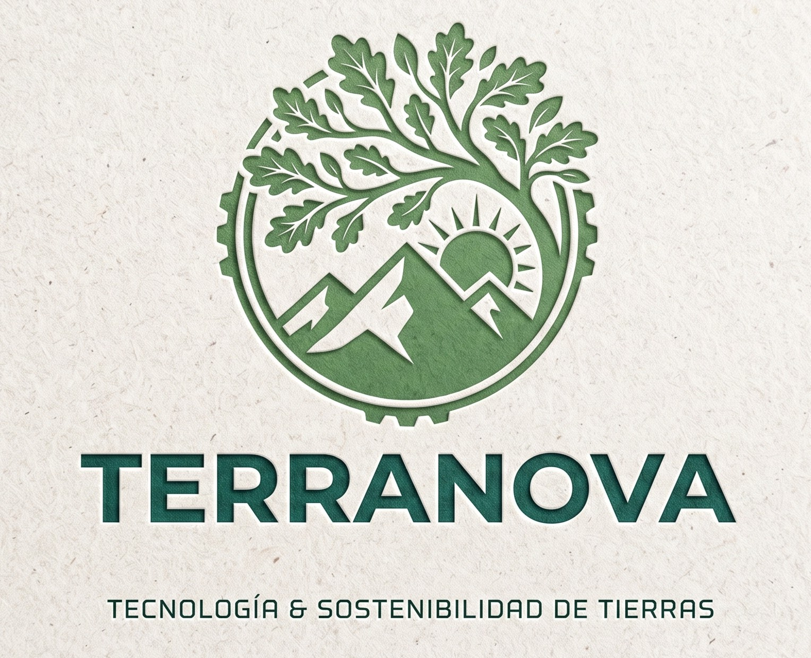</td>
    <td> Agromercado (MIDAGRI) </td>
    <td> VeryAgro </td>
    <td> Procesadora Perú </td>
</tr>
    <tr>
        <td>Modelo Agro-as-a-Service (AaaS): el comerciante alquila una parcela y contrata la labor del agricultor por una temporada, con formalización contractual y notificaciones automatizadas.</td>
        <td>Sistema del Ministerio de Desarrollo Agrario y Riego que busca facilitar negocios directos y reducir brechas de información entre productores y comerciantes.</td>
        <td>Marketplace español (fundado en 2021) que conecta agricultores con proveedores de insumos agrícolas (fertilizantes, riego, maquinaria); anunció su ingreso a Perú como primer mercado de expansión en Latinoamérica.</td>
        <td>Empresa agroexportadora que aplica "siembra por contrato": compra anticipada de toda la cosecha a un precio mínimo garantizado, a más de 1,000 agricultores de Lambayeque, La Libertad y Piura.</td>
    </tr>
    <tr>
        <td class="sub">Ventaja Competitiva ¿Qué valor ofrece a los clientes?</td>
        <td>Automatización end-to-end del contrato  e ingreso garantizado por labor, no por resultado de cosecha.</td>
        <td>Respaldo institucional/estatal y alcance nacional gratuito.</td>
        <td>Catálogo amplio de proveedores (+60) y alta recurrencia de clientes reportada.</td>
        <td>Mercado asegurado y precio mínimo garantizado, con trayectoria comprobada a gran escala.</td>
    </tr>
    <tr>
        <td rowspan="2" class="sub">PERFIL DEL MARKETING</td>
        <td class="sub">Mercado Objetivo</td>
        <td>Familias agricultoras de pequeña escala + compradores urbanos (consumidores individuales, hogares urbanos, restaurantes y pymes del sector alimentario).</td>
        <td>Productores y compradores agrarios a nivel nacional.</td>
        <td>Agricultores que compran insumos (no vinculado a venta de cosecha).</td>
        <td>Agricultores de cultivos específicos (frijol de palo, entre otros) en el norte del país, a escala agroexportadora.</td>
    </tr>
    <tr>
        <td class="sub">Estrategias de Marketing</td>
        <td>Landing page orientada a conversión: CTA principal "Cotizar Parcela", métricas de confianza en el hero (100% pagos protegidos, 0% riesgo de estafa, 15+ hectáreas gestionadas, 25% ahorro promedio) y testimonios reales de agricultores y compradores como prueba social.</td>
        <td>Difusión institucional y gubernamental a través de canales del sector agrario.</td>
        <td>Estrategia de expansión regional hacia Latinoamérica, reforzando su equipo comercial y mejorando continuamente la plataforma digital.</td>
        <td>Relación directa y de largo plazo con asociaciones de productores agrícolas.</td>
    </tr>
    <tr>
        <td rowspan="3" class="sub">PERFIL DEL PRODUCTO</td>
        <td class="sub">Productos & Servicios</td>
        <td>Catálogo de parcelas, contratación y pago digital de temporada, generación automática de contrato, notificaciones de avance, panel de agricultor, calificación bidireccional.</td>
        <td>Sistema de intermediación de información comercial entre productores y compradores.</td>
        <td>Marketplace de insumos agrícolas.</td>
        <td>Compra anticipada de cosecha bajo contrato de precio fijo.</td>
    </tr>
    <tr>
        <td class="sub">Precios & Costos</td>
        <td>Suscripción mensual por planes: Básico (S/ 50 — 1 parcela activa, custodia de 4 hitos), Pro (S/ 123 — hasta 10 parcelas, evidencias GPS, alertas climáticas en vivo), Empresarial (S/ 250 — parcelas ilimitadas, integración API, gestor de cuenta dedicado).</td>
        <td>Gratuito (servicio público).</td>
        <td>No reportado públicamente.</td>
        <td>Precio "refugio" fijado por contrato, no público.</td>
    </tr>
    <tr>
        <td class="sub">Canales de distribución (web/móvil)</td>
        <td>Web responsive (Landing Page + Web Application).</td>
        <td>Plataforma web del Estado.</td>
        <td>Plataforma web.</td>
        <td>Gestión directa/comercial, sin canal digital de autoservicio.</td>
    </tr>
    <tr>
        <td rowspan="4" class="sub">ANÁLISIS SWOT</td>
        <td class="sub">Fortalezas</td>
        <td>Automatización completa del ciclo contractual; modelo que traslada el riesgo climático y de mercado fuera del agricultor; dos segmentos con necesidades complementarias y sustento académico.</td>
        <td>Respaldo institucional, alcance nacional, gratuito para el usuario.</td>
        <td>Modelo ya validado en España y Portugal; alta recurrencia de clientes reportada.</td>
        <td>Modelo de contrato probado a gran escala (+1,000 agricultores); relación de confianza consolidada con productores.</td>
    </tr>
    <tr>
        <td class="sub">Debilidades</td>
        <td>Startup nueva, sin base de usuarios ni reputación instalada; depende de la adopción digital de un segmento con acceso a internet limitado.</td>
        <td>No ofrece automatización contractual ni de pagos; solo facilita el contacto informativo entre partes.</td>
        <td>Enfocado en insumos agrícolas, no en la venta o contratación de cosecha; aún no opera en Perú.</td>
        <td>Sin canal digital de autoservicio; gestión manual/comercial no accesible para compradores urbanos pequeños.</td>
    </tr>
    <tr>
        <td class="sub">Oportunidades</td>
        <td>Ausencia de una plataforma digital peruana que aplique agricultura por contrato de forma automatizada; el interés de actores internacionales valida la categoría.</td>
        <td>Ampliar funcionalidades digitales dado el interés estatal creciente en trazabilidad agrícola.</td>
        <td>Expansión hacia Latinoamérica con Perú como primer destino desde 2027.</td>
        <td>Digitalizar su proceso de contratación podría ampliar su alcance a nuevos productores y compradores.</td>
    </tr>
    <tr>
        <td class="sub">Amenazas</td>
        <td>Iniciativas estatales gratuitas como sustituto de bajo costo; empresas agroexportadoras con escala ya consolidada podrían replicar un modelo digital similar.</td>
        <td>Bajo incentivo para innovar al ser un servicio público sin fines de lucro.</td>
        <td>Entrada tardía al mercado peruano frente a soluciones ya establecidas.</td>
        <td>Nuevos entrantes digitales (como Allpatek) podrían ofrecer una experiencia más accesible y transparente para compradores pequeños.</td>
    </tr>
</table>

### 2.1.2. Estrategias y tácticas frente a competidores

Entre las principales estrategias y tácticas que ejecutaremos como startup son las siguientes:

Por un lado, estas son las estrategias preliminares:

* Incursión en zonas agrícolas a través de alianzas con asociaciones de agricultores, gremios agrarios y organizaciones no gubernamentales del sector rural.
* Capacitación tecnológica gradual mediante material multimedia diseñado para agricultores con conocimientos digitales limitados.
* Optimización de la asistencia al agricultor utilizando medios de contacto directos como llamadas telefónicas, WhatsApp y soporte dentro de la plataforma.
* Generación de utilidad inmediata, brindando notificaciones automáticas de avance de cultivo, formalización legal instantánea del contrato (vía n8n) y funciones sin costo inicial.

Por otro lado, estas son nuestras tácticas específicas:

* Campañas de referidos para incentivar la difusión entre los mismos agricultores y compradores urbanos.
* Material educativo y guías de uso para motivar la adopción frecuente de la aplicación, tanto en el catálogo de parcelas como en el panel de agricultor.
* Adaptación regional del sistema, empleando modismos locales y asistencia personalizada según la zona (sierra, costa).
* Presencia en eventos del sector, tales como ferias agropecuarias y convenciones agrícolas.
* Acercamiento a técnicos agropecuarios, cooperativas y asociaciones de productores para posicionar a Allpatek frente a alternativas como Agromercado (gratuita pero sin automatización) o Procesadora Perú (sin canal digital de autoservicio).

## 2.2. Entrevistas

Se diseñaron guías de entrevista semiestructuradas para cada segmento, cubriendo características demográficas (edad, distrito, ocupación) y subjetivas (uso del celular, conectividad, confianza, canales digitales, objetivos, frustraciones), siguiendo buenas prácticas de needfinding.

### 2.2.1. Diseño de entrevistas

**Guía de entrevista — Segmento 1: Agricultores familiares**

*Preguntas básicas (iniciales):*
1. Para comenzar, ¿me podría decir su nombre?
2. ¿A qué se dedica? ¿Trabaja en la agricultura de forma principal o tiene algún otro trabajo adicional?
3. ¿Qué celular utiliza normalmente?
4. ¿Qué sistema operativo tiene su celular (Android, iPhone, o no lo sabe)?

*Preguntas principales:*
1. ¿Me podría contar un poco sobre usted y su trabajo en la agricultura?
2. ¿Cómo es normalmente un día de trabajo suyo en el campo?
3. ¿Cómo sabe qué trabajos tiene que realizar cada día o durante la semana?
4. ¿Suele usar su celular mientras está trabajando en el campo?
5. ¿Qué cosas le resultan fáciles y cuáles le resultan difíciles cuando usa el celular?
6. ¿Cómo es la señal de internet o del celular en el lugar donde trabaja?
7. Cuando no tiene señal, ¿qué hace si necesita enviar un mensaje, una foto o alguna información?
8. ¿Alguna vez ha tenido que tomar fotos del cultivo para enseñárselas a otra persona?
9. Cuando manda una foto del cultivo, ¿cómo demuestra cuándo y dónde fue tomada?
10. ¿Cómo se entera normalmente de que va a llover, hacer mucho frío o cambiar el clima?
11. ¿Alguna vez se enteró demasiado tarde de una lluvia fuerte, helada u otro cambio del clima?
12. Cuando alguien necesita saber cómo está avanzando su cultivo, ¿cómo se comunica con esa persona?
13. Imagine que usted toma una foto en el campo pero en ese momento no tiene internet. ¿Le serviría que el celular guarde esa foto y la mande automáticamente cuando vuelva la señal?
    *"¿Por qué?"*
14. ¿Le serviría que cuando tome una foto el celular guarde automáticamente el lugar, el día y la hora?
15. ¿Le gustaría recibir un aviso en su celular cuando haya riesgo de lluvia fuerte, helada u otro clima que pueda afectar su cultivo?
    *"¿Cómo preferiría recibir ese aviso?"*
16. ¿Qué tipo de aviso revisaría usted más rápido?
17. Si existiera una aplicación para ayudarle con estas cosas, ¿qué sería lo más importante para usted para que sea fácil de usar?
18. ¿Hay alguna cosa de su trabajo que le gustaría poder hacer más rápido o más fácilmente con el celular?

**Guía de entrevista — Segmento 2: Comerciantes /  Compradores urbanos **

*Preguntas básicas (iniciales):*
1. Para comenzar, ¿me podría decir su nombre?
2. ¿A qué se dedica (negocio propio, restaurante, compra para su familia, etc.)?
3. ¿Qué celular utiliza normalmente?
4. ¿Qué sistema operativo tiene su celular (Android, iPhone, o no lo sabe)?

*Preguntas principales:*
1. ¿Me podría contar un poco sobre cómo compra normalmente los productos agrícolas que necesita?
2. ¿Cómo es un día normal cuando tiene que conseguir estos productos?
3. ¿Cómo decide a quién comprarle o dónde comprar cada vez?
4. ¿Usa su celular para hacer estas compras o para comunicarse con quien le vende?
5. ¿Qué cosas le resultan fáciles y cuáles difíciles al comprar productos agrícolas hoy en día?
6. ¿Qué tan seguido cambian los precios de un producto de una semana a otra? ¿Cómo le afecta eso?
7. ¿Alguna vez ha recibido un producto que no correspondía con lo que esperaba (calidad, cantidad, frescura)?
8. Cuando eso pasa, ¿cómo reclama o qué hace?
9. ¿Le interesa saber de dónde viene el producto, quién lo cultivó o cómo se produjo?
10. Si alguien le mandara una foto del cultivo antes de la cosecha, ¿confiaría en que esa foto es real y reciente?
    *"¿Qué le daría esa confianza?"*
11. ¿Alguna vez tuvo que esperar más de lo esperado para recibir un pedido? ¿Cómo se enteró del retraso?
12. Imagine que puede pagar por adelantado toda una temporada de un producto a un precio fijo, sin que le suba después. ¿Le interesaría?
    *"¿Por qué sí o no?"*
13. ¿Le gustaría recibir avisos en su celular sobre el avance del cultivo que compró (por ejemplo, cuándo se sembró o cuándo estará lista la cosecha)?
14. ¿Qué tipo de aviso revisaría usted más rápido: notificación de app, WhatsApp, correo o llamada?
15. Si existiera una aplicación para hacer este tipo de compras directamente con el agricultor, ¿qué sería lo más importante para que confíe en ella y la use seguido?
16. ¿Hay algo de este proceso de compra que le gustaría poder hacer más rápido o más fácil con el celular?
17. ¿Qué lo haría dudar o desconfiar de comprarle directamente a un agricultor a través de una app, sin intermediarios?
    
### 2.2.2. Registro de entrevistas


### A.Entrevistas al segmento de agricultores familiares

#### Entrevista 1: Rosa Flores

| Campo | Información |
|-------|-------------|
| **Título** | **Entrevista 1: Rosa Flores** |
| Segmento | Agricultor familiar |
| Nombres y apellidos | Rosa Flores |
| Edad | 45 años |
| Distrito | Cieneguilla |
| Ocupación | Administradora y trabajadora agrícola a tiempo completo (Parcela de palta) |
| Tipo de cultivo principal | Palta (Paltos) |
| Extensión aproximada de la parcela |  950 m² |
| Inicio de la entrevista | 00:00 |
| Duración | 06:09 |
| URL del video | [Video evidencia](https://upcedupe-my.sharepoint.com/:v:/g/personal/u202116018_upc_edu_pe/IQBbQDY3p2SiRq-xBW2hRB-dARiTcCuKw4tJ7sUQ8oeVau8?nav=eyJyZWZlcnJhbEluZm8iOnsicmVmZXJyYWxBcHAiOiJPbmVEcml2ZUZvckJ1c2luZXNzIiwicmVmZXJyYWxBcHBQbGF0Zm9ybSI6IldlYiIsInJlZmVycmFsTW9kZSI6InZpZXciLCJyZWZlcnJhbFZpZXciOiJNeUZpbGVzTGlua0NvcHkifX0&e=iVsXEQ) |
| **Fotografía** | <div align="center">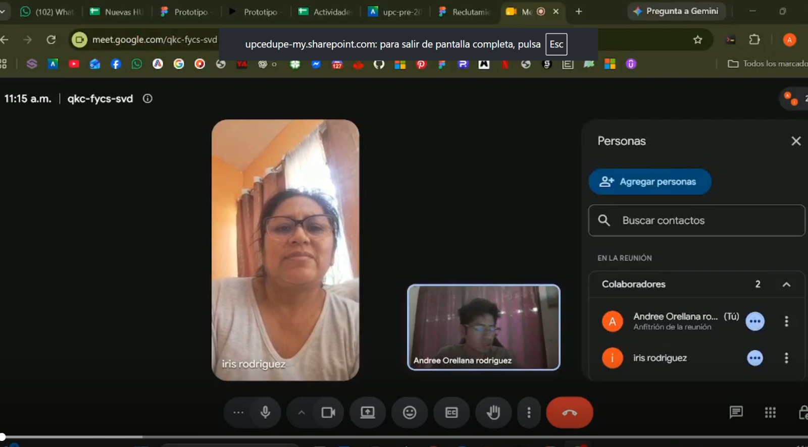</div> |
| **Resumen de la entrevista** | Entrevista realizada a Rosa Flores, agricultora a tiempo completo encargada de la gestión, supervisión y trabajo diario en una parcela familiar de palta con más de 6 años de experiencia en el cultivo. Utiliza un dispositivo Android (Xiaomi Redmi Note 11) para coordinar las labores agrícolas, tomar evidencias fotográficas del calibre de la fruta y comunicarse vía WhatsApp con el dueño de la parcela y los compradores. Señala serios problemas de conectividad a internet en las partes altas del huerto, lo que retrasa la entrega de reportes y negociaciones. Asimismo, destaca la necesidad de un sistema automatizado de guardado y envío de fotos con geolocalización/fecha y un servicio de alertas climáticas tempranas para proteger la floración del palto. |


#### Entrevista 2: Gustavo Adolfo Suyo

| Campo | Información |
|-------|-------------|
| **Título** | **Entrevista 2: Gustavo Adolfo Suyo** |
| Segmento | Agricultor familiar |
| Nombres y apellidos | Gustavo Adolfo Suyo |
| Edad | 48 años |
| Distrito | Yauyos |
| Ocupación | Agricultor |
| Tipo de cultivo principal | Paltas |
| Extensión aproximada de la parcela | 1000 m² |
| Inicio de la entrevista | 00:00 |
| Duración | 09:28 |
| URL del video | [Video Evidencia](https://upcedupe-my.sharepoint.com/:v:/g/personal/u202215188_upc_edu_pe/IQDAVMVnlqPDR4ysCethRB9SAdcd45gkIefMcHaSE811nGw?nav=eyJyZWZlcnJhbEluZm8iOnsicmVmZXJyYWxBcHAiOiJPbmVEcml2ZUZvckJ1c2luZXNzIiwicmVmZXJyYWxBcHBQbGF0Zm9ybSI6IldlYiIsInJlZmVycmFsTW9kZSI6InZpZXciLCJyZWZlcnJhbFZpZXciOiJNeUZpbGVzTGlua0NvcHkifX0&e=hTSuYz) |
| **Fotografía** | <div align="center">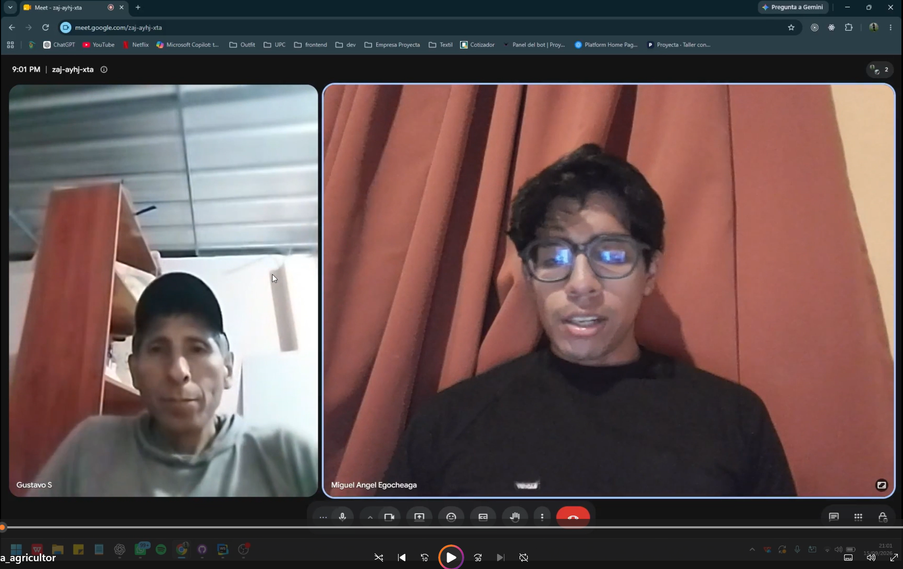</div> |
| **Resumen de la entrevista** | Entrevista realizada a Gustavo Adolfo Suyo, agricultor de 48 años del distrito de Yauyos. Indicó que cultiva paltas en una parcela de aproximadamente 1000 m². El enlace del video se incorporará cuando esté disponible. |


### B.Entrevistas al segmento de comerciantes urbanos

#### Entrevista 1: Irma Barreto Castro

| Campo | Información |
|-------|-------------|
| **Título** | **Entrevista 1: Irma Barreto Castro** |
| Segmento | Comerciante urbano |
| Nombres y apellidos | Irma Barreto Castro |
| Edad | 40 años |
| Distrito | La Molina |
| Ocupación | Dueña y administradora de un pequeño restaurante familiar |
| Tipo de comerciante (familia / restaurante / negocio) | Restaurante |
| Volumen de compra aproximado | 30-40kg por semana |
| Inicio de la entrevista | 00:00 |
| Duración | 7:27 |
| URL del video | [Video evidencia](https://1drv.ms/v/c/d3c743b5a0e38c7f/IQD_LJde0WbnRKFSU8nptpj0Aa4E7e9k4GaI_LXprbhW7qY?e=F1i4PE) |
| **Fotografía** | <div align="center"></div> |
| **Resumen de la entrevista** | Irma Barreto, dueña y administradora de un pequeño restaurante familiar, comentó que actualmente compra frutas y verduras principalmente a proveedores conocidos, mercados mayoristas y mediante pedidos por WhatsApp. Sus principales dificultades son la variación frecuente de precios, la incertidumbre sobre la calidad y frescura de los productos y la falta de información sobre su origen. Mostró interés en conocer directamente al agricultor, la ubicación de la parcela y el avance de los cultivos antes de realizar una compra. También consideró atractiva la posibilidad de pagar por adelantado una temporada a un precio fijo, siempre que exista un contrato claro y garantías de cumplimiento. Para Irma, las notificaciones sobre el progreso de los cultivos y la fecha estimada de cosecha serían útiles, prefiriendo WhatsApp como principal medio de comunicación. Además, señaló que confiaría más en la plataforma si los agricultores estuvieran verificados, existieran calificaciones de otros comerciantes y se ofrecieran mecanismos de respaldo ante incumplimientos. En general, la entrevista evidencia que el comerciante busca reducir la incertidumbre en precio, calidad, origen y cumplimiento, además de contar con un proceso de compra directo, rápido y transparente. |

#### Entrevista 2: César Hugo Egocheaga

| Campo | Información |
|-------|-------------|
| **Título** | **Entrevista 2: César Hugo Egocheaga** |
| Segmento | Comerciante urbano |
| Nombres y apellidos | César Hugo Egocheaga |
| Edad | 50 años |
| Distrito | El Agustino |
| Ocupación | Dueño de un puesto en el Mercado de Frutas |
| Tipo de comerciante (familia / restaurante / negocio) | Negocio |
| Volumen de compra aproximado | 400 kg por semana |
| Inicio de la entrevista | 00:00 |
| Duración | 10:33 |
| URL del video | [Video evidencia](https://upcedupe-my.sharepoint.com/:v:/g/personal/u202215188_upc_edu_pe/IQA2ALZ3uFutSaQ8ve7Nk7hqAXADf3-eTjCN6dlRHIPgDVI?nav=eyJyZWZlcnJhbEluZm8iOnsicmVmZXJyYWxBcHAiOiJPbmVEcml2ZUZvckJ1c2luZXNzIiwicmVmZXJyYWxBcHBQbGF0Zm9ybSI6IldlYiIsInJlZmVycmFsTW9kZSI6InZpZXciLCJyZWZlcnJhbFZpZXciOiJNeUZpbGVzTGlua0NvcHkifX0&e=MX0bNw) |
| **Fotografía** | <div align="center">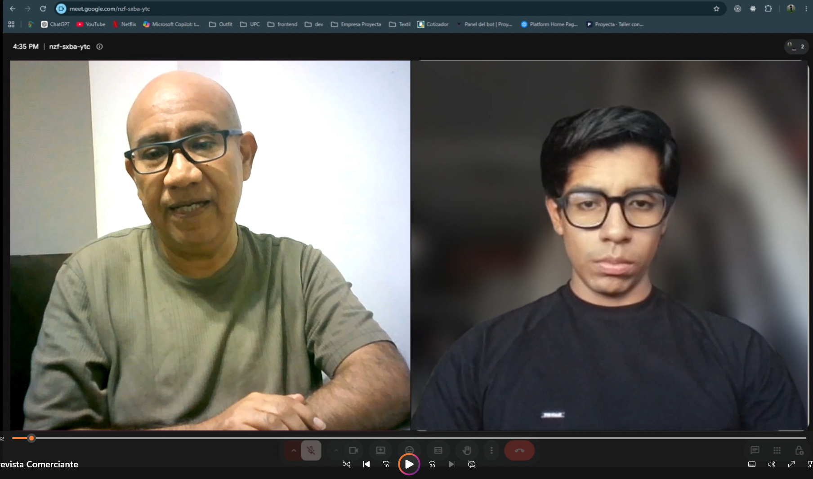</div> |
| **Resumen de la entrevista** | Entrevista realizada a César Hugo Egocheaga, comerciante de 50 años que dirige un negocio en el Mercado de Frutas de El Agustino. Indicó un volumen de compra aproximado de 400 kg por semana. El enlace del video se incorporará cuando esté disponible. |

### 2.2.3. Análisis de entrevistas

El presente análisis sintetiza la información recopilada a partir de las entrevistas en profundidad realizadas a los representantes de los dos segmentos objetivos.

**Análisis Primer Segmento: Agricultores Familiares (Productores de Palta):** En primer lugar, se evidencia una severa limitación técnica y operativa ocasionada por la baja conectividad en campo y la falta de herramientas digitales automatizadas. De acuerdo con los testimonios recopilados, el 100% (2 de 2) de los agricultores gestiona parcelas pequeñas a medianas (entre 950 m² y 1000 m²) dedicadas a cultivos perecibles como la palta en zonas como Cieneguilla y Yauyos. En este contexto, el 100% depende de dispositivos móviles Android para coordinar labores y registrar evidencias, pero enfrentan problemas críticos de cobertura en las partes altas de sus terrenos, lo que retrasa las negociaciones, el envío de reportes visuales y el contacto oportuno con los compradores.

En segundo lugar, se identifica un impacto financiero directo generado por la falta de trazabilidad en la calidad del cultivo y la vulnerabilidad frente a riesgos climáticos. El 100% de los productores reportó fricciones económicas vinculadas a la imposibilidad de sustentar oportunamente el calibre y estado de su fruta. La falta de mecanismos automáticos con geolocalización y fecha para respaldar la calidad de sus productos provoca revisiones tardías, negociaciones en desventaja frente a compradores e intermediarios, y el riesgo constante de perder floraciones completas por falta de alertas meteorológicas tempranas.

En tercer lugar, existe una demanda transversal por herramientas móviles de bajo consumo de datos que funcionen sin conexión intermitente y se integren con WhatsApp. Los productores (de entre 45 y 48 años) señalan requerir aplicaciones que les permitan tomar fotos del cultivo, registrar evidencias de calibre y almacenar datos geolocalizados de manera offline, sincronizando la información automáticamente al recuperar señal. Asimismo, priorizan recibir alertas climáticas tempranas para proteger sus paltos y comunicarse directamente mediante canales accesibles.

En cuarto lugar, respecto a la viabilidad y adopción de la plataforma, la disposición a utilizar el sistema está condicionada a la simplicidad operativa y la efectividad en la venta. Los agricultores respaldarán la herramienta si demuestra que simplifica el registro de sus parcelas, garantiza la autenticidad de sus evidencias de calidad frente a los compradores y les permite acceder a transacciones más rápidas y transparentes. En síntesis, este segmento requiere una solución móvil intuitiva que resuelva los problemas de conectividad, certifique la calidad de sus productos y emita alertas preventivas para resguardar sus cultivos.

<div align="center">
  
</div>

**Análisis Segundo Segmento: Comerciantes Urbanos (Restaurantes y Puestos de Mercado):** En primer lugar, se evidencia una severa vulnerabilidad operativa por la variabilidad incontrolada de costos, la incertidumbre en la calidad del insumo y la falta absoluta de trazabilidad sobre el origen del producto. Según se extrae de los testimonios recopilados, el 100% (2 de 2) de los comerciantes gestiona el abastecimiento de sus negocios (con volúmenes que van desde 30-40 kg/semana en restaurantes de La Molina hasta 400 kg/semana en puestos del Mercado de Frutas en El Agustino) mediante intermediarios tradicionales, compras presenciales en mercados mayoristas o pedidos informales por redes como WhatsApp. Esta dependencia genera que operen bajo una constante imprevisibilidad en el margen de ganancia debido a la fluctuación repentina de precios y a la incapacidad de verificar el estado real y la frescura de las frutas y verduras antes de recibirlas en sus locales.

En segundo lugar, existe un impacto económico y comercial directo derivado de la intermediación excesiva y los incumplimientos de entrega. El 100% de los entrevistados reportó fricciones financieras ligadas a la falta de garantías en el cumplimiento de volumen y calidad. En los pequeños y medianos comercios, la falta de frescura impacta de forma inmediata en la oferta gastronómica y el costo plato; mientras que en los distribuidores mayoristas de mercado, los desfases de entrega provocan mermas y quiebres de stock que comprometen el flujo de caja diario y la continuidad operativa con sus clientes finales.

En tercer lugar, se identifica una alta disposición a la adopción de esquemas de compra directa en origen y modelos de financiamiento por temporada (suscripción o pago adelantado a precio fijo). El 100% de los comerciantes considera altamente atractivo contactar directamente con el agricultor, visualizar la ubicación exacta de las parcelas y monitorear el avance de los cultivos en tiempo real. Asimismo, señalan que adoptarían contratos de compra futura siempre que el canal digital ofrezca mecanismos estrictos de confianza, tales como verificación de identidad agrícola, calificaciones comunitarias entre comerciantes y notificaciones de cosecha directamente vía WhatsApp, su canal digital preferido de comunicación.

En cuarto lugar, respecto a la viabilidad comercial y seguridad de las transacciones, la disposición a pagar e invertir en la plataforma está condicionada a la mitigación del riesgo mediante garantías formales. Los comerciantes señalaron con firmeza que migrarán su canal de abastecimiento hacia la plataforma digital solo si se garantizan protocolos claros de respaldo ante incumplimientos, devolución por producto defectuoso y contratos transparentes. En síntesis, este segmento requiere una plataforma directa y transparente que reduzca la intermediación, garantice la trazabilidad de los cultivos desde la siembra hasta la cosecha y asegure estabilidad de precios para proteger el capital del negocio.

<div align="center">
  
</div>


## 2.3. Needfinding

En esta sección se presentarán los artefactos resultantes del proceso de análisis de la información recolectada de los segmentos objetivos. Aquí se incluyen secciones para User Personas, User Task Matrix, User Journey Maps y Empathy Mapping.

### 2.3.1. User Personas

A continuación, se presentan los User Personas diseñados para representar a los segmentos objetivo identificados durante la fase de investigación. Estos arquetipos detallan variables demográficas, rasgos psicográficos, motivaciones y comportamientos, así como los pains (frustraciones) y gains (objetivos) que enfrentan en su gestión diaria. Asimismo, se analiza su nivel digital y su interacción con soluciones tecnológicas del sector agropecuario. Toda la información ha sido sintetizada a partir de los insights recolectados en las entrevistas y estructurada mediante la plataforma UXPressia para garantizar una representación fiel de las necesidades del usuario.

### User Persona: Agricultor

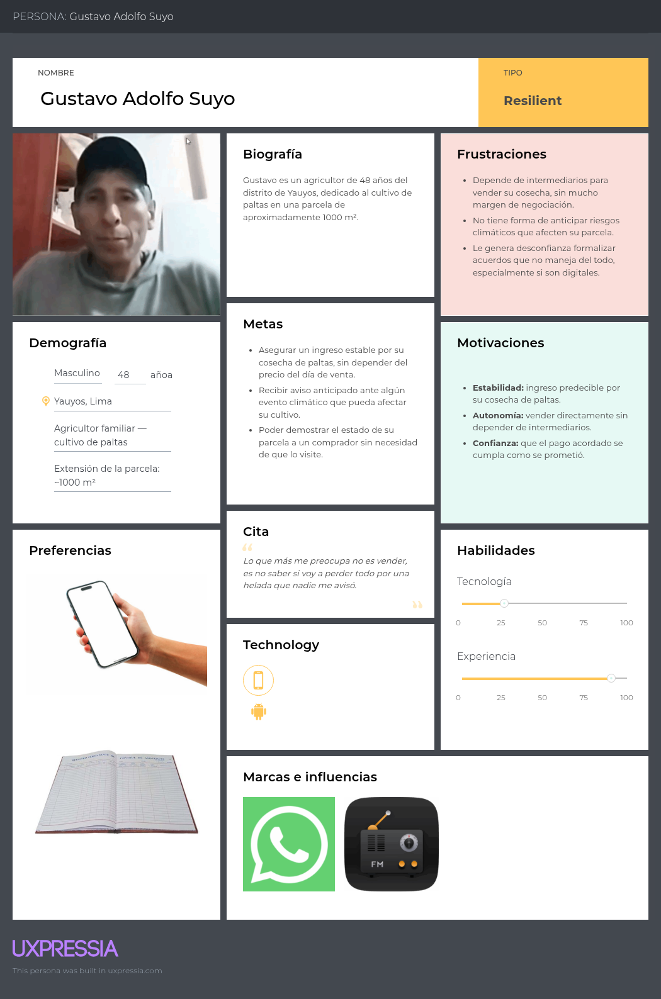

### User Persona: Comprador Urbano

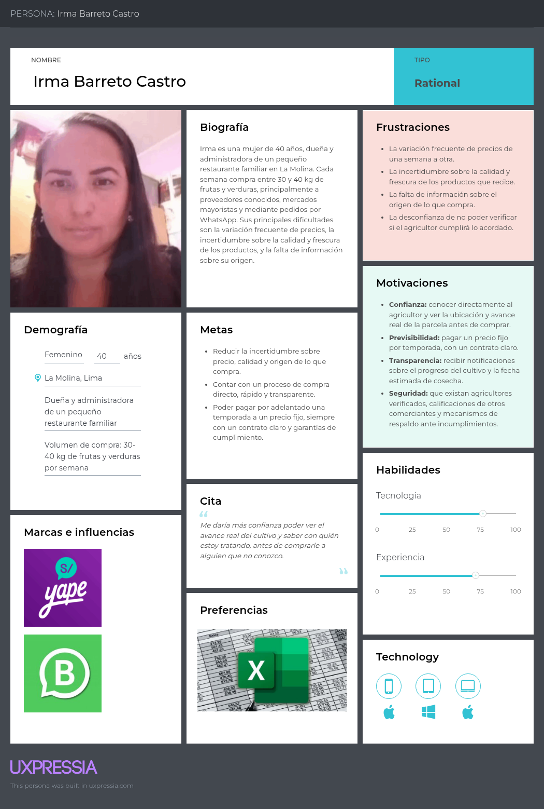

## 2.3.2. User Task Matrix.

A través de la User Task Matrix, es posible identificar y organizar las principales actividades que los usuarios realizan actualmente dentro de su contexto de trabajo, de forma independiente a la existencia de Allpatek. Al categorizar estas tareas según su frecuencia e importancia, se logra comprender cuáles representan mayores dificultades y necesidades para cada perfil de usuario, permitiendo detectar oportunidades de mejora en la relación comercial entre agricultores familiares y compradores urbanos.

| **User Task** | **Gustavo Adolfo Suyo (Frecuencia)** | **Gustavo Adolfo Suyo (Importancia)** | **Irma Barreto Castro (Frecuencia)** | **Irma Barreto Castro (Importancia)** |
|---|---|---|---|---|
| Buscar información sobre precios antes de vender/comprar | Often | High | Often | High |
| Coordinar pedidos o ventas por WhatsApp | Often | High | Often | High |
| Verificar la calidad, frescura u origen del producto antes de aceptarlo | Sometimes | High | Often | High |
| Comprar/vender a proveedores o compradores conocidos por costumbre | Often | Medium | Often | High |
| Registrar información del cultivo/pedido en cuadernos u hojas físicas | Often | High | Sometimes | Medium |
| Informarse sobre el clima antes de tomar decisiones de siembra o cosecha | Sometimes | High | Rarely | Low |
| Firmar acuerdos o compromisos de forma manual (papel o verbal) | Rarely | Medium | Rarely | Medium |
| Buscar alternativas cuando el precio no es favorable | Sometimes | High | Often | Medium |
| Controlar el presupuesto o gasto de la temporada/semana | Sometimes | Medium | Often | High |

La matriz confirma, con evidencia real de Irma, que la verificación de calidad/origen y la coordinación por WhatsApp son tareas frecuentes y de alta importancia para el comerciante — algo que antes solo era una hipótesis. Para Gustavo, al no contar todavía con el resto de su testimonio ni con las 3 entrevistas restantes del segmento, la matriz sigue basada en el perfil general del segmento y debe confirmarse más adelante.

### 2.3.3. User Journey Mapping

Esta sección presenta el User Journey Map de cada User Persona, ilustrando el recorrido end-to-end que atraviesa cada segmento desde que identifica la necesidad de vender o comprar, hasta que evalúa el resultado de esa temporada o compra. Ambos journeys se elaboran en su versión As-Is: representan la situación actual de cada segmento sin que exista todavía Allpatek como solución, por lo que no se presenta ni se anticipa ninguna funcionalidad de la plataforma en esta etapa — el objetivo es exclusivamente identificar los puntos de dolor reales del proceso vigente. Cada Journey Map se construye en UXPressia y queda vinculado a la ficha de User Persona correspondiente, elaborada en la misma herramienta.

### User Agricultor:

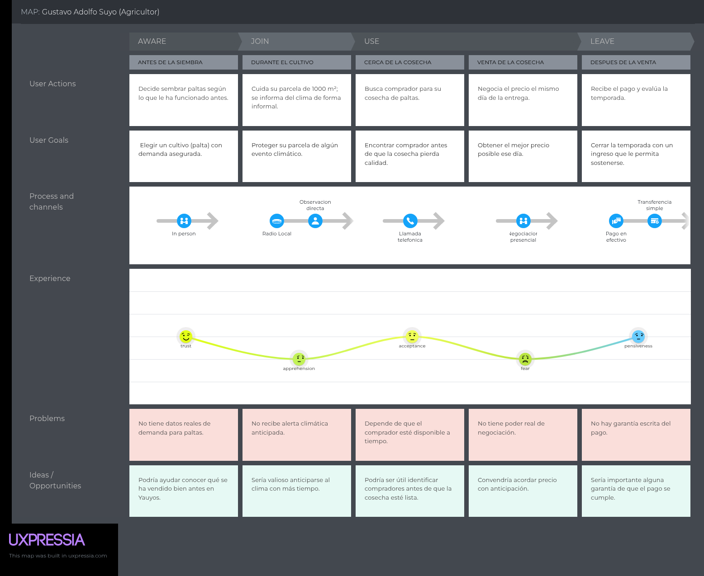

### User Comprador Urbano:

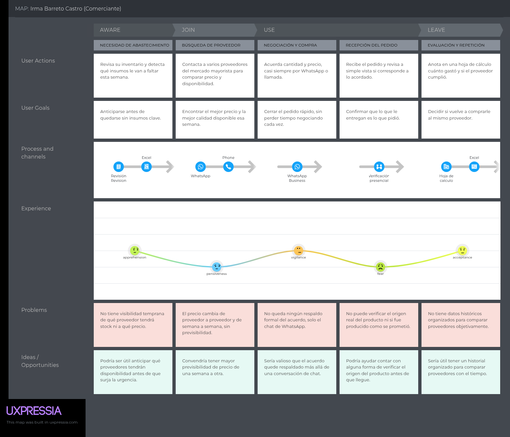

### 2.3.4. Empathy Mapping

Esta sección resume el proceso de elaboración de los Empathy Maps, uno por cada User Persona, construidos en UXPressia. El proceso parte de colocar al centro a la persona correspondiente (Martín Salas Hurtado o Lucía Fernández Torres) y de registrar, en la sección correspondiente de la herramienta, cada observación del equipo obtenida a partir del análisis de entrevistas, buscando responder: ¿Con quién estamos empatizando?, ¿Qué necesita hacer?, ¿Qué está diciendo?, ¿Qué está viendo?, ¿Qué está haciendo? y ¿Qué está escuchando?, además de ¿Cómo se siente y qué piensa? A partir de estas respuestas se identifican los Esfuerzos (Pains), a partir de lo que le preocupa a cada persona, y las Ganancias (Gains), a partir de lo que podría ayudarle a resolver sus problemas y convencerlo de que Allpatek es la alternativa correcta.

### User Agricultor:

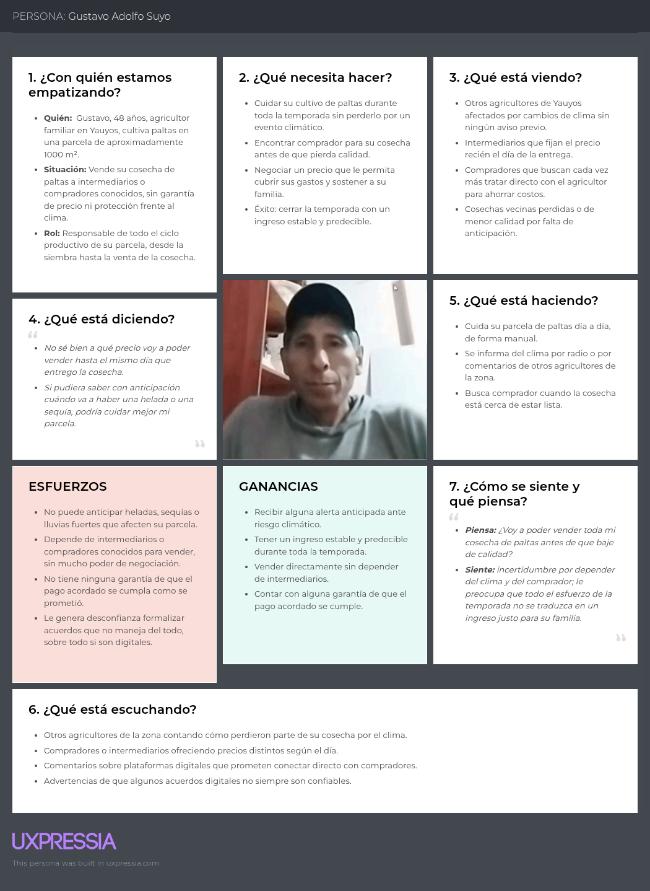

### User Comprador Urbano:

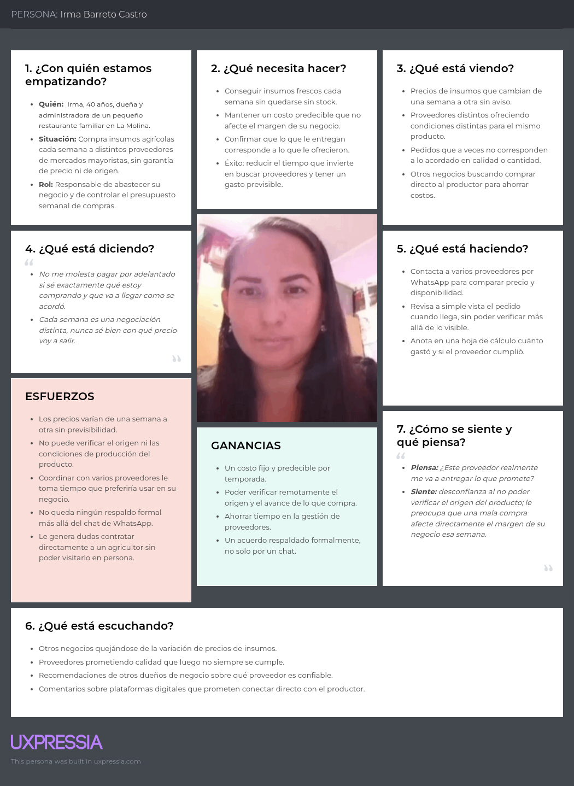

## 2.4. Big Picture Event Storming

El equipo realizó una sesión colaborativa de Big Picture Event Storming con el objetivo de explorar a alto nivel el dominio de negocio de Allpatek, identificando los eventos significativos del proceso de contratación de una parcela y sus relaciones cronológicas, desde la publicación de la parcela hasta el cierre de la temporada. Para la elaboración del diagrama se utilizó Mermaid como herramienta de Diagram-as-Code.

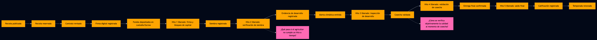

## 2.5. Ubiquitous Language

Siguiendo la definición de Eric Evans en *Domain-Driven Design: Tackling Complexity in the Heart of Software* - "Ubiquitous Language is modeled within a Limited context, where the terms and concepts of the business domain are identified, and there should be no ambiguity", se presenta a continuación el glosario de términos del dominio de negocio de Allpatek. Los términos se redactan en inglés, con su equivalente en español entre paréntesis; la definición correspondiente se redacta en español. Se incluyen únicamente términos del dominio de negocio agrícola y comercial, sin términos técnicos propios de la ingeniería de software.

| Term (Spanish equivalent) | Definición |
|---|---|
| Agro-as-a-Service (AaaS) | Modelo de negocio de Allpatek en el que el comprador alquila una parcela y contrata la labor agrícola de una temporada, en lugar de comprar la cosecha ya producida. |
| Climate Risk (Riesgo Climático) | Exposición del agricultor a eventos como sequías, heladas o lluvias intensas que afectan la producción, riesgo que Allpatek busca mitigar mediante alertas anticipadas. |
| Contract Farming (Agricultura por Contrato) | Acuerdo previo entre productor y comprador sobre volumen, calidad, tiempo de entrega y precio, base conceptual del modelo de negocio de Allpatek. |
| Contract Renewal (Renovación de Contrato) | Nueva temporada contratada entre el mismo agricultor y comprador tras una temporada previa completada exitosamente. |
| Digital Signature (Firma Digital) | Mecanismo mediante el cual agricultor y comprador formalizan su aceptación de los términos del contrato de temporada, sin necesidad de firma física. |
| Direct Production Cost (Costo Directo de Producción) | Costo que paga el comprador al contratar la temporada, equivalente al costo de producción sin intermediarios. |
| Escrow Custody (Custodia Escrow) | Bóveda financiera donde se retienen los fondos depositados por el comprador, liberándose de forma progresiva conforme se cumplen los hitos de la temporada. |
| Field Evidence (Evidencia de Campo) | Registro fotográfico georreferenciado y fechado del estado del cultivo, utilizado para verificar el cumplimiento de un hito. |
| Milestone (Hito) | Etapa predefinida del ciclo de la temporada (firma del contrato, siembra, desarrollo del cultivo, validación de cosecha, entrega final) que determina cuándo se libera una porción de los fondos en custodia Escrow. |
| Plot (Parcela) | Unidad de tierra agrícola registrada en la plataforma, disponible para ser contratada por un comprador durante una temporada. |
| Production Plan (Plan de Producción) | Modalidad de suscripción (Básico, Pro o Empresarial) que define cuántas parcelas puede gestionar un comprador y qué funcionalidades de seguimiento y alertas tiene disponibles. |
| Progress Notification (Notificación de Avance) | Mensaje automatizado que informa al comprador sobre hitos de siembra, cuidado y fecha estimada de cosecha de su parcela contratada. |
| Rating & Reputation (Calificación y Reputación) | Módulo bidireccional donde agricultor y comprador se califican mutuamente al finalizar una temporada. |
| Reservation (Reserva) | Acción del comprador de apartar una parcela y temporada disponible antes de completar el pago y la firma del contrato. |
| Season (Temporada) | Periodo de cultivo determinado, definido por fechas de inicio y cosecha estimada, sobre el cual se establece el contrato entre agricultor y comprador. |
| Season Contract (Contrato de Temporada) | Documento legal que formaliza el acuerdo de precio, duración y condiciones entre agricultor y comprador para una temporada específica. |
| Smallholder Farmer (Agricultor Familiar) | Productor agrícola de pequeña escala, Segmento 1 de Allpatek, con acceso limitado a información de mercado y expuesto a riesgo climático. |
| Urban Buyer (Comprador Urbano) | Consumidor individual, hogar urbano, restaurante o pyme del sector alimentario, Segmento 2 de Allpatek, que busca costo predecible y trazabilidad. |
| Weather Alert (Alerta Climática) | Aviso emitido cuando se detecta riesgo climático (helada, sequía, lluvia intensa) que puede afectar una parcela contratada, clasificado por nivel de severidad (crítica, moderada, normal). |


# Capítulo III: Requirements Specification

## 3.1. User Stories


## Epics

| Epic ID | Título | Descripción |
| :--- | :--- | :--- |
| **EP01** | Identidad, perfiles y visibilidad de la oferta | Epic que agrupa la acreditación de identidad de productores y compradores, la publicación de la oferta productiva y la visibilidad de disponibilidad. |
| **EP02** | Descubrimiento, negociación y contratación | Epic que contempla la localización de parcelas, negociación de volumen y precio, y la reserva exclusiva de la temporada agrícola. |
| **EP03** | Custodia Escrow y liberación de fondos | Epic que abarca la formalización del contrato digital, custodia del capital y desembolsos condicionados a la validación de hitos. |
| **EP04** | Trazabilidad y evidencia de hitos | Epic que gestiona el registro de evidencias con geolocalización, control de insumos y retroalimentación técnica del comprador. |
| **EP05** | Confianza operativa, alertas y reputación | Epic que incluye la emisión de alertas climáticas, programación de visitas a campo, reporte de incidencias y sistema de evaluaciones al cerrar el contrato. |
| **EP06** | Experiencia informativa de la Landing Page | Epic que agrupa la presentación pública de la propuesta de valor, catálogo de servicios, planes, testimonios y captura de solicitudes informativas en el sitio web estático. |


## User Stories 


| Epic / Story ID | Título | Descripción | Criterios de Aceptación | Relacionado con (Epic ID) |
| :--- | :--- | :--- | :--- | :--- |
| **US01** | Registro de perfil y verificación de identidad | **Como** productor agrícola,<br>**quiero** registrar mi perfil y verificar mis datos de identidad,<br>**para** transmitir confianza a los comerciantes y ofrecer mis hectáreas de cultivo. | **Escenario 1: Registro exitoso con datos válidos**<br>- Given que el productor no cuenta con un registro previo en la plataforma.<br>- When proporciona nombres completos, documento de identidad y número telefónico válido.<br>- Then el sistema crea la cuenta en estado pendiente de verificación y genera un código de confirmación asociado al número telefónico.<br><br>**Escenario 2: Documento de identidad ya registrado**<br>- Given que existe un usuario registrado con el mismo número de documento.<br>- When el productor intenta registrar sus datos.<br>- Then el sistema rechaza el registro e informa que el documento de identidad ya está asociado a una cuenta existente. | EP01 |
| **TS01** | API RESTful para autenticación y emisión de tokens JWT | **Como** developer,<br>**quiero** implementar un servicio RESTful de autenticación,<br>**para** validar las credenciales de los usuarios y emitir tokens JWT seguros para los clientes de la plataforma. | **Escenario 1: Autenticación correcta**<br>- Given que el cliente envía una petición POST a /api/v1/auth/login con credenciales válidas.<br>- When el servicio valida las credenciales.<br>- Then responde con 200 OK y un cuerpo JSON que contiene el token JWT y su fecha de expiración.<br><br>**Escenario 2: Credenciales inválidas**<br>- Given que el cliente envía una petición de autenticación con credenciales inválidas.<br>- When el servicio valida las credenciales.<br>- Then responde con 401 Unauthorized y un cuerpo JSON que identifica el error de autenticación. | EP01 |
| **US02** | Búsqueda y filtrado de parcelas disponibles | **Como** comerciante,<br>**quiero** filtrar parcelas agrícolas por tipo de cultivo, zona geográfica y extensión de hectáreas,<br>**para** seleccionar la opción que mejor se ajuste a mis necesidades de abastecimiento. | **Escenario 1: Filtrado con resultados**<br>- Given que existen parcelas activas que coinciden con los criterios de búsqueda.<br>- When el comerciante consulta las parcelas utilizando región y tipo de cultivo.<br>- Then el sistema devuelve las parcelas activas que cumplen los criterios especificados.<br><br>**Escenario 2: Sin coincidencias**<br>- Given que no existen parcelas activas que coincidan con los criterios especificados.<br>- When el comerciante ejecuta la consulta.<br>- Then el sistema devuelve un resultado vacío e informa que no existen coincidencias. | EP02 |
| **US03** | Aprobación de hito y orden de liberación de fondos | **Como** comerciante,<br>**quiero** revisar las evidencias de un hito cumplido y aprobar la liberación parcial de los fondos en custodia,<br>**para** que el productor disponga del capital correspondiente a la etapa completada. | **Escenario 1: Aprobación y liberación**<br>- Given que un hito se encuentra pendiente de validación y cuenta con las evidencias requeridas.<br>- When el comerciante aprueba el cumplimiento del hito.<br>- Then el sistema cambia el estado del hito a aprobado y genera la orden de liberación de los fondos correspondientes.<br><br>**Escenario 2: Fondos insuficientes**<br>- Given que el saldo disponible en custodia es inferior al monto requerido para la liberación.<br>- When el comerciante aprueba el hito.<br>- Then el sistema no ejecuta la liberación y registra que el saldo disponible es insuficiente. | EP03 |
| **TS02** | API RESTful para consulta e integración del estado Escrow | **Como** developer,<br>**quiero** implementar una API RESTful para consultar el saldo y estado de las cuentas Escrow asociadas a contratos,<br>**para** integrar la custodia de fondos con los servicios de pago y el historial de transacciones. | **Escenario 1: Consulta exitosa**<br>- Given que el cliente envía una petición GET a /api/v1/escrow/{contractId} con un contrato válido y credenciales autorizadas.<br>- When la API procesa la solicitud.<br>- Then responde con 200 OK y un JSON que contiene el saldo retenido, el saldo liberado y el detalle de los hitos.<br><br>**Escenario 2: Contrato inexistente**<br>- Given que el identificador de contrato no existe.<br>- When la API procesa la consulta.<br>- Then responde con 404 Not Found y un objeto JSON estructurado con el error correspondiente. | EP03 |
| **US04** | Registro y carga de evidencias fotográficas por hito | **Como** productor agrícola,<br>**quiero** registrar evidencias fotográficas de mi cultivo con información de ubicación,<br>**para** demostrar el avance de cada hito y solicitar la liberación de fondos. | **Escenario 1: Registro exitoso de evidencia**<br>- Given que el productor se encuentra dentro de la ubicación autorizada de la parcela asociada al contrato.<br>- When registra una fotografía y la información correspondiente al hito.<br>- Then el sistema almacena la evidencia con las coordenadas GPS verificadas y cambia el estado del hito a "En Revisión".<br><br>**Escenario 2: Ubicación no válida**<br>- Given que las coordenadas registradas no coinciden con la ubicación autorizada de la parcela.<br>- When el productor intenta registrar la evidencia.<br>- Then el sistema rechaza la evidencia e informa la inconsistencia de geolocalización. | EP04 |
| **SP01** | Evaluación de almacenamiento y sincronización offline de fotografías | **Como** developer,<br>**quiero** evaluar mecanismos de almacenamiento local y sincronización de fotografías sin conexión,<br>**para** garantizar el registro de evidencias en zonas con conectividad intermitente. | **Escenario 1: Almacenamiento sin conexión**<br>- Given que el dispositivo pierde temporalmente la conectividad.<br>- When se registran 20 fotografías localmente.<br>- Then las evidencias permanecen almacenadas hasta que se restablece la conexión.<br><br>**Escenario 2: Sincronización posterior**<br>- Given que existen evidencias pendientes de sincronización y se restablece la conectividad.<br>- When se ejecuta el proceso de sincronización.<br>- Then las evidencias se envían al servidor y se registra la tasa de sincronización exitosa. | EP04 |
| **US05** | Recepción de alertas climáticas de riesgo | **Como** comerciante,<br>**quiero** recibir alertas ante eventos climáticos adversos en las parcelas contratadas,<br>**para** coordinar medidas preventivas con el productor. | **Escenario 1: Evento climático crítico**<br>- Given que una parcela contratada presenta una anomalía climática.<br>- When el evento supera el umbral de riesgo configurado.<br>- Then el sistema genera una alerta dirigida al comerciante y al productor e incluye el nivel de riesgo identificado.<br><br>**Escenario 2: Evento de riesgo bajo no notificable**<br>- Given que el usuario tiene desactivadas las alertas de riesgo bajo.<br>- When se registra un evento climático clasificado como riesgo bajo.<br>- Then el sistema no genera una notificación para ese usuario. | EP05 |
| **US06** | Publicación y geolocalización de lote agrícola | **Como** productor agrícola,<br>**quiero** registrar las dimensiones, características y ubicación de mi parcela,<br>**para** hacer visible mi oferta productiva a los comerciantes. | **Escenario 1: Publicación exitosa**<br>- Given que el productor tiene un perfil verificado.<br>- When registra las características de la parcela y una ubicación válida.<br>- Then el sistema valida la información y publica la parcela como oferta disponible.<br><br>**Escenario 2: Ubicación no válida**<br>- Given que la ubicación registrada no pertenece a una zona autorizada.<br>- When el productor intenta publicar la parcela.<br>- Then el sistema rechaza la publicación e informa que la ubicación no es válida. | EP01 |
| **US07** | Solicitud de cotización y negociación directa de volumen | **Como** comerciante,<br>**quiero** enviar una propuesta formal de compra indicando volumen, precio y fecha de entrega,<br>**para** iniciar una negociación directa con el productor agrícola. | **Escenario 1: Envío de propuesta válida**<br>- Given que existe una parcela activa con capacidad productiva disponible.<br>- When el comerciante registra un volumen requerido, precio propuesto y fecha de entrega válidos.<br>- Then el sistema registra la propuesta y notifica al productor.<br><br>**Escenario 2: Volumen superior a la capacidad disponible**<br>- Given que el volumen solicitado supera la capacidad productiva disponible de la parcela.<br>- When el comerciante intenta enviar la propuesta.<br>- Then el sistema rechaza la propuesta e informa que el volumen solicitado excede la capacidad disponible. | EP02 |
| **US08** | Aceptación de propuesta y firma de contrato digital Escrow | **Como** productor agrícola,<br>**quiero** aceptar las condiciones acordadas y formalizar digitalmente el acuerdo de venta,<br>**para** establecer el compromiso comercial y activar el proceso de custodia de fondos. | **Escenario 1: Firma exitosa**<br>- Given que existe una propuesta con condiciones comerciales acordadas.<br>- When el productor confirma su aceptación mediante el mecanismo de verificación establecido.<br>- Then el sistema registra el contrato como pendiente de depósito Escrow y genera una copia del acuerdo para ambas partes.<br><br>**Escenario 2: Rechazo de condiciones**<br>- Given que el productor no está de acuerdo con las condiciones propuestas.<br>- When rechaza la propuesta y registra sus observaciones.<br>- Then el sistema devuelve la propuesta al comerciante para su modificación. | EP03 |
| **US09** | Depósito de fondos iniciales en custodia | **Como** comerciante,<br>**quiero** transferir el capital acordado a la cuenta de custodia,<br>**para** garantizar la disponibilidad de los fondos y habilitar el inicio del trabajo del productor. | **Escenario 1: Depósito confirmado**<br>- Given que existe un contrato pendiente de depósito.<br>- When el pago es validado por el sistema.<br>- Then los fondos pasan al estado "En Custodia" y el productor recibe la confirmación correspondiente.<br><br>**Escenario 2: Pago rechazado**<br>- Given que la entidad financiera rechaza la transacción.<br>- When el sistema recibe la confirmación del rechazo.<br>- Then los fondos no ingresan a custodia y el contrato permanece pendiente de depósito. | EP03 |
| **US10** | Solicitud de prórroga por imprevisto técnico o ambiental | **Como** productor agrícola,<br>**quiero** solicitar la reprogramación de la fecha límite de un hito cuando ocurre un imprevisto justificado,<br>**para** evitar penalizaciones cuando el retraso sea atribuible a causas válidas. | **Escenario 1: Solicitud de prórroga válida**<br>- Given que el productor identifica un retraso justificado en el cumplimiento de un hito.<br>- When registra una nueva fecha estimada y proporciona la justificación correspondiente.<br>- Then el sistema registra la solicitud y la envía al comerciante para su revisión.<br><br>**Escenario 2: Solicitud fuera de plazo**<br>- Given que la fecha límite del hito ha vencido sin una solicitud previa.<br>- When el productor solicita una prórroga.<br>- Then el sistema rechaza la solicitud y registra que el plazo permitido ha expirado. | EP04 |
| **US11** | Programación de visita presencial a la parcela | **Como** comerciante,<br>**quiero** programar una visita de inspección a la parcela en producción,<br>**para** verificar las condiciones de la cosecha antes del desembolso de la fase final. | **Escenario 1: Fecha disponible**<br>- Given que existe una fecha disponible para inspección y la parcela permite visitas.<br>- When el comerciante solicita la visita para esa fecha.<br>- Then el sistema registra la visita y notifica al productor.<br><br>**Escenario 2: Fecha restringida**<br>- Given que la parcela se encuentra en un periodo en el que no se permiten visitas.<br>- When el comerciante solicita una visita durante ese periodo.<br>- Then el sistema rechaza la solicitud y proporciona las fechas disponibles. | EP05 |
| **US12** | Gestión de disponibilidad y calendario de siembra | **Como** productor agrícola,<br>**quiero** registrar las fechas estimadas de siembra y cosecha de mi parcela,<br>**para** informar a los comerciantes sobre los periodos de disponibilidad de mi producción. | **Escenario 1: Registro válido**<br>- Given que el productor tiene una parcela registrada.<br>- When registra una fecha de siembra y una fecha de cosecha posteriores a la fecha de siembra.<br>- Then el sistema almacena el periodo de disponibilidad asociado a la parcela.<br><br>**Escenario 2: Fechas inconsistentes**<br>- Given que la fecha de cosecha es anterior o igual a la fecha de siembra.<br>- When el productor registra las fechas.<br>- Then el sistema rechaza la solicitud e informa que el rango de fechas es inconsistente. | EP01 |
| **US13** | Configuración de cuenta bancaria para recepción de desembolsos | **Como** productor agrícola,<br>**quiero** vincular una cuenta bancaria a mi perfil,<br>**para** recibir los fondos liberados de la custodia Escrow. | **Escenario 1: Cuenta válida**<br>- Given que el productor no tiene una cuenta bancaria activa asociada.<br>- When proporciona datos bancarios válidos y la titularidad coincide con su identidad registrada.<br>- Then el sistema valida la información y asocia la cuenta al perfil.<br><br>**Escenario 2: Titularidad no coincidente**<br>- Given que la titularidad de la cuenta bancaria no coincide con la identidad del productor.<br>- When el sistema valida los datos.<br>- Then rechaza la asociación de la cuenta. | EP03 |
| **US14** | Revisión y observación técnica de evidencias de hito | **Como** comerciante,<br>**quiero** revisar las evidencias enviadas por el productor y solicitar correcciones cuando sean insuficientes,<br>**para** asegurar que el cultivo cumpla los estándares establecidos antes del desembolso. | **Escenario 1: Evidencia insuficiente**<br>- Given que las evidencias de un hito no cumplen los requisitos establecidos.<br>- When el comerciante registra una observación y solicita una corrección.<br>- Then el sistema cambia el hito al estado "Requiere Corrección" y notifica al productor.<br><br>**Escenario 2: Hito previamente aprobado**<br>- Given que el hito ya fue aprobado y los fondos correspondientes fueron liberados.<br>- When el comerciante intenta modificar el resultado de la validación.<br>- Then el sistema rechaza la modificación porque el resultado se encuentra cerrado. | EP04 |
| **US15** | Calificación y reseña del comerciante al finalizar contrato | **Como** productor agrícola,<br>**quiero** calificar la puntualidad y comunicación del comerciante después de completar un contrato,<br>**para** contribuir a una reputación transparente dentro de la plataforma. | **Escenario 1: Evaluación de contrato finalizado**<br>- Given que el contrato ha finalizado después del último desembolso.<br>- When el productor registra una puntuación y una reseña.<br>- Then el sistema registra la evaluación y la asocia al perfil del comerciante.<br><br>**Escenario 2: Contrato en ejecución**<br>- Given que el contrato mantiene hitos pendientes.<br>- When el productor intenta registrar una evaluación.<br>- Then el sistema rechaza la evaluación hasta que el contrato finalice. | EP05 |
| **US16** | Registro de perfil corporativo y validación fiscal | **Como** comerciante,<br>**quiero** registrar los datos de mi empresa y validar su identificación fiscal,<br>**para** acreditar la formalidad de mi negocio frente a los productores agrícolas. | **Escenario 1: Empresa válida**<br>- Given que el comerciante proporciona un número de identificación fiscal válido.<br>- When el sistema consulta la fuente tributaria correspondiente.<br>- Then valida la existencia de la empresa y confirma que su estado permite operar.<br><br>**Escenario 2: Empresa no habilitada**<br>- Given que el número de identificación fiscal corresponde a una empresa suspendida o inactiva.<br>- When el sistema realiza la validación.<br>- Then rechaza el registro del perfil empresarial. | EP01 |
| **US17** | Canal de mensajería para coordinación técnica | **Como** comerciante,<br>**quiero** intercambiar mensajes con el productor durante la ejecución de un contrato,<br>**para** resolver dudas técnicas y coordinar aspectos de la operación. | **Escenario 1: Mensaje durante contrato activo**<br>- Given que existe un contrato activo entre el comerciante y el productor.<br>- When el comerciante envía un mensaje.<br>- Then el sistema registra el mensaje y notifica al productor.<br><br>**Escenario 2: Ausencia de vínculo comercial**<br>- Given que no existe una negociación ni un contrato activo entre las partes.<br>- When el comerciante intenta enviar un mensaje.<br>- Then el sistema rechaza el envío. | EP04 |
| **US18** | Evaluación y reseña de calidad del productor agrícola | **Como** comerciante,<br>**quiero** evaluar el cumplimiento y la calidad del producto entregado por el productor,<br>**para** contribuir a su reputación y facilitar futuras decisiones de compra. | **Escenario 1: Evaluación de contrato finalizado**<br>- Given que un contrato ha finalizado con la liquidación total de los fondos.<br>- When el comerciante registra una calificación y un comentario.<br>- Then el sistema registra la evaluación y actualiza la reputación del productor.<br><br>**Escenario 2: Evaluación duplicada**<br>- Given que el comerciante ya registró una evaluación para un contrato.<br>- When intenta registrar una segunda evaluación para la misma operación.<br>- Then el sistema rechaza el nuevo registro y conserva la evaluación existente. | EP05 |
| **US19** | Reporte de incidencias y soporte técnico | **Como** productor agrícola,<br>**quiero** reportar incidencias técnicas y solicitar soporte sobre el uso de la plataforma,<br>**para** recibir asistencia ante problemas relacionados con las operaciones realizadas. | **Escenario 1: Registro de incidencia**<br>- Given que el productor identifica una incidencia relacionada con la plataforma.<br>- When registra la descripción del problema y la evidencia disponible.<br>- Then el sistema crea un ticket de soporte y asigna un identificador de seguimiento.<br><br>**Escenario 2: Incidencia sin conectividad**<br>- Given que el productor registra una incidencia mientras no existe conectividad.<br>- When se recupera la conexión.<br>- Then el sistema envía automáticamente la incidencia pendiente al servicio de soporte. | EP05 |
| **US20** | Suscripción a alertas de disponibilidad de cosechas futuras | **Como** comerciante,<br>**quiero** suscribirme a alertas según cultivos, zonas y volúmenes de interés,<br>**para** recibir información sobre nuevas parcelas que coincidan con mis necesidades de abastecimiento. | **Escenario 1: Coincidencia con una nueva parcela**<br>- Given que el comerciante tiene una suscripción activa con criterios definidos.<br>- When un productor publica una parcela que coincide con dichos criterios.<br>- Then el sistema genera una notificación para el comerciante.<br><br>**Escenario 2: Actualización no relevante**<br>- Given que un productor modifica únicamente información descriptiva de una parcela existente.<br>- When se registra la modificación.<br>- Then el sistema no genera una alerta de nueva disponibilidad. | EP01 |
| **US21** | Envío de contraofertas durante la negociación | **Como** productor agrícola,<br>**quiero** enviar una contrapropuesta modificando las condiciones económicas o de entrega,<br>**para** negociar los términos comerciales sin rechazar definitivamente la propuesta. | **Escenario 1: Contraoferta válida**<br>- Given que existe una propuesta de compra pendiente.<br>- When el productor modifica el precio, volumen o fecha de entrega dentro de los límites permitidos.<br>- Then el sistema registra la contraoferta y establece un plazo de respuesta de 48 horas.<br><br>**Escenario 2: Falta de respuesta**<br>- Given que el comerciante no responde dentro del plazo establecido.<br>- When finaliza el periodo de 48 horas.<br>- Then el sistema cambia el estado de la negociación a "Vencido" y libera la capacidad comprometida. | EP02 |
| **US22** | Adendas y modificación de hitos de pago en custodia | **Como** comerciante,<br>**quiero** proponer modificaciones a los montos de los hitos de un contrato activo,<br>**para** adaptar el esquema de desembolsos ante variaciones justificadas del volumen de cosecha. | **Escenario 1: Aprobación de la adenda**<br>- Given que existe un contrato activo y una propuesta de modificación de los hitos.<br>- When el productor acepta la modificación mediante el mecanismo de confirmación establecido.<br>- Then el sistema actualiza los montos de los hitos y el cronograma de pagos.<br><br>**Escenario 2: Rechazo de la adenda**<br>- Given que el productor rechaza la modificación propuesta.<br>- When finaliza el periodo de revisión.<br>- Then el sistema mantiene vigentes los términos y el cronograma originales. | EP03 |
| **US23** | Registro de insumos agrícolas y trazabilidad técnica | **Como** productor agrícola,<br>**quiero** registrar los insumos utilizados durante cada hito del cultivo,<br>**para** mantener la trazabilidad técnica y demostrar el cumplimiento de los requisitos fitosanitarios. | **Escenario 1: Registro de insumo autorizado**<br>- Given que el productor utiliza un insumo permitido.<br>- When registra el producto, fecha de aplicación y evidencia correspondiente.<br>- Then el sistema almacena el registro y lo asocia al hito correspondiente.<br><br>**Escenario 2: Insumo no autorizado**<br>- Given que el insumo registrado no pertenece a la lista de productos autorizados.<br>- When el productor intenta registrar su aplicación.<br>- Then el sistema marca el registro como pendiente de validación y solicita la documentación técnica requerida. | EP04 |
| **US24** | Consultar la propuesta de valor de ALLPATEK | **Como** visitante,<br>**quiero** entender qué ofrece ALLPATEK y con qué resultados se presenta,<br>**para** decidir si el modelo de producción garantizada vale la pena antes de dejar mis datos. | **Escenario 1: Consulta de la propuesta inicial**<br>- Given que el visitante ingresa al sitio por primera vez y aún no tiene una cuenta.<br>- When consulta la información introductoria del servicio.<br>- Then el sistema presenta el propósito de conectar comerciantes B2B con agricultores, la protección de pagos por hitos y las métricas de custodia, riesgo de fraude, hectáreas gestionadas y ahorro estimado.<br><br>**Escenario 2: Continuación hacia el detalle de la oferta**<br>- Given que el visitante ya conoció la propuesta inicial.<br>- When decide profundizar en cómo se entrega ese valor.<br>- Then puede continuar hacia el detalle de servicios sin perder el contexto de producción garantizada. | EP06 |
| **US25** | Solicitar una propuesta técnica desde el sitio | **Como** visitante,<br>**quiero** dejar mis datos de contacto y pedir el desglose de costos y el modelo de custodia,<br>**para** recibir información comercial sin tener que registrarme todavía. | **Escenario 1: Solicitud con datos válidos**<br>- Given que el visitante completa nombres, apellidos, correo y teléfono con valores válidos.<br>- When envía la solicitud de información.<br>- Then el sistema registra la solicitud y confirma que la propuesta técnica será enviada.<br><br>**Escenario 2: Datos incompletos o correo no válido**<br>- Given que falta un dato obligatorio o el correo no tiene un formato válido.<br>- When el visitante intenta enviar la solicitud.<br>- Then el sistema no registra la solicitud e informa que los datos están incompletos o no son válidos. | EP06 |
| **TS03** | API RESTful para consulta del catálogo de parcelas | **Como** developer,<br>**quiero** implementar el endpoint GET /api/v1/parcels,<br>**para** entregar a las aplicaciones cliente el listado filtrado de parcelas disponibles. | **Escenario 1: Consulta exitosa**<br>- Given que la aplicación cliente solicita parcelas con parámetros de búsqueda válidos y existen ofertas activas.<br>- When la API procesa la solicitud.<br>- Then responde con 200 OK y un listado JSON de parcelas que cumplen los filtros.<br><br>**Escenario 2: Sin resultados para los filtros**<br>- Given que no existen parcelas activas que coincidan con los parámetros enviados.<br>- When la API procesa la solicitud.<br>- Then responde con 200 OK y una colección vacía, sin tratar la ausencia de resultados como error de servidor. | EP02 |
| **US27** | Checkout y reserva de temporada agrícola | **Como** comerciante urbano o corporativo,<br>**quiero** completar el pago de la tarifa de temporada mediante la pasarela digital,<br>**para** reservar la parcela y asegurar la retribución del agricultor. | **Escenario 1: Checkout exitoso**<br>- Given que el comerciante selecciona una parcela disponible.<br>- When confirma la transacción con un medio de pago válido.<br>- Then el sistema procesa el cobro y genera el comprobante de reserva.<br><br>**Escenario 2: Pago no autorizado**<br>- Given que la pasarela rechaza el medio de pago.<br>- When el sistema recibe el resultado de la transacción.<br>- Then no reserva la parcela y el comerciante conserva la posibilidad de reintentar el pago. | EP02 |
| **US28** | Bloqueo automático de disponibilidad de la parcela | **Como** pequeño agricultor,<br>**quiero** que mi parcela deje de ofrecerse en el mismo momento en que el cliente paga,<br>**para** no quedar con dos reservas sobre la misma temporada. | **Escenario 1: Actualización de estado**<br>- Given que la pasarela confirma la transacción del comerciante.<br>- When el sistema procesa la confirmación.<br>- Then el estado de la parcela pasa a "Contratada" y deja de aparecer en el catálogo público.<br><br>**Escenario 2: Confirmación ausente**<br>- Given que el checkout quedó iniciado pero la pasarela no confirma el cobro.<br>- When el sistema consulta el resultado.<br>- Then la parcela permanece disponible y no se registra un contrato. | EP02 |
| **US29** | Cancelación y política de reembolso pre-siembra | **Como** comerciante urbano o corporativo,<br>**quiero** cancelar la reserva antes de que empiece la siembra,<br>**para** recuperar los fondos según los términos del servicio. | **Escenario 1: Cancelación dentro del plazo**<br>- Given que el contrato aún no inicia la fase de preparación de tierra.<br>- When el comerciante solicita la cancelación.<br>- Then el sistema procesa la devolución ajustada a los términos y libera la parcela.<br><br>**Escenario 2: Cancelación fuera de plazo**<br>- Given que la parcela ya inició la preparación de tierra o la siembra.<br>- When el comerciante solicita la cancelación.<br>- Then el sistema rechaza la devolución total e informa que el periodo de reembolso pre-siembra ya no aplica. | EP02 |
| **TS04** | API RESTful para gestión de órdenes de contratación | **Como** developer,<br>**quiero** implementar POST /api/v1/orders y GET /api/v1/orders/{id},<br>**para** que los clientes de la plataforma gestionen el ciclo de vida de una temporada contratada. | **Escenario 1: Creación de orden**<br>- Given que el cliente envía los datos de contratación de una parcela disponible.<br>- When el servicio valida la disponibilidad.<br>- Then crea la orden en estado pendiente y responde 201 Created con el identificador de la orden.<br><br>**Escenario 2: Parcela ya no disponible**<br>- Given que la parcela indicada está contratada o no existe.<br>- When el cliente intenta crear la orden.<br>- Then el servicio no crea el recurso y responde 409 Conflict o 404 Not Found, según corresponda, con un JSON de error. | EP02 |
| **US31** | Recorrer las áreas informativas del sitio | **Como** visitante,<br>**quiero** pasar de la presentación inicial a servicios, hitos, testimonios, planes y contacto,<br>**para** armarme una idea completa de ALLPATEK sin perder el hilo. | **Escenario 1: Recorrido entre áreas del sitio**<br>- Given que el visitante se encuentra en el sitio público.<br>- When elige un área informativa distinta a la actual.<br>- Then el sistema lo lleva a esa área y el contenido correspondiente queda disponible.<br><br>**Escenario 2: Retorno al inicio**<br>- Given que el visitante se encuentra en un área distinta a la presentación inicial.<br>- When solicita volver al inicio.<br>- Then el sistema lo sitúa nuevamente en la propuesta de valor principal. | EP06 |
| **US32** | Conocer los servicios de producción garantizada | **Como** visitante del segmento comerciante B2B,<br>**quiero** ver cómo ALLPATEK cubre parcela, trazabilidad, custodia y clima,<br>**para** reconocer si el servicio cubre el riesgo que hoy asumo al comprar a campo. | **Escenario 1: Consulta de los cuatro servicios**<br>- Given que el visitante busca entender qué incluye la oferta.<br>- When consulta los servicios publicados.<br>- Then el sistema presenta selección de parcelas verificadas, trazabilidad con evidencias de campo, fondos en custodia por hitos y asistencia climática.<br><br>**Escenario 2: Servicio de custodia como diferenciador**<br>- Given que el visitante compara ALLPATEK con una compra directa sin intermediación formal.<br>- When consulta el servicio de fondos protegidos.<br>- Then entiende que el capital permanece retenido y solo se libera cuando un hito queda cumplido. | EP06 |
| **US33** | Entender el esquema de pagos por hitos | **Como** visitante,<br>**quiero** conocer las etapas desde el contrato hasta la entrega,<br>**para** saber cuándo entra el dinero a custodia y cuándo se libera. | **Escenario 1: Consulta del flujo completo**<br>- Given que el visitante aún no conoce el modelo Escrow de ALLPATEK.<br>- When consulta cómo funciona el pago por hitos.<br>- Then el sistema presenta las cinco etapas: firma y bloqueo del capital, verificación de siembra, inspección de desarrollo, validación de cosecha y entrega con liberación del saldo.<br><br>**Escenario 2: Relación hito-desembolso**<br>- Given que el visitante ya vio el listado de etapas.<br>- When profundiza en el sentido de cada hito.<br>- Then cada etapa queda asociada a una verificación de campo y a una liberación parcial de fondos, no a un pago único por adelantado. | EP06 |
| **US34** | Revisar experiencias de comerciantes y productores | **Como** visitante,<br>**quiero** leer lo que ya obtuvieron comerciantes B2B y productores,<br>**para** contrastar la promesa del servicio con resultados contados por quienes ya lo usaron. | **Escenario 1: Consulta de testimonios publicados**<br>- Given que el visitante busca evidencia social antes de contactar.<br>- When consulta las experiencias publicadas.<br>- Then el sistema presenta testimonios de comerciantes y de productores, con el resultado que cada uno destaca y una valoración asociada.<br><br>**Escenario 2: Segmentos visibles en las experiencias**<br>- Given que el visitante necesita verse reflejado en un perfil parecido al suyo.<br>- When revisa el conjunto de testimonios.<br>- Then identifica al menos una experiencia orientada a abastecimiento B2B y otra orientada al cobro o a la operación del productor. | EP06 |
| **US35** | Comparar planes de producción según escala | **Como** visitante del segmento comerciante corporativo,<br>**quiero** comparar las capacidades de cada plan y su tarifa,<br>**para** ubicar si me alcanza un plan acotado o necesito una conversación comercial. | **Escenario 1: Comparación de planes publicados**<br>- Given que el visitante evalúa contratar más de una parcela o un volumen mayor.<br>- When consulta los planes de producción.<br>- Then el sistema presenta los planes Básico, Pro y Empresarial, con el alcance de parcelas, el tipo de custodia o trazabilidad incluido y la tarifa mensual de cada uno.<br><br>**Escenario 2: Plan que requiere conversación comercial**<br>- Given que el visitante necesita parcelas ilimitadas, integración o un gestor de cuenta.<br>- When identifica el plan Empresarial.<br>- Then el sistema lo deriva a una solicitud de contacto comercial en lugar de un alta inmediata. | EP06 |
| **US36** | Conocer al equipo detrás de la plataforma | **Como** visitante,<br>**quiero** ver quién construye ALLPATEK,<br>**para** confiar en que hay un equipo técnico real detrás de la custodia y la trazabilidad. | **Escenario 1: Consulta del equipo publicado**<br>- Given que el visitante busca respaldo institucional además de la oferta comercial.<br>- When consulta la información del equipo.<br>- Then el sistema presenta a los integrantes con nombre y rol profesional.<br><br>**Escenario 2: Ausencia de un integrante**<br>- Given que un perfil de equipo deja de estar vigente.<br>- When el visitante consulta el equipo.<br>- Then el sistema no muestra integrantes sin nombre o sin rol, y solo lista perfiles publicados. | EP06 |
| **US37** | Consultar canales, horarios y datos de atención | **Como** visitante,<br>**quiero** ubicar correo, teléfono, dirección y horario de atención,<br>**para** escribir o llamar si prefiero no dejar el formulario. | **Escenario 1: Consulta de datos de contacto**<br>- Given que el visitante necesita una vía directa de atención.<br>- When consulta la información de contacto del sitio.<br>- Then el sistema presenta dirección, teléfono, correo y horario laboral.<br><br>**Escenario 2: Conservación de las vías de contacto**<br>- Given que el visitante ya recorrió servicios o planes.<br>- When busca los datos de atención al final del recorrido.<br>- Then esos datos siguen disponibles y coinciden con los publicados en el resto del sitio. | EP06 |
| **US38** | Consultar el sitio desde un dispositivo móvil | **Como** visitante,<br>**quiero** revisar la propuesta, los planes y el contacto desde el celular,<br>**para** informarme en campo o en desplazamiento sin depender de un computador. | **Escenario 1: Consulta completa en pantalla reducida**<br>- Given que el visitante accede al sitio desde un dispositivo móvil.<br>- When recorre la propuesta, los servicios, los planes y el contacto.<br>- Then el contenido de cada área permanece legible y las acciones de cotizar o solicitar información siguen disponibles.<br><br>**Escenario 2: Navegación en dispositivo móvil**<br>- Given que el visitante usa un dispositivo móvil y el menú de áreas no está desplegado.<br>- When solicita ver las áreas informativas.<br>- Then el sistema presenta esas áreas y, al elegir una, cierra la navegación auxiliar para dejar visible el contenido. | EP06 |
| **US39** | Iniciar una cotización de parcela | **Como** visitante del segmento comerciante B2B,<br>**quiero** pasar de la presentación del servicio a una solicitud de cotización,<br>**para** pedir una parcela gestionada sin tener que adivinar el siguiente paso. | **Escenario 1: Inicio de cotización desde la propuesta**<br>- Given que el visitante ya entendió la propuesta de producción garantizada.<br>- When solicita cotizar una parcela.<br>- Then el sistema lo lleva a dejar una solicitud de información comercial.<br><br>**Escenario 2: Cotización desde un plan**<br>- Given que el visitante ya comparó un plan de producción.<br>- When solicita empezar o pedir una demostración asociada a ese plan.<br>- Then el sistema lo lleva a la misma solicitud de propuesta técnica. | EP06 |
| **US40** | Evaluar la protección de fondos antes de comprometer capital | **Como** visitante del segmento comerciante B2B,<br>**quiero** confirmar que el dinero no se entrega completo al inicio,<br>**para** bajar el miedo a un incumplimiento o a un fraude en la compra a campo. | **Escenario 1: Custodia como condición del modelo**<br>- Given que el visitante desconfía de pagar por adelantado a un productor que no conoce.<br>- When consulta la información de fondos protegidos y de pagos por hitos.<br>- Then entiende que el capital se bloquea al firmar y que cada desembolso depende de una verificación de campo.<br><br>**Escenario 2: Ausencia de pago único anticipado**<br>- Given que el visitante busca una alternativa a un prepago total.<br>- When compara el esquema publicado con un pago único al inicio.<br>- Then el sitio no presenta la liberación total del saldo antes de la entrega final. | EP06 |
| **US41** | Entender cómo se garantiza el cobro al productor | **Como** visitante del segmento productor agrícola,<br>**quiero** ver cuándo y bajo qué condición se me libera el pago,<br>**para** saber si ALLPATEK me cubre si el comerciante se atrasara o no cumpliera. | **Escenario 1: Cobro ligado al hito cumplido**<br>- Given que el productor visita el sitio para evaluar si le conviene ofrecer su parcela.<br>- When consulta el esquema de hitos y los testimonios de productores.<br>- Then entiende que el cobro se libera al verificar siembra, desarrollo, cosecha o entrega, y no queda sujeto solo a la voluntad posterior del comerciante.<br><br>**Escenario 2: Capital ya retenido al inicio**<br>- Given que el productor teme trabajar una temporada sin respaldo de pago.<br>- When consulta la etapa de firma y bloqueo del capital.<br>- Then confirma que el trabajo de campo empieza después de que el capital inicial queda en custodia. | EP06 |


## 3.2. Impact Mapping
<div align="center">
  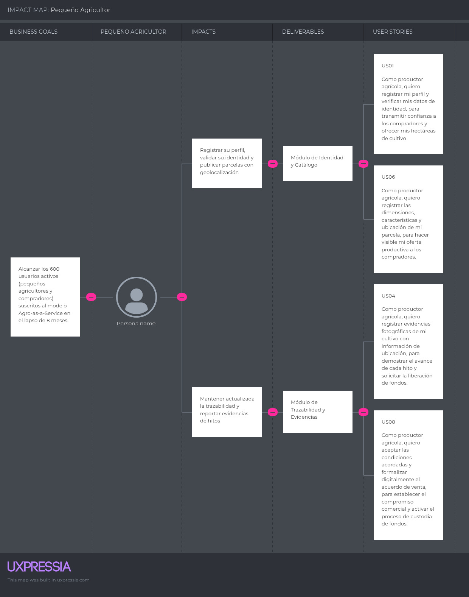
</div>


<div align="center">
  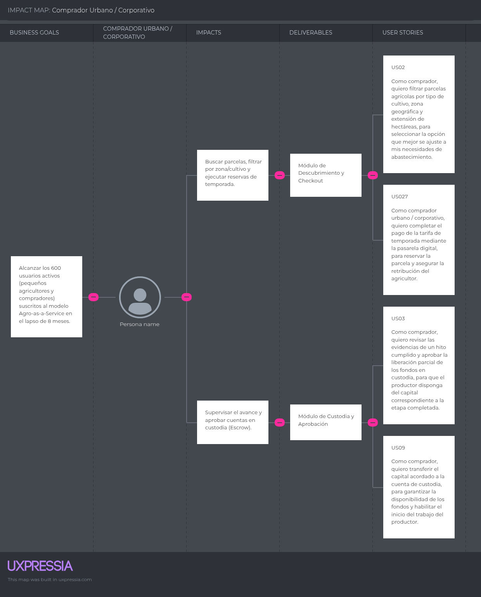
</div>

## 3.3. Product Backlog


El Product Backlog agrupa y prioriza el conjunto de User Stories identificadas. En cumplimiento con los requerimientos de la guía, la priorización está determinada por el valor entregado al negocio, ubicando en el primer Sprint las funcionalidades correspondientes al sitio web estático (Landing Page) para habilitar la captación pública de usuarios y la presentación del modelo de negocio de ALLPATEK.

| Orden | User Story Id | Título | Descripción | Story Points |
| :---: | :--- | :--- | :--- | :---: |
| 1 | US24 | Consultar la propuesta de valor de ALLPATEK | Como visitante deseo entender la propuesta de valor y métricas de ALLPATEK para decidir si el modelo de producción garantizada me conviene antes de registrarme. | 2 |
| 2 | US32 | Conocer los servicios de producción garantizada | Como visitante del segmento comerciante B2B deseo ver la cobertura de parcelas, trazabilidad, custodia y clima para reconocer si el servicio reduce mi riesgo a campo. | 3 |
| 3 | US33 | Entender el esquema de pagos por hitos | Como visitante deseo conocer las etapas del flujo de fondos para saber cuándo entra el dinero a custodia y cuándo se libera. | 2 |
| 4 | US25 | Solicitar una propuesta técnica desde el sitio | Como visitante deseo enviar mis datos de contacto y solicitar el desglose de costos para recibir información comercial sin registrarme aún. | 3 |
| 5 | US35 | Comparar planes de producción según escala | Como visitante del segmento comerciante corporativo deseo comparar las capacidades de cada plan y sus tarifas para evaluar la opción adecuada según mi escala. | 3 |
| 6 | US39 | Iniciar una cotización de parcela | Como visitante del segmento comerciante B2B deseo solicitar una cotización formal desde la presentación del servicio para avanzar al proceso de contratación. | 2 |
| 7 | US38 | Consultar el sitio desde un dispositivo móvil | Como visitante deseo revisar la propuesta, planes y contacto desde mi celular para informarme en desplazamiento o en el campo. | 3 |
| 8 | US02 | Búsqueda y filtrado de parcelas disponibles | Como comerciante deseo filtrar parcelas por cultivo, zona y extensión para seleccionar la opción que mejor se ajuste a mis necesidades. | 5 |
| 9 | US07 | Solicitud de cotización y negociación directa | Como comerciante deseo enviar una propuesta indicando volumen, precio y fecha para iniciar la negociación directa con el productor. | 5 |
| 10 | US21 | Envío de contraofertas durante la negociación | Como productor agrícola deseo responder con una contrapropuesta modificando términos para negociar sin rechazar la oferta. | 3 |
| 11 | US08 | Aceptación de propuesta y firma de contrato digital Escrow | Como productor agrícola deseo aceptar las condiciones y formalizar el acuerdo para activar el proceso de custodia de fondos. | 5 |
| 12 | US09 | Depósito de fondos iniciales en custodia | Como comerciante deseo transferir el capital a la cuenta de custodia Escrow para garantizar la disponibilidad de pagos al productor. | 5 |
| 13 | US04 | Registro y carga de evidencias fotográficas por hito | Como productor agrícola deseo registrar fotografías con geolocalización para demostrar el avance del cultivo y solicitar el desembolso. | 5 |
| 14 | US03 | Aprobación de hito y orden de liberación de fondos | Como comerciante deseo revisar evidencias y aprobar la liberación parcial para transferir el capital de la etapa completada. | 5 |
| 15 | US01 | Registro de perfil y verificación de identidad | Como productor agrícola deseo verificar mi identidad para dar confianza a los comerciantes y habilitar la publicación de mis hectáreas. | 3 |
| 16 | US16 | Registro de perfil corporativo y validación fiscal | Como comerciante deseo registrar datos de mi empresa y validar la condición fiscal para acreditar la formalidad del negocio. | 3 |


### Referencia y Enlace Público

* **Herramienta de gestión:** Trello
* **URL Pública del Product Backlog:** `https://trello.com/b/A0csigUo/terranova` 

### Captura de Pantalla 
<div align="center">
  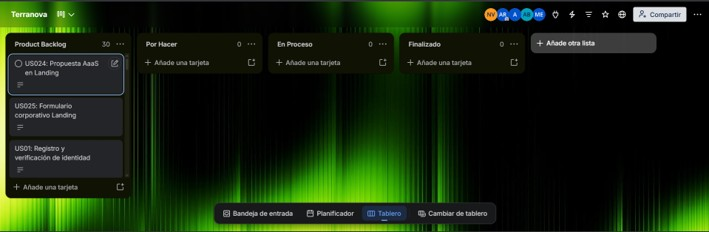
</div>


# Capítulo IV: Product Design

## 4.1. Style Guidelines

Esta sección establece los lineamientos visuales y de comunicación que garantizan la coherencia de ALLPATEK en todos sus puntos de contacto. Con el fin de construir una plataforma intuitiva y confiable para el sector agrícola, se define un sistema de diseño centralizado que abarca desde la identidad de marca, tipografía y paleta de colores dual, hasta las pautas específicas para las interfaces web.

### 4.1.1. General Style Guidelines

#### Branding e Identidad Visual
* **Concepto:** Conectar la tecnología financiera moderna con la solidez de la tierra. La marca refleja seguridad en la custodia de pagos (*escrow*), profesionalismo en acuerdos B2B y trazabilidad agrícola directa.
* **Logotipo:** Tipografía sans-serif geométrica acompañada de un isotipo de hoja y acentos dorados, simbolizando la unión entre el crecimiento orgánico del campo y el valor económico protegido.

#### Paleta de Colores (Colors)
El sistema cromático se divide estratégicamente en dos entornos para responder a los objetivos de cada interfaz: la atracción/conversión en la web pública y la eficiencia operativa en el dashboard privado.

#### A. Paleta de la Landing Page (Sitio Web Público)
Diseñada para captar la atención, comunicar modernidad y guiar al usuario hacia la conversión.

* **Verde Menta (`#34D399`):** Utilizado para acentos visuales, iconos destacados e insignias de valor.
* **Amarillo Vivo (`#FACC15`):** Reservado para botones de llamada a la acción principal (CTA) y destacados de alta prioridad.
* **Verde Profundo (`#0F2A1D`):** Funciona como tono base para tarjetas de servicios, contenedores y contraste con el fondo.
* **Verde Oliva / Neutro (`#626751`):** Aplicado en bloques secundarios y delimitaciones de sección.
* **Gris Claro (`#E4E4E4`):** Color neutro para fondos de contraste y lectura limpia de bloques extensos.


<p align="center">
  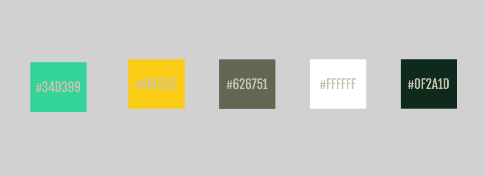
</p>


#### B. Paleta de la Aplicación Web (Dashboard / App Interna)
Optimizada para reducir la fatiga visual (*Dark Mode*), mantener una jerarquía financiera clara y facilitar el uso prolongado.

* **Verde Bosque Oscuro (`#0F1E13`):** Fondo principal de la aplicación que proporciona una estética moderna y profesional.
* **Verde Esmeralda (`#2D6A4F`):** Identifica el estado activo en la barra de navegación lateral (Sidebar), bordes de validación y botones secundarios.
* **Dorado Maíz (`#E9C46A`):** Color de acento de alta jerarquía usado en montos retenidos en *Escrow*, botones de acción principal y aprobaciones.
* **Gris Neutral (`#E4E4E4`):** Utilizado para la tipografía principal, etiquetas de formularios e íconos operativos.


<p align="center">
  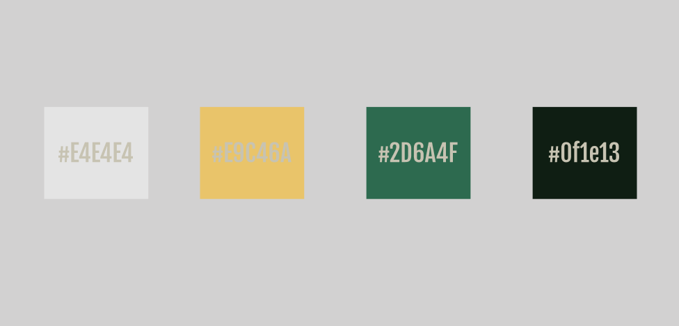
</p>


#### Tipografía (Typography)
* **Títulos y Encabezados:** Se adopta **Fjalla One**, una tipografía *display* sans-serif condensada que otorga personalidad, fuerza y un carácter industrial/agrícola a los titulares principales de la plataforma.
* **Cuerpo de Texto y Datos:** Se utiliza **Inter** (o **Roboto** como alternativa secundaria) por su excelente legibilidad en pantallas de alta densidad, facilitando la lectura de coordenadas GPS, tablas de hitos financieros y formularios técnicos.

#### Espaciado y Rejilla (Spacing & Layout)
* **Sistema de 8px:** Todos los márgenes internos (*padding*) y externos (*margin*) siguen múltiplos de 8px (8, 16, 24, 32, 48px) para mantener un ritmo visual armónico.
* **Efecto Glassmorphism:** Implementación de tarjetas semi-transparentes (`rgba(255, 255, 255, 0.05)`) con bordes sutiles y desenfoque de fondo (`backdrop-blur-md`) para estructurar la información sin recargar la pantalla.


<p align="center">
  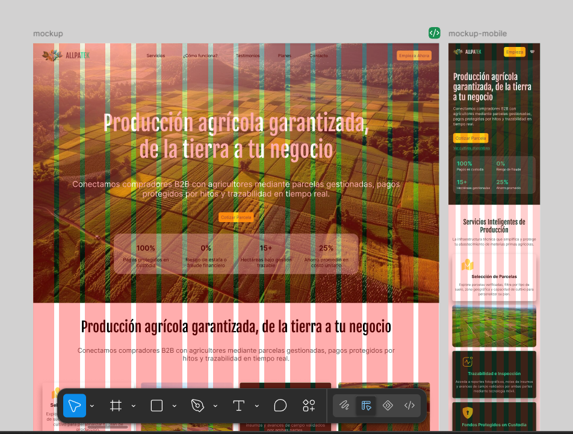
</p>


#### Tono de Comunicación y Lenguaje (Voice & Tone)

| Dimensión | Posición | Justificación |
| :--- | :--- | :--- |
| **Divertido / Serio** | **Serio (80%)** | Maneja contratos de arrendamiento y fondos monetarios en custodia, por lo que las instrucciones y estados deben ser precisos y libres de ambigüedades. |
| **Formal / Casual** | **Profesional equilibrado (60% Formal)** | Se comunica de forma accesible con el agricultor en el campo, pero manteniendo la estructura técnica que exige un comprador o empresa B2B. |
| **Respetuoso / Irreverente** | **Respetuoso (100%)** | Muestra empatía ante los riesgos climáticos del agricultor y la inversión del comprador, ofreciendo siempre soporte claro y guiado. |
| **Entusiasta / Sereno** | **Sereno (75%)** | Transmite calma frente a situaciones de alerta (ej: heladas o demoras) presentando soluciones claras mediante la automatización de avisos. |


### 4.1.2. Web Style Guidelines

Esta sección detalla los estándares visuales y de interacción aplicados al diseño de la plataforma web. Para garantizar una experiencia fluida y consistente en cualquier resolución, la interfaz de la landing page y el dashboard fueron diseñados en Figma aplicando principios de maquetación *responsive* estructurados mediante sistemas de rejilla adaptativa (*grid layouts*) y contenedores flexibles (*auto-layout*).

Esta arquitectura visual asegura la compatibilidad directa con los *breakpoints* estándar del mercado (pantallas de escritorio, laptops y tabletas), permitiendo que los elementos se reorganicen de forma intuitiva sin perder jerarquía ni legibilidad.

* **Estructura y Grid Responsive:** Maquetación basada en una rejilla adaptativa de 12 columnas (Tailwind CSS) con márgenes y canaletas (*gutters*) proporcionales que se ajustan según el ancho de pantalla.
* **Layout Shell del Dashboard:**
  * **Sidebar Fijo / Colapsable:** Navegación lateral de 260px que se adapta o repliega según el espacio disponible para priorizar el área de trabajo.
  * **Header Superior:** Barra de contexto que mantiene fijos el perfil del usuario, el rol activo y el centro de notificaciones.
* **Comportamiento Adaptativo en Figma:** Uso de reglas de restricción (*constraints*) y reescalado de contenedores para que componentes críticos como las tarjetas de parcelas, tablas de hitos y paneles financieros mantengan una proporción adecuada en cualquier monitor.

## 4.2. Information Architecture

En esta sección se detallan las decisiones y el sustento que estructuran la organización del contenido en la landing page y en las aplicaciones web y móviles de ALLPATEK. La arquitectura de información propuesta busca minimizar la carga cognitiva y facilitar la navegabilidad, asegurando que los usuarios exploren la plataforma con intuición y encuentren rápidamente los módulos de contratación, seguimiento de parcelas y Bóveda Escrow. Para lograr una experiencia fluida y accesible

### 4.2.1. Organization Systems

En esta sección se determinan las estructuras y criterios para agrupar y presentar la información en la plataforma **ALLPATEK**, facilitando que tanto los agricultores como los compradores B2B reconozcan el flujo visual y operen con claridad.

#### 1. Formas de Organización Visual del Contenido

**Organización Jerárquica:** Se aplica en la página principal pública y en los paneles de control de cada usuario. Se utilizan tamaños de letra, colores destacados y tarjetas visuales para darle prioridad a los datos más importantes, como la descripción del servicio, los montos retenidos en garantía y el estado actual de los contratos.
* **Organización Secuencial (Paso a Paso):** Se utiliza en los procesos que requieren cumplir ordenadamente con varios pasos. Esto incluye el registro de parcelas, la creación y firma de contratos agrícolas, y la liberación por etapas de los pagos conforme se aprueban las evidencias del trabajo en el campo.
* **Organización Matricial:** Se aplica en las tablas comparativas de terrenos y ofertas. Permite visualizar y comparar varios datos a la vez en una misma pantalla, como el nivel de riesgo del clima, el rendimiento proyectado, el costo por hectárea y el tipo de riego disponible.

#### 2. Esquemas de Categorización del Contenido

* **Por Tipo de Usuario (Audiencia):** Es la forma principal de organizar la aplicación. Al iniciar sesión, el sistema adapta el menú según el perfil de la persona:
  * *Vista del Agricultor:* Muestra herramientas para publicar hectáreas, subir fotos del avance del cultivo y revisar los pagos recibidos por cada hito cumplido.
  * *Vista del Comprador B2B:* Muestra herramientas para explorar el catálogo de terrenos, simular contratos de producción y hacer seguimiento a los pagos en custodia.
* **Por Secciones o Módulos Funcionales:** La información se agrupa en menús conceptuales sencillos: *Mis Contratos*, *Fondos en Garantía*, *Seguimiento y Evidencias*, *Alertas del Clima* y *Fichas Técnicas*.
* **Por Orden Cronológico:** Se aplica para ordenar el historial de pagos, el registro de evidencias con fecha y hora, y el historial de avisos meteorológicos.
* **Por Orden Alfabético:** Se utiliza como criterio secundario para ordenar listas extensas, como catálogos de insumos, tipos de cultivos y regiones del país.

  
### 4.2.2. Labeling Systems

En esta sección se definen las convenciones de etiquetado de la plataforma **ALLPATEK**. Para evitar la confusión de los usuarios, se emplean términos breves, claros y de uso común, reduciendo la cantidad de palabras por etiqueta y manteniendo una asociación directa entre la palabra elegida y la acción o contenido representado.

#### 1. Etiquetas de Navegación Principal
Consisten en nombres breves para las secciones globales del menú, orientando al usuario de forma inmediata sobre el módulo en el que se encuentra:

* **Parcelas:** Gestión, registro y catálogo de terrenos agrícolas.
* **Contratos:** Creación, revisión y firma de acuerdos de producción.
* **Garantía:** Módulo de custodia de fondos (*Escrow*) y estado de pagos.
* **Evidencias:** Registro de fotos, videos y datos de campo reportados.
* **Alertas:** Avisos meteorológicos y notificaciones de riesgo.

#### 2. Etiquetas de Estado de Procesos
Representan el progreso de un contrato o pago mediante palabras clave asociadas a colores estandarizados para reflejar su condición:

* **En Custodia:** Fondos depositados en la garantía a la espera de validación.
* **Aprobado:** Hito o evidencia validada con éxito.
* **Liberado:** Pago transferido al agricultor tras cumplir el hito.
* **Observado:** Evidencia que requiere corrección o sustento adicional.

#### 3. Etiquetas de Acción (Llamados a la Acción / Botones)
Utilizan verbos precisos en infinitivo para que el usuario entienda exactamente la consecuencia de su interacción:

* **Registrar Parcela:** Inicia el formulario de alta de terreno.
* **Firmar Contrato:** Confirma el acuerdo formal entre las partes.
* **Subir Evidencia:** Abre la cámara o la carga de archivos de campo.
* **Aprobar Hito:** Autoriza la conformidad de una etapa cumplida.
* **Descargar Ficha:** Genera el documento técnico en PDF.

#### 4. Asociaciones y Simbología de Apoyo
Para reforzar la comprensión rápida sin saturar de texto la pantalla, cada etiqueta clave se asocia a un icono reconocible y a un color representativo:

* **Icono de Hoja / Terreno + "Parcelas":** Asociado al módulo de tierras.
* **Icono de Candado / Escudo + "Garantía":** Asociado a la seguridad financiera de los fondos.
* **Color Verde + "Aprobado":** Confirmación visual de éxito.
* **Color Ámbar + "Observado":** Indicador visual de atención o revisión necesaria.


### 4.2.3. SEO Tags and Meta Tags

Para optimizar la visibilidad en motores de búsqueda (SEO) y asegurar una presentación clara y uniforme al compartir enlaces externos, se estructuran los metadatos principales de la plataforma ALLPATEK. Esta configuración diferencia las secciones públicas de la Landing Page frente a los módulos privados de la Web Application, aplicando directivas específicas para resguardar la privacidad de la información.

| Tipo de Experiencia | Sección / Módulo | Title | Meta Description | Meta Keywords | Meta Author / Robots |
| :--- | :--- | :--- | :--- | :--- | :--- |
| **Landing Page** | Inicio (*Hero Section*) | Producción Agrícola Garantizada | Conectamos compradores B2B con agricultores mediante parcelas gestionadas, pagos protegidos y trazabilidad en tiempo real. | agro as a service, trazabilidad, parcelas, custodia escrow | **Author:** Equipo ALLPATEK |
| **Landing Page** | Garantía de Pagos por Hitos | Custodia Escrow | Liberación gradual de fondos respaldada por la verificación en campo mediante evidencias GPS e inspección de cosechas. | garantia de pagos, pago por hitos, verificacion en campo | **Author:** Equipo ALLPATEK |
| **Landing Page** | Planes de Producción | Planes de Producción | Escoja la escala de cultivo y las herramientas de trazabilidad ideales para su abastecimiento: Básico, Pro y Empresarial. | planes de produccion, suscripcion agricola, contratos PDF | **Author:** Equipo ALLPATEK |
| **Landing Page** | Contacto y Propuesta Técnica | Propuesta Técnica | Recibe el desglose de costos y el modelo de custodia financiera en tu correo. Cotiza parcelas e inicia tu proyecto. | cotizar parcela, propuesta tecnica, contacto B2B | **Author:** Equipo ALLPATEK |
| **Web Application** | Gestión de Parcelas | Catálogo de Parcelas | Explora y administra las opciones disponibles, filtrando por tipo de suelo, zona geográfica y capacidad de cultivo. | gestion de parcelas, catálogo de terrenos, hectáreas | **Robots:** noindex, nofollow<br>**Author:** Equipo ALLPATEK |
| **Web Application** | Detalle de Contratación | Detalle y Plan de Pagos | Consulta la información técnica del terreno, el plan de desembolsos por hitos en custodia y datos del productor. | detalle de parcela, plan de pagos, contratación | **Robots:** noindex, nofollow<br>**Author:** Equipo ALLPATEK |
| **Web Application** | Registrar Nueva Parcela | Registro de Parcela | Formula y da de alta un nuevo terreno ingresando datos técnicos, geolocalización BPO y evidencias fotográficas. | registrar parcela, geolocalizacion, alta de terreno | **Robots:** noindex, nofollow<br>**Author:** Equipo ALLPATEK |
| **Web Application** | Mis Contratos | Contratos y Alquileres | Gestión integral de tus acuerdos de arrendamiento, montos custodiados y fechas de vigencia de servicios. | acuerdos de alquiler, valor custodiado, contratos activos | **Robots:** noindex, nofollow<br>**Author:** Equipo ALLPATEK |
| **Web Application** | Firma de Contrato | Firma Digital Escrow | Revisa las cláusulas del acuerdo, valida el plan de pagos e ingresa tu firma digital para activar la custodia. | firma de contrato, autenticacion digital, cláusulas | **Robots:** noindex, nofollow<br>**Author:** Equipo ALLPATEK |
| **Web Application** | Monitoreo Climático | Alertas en Tiempo Real | Panel de seguimiento ambiental con datos de temperatura, humedad, viento y recomendaciones asistidas por inteligencia artificial. | monitoreo climatico, alertas agronómicas, riesgo de heladas | **Robots:** noindex, nofollow<br>**Author:** Equipo ALLPATEK |
| **Web Application** | Perfil de Usuario | Perfil y Datos | Revisa, valida y actualiza tus datos personales, documento de identidad, teléfono y rol activo en la plataforma. | perfil de usuario, datos personales, cuenta | **Robots:** noindex, nofollow<br>**Author:** Equipo ALLPATEK |


### 4.2.4. Searching Systems

Para evitar la desorientación del usuario frente al volumen de información agronómica y contractual, la plataforma **ALLPATEK** implementa sistemas de búsqueda contextuales con filtros avanzados e interfaces de resultados estructuradas tanto en la aplicación web como en la móvil.

#### 1. Opciones de Búsqueda y Filtros por Módulo

##### A. Búsqueda en Gestión de Parcelas (*Explorador  y Agricultor*)
Permite la localización rápida de terrenos agrícolas mediante una barra de búsqueda global y controles de filtrado combinados:
* **Entrada de Búsqueda:** Entrada de texto libre para buscar por nombre de parcela, región, valle o tipo de cultivo (ej. *El Vergel*, *Quinoa Órgánica*, *Junín*).
* **Filtros Disponibles:**
  * **Estado de Parcela:** En preparación, Disponible, En Producción.
  * **Tipo de Suelo:** Franco-Arcilloso, Arenoso, Limo-Arcilloso.
  * **Extensión (Hectáreas):** Rango deslizable (de 1 a +50 Ha).
  * **Rango de Precio / Costo por Hito:** Desplegable por presupuesto estimado en Soles (S/).
* **Visualización de Resultados:** Presentación en vista de cuadrícula de tarjetas (*cards*) dinámicas que muestran la foto del terreno, ubicación, hectáreas, tipo de suelo, costo estimado y la etiqueta de estado correspondiente.

##### B. Búsqueda en Mis Contratos de Alquiler
Facilita el rastreo de acuerdos contractuales y el seguimiento de fondos custodiados:
* **Entrada de Búsqueda:** Búsqueda por código único de contrato (ej. *CTR-2025-0041*) o nombre de la parte involucrada (*Comerciante / Agricultor*).
* **Filtros Disponibles:**
  * **Pestañas de Estado:** Contratos Activos, Pendientes de Firma, Finalizados.
  * **Rango de Fechas / Vigencia:** Selección por periodo de inicio o término del acuerdo.
* **Visualización de Resultados:** Tabla analítica de resumen que organiza las coincidencias en filas con columnas clave: Código ID, Parcela/Cultivo, Nombre de la Parte, Monto Acordado en Escrow (S/), Fechas de Vigencia y botón de acción directa (*Ver Detalle*).

##### C. Búsqueda y Filtros en Monitoreo Climático y Alertas
Optimiza el análisis de riesgos ambientales en zonas de producción activas:
* **Entrada de Búsqueda / Selector:** Desplegable de selección rápida para filtrar las métricas agronómicas según la parcela específica registrada.
* **Filtros Disponibles:**
  * **Nivel de Severidad de Alerta:** Crítica (rojo), Advertencia (ámbar), Informativa / Normal (verde).
  * **Tipo de Evento:** Riesgo de Helada, Precipitación / Inundación, Viento Fuerte, Variación de Humedad.
* **Visualización de Resultados:** Panel de tarjetas de alerta priorizadas por nivel de riesgo en la columna central, acompañado de tarjetas de métricas en tiempo real (Temperatura, Humedad Relativa, Precipitación y Velocidad del Viento).


### 4.2.5. Navigation Systems


Para garantizar una experiencia intuitiva y evitar que los usuarios pierdan el contexto de su ubicación dentro del producto digital, la plataforma **ALLPATEK** implementa un sistema de navegación consistente, jerárquico y adaptado al rol del usuario. Se definen mecánicas diferenciadas tanto para la navegación pública en el *Landing Page* como para la experiencia privada en la *Web Application*.

#### 1. Sistemas de Navegación en el Sitio Web Estático (Landing Page)

La navegación pública está orientada a la conversión y al descubrimiento progresivo del modelo de negocio *Agro-as-a-Service*:

* **Navegación Global (Barra Superior / Header):** Menú horizontal fijo (*Sticky Header*) presente en todo el recorrido. Incluye enlaces directos a las secciones clave (*Servicios*, *¿Cómo funciona?*, *Testimonios*, *Planes*, *Contacto*) y un botón de llamado a la acción destacado (*Empieza Ahora* / *Iniciar Sesión*).
* **Navegación Jerárquica y Desplazamiento Suave (*Smooth Scroll*):** Al hacer clic en las opciones del menú superior, la pantalla realiza un desplazamiento fluido directamente hacia la sección correspondiente de la misma página sin recargas innecesarias.
* **Llamados a la Acción Contextuales (CTA Internos):** Botones estratégicos ubicados en las secciones *Hero* y de *Servicios* (*Cotizar Parcela*, *Solicitar Demo*) que redirigen al usuario directamente al formulario de propuesta técnica o al flujo de registro.
* **Navegación de Pie de Página (*Footer*):** Ubicada al final de la página con enlaces secundarios, políticas de privacidad, datos de contacto, horarios de atención y redes sociales.

#### 2. Sistemas de Navegación en la Aplicación Web (Web Application)

Dentro del entorno autenticado, la navegación se estructura para facilitar el flujo operativo rápido entre la gestión de parcelas, la revisión de contratos y el seguimiento agronómico:

* **Navegación Lateral (Sidebar Principal):** Panel vertical ubicado a la izquierda con los módulos centrales de la plataforma (*Mis Parcelas*, *Contratos y Alquileres*, *Bóveda de Pagos / Escrow*, *Trazabilidad y Evidencias*, *Perfil de Usuario*, *Alertas Climáticas*). El módulo activo se resalta visualmente para indicar la ubicación actual.
* **Mapeo de Ruta (*Breadcrumbs* / Migas de Pan):** Cadena de enlaces ubicada en la parte superior del contenido principal (ej. *Inicio / Contratos y Alquileres / Firma de Contrato*). Permite al usuario regresar a niveles superiores de la jerarquía con un solo clic.
* **Navegación contextual por Filas y Tarjetas:** En vistas como *Gestión de Parcelas* o *Mis Contratos*, las tarjetas y filas de tablas actúan como elementos navegables interactivos, permitiendo profundizar hacia el nivel de detalle (*Detalle-contratacion-parcela*) mediante botones de acción explícitos (*Ver Detalle*, *Firmar Contrato*).
* **Flujos de Pasos Secuenciales (Navegación de Proceso / Wizar):** Para tareas complejas como la *Firma de Contrato* o el *Registro de Nueva Parcela*, se utiliza una barra de progreso paso a paso (*Datos Generales*, *Geolocalización BPO*, *Carga de Evidencias*) que evita que el usuario avance sin validar los datos previos.
* **Barra de Acción Superior (Top Bar de Aplicación):** Incluye la barra de búsqueda rápida global, el acceso al perfil de usuario y el botón de notificaciones del sistema.


## 4.3. Landing Page UI Design


En esta sección se presenta la propuesta de diseño de interfaz de usuario (UI) para la *Landing Page* de **ALLPATEK**. La interfaz ha sido desarrollada traduciendo de manera directa las decisiones previamente establecidas en la Arquitectura de Información (IA) y en los sistemas de navegación, organización y etiquetado. El objetivo principal del diseño es proyectar confianza, transparencia y eficiencia operativa, facilitando que los potenciales clientes B2B y agricultores comprendan de forma inmediata la propuesta de valor del modelo *Agro-as-a-Service* y la seguridad del sistema de custodia financiera *Escrow*.

Para lograr una experiencia visual limpia y profesional, se aplicaron principios de jerarquía visual clara, tipografía legible y una paleta de colores inspirada en el sector agrícola con acentos dinámicos para los llamados a la acción (CTA). Cada sección de la página sigue una secuencia lógica orientada a la conversión y al descubrimiento progresivo, transformando conceptos técnicos complejos como la verificación de hitos en campo y la liberación gradual de fondos en componentes visuales comprensibles y estructurados.


### 4.3.1. Landing Page Wireframe

#### Descripción Detallada de las Secciones del Wireframe

##### 1. Encabezado Global (Header / Navbar)
* **Descripción:** Ubicado en la parte superior fija (*Sticky Header*). Contiene el logotipo institucional de **ALLPATEK** alineado a la izquierda, el menú de navegación horizontal (*Servicios*, *¿Cómo funciona?*, *Testimonios*, *Planes*, *Contacto*) y el botón de acción principal (*Empieza Ahora* / *Iniciar Sesión*) destacado a la derecha. En la versión móvil, los enlaces se recogen dentro de un menú hamburguesa desplegable.


<p align="center">
  
</p>


##### 2. Sección Principal (Hero Section)
* **Descripción:** Primera vista que recibe al usuario. Presenta la propuesta de valor con un titular de alto impacto (*"Producción agrícola garantizada, de la tierra a tu negocio"*), seguido de una bajada descriptiva que explica la conexión entre compradores B2B y agricultores. Incluye un llamado a la acción primario (*Cotizar Parcela*) y un bloque destacado con cuatro métricas cuantitativas clave (100% Pagos protegidos, 0% Riesgo de estafa, 15+ Hectáreas gestionadas, 25% Ahorro promedio).


<p align="center">
  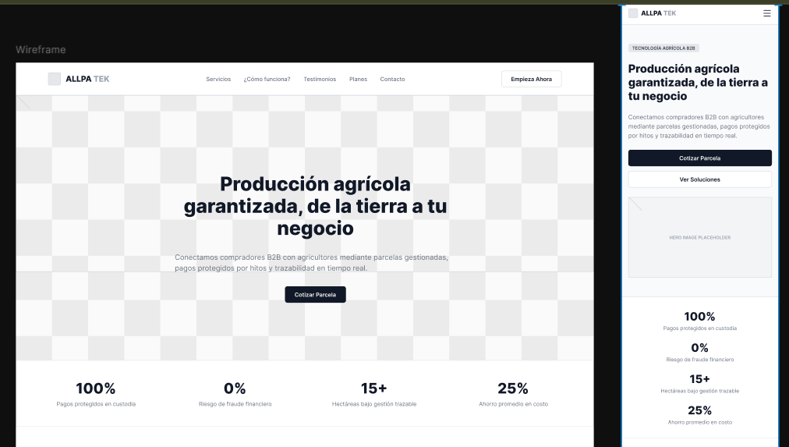
</p>

##### 3. Sección de Servicios y Propuestas de Valor (Grid de Tarjetas)
* **Descripción:** Disposición en cuadrícula de tarjetas interactivas que resumen los pilares operativos de la plataforma:
  * **Selección de Parcelas y Terrenos:** Explicación del filtrado por suelo, zona geográfica y capacidad de cultivo.
  * **Fondos Protegidos en Custodia:** Detalle de la bóveda financiera y liberación progresiva por hitos.
  * **Trazabilidad e Inspección en Tiempo Real:** Acceso a reportes fotográficos, notas de insumos y avances validados.
  * **Asistencia Inteligente y Monitoreo Climático:** Explicación del sistema de alertas tempranas (heladas, sequías, plagas) respaldado por datos.
 
<p align="center">
  
</p>

##### 4. Sección Garantía de Pagos por Hitos (Diagrama de Proceso)
* **Descripción:** Muestra de forma secuencial la línea de tiempo del modelo *Escrow*, conectando visualmente el texto explicativo con imágenes del trabajo en campo:
  * **Hito 1:** Firma de contrato y bloqueo del capital inicial en custodia segura.
  * **Hito 2:** Verificación de siembra y liberación de fondos para insumos.
  * **Hito 3:** Inspección de desarrollo y monitoreo climático en tiempo real.
  * **Hito 4:** Validación de cosecha y aprobación de calidad de producción.
  * **Hito 5:** Entrega final del lote y liberación del saldo restante.
 
<p align="center">
  
</p>

##### 5. Sección de Testimonios (Confianza Respaldada por Resultados)
* **Descripción:** Bloque de prueba social organizado en tres tarjetas verticales. Presenta testimonios reales de compradores B2B y productores (Carlos Mendoza Ríos, Miguel Huamán, Valeria Benavides), acompañados de su fotografía, rol, calificación en estrellas y métricas de éxito obtenidas al usar la plataforma.

<p align="center">
  
</p>

##### 6. Sección de Planes de Producción (Cuadro Comparativo)
* **Descripción:** Muestra tres tarjetas de suscripción alineadas horizontalmente (*Básico*, *Pro* y *Empresarial*):
  * **Básico ($50/mes):** Enfocado en 1 parcela activa, custodia de 4 hitos, soporte por correo y fotos georreferenciadas.
  * **Pro ($123/mes - Destacado):** Diseñado para hasta 10 parcelas, evidencias GPS con validación Java, contratos PDF y alertas climáticas en vivo.
  * **Empresarial ($250/mes):** Para parcelas ilimitadas, integración API, gestor de cuenta dedicado y reportes personalizados.
  * Cada tarjeta incluye su respectivo botón de acción (*Empezar Ahora*, *Solicitar Demo*, *Contactar Ventas*).
 
<p align="center">
  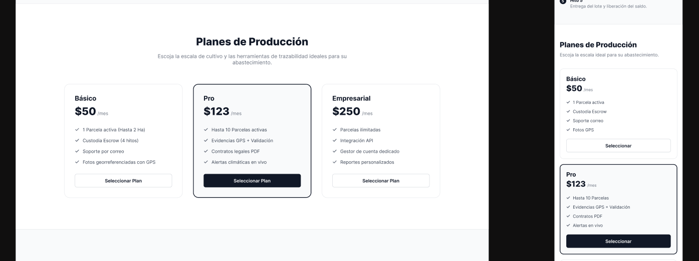
</p>

##### 7. Sección de Equipo (El Equipo Detrás de la Plataforma)
* **Descripción:** Presenta al equipo técnico responsable de la arquitectura del producto. Incluye las tarjetas de los ingenieros de software del proyecto con su fotografía, nombre y rol profesional.

<p align="center">
  
</p>

##### 8. Sección de Contacto y Solicitud de Propuesta Técnica
* **Descripción:** Formulario directo integrado sobre una imagen de fondo de campo agrícola. Permite al usuario solicitar el desglose de costos e información del modelo de custodia ingresando Nombre, Apellidos, Correo Electrónico y Teléfono, finalizando con el botón *Recibir Información*.

<p align="center">
  
</p>


##### 9. Pie de Página (Footer)
* **Descripción:** Ubicado en el cierre de la página. Estructurado en cuatro columnas de navegación secundaria (*Navegación general*, *Servicios*, *Contacto & Horarios* de atención) junto con el logotipo de la marca y los derechos reservados de autor.

<p align="center">
  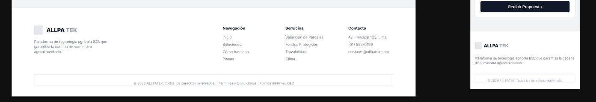
</p>


### 4.3.2. Landing Page Mock-up


En esta sección se presentan y explican los diseños de alta fidelidad (*mock-ups*) desarrollados para la *Landing Page* de **ALLPATEK**, abarcan tanto la versión para navegadores de escritorio (*Desktop Web Browser*) como para dispositivos móviles (*Mobile Web Browser*). La propuesta gráfica materializa la arquitectura de información y la estructura de los *wireframes* previamente definidos, aplicando rigurosamente los principios de diseño visual, accesibilidad e inclusión, e integrando la identidad del *Design System* oficial de la plataforma.


<p align="center">
  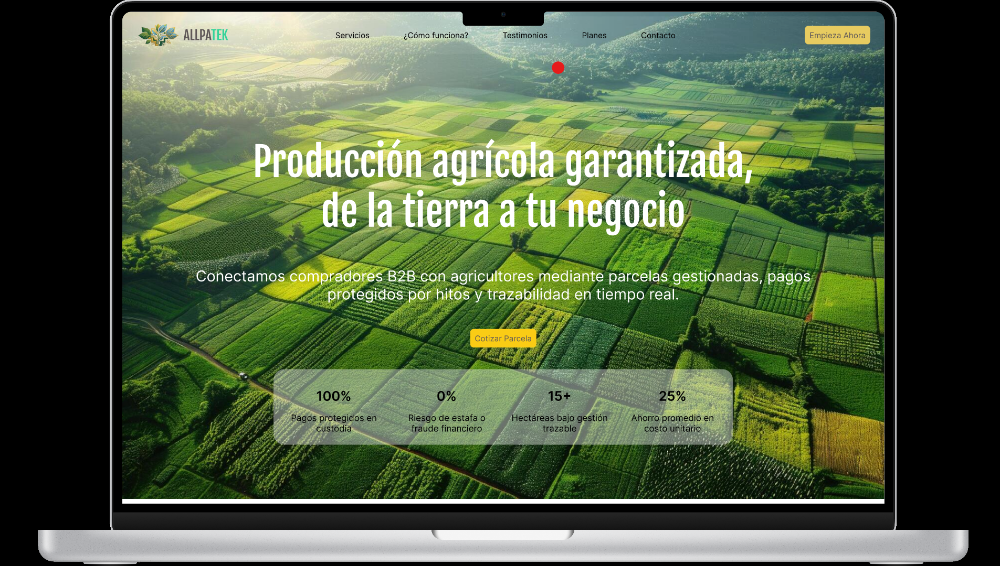
</p>


#### 1. Aplicación del Design System y Lenguaje Visual

* **Paleta de Colores Agrónoma:** Se utiliza una combinación de verdes profundos (tonos corporativos de **ALLPATEK**) para proyectar solidez y naturaleza, combinados con acentos en tonos ámbar/amarillo para los botones de acción principal (CTA) y estados de alerta, garantizando un punto focal inmediato de interacción.
* **Tipografía Escalable:** Implementación de una familia tipográfica sans-serif moderna, con una escala de pesos claramente diferenciada (*Bold* para títulos H1/H2, *Medium* para etiquetas de interfaz y *Regular* para párrafos de lectura), asegurando legibilidad en cualquier densidad de pantalla.
* **Componentes Reutilizables:** Integración del kit de UI institucional, incluyendo botones con estados de interacción (*default, hover, active, disabled*), tarjetas (*cards*) con bordes suaves y sombras leves para dar profundidad, e iconografía vectorial cohesiva para representar métricas y servicios.


#### 2. Principios de Diseño, Accesibilidad y Diseño Inclusivo (WCAG)

* **Relación de Contraste:** Todos los elementos de texto y componentes interactivos cumplen con el estándar WCAG AAA, asegurando un contraste mínimo de $4.5:1$ para texto regular y $3:1$ para títulos y elementos gráficos sobre fondos claros u oscuros.
* **Adaptabilidad Responsive:**
  * **Desktop:** Layout de 12 columnas con márgenes laterales amplios que aprovechan la pantalla panorámica sin dispersar la lectura.
  * **Mobile:** Layout de 4 columnas con apilamiento vertical fluido. Los menús horizontales se contraen en un cajón desplegable (*Drawer*) de fácil alcance táctil.
* **Zona Táctil Óptima (*Thumb Zone*):** En la versión *Mobile*, los botones principales y enlaces de conversión están ubicados en la franja central e inferior de la pantalla con una superficie interactiva mínima de $48 \times 48\text{px}$, facilitando el uso con una sola mano.


#### 3. Presentación de los Mock-ups de Alta Fidelidad

<p align="center">
  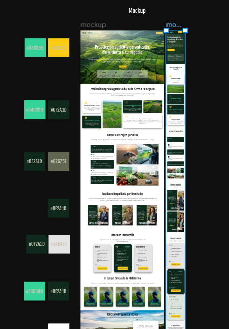
</p>


#### 4. Explicación Detallada de las Secciones del Mock-up

##### A. Encabezado y Navegación Principal (*Header*)
* **Desktop:** Barra fija con fondo semi-transparente (*backdrop blur*) que mantiene visible el logotipo en alta resolución, las opciones del menú con micro-interacciones al pasar el cursor (*hover*) y el botón *Empieza Ahora*.
* **Mobile:** Menú compacto con icono hamburguesa que despliega una lista de opciones accesible a pantalla completa.

<p align="center">
  
</p>

<p align="center">
  
</p>


##### B. Sección de Servicios y Funcionalidades Principales
* **Composición:** Distribución en cuadrícula (bento grid) estructurada mediante un titular principal ("Producción agrícola garantizada, de la tierra a tu negocio") y un subtítulo explicativo del modelo de negocio. Alterna tarjetas informativas funcionales con imágenes aéreas reales de campos agrícolas gestionados.


<p align="center">
  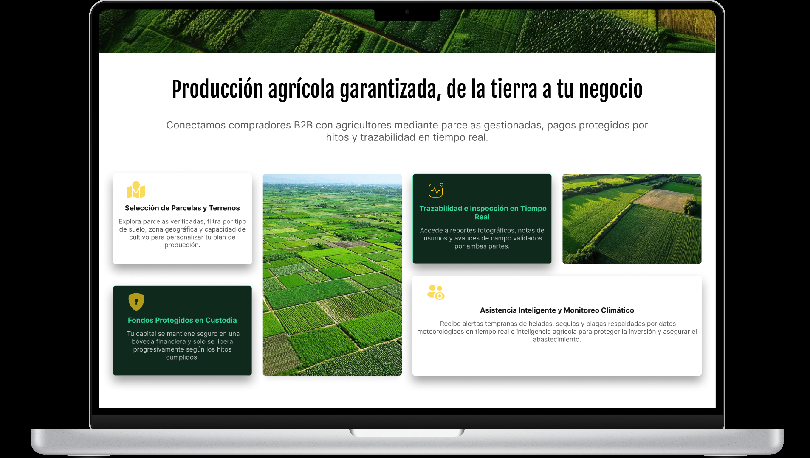
</p>

<p align="center">
  
</p>

  

##### C. Módulo de Servicios y Custodia Escrow
* **Visualización de Tarjetas:** Las características de selección de parcelas, custodia financiera y monitoreo se representan mediante tarjetas con iconos a color, sombras de elevación y jerarquía de texto clara.
* **Flujo del Modelo por Hitos:** Diagrama interactivo paso a paso con conectores visuales que muestran el ciclo de vida del contrato desde el depósito inicial hasta la entrega de la cosecha.

<p align="center">
  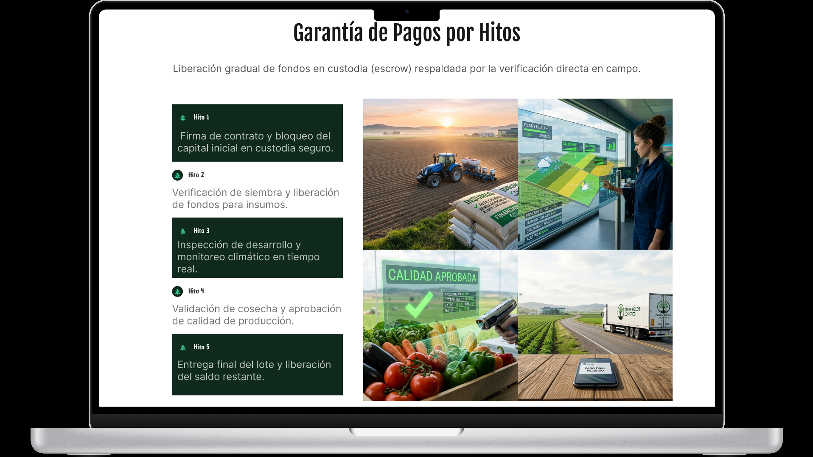
</p>

<p align="center">
  
</p>


##### D. Planes de Producción y Cotización
* **Cuadro Comparativo de Planes:** Tarjetas de suscripción (*Básico*, *Pro*, *Empresarial*) donde la opción recomendada (*Pro*) se resalta mediante un borde distintivo y un indicador visual de *"Más Popular"*.
* **Formulario de Propuesta Técnica:** Bloque final con campos de entrada definidos (*inputs* con etiquetas claras y validación visual) para solicitar cotizaciones personalizadas.

<p align="center">
  
</p>

<p align="center">
  
</p>


## 4.4. Web Applications UX/UI Design

Esta sección presenta la propuesta de diseño visual y de interacción desarrollada para la aplicación web de **ALLPATEK**. Se detallan los principios de diseño de interfaz (UI) y la experiencia de usuario (UX) integrados en los módulos privados de la plataforma. La propuesta abarca la diagramación de flujos de trabajo, pantallas clave, dashboard de monitoreo climático, gestión de parcelas y ejecución de contratos bajo el sistema de custodia *Escrow*, garantizando una navegación intuitiva, coherencia visual y una operativa eficiente para compradores  y productores agrícolas.


### 4.4.1. Web Applications Wireframes


Esta sección presenta los esquemas de baja y media fidelidad (wireframes) diseñados para las aplicaciones móviles del sistema, estructurados como base estructural y funcional previa al desarrollo de alta fidelidad.

 <p align="center">
  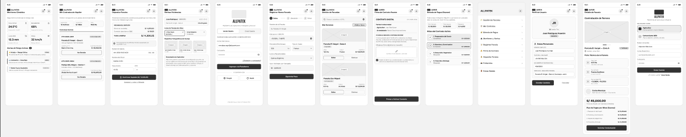
</p>

  

#### Criterios de Diseño y Fundamentos Estructurales

* **Arquitectura de Información y Flujo Móvil:**
  * **Navegación Táctil Persistente:** Implementación de una barra de navegación inferior (*Bottom Navigation Bar*) con acceso directo a las vistas principales (*Inicio/Parcelas*, *Contratos*, *Pagos*, *Clima*), manteniendo al usuario ubicado espacialmente sin sobrecargar la pantalla.
  * **Disposición Vertical de Contenidos:** Distribución secuencial de tarjetas y bloques para favorecer el desplazamiento vertical (*Scroll*) natural en una sola mano.

* **Principios y Elementos de Diseño (UI/Layout):**
  * **Rejilla Móvil:** Maquetado sobre un layout de **4 columnas** con márgenes laterales de $16\text{px}$ y *gutters* de $16\text{px}$, asegurando alineación limpia.
  * **Espaciado Escalar (8px Grid):** Aplicación de márgenes internos de $8\text{px}$, $16\text{px}$ y $24\text{px}$ en tarjetas y contenedores para mantener jerarquía visual y separación clara entre bloques.
  * **Wireframing Neutral:** Uso exclusivo de escalas de grises para validar la estructura, contenido y contraste sin la distracción de elementos estéticos.

* **Diseño Inclusivo y Accesibilidad (WCAG 2.1 AA):**
  * **Zonas de Contacto Táctil (*Touch Targets*):** Todos los componentes interactivos (botones, campos de texto e íconos) respetan un área mínima de $44\times44\text{px}$ para evitar clics accidentales en dispositivos móviles.
  * **Claridad Tipográfica y Contraste:** Uso de tipografías legibles con contraste en escala de grises superior a $4.5:1$ en textos principales e inclusión de etiquetas (*labels*) permanentes en los formularios.


#### Estructura de Wireframes Móviles

##### 1. Wireframe: Autenticación y Selección de Rol
* **Descripción:** Esquema en pantalla única enfocado en el ingreso rápido de credenciales y selección de perfil:
  * **Contenedor Principal:** Módulo centrado con campos de entrada en bloque y botones sociales secundarios en la base.
  * **Selector de Rol:** Botones de opción amplia para conmutar entre *Agricultor* y *Comerciante B2B* antes del alta.

 <p align="center">
  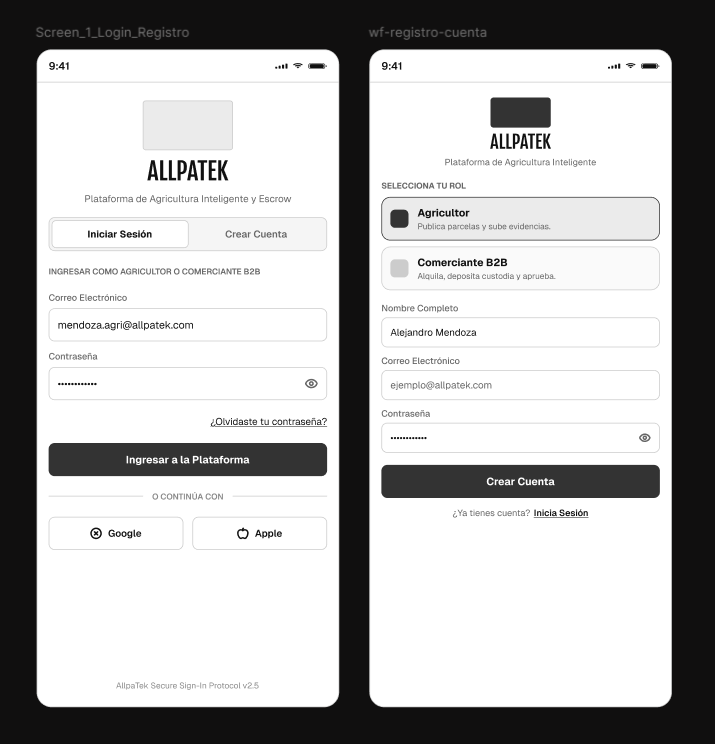
</p>

  

##### 2. Wireframe: Dashboard Móvil de Parcelas
* **Descripción:** Vista principal del inventario agrícola organizada para escaneo rápido:
  * **Buscador Superior:** Campo de búsqueda y filtrado por ubicación fija en la zona superior.
  * **Listado de Tarjetas (*Cards*):** Contenedores individuales que representan cada terreno, con espacios reservados para fotografía, estado, extensión y costo.

 <p align="center">
  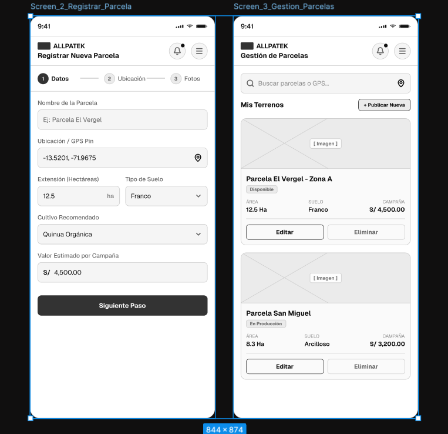
</p>


##### 3. Wireframe: Monitoreo Climático y Alertas
* **Descripción:** Estructura modular de lectura rápida para condiciones de campo:
  * **Métricas Principales (KPIs):** Cuadrícula de 2x2 para indicadores clave (*Temperatura*, *Humedad*, *Lluvia*, *Viento*).
  * **Lista de Alertas:** Bloques horizontales jerarquizados con ícono indicador y espacio para texto explicativo sobre el nivel de riesgo.

 <p align="center">
  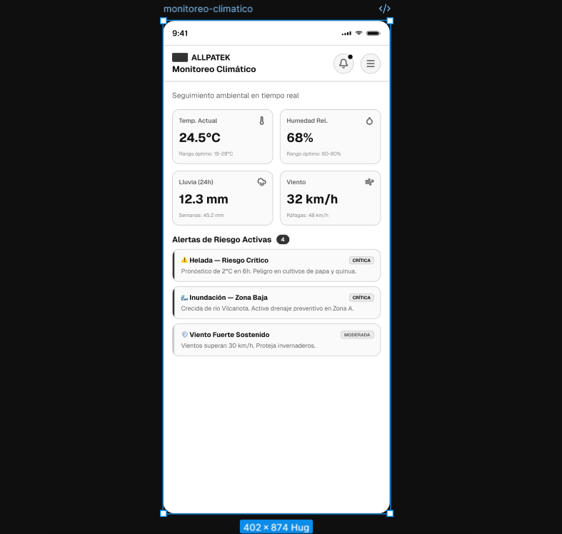
</p>

### 4.4.2. Web Applications Wireflow Diagrams


En esta sección se presentan los diagramas de **Wireflow**, los cuales combinan la estructura de los *wireframes* con la secuencia de un *user flow* para representar la interacción y el cambio de estado de la pantalla en cada paso de la navegación. 

Para garantizar consistencia en la arquitectura de información, se definieron previamente los *Task Flows* correspondientes a las rutas críticas de nuestros User Personas (**Agricultor** y **Comerciante**), modelando explícitamente cada cambio de estado visual (efecto de selección, apertura de modales o actualización de badges) como un paso independiente con su respectivo wireframe.

 **Link Wireflow:** [Link del Wireflow Diagramsl](https://www.figma.com/board/KAFi24QzlDrbm4DzuM1DgV/Untitled?node-id=0-1&t=xxM3mTqylB25csWf-1)


#### Wireflow 1: Registro de Usuario, Selección de Rol y Consulta de Perfil
* **User Persona:** Alejandro Mendoza / María Chen
* **User Goal:** Crear una cuenta en la plataforma seleccionando el rol operativo correspondiente, iniciar sesión para autenticarse y acceder a la sección de perfil para verificar los datos de la cuenta y su estado.

<p align="center">
  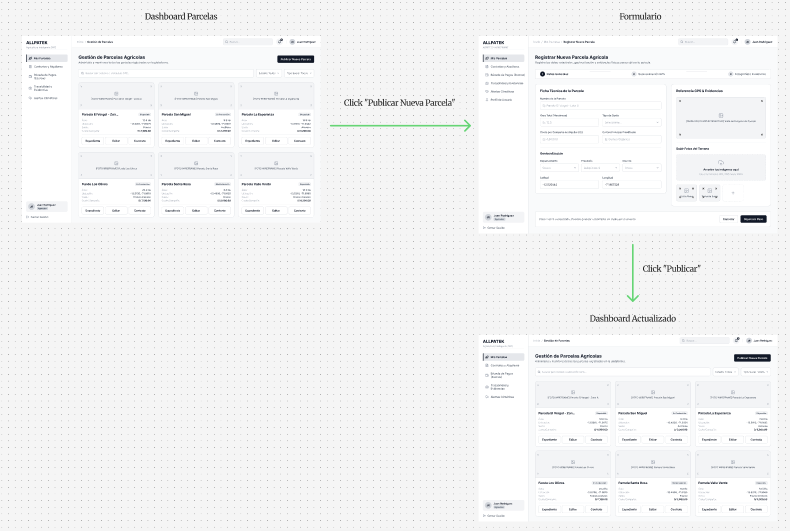
</p>

**Explicación del Flujo Paso a Paso:**
1. **Paso 1 (Modal de Selección de Rol - Estado Inicial):** El usuario accede al flujo de alta. La interfaz despliega un contenedor modal centrado en modo oscuro con dos tarjetas interactivas: **Agricultor** y **Comerciante B2B**. El usuario hace clic sobre la tarjeta de su perfil, la cual cambia visualmente de estado activando un borde destacado en tono dorado maiz (`#E9C46A`). Luego, presiona `Siguiente`.
2. **Paso 2 (Formulario Progresivo de Registro):** La pantalla cambia al formulario de alta de datos. El usuario ingresa sus nombres completos, documento de identidad (DNI/RUC), correo electrónico y contraseña Al hacer clic en `Crear Cuenta`, el sistema valida las entradas y registra la cuenta.
3. **Paso 3 (Pantalla de Inicio de Sesión - Login):** La interfaz muestra el formulario de ingreso de credenciales en un contenedor de columna única. El usuario introduce su correo y contraseña registrados y presiona el botón principal `Iniciar Sesión`. Tras validar el token JWT, el sistema otorga acceso al Dashboard, desde cuyo menú lateral el usuario selecciona `Mi Perfil`.
4. **Paso 4 (Vista de Perfil de Usuario y Datos de Cuenta):** El Wireframe se actualiza mostrando la sección de Perfil de Usuario. Presenta el avatar del usuario, badge de rol activo (`Agricultor` o `Comerciante B2B`), datos fiscales/personales en modo lectura y el botón de acción `Editar Perfil`.


#### Wireflow 2: Registro de Parcela y Publicación en la Plataforma Web
* **User Persona:** Alejandro Mendoza (Productor Agrícola)
* **User Goal:** Registrar un nuevo terreno agrícola ingresando sus especificaciones técnicas, ubicación geográfica en mapa y evidencia fotográfica para ponerlo a disposición de comerciantes B2B en el catálogo de ALLPATEK.

<p align="center">
  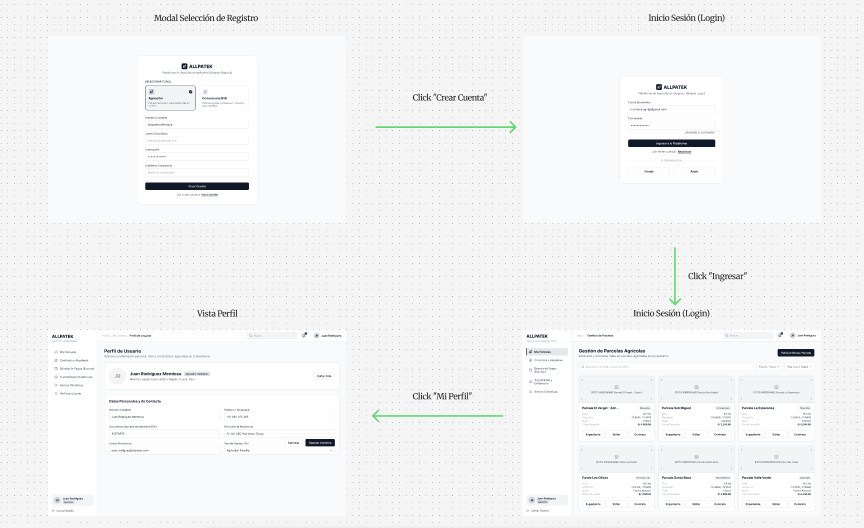
</p>

**Explicación del Flujo Paso a Paso:**
1. **Paso 1 (Dashboard de Parcelas - Estado Inicial):** El agricultor navega al módulo *Gestión de Parcelas* en la barra lateral (Sidebar) y hace clic en el botón principal de acción (CTA) `Publicar Nueva Parcela`.
2. **Paso 2 (Formulario Multipaso - Paso 1: Datos Generales):** Se despliega el Wireframe del formulario. El usuario completa los campos de entrada: nombre de la parcela, extensión en hectáreas (Ha), tipo de suelo y costo por campaña. Al completar, presiona `Siguiente`.
3. **Paso 3 (Formulario Multipaso - Paso 2: Geolocalización):** La pantalla cambia a la vista de ubicación. El usuario selecciona departamento, provincia, distrito y presiona `Obtener Ubicación`, lo que actualiza la interfaz mostrando el pin de coordenadas GPS sobre el visor del mapa interactivo. Hace clic en `Siguiente`.
4. **Paso 4 (Formulario Multipaso - Paso 3: Carga de Evidencia Visual):** La pantalla muestra la zona de arrastre (*Drag & Drop*). El usuario adjunta las imágenes del terreno; el Wireframe se actualiza mostrando las miniaturas de las fotos y permitiendo designar la Foto Principal.
5. **Paso 5 (Confirmación y Actualización del Dashboard):** El agricultor hace clic en `Guardar y Publicar Parcela`. El sistema procesa la solicitud, cierra el asistente y retorna al Dashboard principal, mostrando la nueva tarjeta agregada con el badge en estado `Disponible`.


#### Wireflow 3: Contratación y Firma Digital del Acuerdo Escrow
* **User Persona:** María Chen (Comprador)
* **User Goal:** Revisar los términos legales de una propuesta de arrendamiento agrícola y formalizar el acuerdo mediante firma digital para activar la custodia financiera de fondos en la Bóveda Escrow.

<p align="center">
  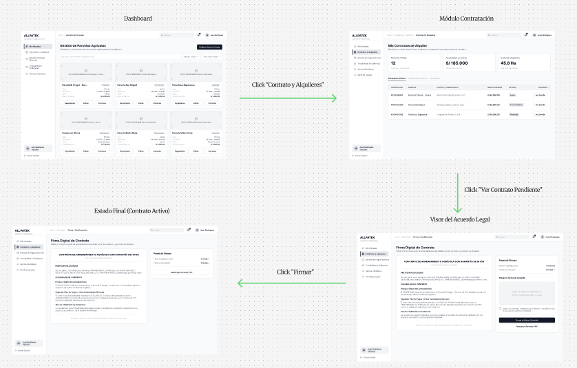
</p>

**Explicación del Flujo Paso a Paso:**
1. **Paso 1 (Módulo de Contratos y Alquileres - Estado Pendiente):** La compradora ingresa a la sección *Contratos* desde la navegación lateral y selecciona una propuesta en estado `Pendiente de Firma`.
2. **Paso 2 (Lectura y Verificación de Cláusulas):** La pantalla muestra la vista dividida (*Split Screen*) con el visor del contrato legal, desglosando las partes involucradas, el área del terreno y el plan de desembolsos por hitos en la Bóveda Escrow.
3. **Paso 3 (Captura de Firma Digital):** La compradora interactúa con el recuadro de firma (*Canvas*). Al dibujar su rúbrica táctil/mouse, el componente cambia de estado mostrando la firma renderizada y habilitando la casilla de verificación.
4. **Paso 4 (Aceptación de Términos Escrow):** La usuaria marca el checkbox *"Acepto los términos y condiciones de custodia Escrow"*, activando visualmente el botón principal `Firmar y Activar Contrato`.
5. **Paso 5 (Estado Final - Contrato Activo):** Tras procesar la firma, la pantalla cambia al estado de `Contrato Activo`, deshabilitando la edición y redirigiendo a la compradora al panel de la Bóveda de Pagos para realizar el depósito inicial.


### 4.4.3. Web Applications Mock-ups

##### 1. Sección de Registro de Usuario (Modal de Selección de Rol y Formulario)
* **Descripción:** Disposición en contenedor modal centrado sobre rejilla de 6 columnas en modo oscuro que gestiona el alta de usuarios:
  * **Selección de Rol Adaptativo:** Tarjetas interactivas (*Agricultor* y *Comerciante*) con íconos temáticos y estado activo en dorado para personalización del flujo.
  * **Formulario Progresivo Secuencial:** Campos de entrada verticalmente alineados con regla de 8px para captura de datos sin saturación visual.
 
<p align="center">
  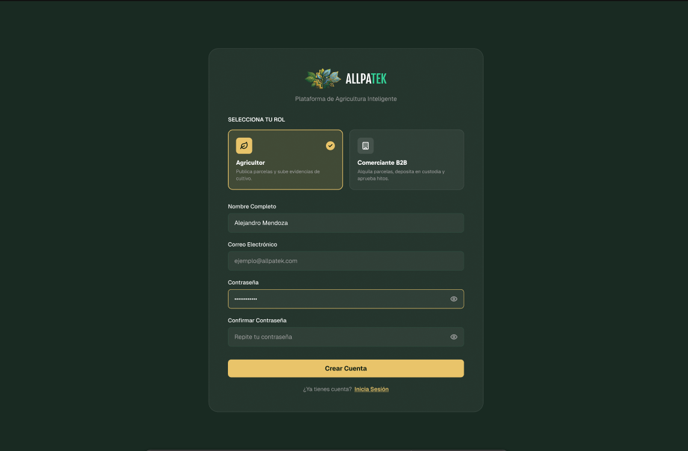
</p>


##### 2. Sección de Inicio de Sesión (Autenticación Directa y Social)
* **Descripción:** Layout de columna única enfocado en minimizar la carga cognitiva durante el acceso a la plataforma:
  * **Credenciales Tradicionales:** Inputs de correo y contraseña con opción de revelar texto y enlaces de recuperación de alto contraste.
  * **Acceso Principal Relevante:** Botón institucional de ancho completo en tono dorado para guiar la interacción principal (*CTA*).

<p align="center">
  
</p>

##### 3. Sección de Gestión de Parcelas Agrícolas (Dashboard en Grid de Tarjetas)
* **Descripción:** Cuadrícula de tarjetas que muestra el inventario de terrenos con badges de estado (*Disponible*, *En Producción*, *En Mantenimiento*):
  * **Información Técnica Clave:** Detalle de hectáreas, coordenadas GPS, tipo de suelo y costo por campaña.
  * **Acciones Rápidas:** Opciones directas de edición y eliminación por cada tarjeta, junto al botón principal "Publicar Nueva Parcela".

<p align="center">
  
</p>

##### 4. Sección de Registro de Nueva Parcela (Formulario Multipaso)
* **Descripción:** Formulario modular dividido en etapas con indicador de progreso (*Datos Generales*, *Geolocalización*, *Fotografías*):
  * **Geolocalización e Integración de Mapa:** Selección por departamento/provincia e inserción de coordenadas con mapa interactivo.
  * **Carga de Evidencia Visual:** Zona *Drag & Drop* para adjuntar imágenes con vista previa y designación de imagen principal.
 
<p align="center">
  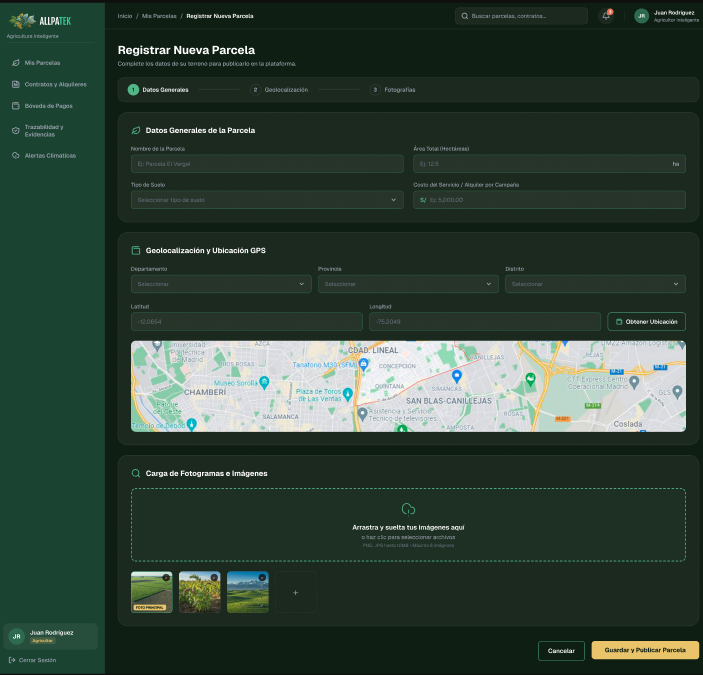
</p>

##### 5. Sección de Perfil de Usuario (Gestión de Datos y Cuenta)
* **Descripción:** Vista centralizada de la información personal del usuario con opción de actualización de datos:
  * **Header de Identidad:** Fotografía de perfil, nombre, badge de rol (*Agricultor*) y fecha de antigüedad.
  * **Formulario de Datos Personales:** Campos para DNI, teléfono, dirección principal, correo verificado y tipo de cuenta activa.

 
<p align="center">
  
</p>


##### 6. Sección de Firma y Confirmación de Contrato (Contratos y Alquileres)
* **Descripción:** Vista dividida en dos columnas para la lectura legal y la formalización de acuerdos bajo el modelo Escrow:
  * **Visor del Acuerdo Legal:** Mapeo de partes involucradas, cláusulas de arrendamiento y plan de desembolsos por hitos en bloques estructurados.
  * **Panel de Autenticación Digital:** Recuadro de firma manuscrita digital, confirmación de términos de custodia Escrow y botón principal de activación en dorado.
 
 
<p align="center">
  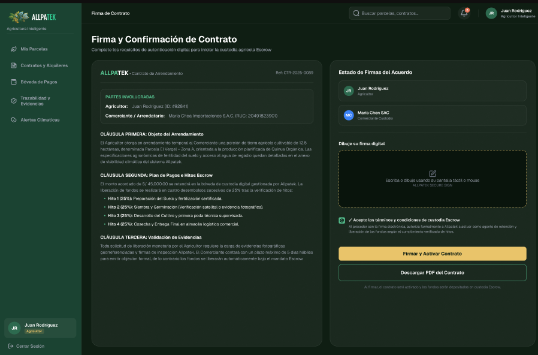
</p>

##### 7. Sección de Bóveda de Pagos (Custodia Financiera Escrow)
* **Descripción:** Panel de control para la gestión de custodia y liberación progresiva de fondos vinculados a contratos activos:
  * **Métricas Financieras Generales:** Tarjetas superiores con KPIs de monto total custodias, fondos liberados y saldos pendientes de aprobación.
  * **Línea de Tiempo de Hitos:** Flujo secuencial de 4 etapas (*Suelo*, *Siembra*, *Desarrollo*, *Cosecha*) con conectores y badges de estado (*Completado*, *En Revisión*, *Bloqueado*).

<p align="center">
  
</p>


##### 8. Sección de Monitoreo Agronómico y Riesgo Climático (Alertas Climáticas)
* **Descripción:** Dashboard de seguimiento ambiental en tiempo real orientado a la prevención de riesgos agrícolas:
  * **Tarjetas de Sensores Ambientales:** Visualización de temperatura, humedad, precipitación y viento con micro-gráficos de tendencia.
  * **Feed de Alertas Jerarquizado:** Contenedores de riesgo clasificados por color y nivel de severidad (*Crítica*, *Moderada*, *Normal*) para actuación inmediata.

<p align="center">
  
</p>

### 4.4.4. Web Applications User Flow Diagrams


En esta sección se presenta la propuesta formal de User Flows mapeados a partir de los diagramas de Wireflow previamente validados. Cada flujo integra los Mock-ups finales de alta fidelidad para representar la experiencia visual definitiva, definiendo con claridad tanto la ruta principal o esperada (Happy Path) como las decisiones y rutas de excepción (Unhappy Paths).

* * **Link:** [Link de los User Flow](https://www.figma.com/board/qh5vL4xQoPmKWNJbFj7TGj/Untitled?node-id=0-1&t=gEVZUOH5xRFhc4Dp-1
)

#### **User Flow 1: Registro de Parcela Agrícola y Publicación en Plataforma**
* **User Persona:** Alejandro Mendoza (Agricultor)
* **User Goal:** Publicar una nueva parcela en el catálogo para ponerla a disposición de comerciantes B2B, garantizando la carga correcta de datos técnicos, coordenadas GPS y fotos del terreno.

<p align="center">
  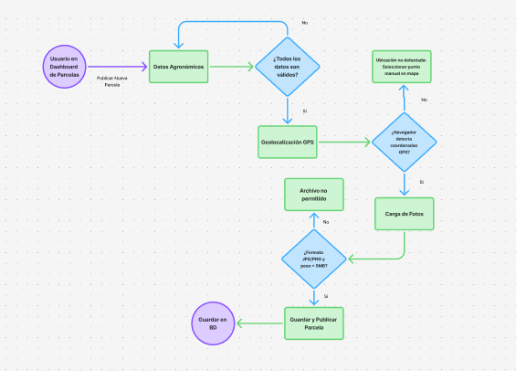
</p>

##### **Explicación del Flujo y Condiciones:**

* **Happy Path (Ruta Esperada):**
  1. **Inicio:** El usuario ingresa a *Gestión de Parcelas* y presiona el CTA `"Publicar Nueva Parcela"`.
  2. **Paso 1 (Datos Generales):** Completa exitosamente el nombre, área en hectáreas, tipo de suelo y costo/campaña. Presiona `"Siguiente"`.
  3. **Paso 2 (Geolocalización):** Selecciona departamento, provincia, distrito y presiona `"Obtener Ubicación"`. El sistema valida las coordenadas GPS y renderiza el mapa.
  4. **Paso 3 (Fotografías):** Adjunta al menos 3 imágenes mediante *Drag & Drop*, asigna la Foto Principal y selecciona `"Guardar y Publicar Parcela"`.
  5. **Resultado:** El sistema valida los datos y redirige al Dashboard, mostrando la tarjeta en estado `Disponible`.

* **Unhappy Paths (Rutas Alternativas y Excepciones):**
  * **Datos Incompletos o Formato Inválido (Paso 1):** Si el usuario deja campos requeridos vacíos o ingresa un costo no numérico, el botón `"Siguiente"` permanece deshabilitado o el input genera un borde de error en rojo.
  * **Error de Geolocalización / Coordenadas Nulas (Paso 2):** Si el navegador o dispositivo no tiene permisos de GPS activados, la plataforma muestra un Banner de Advertencia solicitando la selección manual en el mapa o el reintento de la geolocalización.
  * **Formato o Peso de Imagen No Permitido (Paso 3):** Si se intenta subir un archivo distinto a JPG/PNG o que supere el tamaño máximo (5MB), el contenedor de carga muestra un mensaje de alerta y no procesa el archivo hasta ser reemplazado.


#### **User Flow 2: Formalización y Firma Digital del Contrato Escrow**
* **User Persona:** María Chen (Comerciante B2B)
* **User Goal:** Revisar y firmar digitalmente un contrato de arrendamiento agrícola para proceder al bloqueo e inicio de la custodia de fondos en la Bóveda de Pagos.

<p align="center">
  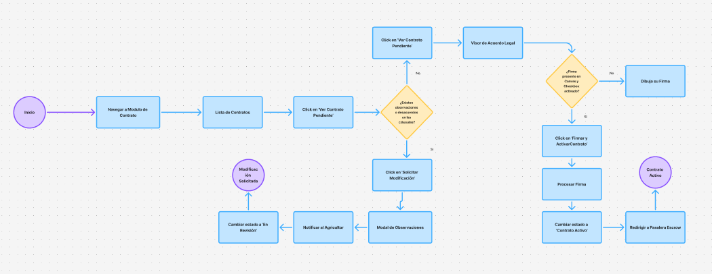
</p>

##### **Explicación del Flujo y Condiciones:**

* **Happy Path (Ruta Esperada):**
  1. **Inicio:** La usuaria navega al módulo *Contratación* y hace clic en una propuesta con estado `Pendiente de Firma`.
  2. **Revisión del Acuerdo:** Examina el visor de contrato (partes, cláusulas y plan de desembolsos por hitos Escrow).
  3. **Rúbrica Digital:** Dibuja su firma en el recuadro interactivo (*Canvas*).
  4. **Aceptación y Confirmación:** Marca la casilla de verificación de términos Escrow y presiona el botón `"Firmar y Activar Contrato"`.
  5. **Resultado:** El sistema registra la firma, cambia el estado a `Contrato Activo` y habilita la visualización de la línea de tiempo en la Bóveda de Pagos.

* **Unhappy Paths (Rutas Alternativas y Excepciones):**
  * **Firma No Realizada / Canvas Vacío:** Si la usuaria marca la casilla de términos pero no dibuja la firma en el recuadro, el botón `"Firmar y Activar Contrato"` se mantiene en estado deshabilitado.
  * **Rechazo o Solicitud de Corrección:** Si la usuaria identifica un error en los montos o hectáreas del acuerdo, puede seleccionar la acción secundaria `"Rechazar / Solicitar Modificación"`, abriendo un modal para enviar observaciones al Agricultor y pausar el flujo.


#### **User Flow 3: Consulta de Monitoreo Climático y Gestión de Alerta**
* **User Persona:** Alejandro Mendoza (Agricultor)
* **User Goal:** Evaluar las métricas ambientales de sus parcelas y revisar detalles de alertas críticas para tomar decisiones preventivas sobre sus cultivos.

<p align="center">
  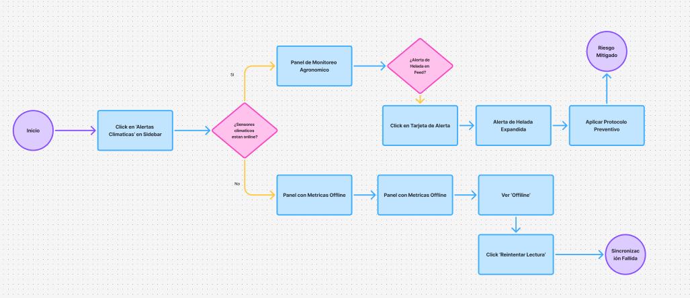
</p>

##### **Explicación del Flujo y Condiciones:**

* **Happy Path (Ruta Esperada):**
  1. **Inicio:** El usuario accede al menú lateral y selecciona `"Alertas Climáticas"`.
  2. **Lectura de Sensores:** Revisa los KPIs de Temperatura, Humedad, Precipitación y Viento.
  3. **Identificación de Alerta:** Selecciona la primera tarjeta del feed (*Alerta de Helada - Riesgo Crítico*).
  4. **Visualización de Recomendación:** La tarjeta expande su contenido, mostrando el diagnóstico técnico y el protocolo de acción sugerido.

* **Unhappy Paths (Rutas Alternativas y Excepciones):**
  * **Pérdida de Conexión de Sensores / Datos Desactualizados:** Si las estaciones meteorológicas no envían señal, las tarjetas de KPI muestran un estado `Offline` con la última hora de sincronización y un botón de `"Reintentar Lectura"`.


## 4.5. Web Applications Prototyping

En esta sección se presentan los prototipos interactivos de alta fidelidad desarrollados para navegadores **Desktop** y **Mobile Web**, los cuales simulan la experiencia real de navegación acorde a los trayectos definidos en los *User Flow Diagrams*. 

#### Criterios para las Decisiones de Interacción y Arquitectura de Información

La estrategia de interacción de **ALLPATEK** se diseñó bajo un enfoque enfocado en el usuario y orientado a tareas, asegurando una transición fluida desde el primer contacto hasta las operaciones avanzadas del sistema:

* **Relación con la Arquitectura de Información:** 
  * **Sistema de Navegación Persistente:** Se implementó una barra lateral (*Sidebar*) en Desktop y un menú colapsable (*Drawer/Hamburger*) en Mobile Web. Esta estructura garantiza que el usuario mantenga claridad de su ubicación espacial (*Breadcrumbs mentales*) y pueda alternar sin fricción entre módulos clave como *Gestión de Parcelas*, *Bóveda de Pagos Escrow* y *Alertas Climáticas*.
  * **Jerarquía de Visualización Contenida:** El contenido se organiza modularmente mediante tarjetas interactivas (*Cards UI*) y tablas de datos que colapsan/expanden información técnica según la densidad requerida por cada dispositivo.

* **Tipos de Interacciones Seleccionadas:**
  * **Microinteracciones y Feedback Inmediato:** Se incorporaron variantes de componentes en Figma para estados *Hover*, *Focus*, *Pressed* y *Active*. Los botones principales y tarjetas cambian de elevación y tono al interactuar, proporcionando retroalimentación visual inmediata.
  * **Interacciones de Flujo Guiado:** Para procesos complejos como la *Firma de Contratos* y la *Carga de Evidencia en Nuevas Parcelas*, se emplearon patrones de interacción progresiva (*Step-by-step Steppers* y zonas de *Drag & Drop*), reduciendo la carga cognitiva.
  * **Navegación Táctil y Enfoque Adaptativo:** En la versión Mobile Web, los puntos de contacto (*Touch Targets*) se mantuvieron por encima del área mínima de $44\times44\text{px}$, optimizando gestos de desplazamiento vertical (*Scroll*) y selección rápida sin sacrificar contraste ni legibilidad.


#### Demostración y Flujos de Interacción en Video

A continuación, se presentan los enlaces y capturas de los videos explicativos subidos a Microsoft Stream, donde se demuestra el recorrido de usuario y las validaciones del prototipo:

##### 1. Prototipo Desktop Web – Flujo Principal de Gestión y Custodia Escrow
* **Descripción del Video:** Explicación detallada de la experiencia en pantalla completa, abarcando desde la autenticación por roles, la exploración de parcelas agrícolas en grid, hasta la firma digital de acuerdos y la liberación de fondos por hitos en la Bóveda de Pagos.
* **Captura de Pantalla:**
  
  <p align="center">
  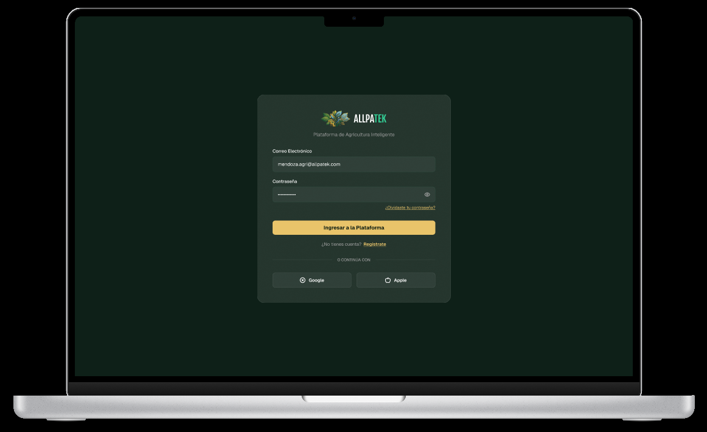
</p>

* **Link del Prototipo:** [Link del Prototipo Web](https://www.figma.com/proto/qdN2BmM77AaLFlq5OyFSyD/Untitled?node-id=85-504&t=DTHiWfYH71axACfB-1&scaling=scale-down&content-scaling=fixed&page-id=0%3A1&starting-point-node-id=123%3A494&show-proto-sidebar=1)
* **Enlace al Video:** [Ver Demostración](https://upcedupe-my.sharepoint.com/:v:/g/personal/u202116018_upc_edu_pe/IQDF54TKL6PlS58DK7p4wuJAAQiikz0rs6edE33i_ATjpPk?nav=eyJyZWZlcnJhbEluZm8iOnsicmVmZXJyYWxBcHAiOiJPbmVEcml2ZUZvckJ1c2luZXNzIiwicmVmZXJyYWxBcHBQbGF0Zm9ybSI6IldlYiIsInJlZmVycmFsTW9kZSI6InZpZXciLCJyZWZlcnJhbFZpZXciOiJNeUZpbGVzTGlua0NvcHkifX0&e=7pTDmu)

##### 2. Prototipo Mobile Web Browser – Adaptabilidad y Monitoreo en Campo
* **Descripción del Video:** Demostración de la respuesta adaptativa en navegadores móviles, enfocada en la facilidad de uso para agricultores en campo: consulta de alertas climáticas en tiempo real, navegación táctil y carga directa de fotografías.
* **Captura de Pantalla:**
  
  <p align="center">
  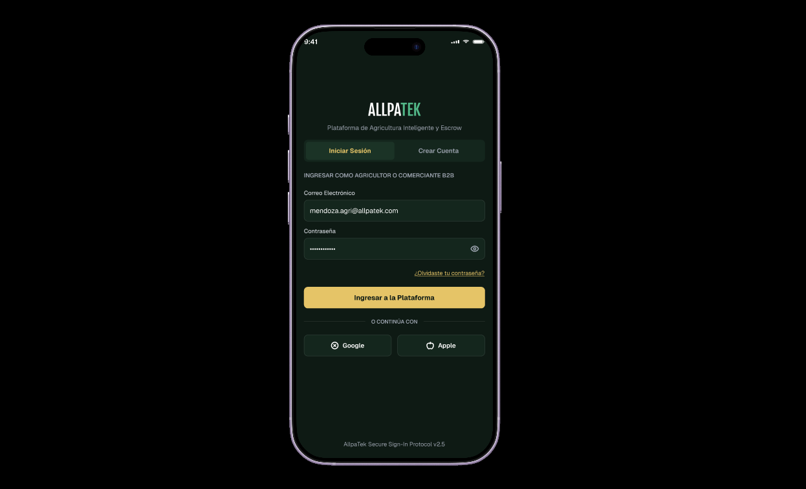
</p>

* **Link del Prototipo:** [Link del Prototipo Movil](https://www.figma.com/proto/qdN2BmM77AaLFlq5OyFSyD/Untitled?node-id=257-10099&t=g4J1J50GPL689wBS-1&scaling=scale-down&content-scaling=fixed&page-id=236%3A5996)
* **Enlace al Video:** [Ver Demostración](https://upcedupe-my.sharepoint.com/:v:/g/personal/u202116018_upc_edu_pe/IQAF9cog3awORKq4HYfc7F9uAa-vd6s6V_oT3BiDwhjeADQ?nav=eyJyZWZlcnJhbEluZm8iOnsicmVmZXJyYWxBcHAiOiJPbmVEcml2ZUZvckJ1c2luZXNzIiwicmVmZXJyYWxBcHBQbGF0Zm9ybSI6IldlYiIsInJlZmVycmFsTW9kZSI6InZpZXciLCJyZWZlcnJhbFZpZXciOiJNeUZpbGVzTGlua0NvcHkifX0&e=Y3j1dP)


## 4.6. Domain-Driven Software Architecture

Allpatek permite que un comerciante contrate una parcela y el trabajo de un agricultor durante una temporada. La arquitectura organiza las funciones necesarias para publicar parcelas, establecer contratos, registrar pagos y consultar el avance del cultivo.

Se utiliza **Domain-Driven Design (DDD)** para agrupar el sistema según sus responsabilidades de negocio. Cada grupo se denomina **bounded context**: un área con datos y reglas propios. Para este proyecto se proponen cinco áreas:

| Bounded context | Responsabilidad | Ejemplo en Allpatek |
|---|---|---|
| Users and Profiles | Usuarios, perfiles y calificaciones. | El comerciante consulta la experiencia previa de un agricultor. |
| Land Management | Parcelas, fotografías y disponibilidad. | El agricultor publica una parcela para una temporada. |
| Season Contracting | Contratos, aceptación de condiciones e hitos. | Ambas partes acuerdan fechas, costos y etapas del trabajo. |
| Payments and Plans | Pagos y planes de suscripción propuestos. | Se consulta un abono o el pago correspondiente a un hito. |
| Crop Monitoring | Avances, evidencias y alertas climáticas. | El agricultor registra la siembra y el comerciante recibe una actualización. |

Estos módulos se implementarán dentro de una misma API Spring Boot. Se comunicarán mediante sus servicios, manteniendo la responsabilidad de cada uno. Por ejemplo, Contratos consulta la disponibilidad de Parcelas y el estado de Pagos para determinar si puede activar un acuerdo. n8n se utiliza como herramienta de automatización para documentos y mensajes.

**Base de la propuesta.** Se utiliza el nombre Allpatek empleado en los capítulos I, II y IV. Se consideran los roles agricultor y comerciante, sin excluir a familias ni negocios. Los planes de suscripción proceden del capítulo IV y las calificaciones, WhatsApp y el uso con conectividad limitada proceden del capítulo I. Son funciones propuestas, no capacidades ya implementadas.

Los términos de cada contrato deben aclarar qué producción recibirá el comerciante y qué ocurre ante una pérdida de cosecha. La arquitectura permite registrar estas condiciones, pero no presupone una cantidad garantizada ni la eliminación del riesgo agrícola. Tampoco se consideran definitivos los precios de los planes, el número de hitos o el proveedor de pagos.

### 4.6.1. Design-Level Event Storming

El **Design-Level EventStorming** permite recorrer lo que sucede en el negocio y relacionarlo con las funciones del sistema. Se identifican las acciones, sus resultados y las reglas necesarias. Esta propuesta detalla el Big Picture Event Storming del capítulo II y se relaciona con US02, US07, US21, US08, US09, US04 y US03 del capítulo III.

| Elemento | Qué significa | Ejemplo |
|---|---|---|
| Actor | Persona o servicio que participa. | Agricultor, comerciante o servicio de pagos. |
| Command | Acción que se solicita. | PublishPlot: publicar una parcela. |
| Event | Hecho que ya ocurrió. | PaymentConfirmed: pago confirmado. |
| Aggregate | Objeto principal que controla un grupo de datos y reglas. | Contract controla las condiciones y los hitos del acuerdo. |
| Policy | Regla que indica cuándo debe ocurrir otra acción. | Después de confirmar el pago y las aceptaciones, activar el contrato. |
| Query / Read model | Información que se consulta sin modificarla. | Parcelas disponibles o estado de un contrato. |

El flujo principal es: el agricultor publica una parcela; el comerciante consulta el catálogo y envía una propuesta; el agricultor la acepta o presenta una contraoferta; se realiza una reserva temporal; ambas partes aceptan las mismas condiciones; se verifica el pago; se activa el contrato y se envía el PDF. Durante la temporada, el agricultor registra avances y el comerciante revisa los hitos acordados.


*Figura 4.6.1. Propuesta de EventStorming para el flujo principal.* [Diagrama editable](assets/chapter-04/architecture/01-eventstorming.puml).

Los agregados principales son User, Plot, Proposal, Reservation, Contract, Payment y ProgressUpdate. Las consultas iniciales son SearchPlots, GetProposal, GetReservation, GetContract, GetPayments y GetProgress. Los contratos relacionan el catálogo con pagos y seguimiento, manteniendo el acuerdo como referencia común.

Las reglas principales son:

- Una propuesta puede recibir una contraoferta y vence si el comerciante no responde dentro del plazo acordado. Una reserva temporal evita que una misma parcela se ofrezca a dos comerciantes mientras se confirma el pago.
- Una parcela no puede asignarse a dos contratos activos con fechas superpuestas. La API revisa la disponibilidad también al confirmar la contratación.
- El contrato se activa cuando ambas partes aceptaron las mismas condiciones y se verificó el pago correspondiente. Si se cambian las condiciones antes de la activación, deben aceptarse nuevamente.
- El agricultor registra evidencias con fecha y ubicación; el comerciante revisa los criterios del hito. Un rechazo debe incluir una observación que permita corregirlo.
- La aprobación de un hito y la confirmación de su desembolso son hechos diferentes. El estado del pago se actualiza según el resultado del proveedor.
- Los criterios de pago por labor deben distinguir el trabajo realizado del rendimiento de la cosecha, de acuerdo con el modelo del capítulo I.
- Una falla de correo no anula un contrato ni debe duplicar un pago.

**Validación colaborativa pendiente:** el recorrido ya se relaciona con el Big Picture Event Storming y las historias disponibles. Aún falta realizar y evidenciar la sesión de diseño del equipo con su fecha, participantes, enlace y capturas reales del tablero. En ella se revisarán los límites de cada área y las preguntas abiertas.

### 4.6.2. Software Architecture Context Diagram

El diagrama de contexto muestra Allpatek como un sistema completo: quién lo utiliza y con qué servicios externos se comunica. El agricultor publica parcelas y reporta labores. El comerciante consulta ofertas, contrata una temporada y revisa los avances. Los servicios externos permiten verificar pagos, obtener información meteorológica y enviar mensajes.


*Figura 4.6.2. Diagrama de contexto de Allpatek.* [Diagrama editable](assets/chapter-04/architecture/02-context.puml).

Esta vista ayuda a reconocer el alcance del producto. Los proveedores concretos todavía deben seleccionarse. La custodia real de fondos descrita en los prototipos depende de las capacidades del proveedor; una demostración con pagos simulados deberá identificarse como tal.

### 4.6.3. Software Architecture Container Diagrams

El diagrama de contenedores muestra las aplicaciones y almacenes que forman la solución. En C4, la palabra *container* se refiere a una aplicación o almacén de datos; no exige utilizar Docker.


*Figura 4.6.3. Aplicaciones y almacenamiento de Allpatek.* [Diagrama editable](assets/chapter-04/architecture/03-containers.puml).

| Elemento | Función | Tecnología propuesta |
|---|---|---|
| Landing page | Presentar el negocio y dirigir al registro o catálogo. | HTML5, CSS3 y JavaScript. |
| Web application | Mostrar las pantallas que utilizan agricultores y comerciantes. | Angular, TypeScript y Angular Material. |
| REST API | Procesar solicitudes, validar reglas y administrar información. | Java, Spring Boot y Spring Data JPA; documentación OpenAPI/Swagger. |
| Base de datos | Guardar usuarios, parcelas, contratos, pagos y avances. | PostgreSQL, como propuesta a confirmar con el equipo. |
| Almacenamiento de archivos | Conservar fotos, evidencias y documentos PDF. | Servicio privado de almacenamiento por seleccionar. |
| n8n | Coordinar la generación del documento y el envío de mensajes. | Flujos de automatización n8n, con su almacenamiento de configuración. |

La aplicación Angular se comunica con la API; la API consulta y guarda los datos. Los archivos se entregan únicamente a usuarios autorizados. n8n recibe una solicitud de la API, obtiene el documento y coordina su envío. Para generar el PDF, se propone que n8n invoque un servicio Java de la API que utilice los datos del contrato.

La interfaz tendrá inglés como idioma predeterminado y español latinoamericano como alternativa, conforme al enunciado. Las pantallas contemplarán uso con teclado, etiquetas claras, contraste y adaptación a móviles. Para la conectividad limitada se propone conservar borradores de avances y enviarlos al recuperar conexión; pagos y aceptación de contratos requieren conexión.

### 4.6.4. Software Architecture Components Diagrams

Los componentes permiten ver cómo se organiza cada aplicación por dentro. En la API, los **controladores** reciben solicitudes, los **servicios** realizan las operaciones del negocio y los **repositorios** consultan o guardan datos. Cada módulo mantiene sus propias reglas. En la figura, el bloque Repositories resume los repositorios de las cinco áreas.


*Figura 4.6.4-A. Componentes de la API.* [Diagrama editable](assets/chapter-04/architecture/04-api-components.puml).

Por ejemplo, una solicitud de contratación llega al controlador, pasa al servicio de contratos y se guarda mediante su repositorio. Cuando la operación necesita pagos, clima o mensajes, utiliza la integración correspondiente. Los servicios de Contratos, Parcelas, Pagos y Seguimiento se consultan entre sí cuando el proceso lo requiere.


*Figura 4.6.4-B. Componentes de la aplicación web.* [Diagrama editable](assets/chapter-04/architecture/05-web-components.puml).

La navegación abre las pantallas según el usuario. Los servicios de Angular solicitan información a la API y muestran sus resultados. Guardar un borrador local permite recuperar un avance aún no enviado; no significa que el servidor ya lo haya registrado.


*Figura 4.6.4-C. Componentes de la landing page.* [Diagrama editable](assets/chapter-04/architecture/06-landing-components.puml).

Las secciones presentan el servicio, mientras los estilos y el idioma mantienen una experiencia consistente. Los botones principales conducen a la vista correspondiente de la aplicación.


*Figura 4.6.4-D. Componentes de la automatización.* [Diagrama editable](assets/chapter-04/architecture/07-n8n-components.puml).

Un flujo solicita el PDF del contrato; otro envía avisos de avance o clima. Ambos informan si el envío fue exitoso. El correo será el canal inicial; WhatsApp se integrará si el equipo confirma su proveedor y alcance.

Los almacenes se detallan en el diseño de datos de 4.8. La base propia de n8n guarda su configuración y ejecuciones; no reemplaza la base de contratos y pagos de Allpatek.

## 4.7. Software Object-Oriented Design

El diseño orientado a objetos representa los elementos del negocio mediante clases. Cada clase reúne información y operaciones relacionadas. Por ejemplo, Contract conserva las fechas de la temporada y permite registrar su aceptación o cierre.

Se proponen clases agrupadas en los mismos cinco módulos de la arquitectura. Los atributos se muestran con **-** para indicar acceso privado y los métodos con **+** para indicar acceso público. Las relaciones señalan cómo se conectan las clases y cuántos elementos pueden participar. Las enumeraciones agrupan valores permitidos, como los roles de usuario o estados de contrato.

### 4.7.1. Class Diagrams

Los diagramas siguientes corresponden al modelo de negocio de la API Java. Se incluye una interfaz Repository representativa por módulo para mostrar cómo se separa la consulta de datos de las clases del negocio. Las referencias entre módulos utilizan identificadores, como merchantId o contractId.

#### Users and Profiles

User representa a una persona registrada, su rol y el estado de verificación de su identidad. Review guarda la calificación que una parte deja a la otra al terminar un contrato. Esto recoge la reputación bidireccional propuesta en el capítulo I y la validación solicitada en US01 del capítulo III.


*Figura 4.7.1. Clases de Users and Profiles.* [Diagrama editable](assets/chapter-04/architecture/08-classes-users.puml).

#### Land Management

Plot reúne los datos de la parcela, cultivo, costo orientativo y disponibilidad. Una reserva temporal cambia su estado mientras se confirma el pago. PlotPhoto permite conservar varias fotografías y distinguir la principal, como solicita el formulario del capítulo IV.


*Figura 4.7.2. Clases de Land Management.* [Diagrama editable](assets/chapter-04/architecture/09-classes-plots.puml).

#### Season Contracting

Proposal registra la oferta inicial y sus contraofertas; Reservation bloquea temporalmente una parcela cuando ya se acordaron las condiciones. Contract guarda las partes, fechas, importe y condiciones de la temporada. Milestone representa una etapa con sus criterios de aprobación e importe. Los hitos pertenecen al contrato y no existen de manera independiente.


*Figura 4.7.3. Clases de Season Contracting.* [Diagrama editable](assets/chapter-04/architecture/10-classes-contracts.puml).

#### Payments and Plans

Payment registra una operación y su resultado. SubscriptionPlan y Subscription representan los planes mensuales de los prototipos. Su inclusión permite conectar el diseño con esas pantallas; los precios y la decisión de cobrar planes o comisiones siguen pendientes.


*Figura 4.7.4. Clases de Payments and Plans.* [Diagrama editable](assets/chapter-04/architecture/11-classes-payments.puml).

#### Crop Monitoring

ProgressUpdate registra el trabajo, sus evidencias, fecha de captura y ubicación. WeatherAlert conserva una alerta con fuente y fecha. Se agrupan aquí para que el usuario consulte tanto el avance del cultivo como la información climática de su parcela. La ubicación de la evidencia responde a US04 del capítulo III.


*Figura 4.7.5. Clases de Crop Monitoring.* [Diagrama editable](assets/chapter-04/architecture/12-classes-monitoring.puml).

La UI de Angular utilizará componentes y servicios para presentar estos datos; su organización aparece en 4.6.4-B. La landing y los flujos n8n no incorporan clases de negocio propias. Por eso los diagramas de dominio se concentran en la API y no repiten las mismas reglas en cada producto.

## 4.8. Database Design

La base de datos conserva la información de Allpatek y relaciona sus elementos mediante identificadores. Se utiliza un modelo relacional para representar usuarios, parcelas, propuestas, reservas, contratos, hitos, pagos y seguimiento.

Cada tabla tiene una **clave primaria (PK)** que identifica sus registros. Las **claves foráneas (FK)** relacionan tablas; por ejemplo, plot_id permite conocer la parcela de un contrato. Los importes se representan con DECIMAL y los archivos mediante una clave de almacenamiento, evitando guardar fotografías completas en los registros del negocio.

### 4.8.1. Database Diagrams

Los diagramas presentan las tablas de cada área con columnas, tipos y relaciones. El asterisco identifica campos obligatorios; UQ identifica valores únicos. Las tablas grises pertenecen a otros módulos y se muestran resumidas para explicar la relación. Un campo opcional acepta NULL.

#### Users and Profiles

User representa a una persona registrada, su rol y el estado de verificación de su identidad. Review guarda la calificación que una parte deja a la otra al terminar un contrato. Esto recoge la reputación bidireccional propuesta en el capítulo I y la validación solicitada en US01 del capítulo III.


*Figura 4.8.1. Tablas de Users and Profiles.* [Diagrama editable](assets/chapter-04/architecture/13-database-users.puml).

#### Land Management

Plot reúne los datos de la parcela, cultivo, costo orientativo y disponibilidad. Una reserva temporal protege la disponibilidad acordada antes del pago. PlotPhoto permite conservar varias fotografías y distinguir la principal, como solicita el formulario del capítulo IV.


*Figura 4.8.2. Tablas de Land Management.* [Diagrama editable](assets/chapter-04/architecture/14-database-plots.puml).

#### Season Contracting

Proposal conserva la oferta y sus contraofertas; Reservation mantiene una reserva temporal vinculada a la propuesta. Contract conserva el acuerdo aceptado y Milestone representa una etapa con sus criterios de aprobación e importe. Los hitos pertenecen al contrato y no existen de manera independiente.


*Figura 4.8.3. Tablas de Season Contracting.* [Diagrama editable](assets/chapter-04/architecture/15-database-contracts.puml).

#### Payments and Plans

Payment registra una operación y su resultado. SubscriptionPlan y Subscription representan los planes mensuales de los prototipos. Su inclusión permite conectar el diseño con esas pantallas; los precios y la decisión de cobrar planes o comisiones siguen pendientes.


*Figura 4.8.4. Tablas de Payments and Plans.* [Diagrama editable](assets/chapter-04/architecture/16-database-payments.puml).

#### Crop Monitoring

ProgressUpdate registra el trabajo, sus evidencias, fecha de captura y ubicación. WeatherAlert conserva una alerta con fuente y fecha. Se agrupan aquí para que el usuario consulte tanto el avance del cultivo como la información climática de su parcela. La ubicación de la evidencia responde a US04 del capítulo III.


*Figura 4.8.5. Tablas de Crop Monitoring.* [Diagrama editable](assets/chapter-04/architecture/17-database-monitoring.puml).

#### Relaciones y reglas principales

| Relación o dato | Regla que se aplicará |
|---|---|
| Usuario y parcelas | Un agricultor puede registrar varias parcelas. Solo su propietario puede modificarlas. |
| Identidad | Todo usuario conserva el estado de su verificación. El proceso que la aprueba o rechaza se definirá con el equipo antes de implementar el servicio. |
| Propuesta y reserva | Una propuesta tiene un plazo y puede ser aceptada, rechazada o recibir una contraoferta. Al acordar las condiciones, una reserva temporal evita que otra contratación use la misma parcela antes de confirmar el pago. |
| Parcela y contratos | Una parcela conserva varios contratos históricos; sus temporadas activas no se superponen. |
| Contrato e hitos | Un contrato proviene de una propuesta aceptada y puede referenciar su reserva. Tiene varios hitos ordenados cuya suma debe coincidir con el importe pactado. |
| Aceptación y condiciones | Se guardan las fechas de aceptación del agricultor y comerciante. Cambiar condiciones antes de activar exige volver a aceptarlas; un acuerdo activo conserva las condiciones pactadas. |
| Pago y destino | SEASON_FUNDING se vincula a un contrato; MILESTONE_RELEASE a un contrato y uno de sus hitos; SUBSCRIPTION solo a una suscripción. Los campos opcionales permiten estos tres casos, que la API debe validar. |
| Confirmación de pagos | Una referencia de proveedor no se registra dos veces. Un hito no se desembolsa dos veces ni por encima del importe acordado. Las liberaciones acumuladas no superan los fondos confirmados de la temporada. |
| Plan y suscripción | Un plan puede tener varias suscripciones. Sus precios y límites son configurables, no datos fijos en el código. |
| Avance e hito | Un avance pertenece a un contrato y puede asociarse a uno de sus hitos. La API verifica que ambos correspondan al mismo acuerdo. |
| Evidencia y ubicación | Una evidencia puede conservar fecha y coordenadas. Su ubicación se registra para validación; la regla exacta de aceptación se definirá antes de implementarla. |
| Avances sin conexión | client_reference identifica el borrador enviado para evitar crear dos registros cuando se reintenta la misma carga. |
| Calificación | Se permite una calificación por autor y contrato, dirigida a la otra parte y con puntuación de 1 a 5, al finalizar la temporada. |
| Fotografías | Una parcela puede tener varias fotos y una sola principal. El formulario actual exige al menos tres para publicar. |
| Alertas y mensajes | Las alertas indican fuente y fecha. Las marcas de envío permiten identificar documentos y avances pendientes de notificar. |

Los roles y estados se validarán contra sus valores permitidos. Las áreas e importes deben ser positivos y la fecha final posterior a la inicial. Los correos serán únicos. Las comprobaciones de disponibilidad y saldo se realizarán dentro de una transacción que evite conflictos entre solicitudes simultáneas. Estos son criterios del diseño; todavía no son pruebas ejecutadas sobre una aplicación.

#### Correspondencia con el informe del equipo

| Función documentada | Procedencia | Diseño relacionado |
|---|---|---|
| Catálogo y publicación de parcelas | Capítulos I y IV | Plot, PlotPhoto y Land Management. |
| Registro y verificación de identidad | Capítulo III | User y VerificationStatus. |
| Propuesta, contraoferta y reserva | Capítulos II y III | Proposal, Reservation y disponibilidad de Plot. |
| Contratación y documento automático | Capítulos I, III y IV | Contract, Payments y flujo n8n. |
| Seguimiento, evidencias y pagos por hitos | Capítulos III y IV | Milestone, ProgressUpdate y Payment. |
| Calificaciones entre participantes | Capítulo I | Review en Users and Profiles. |
| Planes mensuales | Capítulo IV | SubscriptionPlan y Subscription, pendientes de confirmación comercial. |
| Avisos por correo y WhatsApp | Capítulo I | Flujos n8n y servicios de mensajería. |
| Conectividad limitada | Capítulo I | Borradores locales de avances y envío posterior. |
| Alertas climáticas | Capítulo IV | WeatherAlert e integración meteorológica. |

Antes de cerrar la versión del informe, el equipo debe unificar las condiciones de producción, la secuencia de aceptación y pago, el número de hitos y los planes comerciales. La firma dibujada en los prototipos y el PDF enviado representan pasos de la experiencia, pero no se presentan aquí como una certificación de firma digital. Las recomendaciones con IA y el inicio de sesión social requieren confirmación de alcance; no se añaden automáticamente a esta arquitectura.


# Capítulo V: Product Implementation, Validation & Deployment

## 5.1. Software Configuration Management


La gestión de la configuración del software en el proyecto garantiza el control de cambios, asegurando la integridad, trazabilidad y consistencia del código fuente. Asimismo, facilita la coordinación del trabajo en equipo entre las capas de frontend y backend mediante el uso de buenas prácticas de ingeniería de software y el control de versiones alineado a los principios de Domain-Driven Design (DDD). Este enfoque permite estructurar el desarrollo separando responsabilidades según el Lenguaje Ubicuo, los Contextos Delimitados y los modelos de dominio.

### 5.1.1. Software Development Environment Configuration

Para respaldar el ciclo de vida de la aplicación, el equipo seleccionó herramientas y entornos que optimizan la comunicación, diseño, desarrollo, despliegue y documentación. Estas soluciones garantizan un flujo de trabajo ágil y escalable sobre una arquitectura desacoplada basada en Angular y Java (Spring Boot) bajo la metodología DDD.
Las herramientas se organizan según las principales actividades del ciclo de vida del software:

### Project Management y Requirements Management

* **Trello:** Es la herramienta principal utilizada para la gestión visual del proyecto mediante tableros Kanban. Permite organizar tareas en listas y tarjetas (Backlog, En Proceso, Revisión, Finalizado), ordenando las historias de usuario y tareas de desarrollo por *Bounded Contexts* (Contextos Delimitados) del dominio, facilitando el seguimiento del avance del desarrollo entre el frontend y backend.
* **Microsoft OneDrive:** Actúa como el almacenamiento centralizado en la nube para alojar y resguardar archivos pesados, evidencias visuales del desarrollo y los videos demostrativos o explicativos del proyecto. Permite generar enlaces de acceso directo que se vinculan en la documentación técnica para su revisión.

### Product UX/UI Design

* **Figma:** Es la herramienta principal para el diseño de la interfaz de usuario (UI) y la experiencia de usuario (UX). Se emplea para construir wireframes, prototipos interactivos y el sistema de diseño (*Design System*) alineado a los flujos y casos de uso definidos por el dominio en Angular.
* **Miro:** Se utiliza como pizarra virtual colaborativa para facilitar dinámicas de *Event Storming*, mapeo de contextos delimitados (*Context Mapping*), modelado de flujos de navegación y diagramación conceptual del dominio previa a la implementación.

### Software Development

* **Visual Studio Code:** Es el editor de código utilizado para el desarrollo de la Landing Page del proyecto mediante HTML, CSS y JavaScript. Asimismo, se utiliza como entorno para la redacción estructurada de la documentación técnica en formato **Markdown**, ofreciendo soporte para extensiones de previsualización sintáctica.
* **IntelliJ IDEA:** Es el entorno de desarrollo integrado (IDE) utilizado de manera exclusiva para el desarrollo del Backend en Java (Spring Boot) siguiendo los patrones tácticos de DDD (Entidades, Agregados, Objetos de Valor, Repositorios, Servicios de Dominio y Casos de Uso). Proporciona herramientas avanzadas para la gestión de dependencias con Maven/Gradle, refactorización de código, depuración de servicios RESTful y ejecución de pruebas unitarias y de integración.
* **Git:** Es el sistema de control de versiones distribuido utilizado para gestionar el código fuente del proyecto. Permite registrar el historial de cambios, administrar ramas de desarrollo (*branching*) y garantizar la consistencia del código.
* **GitHub:** Es la plataforma en la nube utilizada para alojar los repositorios del proyecto (separando frontend y backend o por contextos delimitados). Facilita la revisión de código (*Pull Requests*), el control de versiones de la documentación redactada en Markdown y la integración del trabajo colaborativo.
* **Node.js & npm / Angular CLI:** Entorno de ejecución y gestor de paquetes utilizados para administrar las dependencias del frontend de la aplicación web en Angular, compilar los componentes del sistema y ejecutar el servidor de desarrollo local.
* **JDK (Java Development Kit):** Entorno de desarrollo para la compilación y ejecución de la lógica de negocio orientada al dominio y APIs del backend basadas en Java.

### Software Deployment

* **GitHub Pages / Vercel / Netlify:** Servicios utilizados para el despliegue y alojamiento de la Landing Page y la aplicación frontend construida en Angular, garantizando un acceso rápido y disponibilidad pública.
* **Railway / Render:** Plataformas PaaS en la nube utilizadas para el despliegue del entorno backend en Java y la base de datos relacional, permitiendo la exposición de las APIs REST a través de endpoints seguros en producción.

### Software Documentation

* **Markdown:** Es el lenguaje de marcado ligero utilizado como estándar para la redacción colaborativa y estructurada de toda la documentación técnica del proyecto, incluyendo la especificación del Lenguaje Ubicuo (*Ubiquitous Language*), informes técnicos, guías del sistema y entregables académicos en el repositorio.
* **Swagger / Open API:** Herramienta integrada en el backend en Java para la documentación y prueba interactiva de las APIs RESTful expuestas por cada *Bounded Context*. Permite visualizar los endpoints, esquemas de DTOs y probar los servicios directamente desde una interfaz web.
* **Postman:** Utilizado para la realización de pruebas de integración y validación manual de los servicios REST antes de ser consumidos por la aplicación en Angular.


### 5.1.2. Source Code Management


Para llevar un control claro de los cambios y trabajar en equipo de forma ordenada, utilizamos **Git** para el control de versiones y **GitHub** como plataforma centralizada donde alojamos el código. 

Organizamos el proyecto en repositorios independientes según cada producto digital:

* **Landing Page (HTML, CSS y JS):** [Link del Repositorio](https://github.com/upc-pre-202620-1asi0729-7753-Terranova/allpatek-website)
* **Web Services (Java / Spring Boot):** [Link del Repositorio](https://github.com/upc-pre-202620-1asi0729-7753-Terranova/allpatek-platform)
* **Frontend Web Application (Angular):** [Link del Repositorio](https://github.com/upc-pre-202620-1asi0729-7753-Terranova/allpatek-webapp)


#### Estrategia de Trabajo: GitFlow

Adoptamos el flujo de trabajo **GitFlow** para organizar el desarrollo en diferentes ramas según el propósito de cada cambio:

1. **Ramas Principales**
   * `main`: Mantiene únicamente el código estable y probado que está listo para producción.
   * `develop`: Funciona como la rama de integración continua donde se consolidan las funcionalidades listas para la próxima entrega.

2. **Ramas Temporales**
   * **Feature Branches (`feature/*`):** Las creamos a partir de `develop` para construir nuevas funcionalidades o historias de usuario asociadas a un contexto delimitado (*Bounded Context*).
     * **Convención:** `feature/<bounded-context>-<descripcion-corta>`
     * *Ejemplo:* `feature/iam-user-authentication`
   * **Release Branches (`release/*`):** Se generan desde `develop` cuando tenemos un grupo de funcionalidades listas para publicar. Las usamos para realizar pruebas finales y ajustes menores antes de pasar a producción.
     * **Convención:** `release/vX.Y.Z`
     * *Ejemplo:* `release/v1.0.0`
   * **Hotfix Branches (`hotfix/*`):** Nacen directamente de `main` para corregir errores urgentes detectados en producción. Una vez resuelto el problema, la rama se integra tanto en `main` como en `develop`.
     * **Convención:** `hotfix/vX.Y.Z-<descripcion-corta>`
     * *Ejemplo:* `hotfix/v1.0.1-fix-login-error`


#### Versionado Semántico (Semantic Versioning 2.0.0)

Para etiquetar los lanzamientos (*Releases*) en la rama `main`, seguimos la regla `vX.Y.Z` (`vMAJOR.MINOR.PATCH`):

* **MAJOR (X):** Se incrementa cuando introducimos cambios grandes que rompen la compatibilidad con versiones anteriores.
* **MINOR (Y):** Se incrementa al añadir nuevas funcionalidades de manera retrocompatible.
* **PATCH (Z):** Se incrementa cuando aplicamos correcciones puntuales de errores (*bug fixes*).


#### Estándar de Commits (Conventional Commits)

Escribimos los mensajes de commit de forma clara y uniforme para que cualquier miembro del equipo entienda qué se cambió de un vistazo:

`<tipo>(<alcance>): <descripción corta>`

* **Tipos comunes:**
  * `feat`: Nueva funcionalidad.
  * `fix`: Corrección de un error.
  * `docs`: Cambios en la documentación.
  * `style`: Ajustes estéticos o de formato sin cambios en la lógica (CSS, espacios, comas).
  * `refactor`: Mejoras al código que no cambian su comportamiento ni arreglan errores.
  * `test`: Creación o modificación de pruebas.
  * `chore`: Mantenimiento de configuraciones, dependencias o herramientas.

* **Ejemplos prácticos:**
  * `feat(iam): add user registration service in Java backend`
  * `fix(landing): resolve responsive navigation bar overflow`
  * `refactor(shared): optimize Angular HTTP interceptor handling`
  * `test(iam): add unit tests for authentication aggregate`
  * `docs(scm): update GitFlow branching strategy documentation`


### 5.1.3. Source Code Style Guide & Conventions

Para garantizar la mantenibilidad, legibilidad y consistencia del código a lo largo del proyecto, el equipo adopta estándares de desarrollo y guías de estilo reconocidas por la industria para cada uno de los lenguajes utilizados. Toda la nomenclatura en el código fuente (nombres de variables, clases, métodos, funciones, interfaces, componentes, archivos y comentarios) se escribe exclusivamente en **inglés**.


#### 1. General Naming Conventions

Independientemente del lenguaje de programación, se aplican las siguientes reglas generales para la nomenclatura de elementos:

* **CamelCase (`camelCase`):** Utilizado para variables, atributos, parámetros de métodos y nombres de funciones en JavaScript, TypeScript y Java.
* **PascalCase (`PascalCase`):** Utilizado para nombres de clases, interfaces, enums, componentes de Angular, anotaciones y tipos personalizados.
* **Kebab-Case (`kebab-case`):** Utilizado para nombres de archivos, carpetas, selectores de componentes de Angular, clases CSS y atributos personalizados de HTML.
* **Screaming Snake Case (`UPPER_SNAKE_CASE`):** Utilizado para constantes y valores inmutables en Java y TypeScript.


#### 2. HTML & CSS Style Guide

Se adoptan los principios de la **Google HTML/CSS Style Guide** y la **W3C HTML Style Guide**:

* **Sintaxis y Estructura HTML:**
  * Uso obligatorio de HTML5 semántico (`<header>`, `<nav>`, `<main>`, `<section>`, `<footer>`).
  * Nombres de etiquetas, atributos y valores en minúsculas.
  * Uso de comillas dobles (`"..."`) en todos los valores de los atributos.
  * Indentación de 2 espacios sin tabulaciones.

* **Estilos CSS:**
  * Adoptar la metodología **BEM (Block Element Modifier)** para la nomenclatura de clases (`block__element--modifier`).
  * Evitar la regla `!important` y limitar el anidamiento excesivo en preprocesadores.
  * Agrupar propiedades CSS en orden lógico (Posicionamiento, Box Model, Tipografía, Visuales).


#### 3. JavaScript & TypeScript Style Guide (Angular)

Se aplican la **Google TypeScript Style Guide** y la guía oficial **Angular Coding Style Guide**:

* **Naming Conventions:**
  * **Interfaces:** Denominadas en `PascalCase` sin prefijo `I` (ejemplo: `User`, no `IUser`).
  * **Componentes y Servicios:** Sufijos explícitos en el nombre de la clase y archivo (ejemplo: `user-profile.component.ts` -> `UserProfileComponent`).
  * **Observables:** Sufijo `$` al final de la variable (ejemplo: `userData$`).

* **Buenas Prácticas:**
  * Declarar tipos explícitos para variables, parámetros de funciones y retornos, evitando el uso de `any`.
  * Mantener inmutabilidad mediante el uso preferente de `const` sobre `let` (evitando `var`).
  * Estructura de archivos modular basada en componentes y lógica orientada a *Bounded Contexts*.


#### 4. Java & Spring Boot Style Guide

Se adoptan la **Google Java Style Guide** y los estándares recomendados en **Spring Boot Features**:

* **Naming Conventions:**
  * **Clases:** `PascalCase` representando sustantivos en inglés (ejemplo: `UserRepository`, `AuthenticationService`).
  * **Métodos:** `camelCase` representando verbos u acciones (ejemplo: `findUserById`, `calculateTotalAmount`).
  * **Paquetes:** Nombres en minúsculas en singular (ejemplo: `com.company.project.domain.model`).

* **Estructura Arquitectónica con DDD:**
  * **Layered Packages:** Organización por capas respetando DDD (`domain`, `application`, `infrastructure`, `interfaces`).
  * **Entidades y Agregados:** Modelado de objetos de dominio encapsulados sin exponer la lógica interna directamente mediante setters indiscriminados.
  * **Spring Annotations:** Uso explícito de estereotipos de Spring (`@RestController`, `@Service`, `@Repository`) y constructor injection mediante `final` fields o Lombok (`@RequiredArgsConstructor`).


### 5.1.4. Software Deployment Configuration

En esta sección el equipo especifica la configuración del despliegue de la solución, incluyendo los procedimientos necesarios para que, a partir de los repositorios de código fuente, se pueda realizar la publicación exitosa de los productos digitales que componen el sistema: Landing Page, Frontend Web Application y Web Services (Backend) junto con su Base de Datos.

La solución se encuentra estructurada bajo una arquitectura desacoplada, donde cada componente es desplegado de manera independiente utilizando plataformas especializadas en la nube, lo que permite mejorar la escalabilidad, disponibilidad y mantenimiento del sistema.

#### Componentes de Despliegue

* **Landing Page:** desplegada en **GitHub Pages**.
* **Frontend Web Application (Angular):** desplegada en **Netlify**.
* **Backend Web Services (Java / Spring Boot) + Base de Datos (PostgreSQL/MySQL):** desplegados en **Railway**.


#### 1. Control de Versiones

El proyecto utiliza **Git** como sistema de control de versiones y **GitHub** como plataforma para la gestión de repositorios independientes por cada producto digital.

**Estrategia de ramas (GitFlow):**
* `main`: contiene la versión estable lista para producción.
* `develop`: integra las funcionalidades en desarrollo.
* `feature/*`: ramas destinadas al desarrollo de nuevas funcionalidades por contexto delimitado.
* `hotfix/*`: ramas destinadas a correcciones críticas en producción.


#### 2. Despliegue de Landing Page (GitHub Pages)

La Landing Page es una solución web estática desarrollada con HTML, CSS y JavaScript.

**Pasos de despliegue:**

1. **Inicializar y preparar el repositorio**
    ```bash
    git init
    git add .
    git commit -m "feat(landing): initial release for deployment"
    ```
2. **Conectar el repositorio con GitHub**
    ```bash
    git branch -M main
    git remote add origin [https://github.com/TuOrganizacion/landing-page.git](https://github.com/TuOrganizacion/landing-page.git)
    git push -u origin main
    ```
3. **Configurar GitHub Pages**
    * Ir a **Settings** del repositorio en GitHub.
    * Acceder a la sección **Pages**.
    * Seleccionar:
        * **Source:** Deploy from a branch
        * **Branch:** `main`
        * **Folder:** `/ (root)`
    * **Resultado público:** `https://TuOrganizacion.github.io/landing-page/`


#### 3. Despliegue del Frontend Web Application (Angular en Netlify)

El frontend está desarrollado con Angular y se despliega en Netlify mediante integración continua con GitHub.

**Pasos de despliegue:**

1. **Subir el código al repositorio de GitHub**
    ```bash
    git add .
    git commit -m "feat(frontend): prepare angular production build"
    git push origin main
    ```
2. **Configurar en Netlify**
    * Acceder a: [https://www.netlify.com/](https://www.netlify.com/)
    * Seleccionar **Add new site** → **Import an existing project**.
    * Conectar con la cuenta de GitHub.
    * Seleccionar el repositorio correspondiente al frontend en Angular.
3. **Configurar el build**
    * **Branch to deploy:** `main`
    * **Build command:** `npm run build` *(o `ng build --configuration production`)*
    * **Publish directory:** `dist/<nombre-proyecto>/browser`
4. **Configurar la regla de redirección (SPA Rewrites)**
    * Incluir un archivo `_redirects` en la carpeta de activos de Angular con la regla:
        ```text
        /*    /index.html   200
        ```
5. **Configurar variables de entorno**
    * En el panel de Netlify (*Site configuration* → *Environment variables*):
        * `NG_APP_API_URL` = `https://tu-backend.up.railway.app/api/v1`
6. **Despliegue**
    * Netlify ejecuta el proceso de build automáticamente tras cada push a `main`.
    * Se genera una URL pública accesible para los usuarios finales.


#### 4. Configuración de Base de Datos (PostgreSQL / MySQL en Railway)

Antes de iniciar el backend, se aprovisiona la base de datos relacional dentro de Railway.

**Pasos de configuración:**

1. **Crear servicio de base de datos**
    * En el dashboard de Railway, seleccionar **New Project** (o dentro del proyecto existente).
    * Elegir **Provision PostgreSQL** (o **Provision MySQL**).
2. **Obtener las credenciales generadas**
    * En la pestaña **Variables** o **Connect** del servicio de la base de datos, Railway genera automáticamente:
        * `PGHOST` / `MYSQLHOST`
        * `PGDATABASE` / `MYSQLDATABASE`
        * `PGUSER` / `MYSQLUSER`
        * `PGPASSWORD` / `MYSQLPASSWORD`
        * `PGPORT` / `MYSQLPORT`
        * `DATABASE_URL` / `MYSQL_URL`


#### 5. Despliegue de Web Services (Backend Java / Spring Boot en Railway)

El backend está desarrollado en Java utilizando Spring Boot y se despliega en Railway conectado a la base de datos provisionada.

**Pasos de despliegue:**

1. **Subir el backend a GitHub**
    ```bash
    git add .
    git commit -m "feat(backend): setup spring boot for deployment"
    git push origin main
    ```
2. **Crear servicio de backend en Railway**
    * Acceder al proyecto existente en Railway donde se encuentra la base de datos.
    * Seleccionar **New** → **GitHub Repo**.
    * Elegir el repositorio del backend en Java.
3. **Configurar variables de entorno**
    * En la pestaña **Variables** del servicio Java en Railway, configurar:
        * `SPRING_PROFILES_ACTIVE` = `prod`
        * `SPRING_DATASOURCE_URL` = `jdbc:postgresql://${{Postgres.PGHOST}}:${{Postgres.PGPORT}}/${{Postgres.PGDATABASE}}`
        * `SPRING_DATASOURCE_USERNAME` = `${{Postgres.PGUSER}}`
        * `SPRING_DATASOURCE_PASSWORD` = `${{Postgres.PGPASSWORD}}`
        * `PORT` = `${{PORT}}`
4. **Despliegue automático**
    * Railway detecta el proyecto Maven/Java a través del archivo `pom.xml` y ejecuta automáticamente:
        * **Compilation & Build:** `./mvnw clean package -DskipTests`
        * **Execution:** `java -jar target/*.jar`
    * **Resultado público:** `https://tu-backend.up.railway.app`


#### 6. Integración de Componentes

El sistema funciona de la siguiente manera:
1. La **Landing Page** actúa como punto de entrada inicial, promocionando la solución y redirigiendo al usuario al Frontend Web.
2. El **Frontend Web Application (Angular)** consume las APIs del backend mediante peticiones HTTP RESTful.
3. El **Backend Web Services (Java / Spring Boot)** procesa la lógica de negocio estructurada en capas bajo DDD y gestiona las transacciones.
4. La **Base de Datos (Railway)** almacena la información de forma persistente y segura.


#### 7. Consideraciones de Despliegue

* Uso obligatorio de variables de entorno para la configuración sensible (credenciales, llaves secretas, URLs de conexión).
* Configuración de **CORS (Cross-Origin Resource Sharing)** en Spring Boot para permitir únicamente la comunicación desde el dominio del frontend en Netlify.
* Separación clara entre entornos de desarrollo (`application-dev.yml`) y producción (`application-prod.yml`).
* Prohibición estricta de incluir credenciales o tokens dentro del código fuente subido a GitHub.
* Verificación periódica de la disponibilidad de endpoints mediante la documentación interactiva con Swagger/OpenAPI.
* Preservación del versionado semántico en las entregas para asegurar la compatibilidad entre el frontend y backend.


## 5.2. Landing Page, Services & Applications Implementation
### 5.2.1. Sprint 1

El Sprint 1 se enfocó en el desarrollo e implementación de la Landing Page de Allpatek, la cual constituye el primer punto de contacto con los usuarios potenciales. Su objetivo fue comunicar de manera clara la propuesta de valor del sistema centrada en el modelo Agro-as-a-Service y la agricultura por contrato. Durante este sprint, se integraron las secciones principales (presentación, funcionalidades, beneficios y llamadas a la acción) siguiendo los wireframes del Capítulo IV y priorizando estándares de usabilidad, diseño responsivo y consistencia visual.

#### 5.2.1.1. Sprint Planning 1


<table>
  <tr>
    <th colspan="5">Sprint #</th>
    <th colspan="8">Sprint 1</th>
  </tr>
  <tr>
    <td colspan="13"><strong>Sprint Planning Background</strong></td>
  </tr>
  <tr>
    <td colspan="5">Date</td>
    <td colspan="8">2026-09-14</td>
  </tr>
  <tr>
    <td colspan="5">Time</td>
    <td colspan="8">4:00 PM</td>
  </tr>
  <tr>
    <td colspan="5">Location</td>
    <td colspan="8">Reunión virtual vía Google Meet</td>
  </tr>
  <tr>
    <td colspan="5">Prepared By</td>
    <td colspan="8">Orellana Rodriguez, Mel Andree</td>
  </tr>
  <tr>
    <td colspan="5">Attendees (to planning meeting)</td>
    <td colspan="8">Alexander Sebastián, Miguel Angel, Mel Andree, Nayely Macarena, Abigail Nadhim</td>
  </tr>
  <tr>
    <td colspan="5">Sprint n-1 Review Summary</td>
    <td colspan="8">No aplica - Este es el primer Sprint del proyecto.</td>
  </tr>
  <tr>
    <td colspan="5">Sprint n-1 Retrospective Summary</td>
    <td colspan="8">No aplica - Este es el primer Sprint del proyecto.</td>
  </tr>
  <tr>
    <td colspan="13"><strong>Sprint Goal & User Stories</strong></td>
  </tr>
  <tr>
    <td colspan="5">Sprint 1 Goal</td>
    <td colspan="8"><strong>Our focus is on</strong> presenting ALLPATEK’s guaranteed agricultural production model, fee-by-milestone structure, and service offerings through a responsive static landing page with lead capture capabilities. <strong>We believe it delivers</strong> initial market reach, brand credibility, and clear commercial orientation <strong>to</strong> prospective agricultural producers and B2B grain merchants. <strong>This will be confirmed when</strong> visitors can navigate through all service overview sections, compare commercial plans, and submit a technical proposal request in under 3 steps with zero UI validation errors.</td>
  </tr>
  <tr>
    <td colspan="5">Sprint 1 Velocity</td>
    <td colspan="8">30 story points</td>
  </tr>
  <tr>
    <td colspan="5">Sum of Story Points</td>
    <td colspan="8">30 story points</td>
  </tr>
</table>


#### 5.2.1.2. Aspect Leaders and Collaborators


<table>
    <thead>
      <tr style="background-color: #f2f2f2;">
        <th style="border: 1px solid #dddddd; padding: 10px;">Team Member</th>
        <th style="border: 1px solid #dddddd; padding: 10px;">GitHub Username</th>
        <th style="border: 1px solid #dddddd; padding: 10px;">Header / Navbar</th>
        <th style="border: 1px solid #dddddd; padding: 10px;">Hero</th>
        <th style="border: 1px solid #dddddd; padding: 10px;">Services</th>
        <th style="border: 1px solid #dddddd; padding: 10px;">How It Works</th>
        <th style="border: 1px solid #dddddd; padding: 10px;">Testimonials</th>
        <th style="border: 1px solid #dddddd; padding: 10px;">Team</th>
        <th style="border: 1px solid #dddddd; padding: 10px;">Contact Form</th>
        <th style="border: 1px solid #dddddd; padding: 10px;">Footer</th>
        <th style="border: 1px solid #dddddd; padding: 10px;">Plans</th>
      </tr>
    </thead>
    <tbody>
      <tr>
        <td style="border: 1px solid #dddddd; padding: 8px;">Atauje Barreto, Alexander Sebastián</td>
        <td style="border: 1px solid #dddddd; padding: 8px;">Alexander1Alexander2</td>
        <td style="border: 1px solid #dddddd; padding: 8px;">C</td>
        <td style="border: 1px solid #dddddd; padding: 8px;">C</td>
        <td style="border: 1px solid #dddddd; padding: 8px;">L</td>
        <td style="border: 1px solid #dddddd; padding: 8px;">L</td>
        <td style="border: 1px solid #dddddd; padding: 8px;">C</td>
        <td style="border: 1px solid #dddddd; padding: 8px;">C</td>
        <td style="border: 1px solid #dddddd; padding: 8px;">C</td>
        <td style="border: 1px solid #dddddd; padding: 8px;">C</td>
        <td style="border: 1px solid #dddddd; padding: 8px;">C</td>
      </tr>
      <tr>
        <td style="border: 1px solid #dddddd; padding: 8px;">Egocheaga Suyo, Miguel Angel</td>
        <td style="border: 1px solid #dddddd; padding: 8px;">MiguelAngel0107</td>
        <td style="border: 1px solid #dddddd; padding: 8px;">L</td>
        <td style="border: 1px solid #dddddd; padding: 8px;">L</td>
        <td style="border: 1px solid #dddddd; padding: 8px;">C</td>
        <td style="border: 1px solid #dddddd; padding: 8px;">C</td>
        <td style="border: 1px solid #dddddd; padding: 8px;">C</td>
        <td style="border: 1px solid #dddddd; padding: 8px;">C</td>
        <td style="border: 1px solid #dddddd; padding: 8px;">C</td>
        <td style="border: 1px solid #dddddd; padding: 8px;">C</td>
        <td style="border: 1px solid #dddddd; padding: 8px;">C</td>
      </tr>
      <tr>
        <td style="border: 1px solid #dddddd; padding: 8px;">Orellana Rodríguez, Mel Andree</td>
        <td style="border: 1px solid #dddddd; padding: 8px;">melandree8</td>
        <td style="border: 1px solid #dddddd; padding: 8px;">C</td>
        <td style="border: 1px solid #dddddd; padding: 8px;">C</td>
        <td style="border: 1px solid #dddddd; padding: 8px;">C</td>
        <td style="border: 1px solid #dddddd; padding: 8px;">C</td>
        <td style="border: 1px solid #dddddd; padding: 8px;">C</td>
        <td style="border: 1px solid #dddddd; padding: 8px;">L</td>
        <td style="border: 1px solid #dddddd; padding: 8px;">C</td>
        <td style="border: 1px solid #dddddd; padding: 8px;">C</td>
        <td style="border: 1px solid #dddddd; padding: 8px;">C</td>
      </tr>
      <tr>
        <td style="border: 1px solid #dddddd; padding: 8px;">Raymundo Villarroel, Abigail Nadhim</td>
        <td style="border: 1px solid #dddddd; padding: 8px;">AbigailRV</td>
        <td style="border: 1px solid #dddddd; padding: 8px;">C</td>
        <td style="border: 1px solid #dddddd; padding: 8px;">C</td>
        <td style="border: 1px solid #dddddd; padding: 8px;">C</td>
        <td style="border: 1px solid #dddddd; padding: 8px;">C</td>
        <td style="border: 1px solid #dddddd; padding: 8px;">C</td>
        <td style="border: 1px solid #dddddd; padding: 8px;">C</td>
        <td style="border: 1px solid #dddddd; padding: 8px;">L</td>
        <td style="border: 1px solid #dddddd; padding: 8px;">L</td>
        <td style="border: 1px solid #dddddd; padding: 8px;">C</td>
      </tr>
      <tr>
        <td style="border: 1px solid #dddddd; padding: 8px;">Vera Solsol, Nayely Macarena</td>
        <td style="border: 1px solid #dddddd; padding: 8px;">Macaxprogram29</td>
       <td style="border: 1px solid #dddddd; padding: 8px;">C</td>
        <td style="border: 1px solid #dddddd; padding: 8px;">C</td>
        <td style="border: 1px solid #dddddd; padding: 8px;">C</td>
        <td style="border: 1px solid #dddddd; padding: 8px;">C</td>
        <td style="border: 1px solid #dddddd; padding: 8px;">L</td>
        <td style="border: 1px solid #dddddd; padding: 8px;">C</td>
        <td style="border: 1px solid #dddddd; padding: 8px;">C</td>
        <td style="border: 1px solid #dddddd; padding: 8px;">C</td>
        <td style="border: 1px solid #dddddd; padding: 8px;">L</td>
      </tr>
    </tbody>
  </table>


#### 5.2.1.3. Sprint Backlog 1


El **Sprint 1** tuvo como objetivo principal la maquetación, diseño responsivo, lógica de interacción y despliegue público de la **Landing Page estática e informativa de ALLPATEK**, la cual sirve como punto de contacto inicial para comunicar la propuesta de valor del modelo *Agro-as-a-Service* e incentivar la captación de productores agrícolas y compradores B2B.

Para la gestión y control del flujo de trabajo, las tareas se organizaron y monitorearon interactivamente mediante la herramienta de gestión de proyectos **GitHub Projects**.

#### Tablero de Control del Sprint 1 (Sprint Board)

<p align="center">
  
</p>

* **Figura 5.2.1.3.1.** *Captura del tablero del Sprint 1 en la herramienta de control mostrando el estado de desarrollo.*

* **URL Pública del Board del Sprint 1:** [Enlace de Trello Sprint 1](https://trello.com/invite/b/6aa216c035a4a46c6bd2f3f0/ATTI885bbe2f06b7915f27146102eb51b6dfDBBD1DE6/terranova)


#### Tabla de Control de Estado del Sprint Backlog 1

A continuación, se detalla la descomposición de las Historias de Usuario de la Landing Page asignadas al Sprint 1 en sus respectivas tareas técnicas (*Work-items / Tasks*), distribuidas según las ramas de desarrollo por componente (*feature branches*) y los líderes asignados a cada sección:

| Sprint | User Story ID | User Story Title | Task ID | Task Title | Description | Estimation (Hours) | Assigned To | Status |
| :---: | :---: | :--- | :---: | :--- | :--- | :---: | :--- | :---: |
| **Sprint 1** | **US24** | Consultar la propuesta de valor de ALLPATEK | **T001** | Inicialización del repositorio y estructura base | Configurar el repositorio oficial, convención de commits y estructura de carpetas HTML/CSS/JS inicial. | 3 | Mel Andree | Done |
| **Sprint 1** | **US31** | Recorrer las áreas informativas del sitio | **T002** | Maquetación HTML del Header y Navbar | Construir la estructura semántica en HTML5 del logo, menú de navegación principal y contenedor superior (`feature/header-navbar`). | 4 | Miguel Angel | Done |
| **Sprint 1** | **US38** | Consultar el sitio desde un dispositivo móvil | **T003** | Estilos CSS y responsive design para Header/Navbar | Aplicar la paleta de colores, tipografía y adaptabilidad móvil para el menú desplegable y navegación. | 4 | Miguel Angel | Done |
| **Sprint 1** | **US24** | Consultar la propuesta de valor de ALLPATEK | **T004** | Maquetación HTML de la sección Hero | Construir la estructura semántica del Hero Section con propuesta de valor y botones CTA (`feature/hero`). | 4 | Miguel Angel | Done |
| **Sprint 1** | **US24** | Consultar la propuesta de valor de ALLPATEK | **T005** | Estilos CSS y métricas clave para la sección Hero | Diseñar el estilo visual de la sección principal, fondo responsivo e insignias de métricas clave. | 4 | Miguel Angel | Done |
| **Sprint 1** | **US32** | Conocer los servicios de producción garantizada | **T006** | Maquetación HTML de la sección Servicios | Crear la estructura de cuadrícula para las tarjetas explicativas del modelo de custodia financiera Escrow (`feature/servicios`). | 4 | Alexander Sebastián | Done |
| **Sprint 1** | **US40** | Evaluar la protección de fondos antes de comprometer capital | **T007** | Estilos CSS para el grid de Servicios | Aplicar sombras, bordes y estilos de contraste visual para las tarjetas de servicios de la plataforma. | 4 | Alexander Sebastián | Done |
| **Sprint 1** | **US33** | Entender el esquema de pagos por hitos | **T008** | Maquetación HTML de la sección Hitos / Cómo Funciona | Construir la secuencia del flujo de trabajo por hitos y desembolsos progresivos (`feature/hitos`). | 4 | Alexander Sebastián | Done |
| **Sprint 1** | **US41** | Entender cómo se garantiza el cobro al productor | **T009** | Estilos CSS para la línea de tiempo de Hitos | Diseñar la línea de tiempo visual y los conectores gráficos entre los pasos del proceso Escrow. | 3 | Alexander Sebastián | Done |
| **Sprint 1** | **US34** | Revisar experiencias de comerciantes y productores | **T010** | Maquetación HTML y estilos de Testimonios | Diseñar las tarjetas de reseñas y valoraciones de compradores B2B y productores agrícolas (`feature/testimonios`). | 4 | Nayely Macarena | Done |
| **Sprint 1** | **US35** | Comparar planes de producción según escala | **T011** | Maquetación HTML de la sección Planes | Estructurar las tarjetas comparativas de planes de producción y suscripción agrícola (`feature/planes`). | 3 | Nayely Macarena | Done |
| **Sprint 1** | **US35** | Comparar planes de producción según escala | **T012** | Estilos CSS y destacado del plan recomendado | Resaltar el plan principal mediante etiquetas, bordes especiales e indicadores de precio. | 3 | Nayely Macarena | Done |
| **Sprint 1** | **US36** | Conocer al equipo detrás de la plataforma | **T013** | Maquetación HTML y estilos de la sección Equipo | Estructurar la cuadrícula de perfiles del equipo técnico (*Aspect Leaders*) con sus tarjetas y enlaces (`feature/equipo`). | 3 | Mel Andree | Done |
| **Sprint 1** | **US25** | Solicitar una propuesta técnica desde el sitio | **T014** | Maquetación HTML del Formulario de Contacto | Construir los campos de captura para datos de contacto, empresa y requerimiento de propuesta técnica (`feature/contacto`). | 3 | Abigail Nadhim | Done |
| **Sprint 1** | **US39** | Iniciar una cotización de parcela | **T015** | Estilos CSS y lógica JS para validación de formulario | Diseñar estados hover/focus y programar la validación visual en cliente para campos obligatorios. | 4 | Abigail Nadhim | Done |
| **Sprint 1** | **US37** | Consultar canales, horarios y datos de atención | **T016** | Maquetación HTML y estilos CSS del Footer | Construir el pie de página en columnas con datos institucionales, enlaces secundarios y copyright (`feature/footer`). | 3 | Abigail Nadhim | Done |
| **Sprint 1** | **US38** | Consultar el sitio desde un dispositivo móvil | **T017** | Optimización responsive y media queries globales | Ajustar estilos globales CSS para adaptar todas las secciones a pantallas móviles y tabletas. | 4 | Mel Andree | Done |


#### 5.2.1.4. Development Evidence for Sprint Review

| Repository | Branch | Commit Id | Commit Message | Commit Message Body | Committed on (Date) |
| --- | --- | --- | --- | --- | --- |
| allpatek-website | main | 3a8eb3fc0a4d5d77f5f11fc5858b905740023dea | feat:implementing the basic structure in html | Set up foundational HTML document with semantic boilerplate elements. | 07/09/2026 |
| allpatek-website | main | d787382ba7a0d210d9468ed9158274697bbe9545 | feat: basic structure for implementing css | Create initial styles.css file and reset basic layout properties. | 07/09/2026 |
| allpatek-website | main | 36bc9f66d672055aeb50d9696bccb8a4a899396b | feat: initial script in Javascript | Initialize main.js script file for handling web page interactions. | 07/09/2026 |
| allpatek-website | main | ac648453b501b0aa0310d6cb9f5c62f63b98c35b | feat: adding images for the views | Add initial image assets for landing page sections into assets folder. | 07/09/2026 |
| allpatek-website | feature/services | 2fee825338dbf3028991a8c8064c8a519249ca2a | feat: add services section content in index.html | Add HTML grid container and cards for Escrow services section. | 10/09/2026 |
| allpatek-website | feature/services | 08261cfea0463728390afb709160b733cb40cca5 | feat: add styles for services section in styles.css | Apply CSS styles, card colors, and layout for services grid. | 10/09/2026 |
| allpatek-website | feature/how-it-works | 4b0288336be0a4160051bb113fd5187fe758be3b | feat: add how it works milestones section content in index.html | Add HTML timeline markup for Escrow milestone workflow steps. | 10/09/2026 |
| allpatek-website | feature/how-it-works | 18f98fd9dfc69ee59953c12e2e31b0791354c1d3 | feat: add styles for how it works section in styles.css | Add CSS rules for milestone timeline design and visual connectors. | 10/09/2026 |
| allpatek-website | feature/how-it-works | 103271ba9d95fbe7e93536d4adec038f31e5c716 | feat: fix styles for the functionality section in styles.css | Adjust spacing and alignment for how-it-works section elements. | 10/09/2026 |
| allpatek-website | feature/services | 7b4d3ff51fec3110e4572aff657027dfc1b4224b | fix: isolate services styles by removing shared section tokens in styles.css | Refactor CSS selectors to prevent style leaks across sections. | 10/09/2026 |
| allpatek-website | feature/hero | 4386868b588b1290595b674860361703b72f6dce | feat(hero): add hero section and key metrics | Implement hero section markup with call-to-action and metric badges. | 11/09/2026 |
| allpatek-website | feature/header-navbar | d31ba2ddbb7ed0c07039bf94385c700c2dc7fe7e | feat(header-navbar): add header markup and styles | Add sticky navigation bar with logo, menu links, and action button. | 11/09/2026 |
| allpatek-website | feature/hero | 2c8d7db171aaa467e04d962666a4b43b9c3662f8 | fix(hero): correct styling and mobile layout | Fix hero background alignment and font sizes on mobile viewports. | 11/09/2026 |
| allpatek-website | feature/header-navbar | c096c5242ffc431eaf514a9216b2295465ecd927 | fix(header-navbar): correct styling and mobile menu behavior | Resolve hamburger menu toggle and navigation bar overlay issues. | 11/09/2026 |
| allpatek-website | feature/team | 94c016bbf24fbd08af641f1d72c477c9775143a2 | feat: add team members data file | Add structured JSON file containing engineering team profile info. | 11/09/2026 |
| allpatek-website | feature/team | 6a93b1ec811af094e27c7a7708f9edbc779eca6e | feat: add team members section markup | Add HTML structure for displaying team members cards section. | 11/09/2026 |
| allpatek-website | feature/team | 02ed6554d1c2fc03abcc066db1ca4d5212df0400 | feat: add layout and styling for team members section | Style team cards layout, member avatars, and social links. | 11/09/2026 |
| allpatek-website | feature/global-styles-and-responsive | a303af90b73a246c4ca18b1462879bab34bf209f | feat: add global styles and responsive design media queries | Add media queries for desktop, tablet, and mobile breakpoints. | 11/09/2026 |
| allpatek-website | feature/contact-form | 758ac7435eefb27d5f2c4abb571f7fd78aab06bc | feat: add contact section with form for proposals | Build contact section markup with proposal form input fields. | 12/09/2026 |
| allpatek-website | feature/contact-form | ab115ba0373d6e15a0c9e95620fb9dae60c12352 | feat: add styles for contact form layout and design | Apply styles for contact form fields, focus states, and submit button. | 12/09/2026 |
| allpatek-website | feature/footer | caff03637654950bf1a9e01f35119e71a4c1d05f | feat: add footer section with navigation and contact info | Create footer HTML markup with links, copyright notice, and social icons. | 12/09/2026 |
| allpatek-website | feature/footer | d572abe14decc53b6b5713cd188e03ab452e1a05 | feat: add footer styles to styles.css | Style footer dark layout, column alignments, and text links. | 12/09/2026 |
| allpatek-website | feature/testimonials | 0be1ba338ca60770468686f8b572786a6773cd20 | feat: add testimonials and plans sections to index.html | Add HTML cards for user reviews and subscription pricing plans. | 13/09/2026 |
| allpatek-website | feature/testimonials | 0423bca629431b5a78632b64e25b1d0f03005b68 | feat: add styles for reviews and plans sections | Style pricing plan tables, highlight featured plan, and customer reviews. | 13/09/2026 |
| allpatek-website | develop | f5068cc6cca4ce74601b14b55cf927104884d510 | Merge branch 'feature/global-styles-and-responsive' into develop | Merge global styles and responsive design features into develop branch. | 13/09/2026 |
| allpatek-website | develop | c5f10dbe1ed05c6d1e8d6b7bf298064b4076fc03 | Merge branch 'feature/header-navbar' into develop | Merge header navigation bar component features into develop branch. | 13/09/2026 |
| allpatek-website | develop | 2291646184c9876bfc9fac92199468ea73bb64d7 | Merge branch 'feature/hero' into develop | Merge hero section features and key metrics into develop branch. | 13/09/2026 |
| allpatek-website | develop | b22c4a209fa9219449f978053c15d2166d9e7349 | Merge branch 'feature/services' into develop | Merge Escrow services section features into develop branch. | 13/09/2026 |
| allpatek-website | develop | 68413828fe042d51133837dba8514a51243ccb9e | Merge branch 'feature/how-it-works' into develop | Merge how-it-works milestone workflow features into develop branch. | 13/09/2026 |
| allpatek-website | develop | 7f046503874b08f53b1e375614e5bb31819a5571 | Merge branch 'feature/testimonials' into develop | Merge customer testimonials section features into develop branch. | 13/09/2026 |
| allpatek-website | develop | 62db8f58b21ceb0b2fa324732550f72892eb328b | Merge branch 'feature/team' into develop | Merge team profile section features into develop branch. | 13/09/2026 |
| allpatek-website | develop | e5e145d965d4a6de348db6bbbaff2bf6e4bd098e | Merge branch 'feature/contact-form' into develop | Merge contact section and proposal form features into develop branch. | 13/09/2026 |
| allpatek-website | develop | a425cfea58eddf7c207bb5536791fe2fa7b791da | Merge branch 'feature/footer' into develop | Merge footer section features into develop branch. | 13/09/2026 |


#### 5.2.1.5. Execution Evidence for Sprint Review


Durante el desarrollo del **Sprint 1**, el equipo logró implementar y desplegar exitosamente la versión inicial de la **Landing Page de ALLPATEK**, la cual funciona como el primer punto de contacto e interacción con los clientes potenciales (Comercializadores y Agricultores). En esta iteración se completaron e integraron todas las secciones estratégicas planificadas en el Sprint Backlog, asegurando la consistencia del Design System, la adaptabilidad a dispositivos móviles (*Responsive Design*) y el cumplimiento de los estándares de accesibilidad visual y contraste.

A continuación se presenta la evidencia gráfica con las capturas de las principales secciones implementadas en el entorno público de ejecución:

#### Vistas Principales de la Landing Page

* **Header y Encabezado Principal (Hero Section):** Muestra el menú de navegación persistente con el logotipo institucional de ALLPATEK, la propuesta de valor centrada en el modelo *Agro-as-a-Service* y el botón de llamada a la acción (*CTA*) "Empieza Ahora".

<p align="center">
  
</p>

* **Sección de Servicios y Custodia Escrow:** Presenta las tarjetas explicativas del modelo de custodia financiera y la liberación progresiva de pagos por hitos validados con evidencias de campo.

<p align="center">
  
</p>

* **Proceso de Funcionamiento (How It Works) y Testimonios:** Muestra el diagrama secuencial paso a paso del flujo de contratación, acompañado por la cuadrícula de testimonios y valoraciones de usuarios.

<p align="center">
  
</p>

* **Planes de Producción y Formulario de Contacto:** Detalla las alternativas de suscripción por escala de cultivo y el formulario de captura para solicitudes de propuesta técnica y cotización de parcelas.

<p align="center">
  
</p>


#### Video Demostrativo de Visualización y Navegación

Para profundizar en la revisión de la ejecución de este Sprint, el equipo preparó una presentación en video donde se ilustra y explica en detalle el recorrido interactivo, las transacciones visuales (*smooth scroll*), las animaciones de componentes y la navegación fluida lograda en la Landing Page:

* **Enlace al Video de Evidencia:** [Ver Demostración de Navegación del Sprint 1](https://upcedupe-my.sharepoint.com/:v:/g/personal/u202116018_upc_edu_pe/IQApudu7-aW0R6zofbarn9-pAd96aUTXm_GwyTKAwac5l90?nav=eyJyZWZlcnJhbEluZm8iOnsicmVmZXJyYWxBcHAiOiJPbmVEcml2ZUZvckJ1c2luZXNzIiwicmVmZXJyYWxBcHBQbGF0Zm9ybSI6IldlYiIsInJlZmVycmFsTW9kZSI6InZpZXciLCJyZWZlcnJhbFZpZXciOiJNeUZpbGVzTGlua0NvcHkifX0&e=7oUJHv)
* **Duración:** ~03:30 min.
* **Contenido:** Recorrido por la Landing Page, validación de diseño *responsive* en vista de escritorio y móvil, interacción con botones CTA y prueba de captura del formulario de contacto.


#### 5.2.1.6. Services Documentation Evidence for Sprint Review


Durante el **Sprint 1**, el trabajo del equipo se centró de manera exclusiva en el diseño, maquetación, adaptabilidad responsiva y despliegue del sitio web estático para la **Landing Page** de la plataforma **ALLPATEK** (desarrollada con HTML5, CSS3 y JavaScript).

Al tratarse de una solución estática e informativa en esta primera iteración, **no se contempló el desarrollo de un backend ni la creación de servicios web RESTful (APIs / endpoints)**. Por lo tanto, no aplica la inclusión de endpoints, contratos de API ni capturas de interacción en Swagger UI para esta entrega.

La implementación de los servicios web backend (*RESTful Web Services* en Java con Spring Boot) y su correspondiente documentación interactiva mediante **OpenAPI Specification / Swagger UI** se iniciará a partir del **Sprint 3 (AV2)**, cuando se construya la lógica del servidor para la aplicación web.


#### 5.2.1.7. Software Deployment Evidence for Sprint Review

Durante el desarrollo del **Sprint 1**, el equipo llevó a cabo la configuración del entorno de despliegue y la publicación pública de la **Landing Page estática de ALLPATEK**, la cual constituye el sitio web informativo y de adquisición inicial para potenciales Comercializadores y productores agrícolas. Para esta iteración, el proceso de despliegue se gestionó en su totalidad a través del servicio de almacenamiento estático **GitHub Pages**, garantizando un acceso público continuo y seguro mediante certificado TLS/SSL.

A continuación, se describen los pasos de configuración ejecutados en el repositorio, la evidencia visual del estado activo del servicio y la matriz con la dirección de acceso al sitio web.


#### 1. Resumen del Proceso de Despliegue en GitHub Pages

1. **Configuración de la Rama de Publicación:** Se configuró el repositorio oficial de la organización para realizar el despliegue automático (*Deploy from a branch*) tomando como fuente la rama principal `main` y asignando el directorio raíz (`/root`) para la compilación de los archivos estáticos (`index.html`, hojas de estilo CSS e imágenes del proyecto).
2. **Generación de Dominio y Certificación SSL:** Se verificó la generación del certificado de seguridad de capa de transporte (HTTPS/TLS) y la asignación del nombre de dominio público provisto por la infraestructura de GitHub.


#### 2. Evidencia Gráfica del Despliegue

A continuación se presenta la captura de pantalla que confirma la ejecución exitosa del flujo de publicación de GitHub Pages dentro del panel de administración del repositorio:

<p align="center">
  
</p>

#### 3. Enlace Público del Producto Desplegado

| Producto Digital | Entorno / Hosting | Fuente de Despliegue | Estado de Publicación | Dirección URL de Acceso Público |
| :--- | :--- | :---: | :---: | :--- |
| **Landing Page** | GitHub Pages | Rama `main` (`/root`) | **Active / Live** | [https://upc-pre-202620-1asi0729-7753-terranova.github.io/allpatek-report/](https://upc-pre-202620-1asi0729-7753-terranova.github.io/allpatek-report/) |


#### 5.2.1.8. Team Collaboration Insights during Sprint

Durante el desarrollo del **Sprint 1**, el equipo **TerraNova** estableció una dinámica de trabajo colaborativa, inclusiva y altamente distribuida para cumplir con la implementación y publicación de la Landing Page estática e informativa de la plataforma **ALLPATEK**. El proceso de desarrollo se gestionó mediante la plataforma **GitHub**, adoptando una estrategia de ramificación por aspectos de la interfaz web (`feature/header-navbar`, `feature/hero`, `feature/services`, `feature/how-it-works`, `feature/testimonials`, `feature/team`, `feature/contact-form`, `feature/footer`, `feature/plans`) para permitir el trabajo en paralelo de todos los miembros del equipo.

Para asegurar la trazabilidad del código fuente y el control de cambios, se aplicó la guía de trabajo basada en el estándar **Conventional Commits** con mensajes redactados estrictamente en inglés. La consolidación del progreso se realizó mediante la revisión continua y la integración de ramas hacia la rama principal de integración, garantizando una participación activa y equitativa de todos los integrantes.


#### 1. Evidencia Analítica de Colaboración en GitHub (Analytics & Contributors)


A continuación, se presentan las capturas de los analíticos extraídos de la pestaña *Insights / Contributors* y *Commits* del repositorio oficial, los cuales evidencian la distribución del trabajo, la frecuencia de commits y las adiciones de código realizadas por cada estudiante:

<p align="center">
  
</p>

* **Figura 5.2.1.8.1.** *Métricas de contribuciones por usuario en GitHub Insights, mostrando la participación activa y constante de todos los miembros del equipo durante el desarrollo del Sprint 1.*

<p align="center">
  
</p>

* **Figura 5.2.1.8.2.** *Grafo de red y flujo de commits en GitHub, evidenciando el uso de ramas de funcionalidades por componente y la integración hacia la rama de desarrollo.*


#### 2. Resumen de Contribuciones por Integrante

En la siguiente tabla se resumen las actividades y entregables específicos asumidos por cada miembro del equipo durante el desarrollo del producto en este Sprint:

| Integrante del Equipo | Usuario en GitHub | Rol / Producto Asignado | Tareas y Secciones Implementadas |
| :--- | :--- | :--- | :--- |
| **Atauje Barreto, Alexander Sebastián** | Alexander1Alexander2 | Developer / Aspect Leader | Maquetación y desarrollo del Header/Navbar, Hero Section y Testimonios. Configuración inicial de la estructura HTML/CSS. |
| **Egocheaga Suyo, Miguel Angel** | MiguelAngel0107 | Developer / Aspect Leader | Desarrollo de la arquitectura del Capítulo IV y de las secciones Header/Navbar y Hero de la Landing Page, incluyendo estilos responsivos y comportamiento de navegación móvil. |
| **Orellana Rodríguez, Mel Andree** | melandree8 | Repository Admin / Aspect Leader | Configuración del repositorio, implementación de la sección de Equipo (Team), Planes de Producción y gestión de despliegue en GitHub Pages. |
| **Raymundo Villarroel, Abigail Nadhim** | AbigailRV | Developer / Aspect Leader | Maquetación y desarrollo del Formulario de Contacto/Cotización técnica y la sección del Footer. |
| **Vera Solsol, Nayely Macarena** | Macaxprogram29 | Developer / Aspect Leader | Desarrollo de la sección de Testimonios y soporte en la adaptabilidad responsive de la barra de navegación. |


### 5.2.2. Sprint 2
#### 5.2.2.1. Sprint Planning 2
#### 5.2.2.2. Aspect Leaders and Collaborators
#### 5.2.2.3. Sprint Backlog 2
#### 5.2.2.4. Development Evidence for Sprint Review
#### 5.2.2.5. Execution Evidence for Sprint Review
#### 5.2.2.6. Services Documentation Evidence for Sprint Review
#### 5.2.2.7. Software Deployment Evidence for Sprint Review
#### 5.2.2.8. Team Collaboration Insights during Sprint
### 5.2.3. Sprint 3
#### 5.2.3.1. Sprint Planning 3
#### 5.2.3.2. Aspect Leaders and Collaborators
#### 5.2.3.3. Sprint Backlog 3
#### 5.2.3.4. Development Evidence for Sprint Review
#### 5.2.3.5. Execution Evidence for Sprint Review
#### 5.2.3.6. Services Documentation Evidence for Sprint Review
#### 5.2.3.7. Software Deployment Evidence for Sprint Review
#### 5.2.3.8. Team Collaboration Insights during Sprint
### 5.2.4. Sprint 4
#### 5.2.4.1. Sprint Planning 4
#### 5.2.4.2. Aspect Leaders and Collaborators
#### 5.2.4.3. Sprint Backlog 4
#### 5.2.4.4. Development Evidence for Sprint Review
#### 5.2.4.5. Execution Evidence for Sprint Review
#### 5.2.4.6. Services Documentation Evidence for Sprint Review
#### 5.2.4.7. Software Deployment Evidence for Sprint Review
#### 5.2.4.8. Team Collaboration Insights during Sprint

## 5.3. Validation Interviews
### 5.3.1. Diseño de Entrevistas
### 5.3.2. Registro de Entrevistas
### 5.3.3. Evaluaciones según heurísticas

## 5.4. Video About-the-Product

# Conclusiones y recomendaciones

## Conclusiones


El desarrollo y despliegue de la Landing Page informativa representó el hito inicial del proyecto, logrando establecer un canal de contacto directo para comunicar la propuesta de valor del modelo Agro-as-a-Service. Este hito permitió evaluar la respuesta del mercado frente a la incertidumbre económica y la falta de previsibilidad en el suministro que afectan al sector agrícola. A través de una arquitectura web limpia y responsiva, desplegada mediante integración continua en GitHub Pages, se estructuró la presentación de los servicios clave del sistema. Entre ellos destacan la selección de parcelas con geolocalización, la protección de capital mediante la Bóveda Escrow con pagos por hitos y la asistencia climática preventiva.

Asimismo, las validaciones de interfaz alineadas a las pautas de accesibilidad  y los resultados obtenidos en las fases iniciales de Lean UX permitieron contrastar los supuestos del comportamiento de los usuarios y validar las hipótesis del servicio. Las pruebas realizadas con comerciantes y productores agrícolas confirman que la solución no solo resulta visualmente accesible y clara en su propuesta, sino que además sienta bases sólidas para las siguientes etapas del proyecto. Esta preparación facilita la futura integración de la aplicación web y los servicios de backend, garantizando un modelo de negocio técnicamente rentable y con capacidad de brindar estabilidad a los agricultores.


## Recomendaciones


* Evolución del Roadmap hacia la Web Application: Se recomienda iniciar la transición del desarrollo desde la Landing Page informativa hacia los módulos interactivos del entorno autenticado de la Web Application. Esto permitirá habilitar el registro de usuarios con validación de identidad y la publicación del catálogo dinámico de parcelas.

* Implementación Operativa de la Bóveda Escrow: Se sugiere integrar la pasarela de pagos con el motor de reglas de custodia financiera para formalizar el flujo de depósito de capital por parte del comerciante y automatizar la liberación de desembolsos parciales (25% por hito) tras la aprobación de evidencias.


* Estrategia de Adquisición y Trabajo en Campo: Se sugiere continuar con el plan de captación directa mediante alianzas estratégicas con cooperativas agrarias y talleres presenciales para agricultores, utilizando la oferta de asistencia climática gratuita como incentivo de entrada para incrementar la oferta de tierras en la plataforma.


# Video About-the-Team

# Bibliografía
Fan, Q., & Salas Garcia, V. B. (2018). Information access and smallholder farmers' market participation in Peru. Journal of Agricultural Economics, 69(2), 476–494. https://doi.org/10.1111/1477-9552.12243

Heikkinen, A. M. (2021). Climate change, power, and vulnerabilities in the Peruvian Highlands. Regional Environmental Change, 21(3), 82. https://doi.org/10.1007/s10113-021-01825-8

Heros, C., & De la Torre Ugarte, D. (2022). Política para el impulso de la Pequeña Agricultura Familiar. Consorcio de Investigación Económica y Social. https://cies.org.pe/investigacion/politica-para-el-impulso-de-la-pequena-agricultura-familiar/

Otsuka, K., Nakano, Y., & Takahashi, K. (2016). Contract farming in developed and developing countries. Annual Review of Resource Economics, 8(1), 353–376. https://doi.org/10.1146/annurev-resource-100815-095459

Tambet, H., & Stopnitzky, Y. (2021). Climate adaptation and conservation agriculture among Peruvian farmers. American Journal of Agricultural Economics, 103(3), 900–922. https://doi.org/10.1111/ajae.12177


# Anexos

## Anexo A. Registros de Participación del Equipo (Participant Performance Report)

Evidencia del desempeño individual del equipo **TerraNova** evaluado para el hito **AV1**:

| Entrega | Documento de Rendimiento | Archivos Adjuntos |
| :---: | :--- | :---: |
| **AV1** | `upc-pre-202620-1asi0729-7753-terranova-performance-av1` | `upc-pre-202620-1asi0729-7753-terranova-performance-av1.docx`<br>`upc-pre-202620-1asi0729-7753-terranova-performance-av1.pdf` |

---

## Anexo B. Repositorios de Código Fuente y Control de Versiones

Repositorios oficiales en la organización pública de **GitHub** para el hito **AV1**:

| Producto / Artefacto | Repositorio Oficial | Rama Principal | Estado | Enlace al Repositorio |
| :--- | :--- | :---: | :---: | :---: |
| **Project Report** | `allpatek-report` | `main` | Active | [Ver Repositorio del Informe](https://github.com/upc-pre-202620-1asi0729-7753-Terranova/allpatek-report) |
| **Landing Page** | `allpatek-website` | `main` | Deployed | [Ver Repositorio Landing Page](https://github.com/upc-pre-202620-1asi0729-7753-Terranova/allpatek-website) |

---

## Anexo C. Enlaces de Despliegue en Entornos de Operación (Cloud Deployments)

Acceso al sitio web estático (Landing Page) desplegado públicamente para la entrega **AV1**:

| Producto Digital | Entorno / Provider | Estado | Dirección URL de Acceso Público |
| :--- | :---: | :---: | :---: |
| **Landing Page (ALLPATEK)** | GitHub Pages | Live | [https://upc-pre-202620-1asi0729-7753-terranova.github.io/allpatek-website/](https://upc-pre-202620-1asi0729-7753-terranova.github.io/allpatek-website/) |

---

## Anexo D. Gestión del Proyecto y Product Backlog (Trello)

Seguimiento interactivo de tareas y planificación del Product Backlog / Sprint 1:

| Artefacto de Gestión | Herramienta | Enlace Público al Tablero |
| :--- | :---: | :---: |
| **Product Backlog & Sprint 1 Board** | Trello | [Ver Tablero Trello - TerraNova ALLPATEK](https://trello.com/b/A0csigUo/terranova) |


