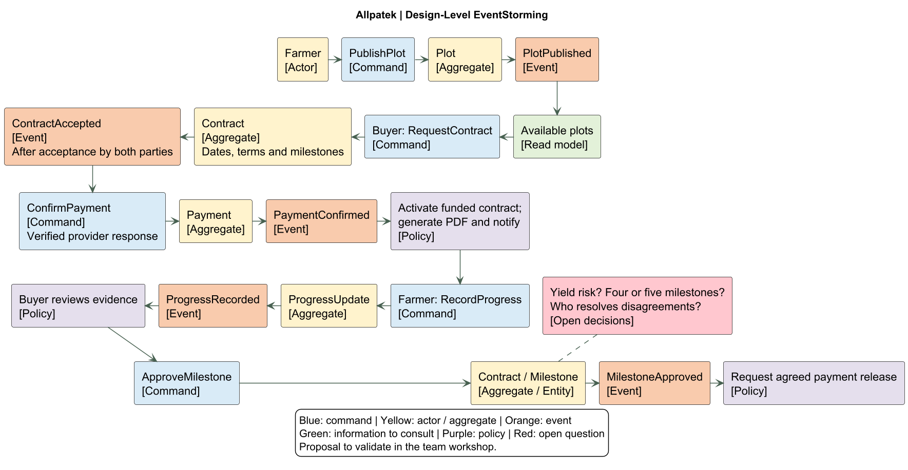

<div align="center">
    <br>
</div>
<h3 align="center"> Universidad Peruana de Ciencias Aplicadas </h3>

<h3 align="center">Carrera de  Ingeniería de Software </h3>

<h3 align="center">1ASI0729 </h3>
<h3 align="center">Desarrollo de Aplicaciones Open Source</h3>
<h3 align="center"> NRC </h3>
<h3 align="center"> 7747 </h3>

<h3 align="center">Informe del Trabajo Final</h3>


<h3 align="center"> Docente</h3>
<h3 align="center">Bautista Ubillús, Efraín Ricardo </h3>


<h3 align="center"> Equipo </h3>
<h3 align="center">TerraNova</h3>

<h3 align="center"> Proyecto</h3>
<h3 align="center"> TerraNova Platform </h3>

<h3 align="center"> Integrantes </h3>

<div align="center">

| Code | Member |
| :---: | :--- |
| u20241f246 | Atauje Barreto, Alexander Sebastián |
| u202215188 | Egocheaga Suyo, Miguel Angel |
| u202116018 | Orellana Rodríguez, Mel Andree |
| U20231h171 | Vera Solsol, Nayely Macarena |
| u202318001 |Raymundo Villarroel, Abigail Nadhim |

</div>

<h3 align="center">Periodo 202620</h3>
<h3 align="center">Agosto, 2026</h3>


<div style="page-break-after: always;"></div>

## Registro de Versiones del Informe

<div align="center">

| Versión |    Fecha    |                Autor                |                                                                                                Descripción de modificación                                                                                                |
|:-------:|:----------:|:-----------------------------------:|:-------------------------------------------------------------------------------------------------------------------------------------------------------------------------------------------------------------------------:|
| [Versión] | [DD-MM-AAAA] | [Apellidos, Nombres] | [Descripción del cambio o aporte] |

</div>

## Project Report Collaboration Insights

<div align="center">

| Integrante | Tareas Asignadas |
|---|---|
| [Nombre Completo 1] | [Lista de tareas realizadas] |
| [Nombre Completo 2] | [Lista de tareas realizadas] |
| [Nombre Completo 3] | [Lista de tareas realizadas] |
| [Nombre Completo 4] | [Lista de tareas realizadas] |
| [Nombre Completo 5] | [Lista de tareas realizadas] |

</div>


El proceso de colaboración en el informe se realizó mediante commits constantes al repositorio de la organización.


## Tabla de Contenidos

* [Capítulo I: Introducción](#capítulo-i-introducción)
  * [1.1. Startup Profile](#11-startup-profile)
    * [1.1.1. Descripción de la Startup](#111-descripción-de-la-startup)
    * [1.1.2. Perfiles de integrantes del equipo](#112-perfiles-de-integrantes-del-equipo)
  * [1.2. Solution Profile](#12-solution-profile)
    * [1.2.1. Antecedentes y problemática](#121-antecedentes-y-problemática)
    * [1.2.2. Lean UX Process](#122-lean-ux-process)
      * [1.2.2.1. Lean UX Problem Statements](#1221-lean-ux-problem-statements)
      * [1.2.2.2. Lean UX Assumptions](#1222-lean-ux-assumptions)
      * [1.2.2.3. Lean UX Hypothesis Statements](#1223-lean-ux-hypothesis-statements)
      * [1.2.2.4. Lean UX Canvas](#1224-lean-ux-canvas)
  * [1.3. Segmentos objetivo](#13-segmentos-objetivo)
* [Capítulo II: Requirements Elicitation & Analysis](#capítulo-ii-requirements-elicitation--analysis)
  * [2.1. Competidores](#21-competidores)
    * [2.1.1. Análisis competitivo](#211-análisis-competitivo)
    * [2.1.2. Estrategias y tácticas frente a competidores](#212-estrategias-y-tácticas-frente-a-competidores)
  * [2.2. Entrevistas](#22-entrevistas)
    * [2.2.1. Diseño de entrevistas](#221-diseño-de-entrevistas)
    * [2.2.2. Registro de entrevistas](#222-registro-de-entrevistas)
    * [2.2.3. Análisis de entrevistas](#223-análisis-de-entrevistas)
  * [2.3. Needfinding](#23-needfinding)
    * [2.3.1. User Personas](#231-user-personas)
    * [2.3.2. User Task Matrix](#232-user-task-matrix)
    * [2.3.3. User Journey Mapping](#233-user-journey-mapping)
    * [2.3.4. Empathy Mapping](#234-empathy-mapping)
  * [2.4. Big Picture Event Storming](#24-big-picture-event-storming)
  * [2.5. Ubiquitous Language](#25-ubiquitous-language)
* [Capítulo III: Requirements Specification](#capítulo-iii-requirements-specification)
  * [3.1. User Stories](#31-user-stories)
  * [3.2. Impact Mapping](#32-impact-mapping)
  * [3.3. Product Backlog](#33-product-backlog)
* [Capítulo IV: Product Design](#capítulo-iv-product-design)
  * [4.1. Style Guidelines](#41-style-guidelines)
    * [4.1.1. General Style Guidelines](#411-general-style-guidelines)
    * [4.1.2. Web Style Guidelines](#412-web-style-guidelines)
  * [4.2. Information Architecture](#42-information-architecture)
    * [4.2.1. Organization Systems](#421-organization-systems)
    * [4.2.2. Labeling Systems](#422-labeling-systems)
    * [4.2.3. SEO Tags and Meta Tags](#423-seo-tags-and-meta-tags)
    * [4.2.4. Searching Systems](#424-searching-systems)
    * [4.2.5. Navigation Systems](#425-navigation-systems)
  * [4.3. Landing Page UI Design](#43-landing-page-ui-design)
    * [4.3.1. Landing Page Wireframe](#431-landing-page-wireframe)
    * [4.3.2. Landing Page Mock-up](#432-landing-page-mock-up)
  * [4.4. Web Applications UX/UI Design](#44-web-applications-uxui-design)
    * [4.4.1. Web Applications Wireframes](#441-web-applications-wireframes)
    * [4.4.2. Web Applications Wireflow Diagrams](#442-web-applications-wireflow-diagrams)
    * [4.4.3. Web Applications Mock-ups](#443-web-applications-mock-ups)
    * [4.4.4. Web Applications User Flow Diagrams](#444-web-applications-user-flow-diagrams)
  * [4.5. Web Applications Prototyping](#45-web-applications-prototyping)
  * [4.6. Domain-Driven Software Architecture](#46-domain-driven-software-architecture)
    * [4.6.1. Design-Level Event Storming](#461-design-level-event-storming)
    * [4.6.2. Software Architecture Context Diagram](#462-software-architecture-context-diagram)
    * [4.6.3. Software Architecture Container Diagrams](#463-software-architecture-container-diagrams)
    * [4.6.4. Software Architecture Components Diagrams](#464-software-architecture-components-diagrams)
  * [4.7. Software Object-Oriented Design](#47-software-object-oriented-design)
    * [4.7.1. Class Diagrams](#471-class-diagrams)
  * [4.8. Database Design](#48-database-design)
    * [4.8.1. Database Diagrams](#481-database-diagrams)
* [Capítulo V: Product Implementation, Validation & Deployment](#capítulo-v-product-implementation-validation--deployment)
  * [5.1. Software Configuration Management](#51-software-configuration-management)
    * [5.1.1. Software Development Environment Configuration](#511-software-development-environment-configuration)
    * [5.1.2. Source Code Management](#512-source-code-management)
    * [5.1.3. Source Code Style Guide & Conventions](#513-source-code-style-guide--conventions)
    * [5.1.4. Software Deployment Configuration](#514-software-deployment-configuration)
  * [5.2. Landing Page, Services & Applications Implementation](#52-landing-page-services--applications-implementation)
    * [5.2.1. Sprint 1](#521-sprint-1)
      * [5.2.1.1. Sprint Planning 1](#5211-sprint-planning-1)
      * [5.2.1.2. Aspect Leaders and Collaborators](#5212-aspect-leaders-and-collaborators)
      * [5.2.1.3. Sprint Backlog 1](#5213-sprint-backlog-1)
      * [5.2.1.4. Development Evidence for Sprint Review](#5214-development-evidence-for-sprint-review)
      * [5.2.1.5. Execution Evidence for Sprint Review](#5215-execution-evidence-for-sprint-review)
      * [5.2.1.6. Services Documentation Evidence for Sprint Review](#5216-services-documentation-evidence-for-sprint-review)
      * [5.2.1.7. Software Deployment Evidence for Sprint Review](#5217-software-deployment-evidence-for-sprint-review)
      * [5.2.1.8. Team Collaboration Insights during Sprint](#5218-team-collaboration-insights-during-sprint)
    * [5.2.2. Sprint 2](#522-sprint-2)
      * [5.2.2.1. Sprint Planning 2](#5221-sprint-planning-2)
      * [5.2.2.2. Aspect Leaders and Collaborators](#5222-aspect-leaders-and-collaborators)
      * [5.2.2.3. Sprint Backlog 2](#5223-sprint-backlog-2)
      * [5.2.2.4. Development Evidence for Sprint Review](#5224-development-evidence-for-sprint-review)
      * [5.2.2.5. Execution Evidence for Sprint Review](#5225-execution-evidence-for-sprint-review)
      * [5.2.2.6. Services Documentation Evidence for Sprint Review](#5226-services-documentation-evidence-for-sprint-review)
      * [5.2.2.7. Software Deployment Evidence for Sprint Review](#5227-software-deployment-evidence-for-sprint-review)
      * [5.2.2.8. Team Collaboration Insights during Sprint](#5228-team-collaboration-insights-during-sprint)
    * [5.2.3. Sprint 3](#523-sprint-3)
      * [5.2.3.1. Sprint Planning 3](#5231-sprint-planning-3)
      * [5.2.3.2. Aspect Leaders and Collaborators](#5232-aspect-leaders-and-collaborators)
      * [5.2.3.3. Sprint Backlog 3](#5233-sprint-backlog-3)
      * [5.2.3.4. Development Evidence for Sprint Review](#5234-development-evidence-for-sprint-review)
      * [5.2.3.5. Execution Evidence for Sprint Review](#5235-execution-evidence-for-sprint-review)
      * [5.2.3.6. Services Documentation Evidence for Sprint Review](#5236-services-documentation-evidence-for-sprint-review)
      * [5.2.3.7. Software Deployment Evidence for Sprint Review](#5237-software-deployment-evidence-for-sprint-review)
      * [5.2.3.8. Team Collaboration Insights during Sprint](#5238-team-collaboration-insights-during-sprint)
    * [5.2.4. Sprint 4](#524-sprint-4)
      * [5.2.4.1. Sprint Planning 4](#5241-sprint-planning-4)
      * [5.2.4.2. Aspect Leaders and Collaborators](#5242-aspect-leaders-and-collaborators)
      * [5.2.4.3. Sprint Backlog 4](#5243-sprint-backlog-4)
      * [5.2.4.4. Development Evidence for Sprint Review](#5244-development-evidence-for-sprint-review)
      * [5.2.4.5. Execution Evidence for Sprint Review](#5245-execution-evidence-for-sprint-review)
      * [5.2.4.6. Services Documentation Evidence for Sprint Review](#5246-services-documentation-evidence-for-sprint-review)
      * [5.2.4.7. Software Deployment Evidence for Sprint Review](#5247-software-deployment-evidence-for-sprint-review)
      * [5.2.4.8. Team Collaboration Insights during Sprint](#5248-team-collaboration-insights-during-sprint)
  * [5.3. Validation Interviews](#53-validation-interviews)
    * [5.3.1. Diseño de Entrevistas](#531-diseño-de-entrevistas)
    * [5.3.2. Registro de Entrevistas](#532-registro-de-entrevistas)
    * [5.3.3. Evaluaciones según heurísticas](#533-evaluaciones-según-heurísticas)
  * [5.4. Video About-the-Product](#54-video-about-the-product)
* [Conclusiones y Recomendaciones](#conclusiones-y-recomendaciones)
* [Video App Validation](#video-app-validation)
* [Video About the product](#video-about-the-product)
* [Video About the team](#video-about-the-team)
* [Glosario](#glosario)
* [Bibliografía](#bibliografía)
* [Anexos](#anexos)


# Student Outcome

<div align="center">
  <table style="width:100%; border-collapse: collapse; font-family: Arial, sans-serif; font-size: 14px;">
    <thead>
      <tr style="background-color: #f2f2f2; text-align: center;">
        <th style="border: 1px solid #dddddd; padding: 12px; width: 25%;">Criterio específico</th>
        <th style="border: 1px solid #dddddd; padding: 12px; width: 45%;">Acciones realizadas</th>
        <th style="border: 1px solid #dddddd; padding: 12px; width: 30%;">Conclusiones</th>
      </tr>
    </thead>
    <tbody>
      <tr>
        <td style="border: 1px solid #dddddd; padding: 10px; font-weight: bold; vertical-align: top;">
          Trabaja en equipo para proporcionar liderazgo en forma conjunta.
        </td>
        <td style="border: 1px solid #dddddd; padding: 10px; vertical-align: top;">
          <ul>
            <li><b>[Entrega] - [Nombre del Integrante]:</b> [Descripción de la acción realizada]</li>
          </ul>
        </td>
        <td style="border: 1px solid #dddddd; padding: 10px; vertical-align: top;">
          [Conclusión sobre el criterio]
        </td>
      </tr>
      <tr>
        <td style="border: 1px solid #dddddd; padding: 10px; font-weight: bold; vertical-align: top;">
          Crea un entorno colaborativo e inclusivo, establece metas, planifica tareas y cumple objetivos.
        </td>
        <td style="border: 1px solid #dddddd; padding: 10px; vertical-align: top;">
          <ul>
            <li><b>[Entrega] - [Nombre del Integrante]:</b> [Descripción de la acción realizada]</li>
          </ul>
        </td>
        <td style="border: 1px solid #dddddd; padding: 10px; vertical-align: top;">
          [Conclusión sobre el criterio]
        </td>
      </tr>
    </tbody>
  </table>
</div>


# Capítulo I: Introducción

## 1.1. Startup Profile
### 1.1.1. Descripción de la Startup
### 1.1.2. Perfiles de integrantes del equipo

## 1.2. Solution Profile
### 1.2.1. Antecedentes y problemática
### 1.2.2. Lean UX Process
#### 1.2.2.1. Lean UX Problem Statements
#### 1.2.2.2. Lean UX Assumptions
#### 1.2.2.3. Lean UX Hypothesis Statements
#### 1.2.2.4. Lean UX Canvas

## 1.3. Segmentos objetivo

# Capítulo II: Requirements Elicitation & Analysis

## 2.1. Competidores
### 2.1.1. Análisis competitivo
### 2.1.2. Estrategias y tácticas frente a competidores

## 2.2. Entrevistas
### 2.2.1. Diseño de entrevistas
### 2.2.2. Registro de entrevistas
### 2.2.3. Análisis de entrevistas

## 2.3. Needfinding
### 2.3.1. User Personas
### 2.3.2. User Task Matrix
### 2.3.3. User Journey Mapping
### 2.3.4. Empathy Mapping

## 2.4. Big Picture Event Storming

## 2.5. Ubiquitous Language

# Capítulo III: Requirements Specification

## 3.1. User Stories

## 3.2. Impact Mapping

## 3.3. Product Backlog

# Capítulo IV: Product Design

## 4.1. Style Guidelines
### 4.1.1. General Style Guidelines
### 4.1.2. Web Style Guidelines

## 4.2. Information Architecture
### 4.2.1. Organization Systems
### 4.2.2. Labeling Systems
### 4.2.3. SEO Tags and Meta Tags
### 4.2.4. Searching Systems
### 4.2.5. Navigation Systems

## 4.3. Landing Page UI Design
### 4.3.1. Landing Page Wireframe
### 4.3.2. Landing Page Mock-up

## 4.4. Web Applications UX/UI Design
### 4.4.1. Web Applications Wireframes
### 4.4.2. Web Applications Wireflow Diagrams
### 4.4.3. Web Applications Mock-ups
### 4.4.4. Web Applications User Flow Diagrams

## 4.5. Web Applications Prototyping

## 4.6. Domain-Driven Software Architecture

Allpatek permite que un comprador contrate una parcela y el trabajo de un agricultor durante una temporada. La arquitectura organiza las funciones necesarias para publicar parcelas, establecer contratos, registrar pagos y consultar el avance del cultivo.

Se utiliza **Domain-Driven Design (DDD)** para agrupar el sistema según sus responsabilidades de negocio. Cada grupo se denomina **bounded context**: un área con datos y reglas propios. Para este proyecto se proponen cinco áreas:

| Bounded context | Responsabilidad | Ejemplo en Allpatek |
|---|---|---|
| Users and Profiles | Usuarios, perfiles y calificaciones. | El comprador consulta la experiencia previa de un agricultor. |
| Land Management | Parcelas, fotografías y disponibilidad. | El agricultor publica una parcela para una temporada. |
| Season Contracting | Contratos, aceptación de condiciones e hitos. | Ambas partes acuerdan fechas, costos y etapas del trabajo. |
| Payments and Plans | Pagos y planes de suscripción propuestos. | Se consulta un abono o el pago correspondiente a un hito. |
| Crop Monitoring | Avances, evidencias y alertas climáticas. | El agricultor registra la siembra y el comprador recibe una actualización. |

Estos módulos se implementarán dentro de una misma API Spring Boot. Se comunicarán mediante sus servicios, manteniendo la responsabilidad de cada uno. Por ejemplo, Contratos consulta la disponibilidad de Parcelas y el estado de Pagos para determinar si puede activar un acuerdo. n8n se utiliza como herramienta de automatización para documentos y mensajes.

**Base de la propuesta.** Se utiliza el nombre Allpatek empleado en los capítulos I, II y IV; la portada aún debe unificarse con ese nombre. Se consideran los roles agricultor y comprador, sin excluir a familias ni negocios. Los planes de suscripción proceden del capítulo IV y las calificaciones, WhatsApp y el uso con conectividad limitada proceden del capítulo I. Son funciones propuestas, no capacidades ya implementadas.

Los términos de cada contrato deben aclarar qué producción recibirá el comprador y qué ocurre ante una pérdida de cosecha. La arquitectura permite registrar estas condiciones, pero no presupone una cantidad garantizada ni la eliminación del riesgo agrícola. Tampoco se consideran definitivos los precios de los planes, el número de hitos o el proveedor de pagos.

### 4.6.1. Design-Level Event Storming

El **Design-Level EventStorming** permite recorrer lo que sucede en el negocio y relacionarlo con las funciones del sistema. Se identifican las acciones, sus resultados y las reglas necesarias. Esta propuesta deberá vincularse con el proceso general del capítulo II cuando el equipo lo complete.

| Elemento | Qué significa | Ejemplo |
|---|---|---|
| Actor | Persona o servicio que participa. | Agricultor, comprador o servicio de pagos. |
| Command | Acción que se solicita. | PublishPlot: publicar una parcela. |
| Event | Hecho que ya ocurrió. | PaymentConfirmed: pago confirmado. |
| Aggregate | Objeto principal que controla un grupo de datos y reglas. | Contract controla las condiciones y los hitos del acuerdo. |
| Policy | Regla que indica cuándo debe ocurrir otra acción. | Después de confirmar el pago y las aceptaciones, activar el contrato. |
| Query / Read model | Información que se consulta sin modificarla. | Parcelas disponibles o estado de un contrato. |

El flujo principal propuesto es: el agricultor publica una parcela; el comprador solicita la contratación; ambas partes aceptan las condiciones; se verifica el pago; se activa el contrato y se envía el PDF. Durante la temporada, el agricultor registra avances y el comprador revisa los hitos acordados.



*Figura 4.6.1. Propuesta de EventStorming para el flujo principal.* [Diagrama editable](assets/chapter-04/architecture/01-eventstorming.puml).

Los agregados principales son User, Plot, Contract, Payment y ProgressUpdate. Las consultas iniciales son SearchPlots, GetContract, GetPayments y GetProgress. Los contratos relacionan el catálogo con pagos y seguimiento, manteniendo el acuerdo como referencia común.

Las reglas principales son:

- Una parcela no puede asignarse a dos contratos activos con fechas superpuestas. La API revisa la disponibilidad también al confirmar la contratación.
- El contrato se activa cuando ambas partes aceptaron las mismas condiciones y se verificó el pago correspondiente. Si se cambian las condiciones antes de la activación, deben aceptarse nuevamente.
- El agricultor registra evidencias; el comprador revisa los criterios del hito. Un rechazo debe incluir una observación que permita corregirlo.
- La aprobación de un hito y la confirmación de su desembolso son hechos diferentes. El estado del pago se actualiza según el resultado del proveedor.
- Los criterios de pago por labor deben distinguir el trabajo realizado del rendimiento de la cosecha, de acuerdo con el modelo del capítulo I.
- Una falla de correo no anula un contrato ni debe duplicar un pago.

**Validación colaborativa pendiente:** este diagrama es la propuesta para la sesión del equipo. En ella se revisará el recorrido, se ajustarán los límites de cada área y se resolverán las preguntas abiertas. Después se incorporarán fecha, participantes, enlace y capturas reales del tablero. No se afirma que esa reunión ya haya ocurrido. Los identificadores definitivos de historias y la relación con el Big Picture EventStorming se añadirán cuando esos artefactos estén disponibles.

### 4.6.2. Software Architecture Context Diagram
### 4.6.3. Software Architecture Container Diagrams
### 4.6.4. Software Architecture Components Diagrams

## 4.7. Software Object-Oriented Design
### 4.7.1. Class Diagrams

## 4.8. Database Design
### 4.8.1. Database Diagrams

# Capítulo V: Product Implementation, Validation & Deployment

## 5.1. Software Configuration Management


La gestión de la configuración del software en el proyecto garantiza el control de cambios, asegurando la integridad, trazabilidad y consistencia del código fuente. Asimismo, facilita la coordinación del trabajo en equipo entre las capas de frontend y backend mediante el uso de buenas prácticas de ingeniería de software y el control de versiones alineado a los principios de Domain-Driven Design (DDD). Este enfoque permite estructurar el desarrollo separando responsabilidades según el Lenguaje Ubicuo, los Contextos Delimitados y los modelos de dominio.

### 5.1.1. Software Development Environment Configuration

Para respaldar el ciclo de vida de la aplicación, el equipo seleccionó herramientas y entornos que optimizan la comunicación, diseño, desarrollo, despliegue y documentación. Estas soluciones garantizan un flujo de trabajo ágil y escalable sobre una arquitectura desacoplada basada en Angular y Java (Spring Boot) bajo la metodología DDD.
Las herramientas se organizan según las principales actividades del ciclo de vida del software:

### Project Management y Requirements Management

* **Trello:** Es la herramienta principal utilizada para la gestión visual del proyecto mediante tableros Kanban. Permite organizar tareas en listas y tarjetas (Backlog, En Proceso, Revisión, Finalizado), ordenando las historias de usuario y tareas de desarrollo por *Bounded Contexts* (Contextos Delimitados) del dominio, facilitando el seguimiento del avance del desarrollo entre el frontend y backend.
* **Microsoft OneDrive:** Actúa como el almacenamiento centralizado en la nube para alojar y resguardar archivos pesados, evidencias visuales del desarrollo y los videos demostrativos o explicativos del proyecto. Permite generar enlaces de acceso directo que se vinculan en la documentación técnica para su revisión.

### Product UX/UI Design

* **Figma:** Es la herramienta principal para el diseño de la interfaz de usuario (UI) y la experiencia de usuario (UX). Se emplea para construir wireframes, prototipos interactivos y el sistema de diseño (*Design System*) alineado a los flujos y casos de uso definidos por el dominio en Angular.
* **Miro:** Se utiliza como pizarra virtual colaborativa para facilitar dinámicas de *Event Storming*, mapeo de contextos delimitados (*Context Mapping*), modelado de flujos de navegación y diagramación conceptual del dominio previa a la implementación.

### Software Development

* **Visual Studio Code:** Es el editor de código utilizado para el desarrollo de la Landing Page del proyecto mediante HTML, CSS y JavaScript. Asimismo, se utiliza como entorno para la redacción estructurada de la documentación técnica en formato **Markdown**, ofreciendo soporte para extensiones de previsualización sintáctica.
* **IntelliJ IDEA:** Es el entorno de desarrollo integrado (IDE) utilizado de manera exclusiva para el desarrollo del Backend en Java (Spring Boot) siguiendo los patrones tácticos de DDD (Entidades, Agregados, Objetos de Valor, Repositorios, Servicios de Dominio y Casos de Uso). Proporciona herramientas avanzadas para la gestión de dependencias con Maven/Gradle, refactorización de código, depuración de servicios RESTful y ejecución de pruebas unitarias y de integración.
* **Git:** Es el sistema de control de versiones distribuido utilizado para gestionar el código fuente del proyecto. Permite registrar el historial de cambios, administrar ramas de desarrollo (*branching*) y garantizar la consistencia del código.
* **GitHub:** Es la plataforma en la nube utilizada para alojar los repositorios del proyecto (separando frontend y backend o por contextos delimitados). Facilita la revisión de código (*Pull Requests*), el control de versiones de la documentación redactada en Markdown y la integración del trabajo colaborativo.
* **Node.js & npm / Angular CLI:** Entorno de ejecución y gestor de paquetes utilizados para administrar las dependencias del frontend de la aplicación web en Angular, compilar los componentes del sistema y ejecutar el servidor de desarrollo local.
* **JDK (Java Development Kit):** Entorno de desarrollo para la compilación y ejecución de la lógica de negocio orientada al dominio y APIs del backend basadas en Java.

### Software Deployment

* **GitHub Pages / Vercel / Netlify:** Servicios utilizados para el despliegue y alojamiento de la Landing Page y la aplicación frontend construida en Angular, garantizando un acceso rápido y disponibilidad pública.
* **Railway / Render:** Plataformas PaaS en la nube utilizadas para el despliegue del entorno backend en Java y la base de datos relacional, permitiendo la exposición de las APIs REST a través de endpoints seguros en producción.

### Software Documentation

* **Markdown:** Es el lenguaje de marcado ligero utilizado como estándar para la redacción colaborativa y estructurada de toda la documentación técnica del proyecto, incluyendo la especificación del Lenguaje Ubicuo (*Ubiquitous Language*), informes técnicos, guías del sistema y entregables académicos en el repositorio.
* **Swagger / Open API:** Herramienta integrada en el backend en Java para la documentación y prueba interactiva de las APIs RESTful expuestas por cada *Bounded Context*. Permite visualizar los endpoints, esquemas de DTOs y probar los servicios directamente desde una interfaz web.
* **Postman:** Utilizado para la realización de pruebas de integración y validación manual de los servicios REST antes de ser consumidos por la aplicación en Angular.


### 5.1.2. Source Code Management


Para llevar un control claro de los cambios y trabajar en equipo de forma ordenada, utilizamos **Git** para el control de versiones y **GitHub** como plataforma centralizada donde alojamos el código. 

Organizamos el proyecto en repositorios independientes según cada producto digital:

* **Landing Page (HTML, CSS y JS):** [Link del Repositorio](https://github.com/TuOrganizacion/tu-proyecto-landing-page)
* **Web Services (Java / Spring Boot):** [Link del Repositorio](https://github.com/TuOrganizacion/tu-proyecto-landing-page)
* **Frontend Web Application (Angular):** [Link del Repositorio](https://github.com/TuOrganizacion/tu-proyecto-landing-page)


#### Estrategia de Trabajo: GitFlow

Adoptamos el flujo de trabajo **GitFlow** para organizar el desarrollo en diferentes ramas según el propósito de cada cambio:

1. **Ramas Principales**
   * `main`: Mantiene únicamente el código estable y probado que está listo para producción.
   * `develop`: Funciona como la rama de integración continua donde se consolidan las funcionalidades listas para la próxima entrega.

2. **Ramas Temporales**
   * **Feature Branches (`feature/*`):** Las creamos a partir de `develop` para construir nuevas funcionalidades o historias de usuario asociadas a un contexto delimitado (*Bounded Context*).
     * **Convención:** `feature/<bounded-context>-<descripcion-corta>`
     * *Ejemplo:* `feature/iam-user-authentication`
   * **Release Branches (`release/*`):** Se generan desde `develop` cuando tenemos un grupo de funcionalidades listas para publicar. Las usamos para realizar pruebas finales y ajustes menores antes de pasar a producción.
     * **Convención:** `release/vX.Y.Z`
     * *Ejemplo:* `release/v1.0.0`
   * **Hotfix Branches (`hotfix/*`):** Nacen directamente de `main` para corregir errores urgentes detectados en producción. Una vez resuelto el problema, la rama se integra tanto en `main` como en `develop`.
     * **Convención:** `hotfix/vX.Y.Z-<descripcion-corta>`
     * *Ejemplo:* `hotfix/v1.0.1-fix-login-error`


#### Versionado Semántico (Semantic Versioning 2.0.0)

Para etiquetar los lanzamientos (*Releases*) en la rama `main`, seguimos la regla `vX.Y.Z` (`vMAJOR.MINOR.PATCH`):

* **MAJOR (X):** Se incrementa cuando introducimos cambios grandes que rompen la compatibilidad con versiones anteriores.
* **MINOR (Y):** Se incrementa al añadir nuevas funcionalidades de manera retrocompatible.
* **PATCH (Z):** Se incrementa cuando aplicamos correcciones puntuales de errores (*bug fixes*).


#### Estándar de Commits (Conventional Commits)

Escribimos los mensajes de commit de forma clara y uniforme para que cualquier miembro del equipo entienda qué se cambió de un vistazo:

`<tipo>(<alcance>): <descripción corta>`

* **Tipos comunes:**
  * `feat`: Nueva funcionalidad.
  * `fix`: Corrección de un error.
  * `docs`: Cambios en la documentación.
  * `style`: Ajustes estéticos o de formato sin cambios en la lógica (CSS, espacios, comas).
  * `refactor`: Mejoras al código que no cambian su comportamiento ni arreglan errores.
  * `test`: Creación o modificación de pruebas.
  * `chore`: Mantenimiento de configuraciones, dependencias o herramientas.

* **Ejemplos prácticos:**
  * `feat(iam): add user registration service in Java backend`
  * `fix(landing): resolve responsive navigation bar overflow`
  * `refactor(shared): optimize Angular HTTP interceptor handling`
  * `test(iam): add unit tests for authentication aggregate`
  * `docs(scm): update GitFlow branching strategy documentation`


### 5.1.3. Source Code Style Guide & Conventions

Para garantizar la mantenibilidad, legibilidad y consistencia del código a lo largo del proyecto, el equipo adopta estándares de desarrollo y guías de estilo reconocidas por la industria para cada uno de los lenguajes utilizados. Toda la nomenclatura en el código fuente (nombres de variables, clases, métodos, funciones, interfaces, componentes, archivos y comentarios) se escribe exclusivamente en **inglés**.


#### 1. General Naming Conventions

Independientemente del lenguaje de programación, se aplican las siguientes reglas generales para la nomenclatura de elementos:

* **CamelCase (`camelCase`):** Utilizado para variables, atributos, parámetros de métodos y nombres de funciones en JavaScript, TypeScript y Java.
* **PascalCase (`PascalCase`):** Utilizado para nombres de clases, interfaces, enums, componentes de Angular, anotaciones y tipos personalizados.
* **Kebab-Case (`kebab-case`):** Utilizado para nombres de archivos, carpetas, selectores de componentes de Angular, clases CSS y atributos personalizados de HTML.
* **Screaming Snake Case (`UPPER_SNAKE_CASE`):** Utilizado para constantes y valores inmutables en Java y TypeScript.


#### 2. HTML & CSS Style Guide

Se adoptan los principios de la **Google HTML/CSS Style Guide** y la **W3C HTML Style Guide**:

* **Sintaxis y Estructura HTML:**
  * Uso obligatorio de HTML5 semántico (`<header>`, `<nav>`, `<main>`, `<section>`, `<footer>`).
  * Nombres de etiquetas, atributos y valores en minúsculas.
  * Uso de comillas dobles (`"..."`) en todos los valores de los atributos.
  * Indentación de 2 espacios sin tabulaciones.

* **Estilos CSS:**
  * Adoptar la metodología **BEM (Block Element Modifier)** para la nomenclatura de clases (`block__element--modifier`).
  * Evitar la regla `!important` y limitar el anidamiento excesivo en preprocesadores.
  * Agrupar propiedades CSS en orden lógico (Posicionamiento, Box Model, Tipografía, Visuales).


#### 3. JavaScript & TypeScript Style Guide (Angular)

Se aplican la **Google TypeScript Style Guide** y la guía oficial **Angular Coding Style Guide**:

* **Naming Conventions:**
  * **Interfaces:** Denominadas en `PascalCase` sin prefijo `I` (ejemplo: `User`, no `IUser`).
  * **Componentes y Servicios:** Sufijos explícitos en el nombre de la clase y archivo (ejemplo: `user-profile.component.ts` -> `UserProfileComponent`).
  * **Observables:** Sufijo `$` al final de la variable (ejemplo: `userData$`).

* **Buenas Prácticas:**
  * Declarar tipos explícitos para variables, parámetros de funciones y retornos, evitando el uso de `any`.
  * Mantener inmutabilidad mediante el uso preferente de `const` sobre `let` (evitando `var`).
  * Estructura de archivos modular basada en componentes y lógica orientada a *Bounded Contexts*.


#### 4. Java & Spring Boot Style Guide

Se adoptan la **Google Java Style Guide** y los estándares recomendados en **Spring Boot Features**:

* **Naming Conventions:**
  * **Clases:** `PascalCase` representando sustantivos en inglés (ejemplo: `UserRepository`, `AuthenticationService`).
  * **Métodos:** `camelCase` representando verbos u acciones (ejemplo: `findUserById`, `calculateTotalAmount`).
  * **Paquetes:** Nombres en minúsculas en singular (ejemplo: `com.company.project.domain.model`).

* **Estructura Arquitectónica con DDD:**
  * **Layered Packages:** Organización por capas respetando DDD (`domain`, `application`, `infrastructure`, `interfaces`).
  * **Entidades y Agregados:** Modelado de objetos de dominio encapsulados sin exponer la lógica interna directamente mediante setters indiscriminados.
  * **Spring Annotations:** Uso explícito de estereotipos de Spring (`@RestController`, `@Service`, `@Repository`) y constructor injection mediante `final` fields o Lombok (`@RequiredArgsConstructor`).


### 5.1.4. Software Deployment Configuration

En esta sección el equipo especifica la configuración del despliegue de la solución, incluyendo los procedimientos necesarios para que, a partir de los repositorios de código fuente, se pueda realizar la publicación exitosa de los productos digitales que componen el sistema: Landing Page, Frontend Web Application y Web Services (Backend) junto con su Base de Datos.

La solución se encuentra estructurada bajo una arquitectura desacoplada, donde cada componente es desplegado de manera independiente utilizando plataformas especializadas en la nube, lo que permite mejorar la escalabilidad, disponibilidad y mantenimiento del sistema.

#### Componentes de Despliegue

* **Landing Page:** desplegada en **GitHub Pages**.
* **Frontend Web Application (Angular):** desplegada en **Netlify**.
* **Backend Web Services (Java / Spring Boot) + Base de Datos (PostgreSQL/MySQL):** desplegados en **Railway**.


#### 1. Control de Versiones

El proyecto utiliza **Git** como sistema de control de versiones y **GitHub** como plataforma para la gestión de repositorios independientes por cada producto digital.

**Estrategia de ramas (GitFlow):**
* `main`: contiene la versión estable lista para producción.
* `develop`: integra las funcionalidades en desarrollo.
* `feature/*`: ramas destinadas al desarrollo de nuevas funcionalidades por contexto delimitado.
* `hotfix/*`: ramas destinadas a correcciones críticas en producción.


#### 2. Despliegue de Landing Page (GitHub Pages)

La Landing Page es una solución web estática desarrollada con HTML, CSS y JavaScript.

**Pasos de despliegue:**

1. **Inicializar y preparar el repositorio**
    ```bash
    git init
    git add .
    git commit -m "feat(landing): initial release for deployment"
    ```
2. **Conectar el repositorio con GitHub**
    ```bash
    git branch -M main
    git remote add origin [https://github.com/TuOrganizacion/landing-page.git](https://github.com/TuOrganizacion/landing-page.git)
    git push -u origin main
    ```
3. **Configurar GitHub Pages**
    * Ir a **Settings** del repositorio en GitHub.
    * Acceder a la sección **Pages**.
    * Seleccionar:
        * **Source:** Deploy from a branch
        * **Branch:** `main`
        * **Folder:** `/ (root)`
    * **Resultado público:** `https://TuOrganizacion.github.io/landing-page/`


#### 3. Despliegue del Frontend Web Application (Angular en Netlify)

El frontend está desarrollado con Angular y se despliega en Netlify mediante integración continua con GitHub.

**Pasos de despliegue:**

1. **Subir el código al repositorio de GitHub**
    ```bash
    git add .
    git commit -m "feat(frontend): prepare angular production build"
    git push origin main
    ```
2. **Configurar en Netlify**
    * Acceder a: [https://www.netlify.com/](https://www.netlify.com/)
    * Seleccionar **Add new site** → **Import an existing project**.
    * Conectar con la cuenta de GitHub.
    * Seleccionar el repositorio correspondiente al frontend en Angular.
3. **Configurar el build**
    * **Branch to deploy:** `main`
    * **Build command:** `npm run build` *(o `ng build --configuration production`)*
    * **Publish directory:** `dist/<nombre-proyecto>/browser`
4. **Configurar la regla de redirección (SPA Rewrites)**
    * Incluir un archivo `_redirects` en la carpeta de activos de Angular con la regla:
        ```text
        /*    /index.html   200
        ```
5. **Configurar variables de entorno**
    * En el panel de Netlify (*Site configuration* → *Environment variables*):
        * `NG_APP_API_URL` = `https://tu-backend.up.railway.app/api/v1`
6. **Despliegue**
    * Netlify ejecuta el proceso de build automáticamente tras cada push a `main`.
    * Se genera una URL pública accesible para los usuarios finales.


#### 4. Configuración de Base de Datos (PostgreSQL / MySQL en Railway)

Antes de iniciar el backend, se aprovisiona la base de datos relacional dentro de Railway.

**Pasos de configuración:**

1. **Crear servicio de base de datos**
    * En el dashboard de Railway, seleccionar **New Project** (o dentro del proyecto existente).
    * Elegir **Provision PostgreSQL** (o **Provision MySQL**).
2. **Obtener las credenciales generadas**
    * En la pestaña **Variables** o **Connect** del servicio de la base de datos, Railway genera automáticamente:
        * `PGHOST` / `MYSQLHOST`
        * `PGDATABASE` / `MYSQLDATABASE`
        * `PGUSER` / `MYSQLUSER`
        * `PGPASSWORD` / `MYSQLPASSWORD`
        * `PGPORT` / `MYSQLPORT`
        * `DATABASE_URL` / `MYSQL_URL`


#### 5. Despliegue de Web Services (Backend Java / Spring Boot en Railway)

El backend está desarrollado en Java utilizando Spring Boot y se despliega en Railway conectado a la base de datos provisionada.

**Pasos de despliegue:**

1. **Subir el backend a GitHub**
    ```bash
    git add .
    git commit -m "feat(backend): setup spring boot for deployment"
    git push origin main
    ```
2. **Crear servicio de backend en Railway**
    * Acceder al proyecto existente en Railway donde se encuentra la base de datos.
    * Seleccionar **New** → **GitHub Repo**.
    * Elegir el repositorio del backend en Java.
3. **Configurar variables de entorno**
    * En la pestaña **Variables** del servicio Java en Railway, configurar:
        * `SPRING_PROFILES_ACTIVE` = `prod`
        * `SPRING_DATASOURCE_URL` = `jdbc:postgresql://${{Postgres.PGHOST}}:${{Postgres.PGPORT}}/${{Postgres.PGDATABASE}}`
        * `SPRING_DATASOURCE_USERNAME` = `${{Postgres.PGUSER}}`
        * `SPRING_DATASOURCE_PASSWORD` = `${{Postgres.PGPASSWORD}}`
        * `PORT` = `${{PORT}}`
4. **Despliegue automático**
    * Railway detecta el proyecto Maven/Java a través del archivo `pom.xml` y ejecuta automáticamente:
        * **Compilation & Build:** `./mvnw clean package -DskipTests`
        * **Execution:** `java -jar target/*.jar`
    * **Resultado público:** `https://tu-backend.up.railway.app`


#### 6. Integración de Componentes

El sistema funciona de la siguiente manera:
1. La **Landing Page** actúa como punto de entrada inicial, promocionando la solución y redirigiendo al usuario al Frontend Web.
2. El **Frontend Web Application (Angular)** consume las APIs del backend mediante peticiones HTTP RESTful.
3. El **Backend Web Services (Java / Spring Boot)** procesa la lógica de negocio estructurada en capas bajo DDD y gestiona las transacciones.
4. La **Base de Datos (Railway)** almacena la información de forma persistente y segura.


#### 7. Consideraciones de Despliegue

* Uso obligatorio de variables de entorno para la configuración sensible (credenciales, llaves secretas, URLs de conexión).
* Configuración de **CORS (Cross-Origin Resource Sharing)** en Spring Boot para permitir únicamente la comunicación desde el dominio del frontend en Netlify.
* Separación clara entre entornos de desarrollo (`application-dev.yml`) y producción (`application-prod.yml`).
* Prohibición estricta de incluir credenciales o tokens dentro del código fuente subido a GitHub.
* Verificación periódica de la disponibilidad de endpoints mediante la documentación interactiva con Swagger/OpenAPI.
* Preservación del versionado semántico en las entregas para asegurar la compatibilidad entre el frontend y backend.


## 5.2. Landing Page, Services & Applications Implementation
### 5.2.1. Sprint 1

El Sprint 1 se enfocó en el desarrollo e implementación de la Landing Page de Allpatek, la cual constituye el primer punto de contacto con los usuarios potenciales. Su objetivo fue comunicar de manera clara la propuesta de valor del sistema centrada en la gestión de seguridad ciudadana. Durante este sprint, se integraron las secciones principales (presentación, funcionalidades, beneficios y llamadas a la acción) siguiendo los wireframes del Capítulo IV y priorizando estándares de usabilidad, diseño responsivo y consistencia visual.

#### 5.2.1.1. Sprint Planning 1

<table>
  <tr>
    <th colspan="5">Sprint #</th>
    <th colspan="9">Sprint 1</th>
  </tr>
  <tr>
    <td colspan="13">Sprint Planning Background</td>
  </tr>
  <tr>
    <td colspan="5">Date</td>
    <td colspan="8">07-09-2026</td>
  </tr>
  <tr>
    <td colspan="5">Time</td>
    <td colspan="8">4:00 PM</td>
  </tr>
  <tr>
    <td colspan="5">Location</td>
    <td colspan="8">Reunion por Meet</td>
  </tr>
  <tr>
    <td colspan="5">Prepared By</td>
    <td colspan="8"></td>
  </tr>
  <tr>
    <td colspan="5">Attendees (to planning meeting)</td>
    <td colspan="8"> Alexander Sebastián,  Miguel Angel,  Mel Andree, Nayely Macarena, Abigail Nadhim</td>
  </tr>
  <tr>
    <td colspan="5">Sprint n-1 Review Summary</td>
    <td colspan="8">No aplica - Este es el primer Sprint del proyecto</td>
  </tr>
  <tr>
    <td colspan="5">Sprint n-1 Retrospective Summary</td>
    <td colspan="8">No aplica - Este es el primer Sprint del proyecto</td>
  </tr>
  <tr>
    <td colspan="13">Sprint Goal & User Stories</td>
  </tr>
  <tr>
    <td colspan="5">Sprint 1 Goal</td>
    <td colspan="8"><strong>""</strong></td>
  </tr>
  <tr>
    <td colspan="5">Sprint 1 Velocity</td>
    <td colspan="8"></td>
  </tr>
  <tr>
    <td colspan="5">Sum of Story Points</td>
    <td colspan="8"> story points</td>
  </tr>
</table>

#### 5.2.1.2. Aspect Leaders and Collaborators


<div align="center">
  <table style="width:100%; border-collapse: collapse; font-family: Arial, sans-serif; font-size: 13px; text-align: center;">
    <thead>
      <tr style="background-color: #f2f2f2;">
        <th style="border: 1px solid #dddddd; padding: 10px;">Team Member (Last Name, First Name)</th>
        <th style="border: 1px solid #dddddd; padding: 10px;">GitHub Username</th>
        <th style="border: 1px solid #dddddd; padding: 10px;"></th>
        <th style="border: 1px solid #dddddd; padding: 10px;"></th>
        <th style="border: 1px solid #dddddd; padding: 10px;"></th>
        <th style="border: 1px solid #dddddd; padding: 10px;"></th>
      </tr>
    </thead>
    <tbody>
      <tr>
        <td style="border: 1px solid #dddddd; padding: 8px;">Atauje Barreto, Alexander Sebastián</td>
        <td style="border: 1px solid #dddddd; padding: 8px;"></td>
        <td style="border: 1px solid #dddddd; padding: 8px;"></td>
        <td style="border: 1px solid #dddddd; padding: 8px;"></td>
        <td style="border: 1px solid #dddddd; padding: 8px;"></td>
        <td style="border: 1px solid #dddddd; padding: 8px;"></td>
      </tr>
      <tr>
        <td style="border: 1px solid #dddddd; padding: 8px;">Egocheaga Suyo, Miguel Angel</td>
        <td style="border: 1px solid #dddddd; padding: 8px;"></td>
        <td style="border: 1px solid #dddddd; padding: 8px;"></td>
        <td style="border: 1px solid #dddddd; padding: 8px;"></td>
        <td style="border: 1px solid #dddddd; padding: 8px;"></td>
        <td style="border: 1px solid #dddddd; padding: 8px;"></td>
      </tr>
      <tr>
        <td style="border: 1px solid #dddddd; padding: 8px;">Orellana Rodríguez, Mel Andree</td>
        <td style="border: 1px solid #dddddd; padding: 8px;"></td>
        <td style="border: 1px solid #dddddd; padding: 8px;"></td>
        <td style="border: 1px solid #dddddd; padding: 8px;"></td>
        <td style="border: 1px solid #dddddd; padding: 8px;"></td>
        <td style="border: 1px solid #dddddd; padding: 8px;"></td>
      </tr>
      <tr>
        <td style="border: 1px solid #dddddd; padding: 8px;">Raymundo Villarroel, Abigail Nadhim</td>
        <td style="border: 1px solid #dddddd; padding: 8px;"></td>
        <td style="border: 1px solid #dddddd; padding: 8px;"></td>
        <td style="border: 1px solid #dddddd; padding: 8px;"></td>
        <td style="border: 1px solid #dddddd; padding: 8px;"></td>
        <td style="border: 1px solid #dddddd; padding: 8px;"></td>
      </tr>
      <tr>
        <td style="border: 1px solid #dddddd; padding: 8px;">Vera Solsol, Nayely Macarena</td>
        <td style="border: 1px solid #dddddd; padding: 8px;"></td>
        <td style="border: 1px solid #dddddd; padding: 8px;"></td>
        <td style="border: 1px solid #dddddd; padding: 8px;"></td>
        <td style="border: 1px solid #dddddd; padding: 8px;"></td>
        <td style="border: 1px solid #dddddd; padding: 8px;"></td>
      </tr>
    </tbody>
  </table>
</div>


#### 5.2.1.3. Sprint Backlog 1

| Sprint | User Story ID | User Story Title | Task ID | Task Title | Description | Estimation (Hours) | Assigned To | Status |
|--------|--------------|------------------|---------|------------|-------------|--------------------|-------------|--------|
| Sprint 1 | | | | | | | | |
| Sprint 1 | | | | | | | | |
| Sprint 1 | | | | | | | | |
| Sprint 1 | | | | | | | | |
| Sprint 1 | | | | | | | | |
| Sprint 1 | | | | | | | | |
| Sprint 1 | | | | | | | | |
| Sprint 1 | | | | | | | | |
| Sprint 1 | | | | | | | | |

###  Estados de las tareas
- **To-do**: Pendiente
- **InProcess**: En desarrollo
- **ToReview**: En revisión
- **Done**: Finalizado

#### 5.2.1.4. Development Evidence for Sprint Review

<table>
  <thead>
    <tr>
      <th>Repository</th>
      <th>Branch</th>
      <th>Commit Id</th>
      <th>Commit Message</th>
      <th>Commit Message Body</th>
      <th>Committed on (Date)</th>
    </tr>
  </thead>
  <tbody>
    <tr>
      <td></td>
      <td></td>
      <td></td>
      <td></td>
      <td></td>
      <td></td>
    </tr>
    <tr>
      <td></td>
      <td></td>
      <td></td>
      <td></td>
      <td></td>
      <td></td>
    </tr>
    <tr>
      <td></td>
      <td></td>
      <td></td>
      <td></td>
      <td></td>
      <td></td>
    </tr>
    <tr>
      <td></td>
      <td></td>
      <td></td>
      <td></td>
      <td></td>
      <td></td>
    </tr>
    <tr>
      <td></td>
      <td></td>
      <td></td>
      <td></td>
      <td></td>
      <td></td>
    </tr>
    <tr>
      <td></td>
      <td></td>
      <td></td>
      <td></td>
      <td></td>
      <td></td>
    </tr>
  </tbody>
</table>


#### 5.2.1.5. Execution Evidence for Sprint Review
#### 5.2.1.6. Services Documentation Evidence for Sprint Review
#### 5.2.1.7. Software Deployment Evidence for Sprint Review
#### 5.2.1.8. Team Collaboration Insights during Sprint
### 5.2.2. Sprint 2
#### 5.2.2.1. Sprint Planning 2
#### 5.2.2.2. Aspect Leaders and Collaborators
#### 5.2.2.3. Sprint Backlog 2
#### 5.2.2.4. Development Evidence for Sprint Review
#### 5.2.2.5. Execution Evidence for Sprint Review
#### 5.2.2.6. Services Documentation Evidence for Sprint Review
#### 5.2.2.7. Software Deployment Evidence for Sprint Review
#### 5.2.2.8. Team Collaboration Insights during Sprint
### 5.2.3. Sprint 3
#### 5.2.3.1. Sprint Planning 3
#### 5.2.3.2. Aspect Leaders and Collaborators
#### 5.2.3.3. Sprint Backlog 3
#### 5.2.3.4. Development Evidence for Sprint Review
#### 5.2.3.5. Execution Evidence for Sprint Review
#### 5.2.3.6. Services Documentation Evidence for Sprint Review
#### 5.2.3.7. Software Deployment Evidence for Sprint Review
#### 5.2.3.8. Team Collaboration Insights during Sprint
### 5.2.4. Sprint 4
#### 5.2.4.1. Sprint Planning 4
#### 5.2.4.2. Aspect Leaders and Collaborators
#### 5.2.4.3. Sprint Backlog 4
#### 5.2.4.4. Development Evidence for Sprint Review
#### 5.2.4.5. Execution Evidence for Sprint Review
#### 5.2.4.6. Services Documentation Evidence for Sprint Review
#### 5.2.4.7. Software Deployment Evidence for Sprint Review
#### 5.2.4.8. Team Collaboration Insights during Sprint

## 5.3. Validation Interviews
### 5.3.1. Diseño de Entrevistas
### 5.3.2. Registro de Entrevistas
### 5.3.3. Evaluaciones según heurísticas

## 5.4. Video About-the-Product

# Conclusiones y recomendaciones

## Conclusiones
## Recomendaciones

# Video About-the-Team

# Bibliografía

# Anexos
