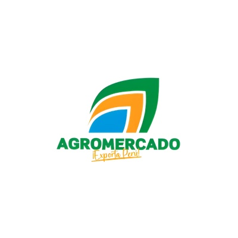
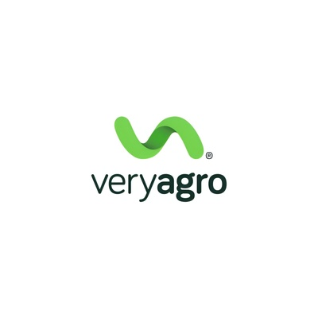

     

<h3 align="center"> Universidad Peruana de Ciencias Aplicadas </h3>

<h3 align="center">Carrera de  Ingeniería de Software </h3>

<h3 align="center">1ASI0729 </h3>
<h3 align="center">Desarrollo de Aplicaciones Open Source</h3>
<h3 align="center"> NRC </h3>
<h3 align="center"> 7747 </h3>

<h3 align="center">Informe del Trabajo Final</h3>

<h3 align="center"> Docente</h3>
<h3 align="center">Bautista Ubillús, Efraín Ricardo </h3>

<h3 align="center"> Equipo </h3>
<h3 align="center">TerraNova</h3>

<h3 align="center"> Proyecto</h3>
<h3 align="center"> TerraNova Platform </h3>

<h3 align="center"> Integrantes </h3>

| Code | Member |
| :---: | :--- |
| u20241f246 | Atauje Barreto, Alexander Sebastián |
| u202215188 | Egocheaga Suyo, Miguel Angel |
| u202116018 | Orellana Rodríguez, Mel Andree |
| U20231h171 | Vera Solsol, Nayely Macarena |
| u202318001 |Raymundo Villarroel, Abigail Nadhim |

<h3 align="center">Periodo 202620</h3>
<h3 align="center">Agosto, 2026</h3>

## Registro de Versiones del Informe

| Versión |    Fecha    |                Autor                |                                                                                                Descripción de modificación                                                                                                |
|:-------:|:----------:|:-----------------------------------:|:-------------------------------------------------------------------------------------------------------------------------------------------------------------------------------------------------------------------------:|
| [Versión] | [DD-MM-AAAA] | [Apellidos, Nombres] | [Descripción del cambio o aporte] |

## Project Report Collaboration Insights

| Integrante | Tareas Asignadas |
|---|---|
| [Nombre Completo 1] | [Lista de tareas realizadas] |
| [Nombre Completo 2] | [Lista de tareas realizadas] |
| [Nombre Completo 3] | [Lista de tareas realizadas] |
| [Nombre Completo 4] | [Lista de tareas realizadas] |
| [Nombre Completo 5] | [Lista de tareas realizadas] |

El proceso de colaboración en el informe se realizó mediante commits constantes al repositorio de la organización.

## Tabla de Contenidos

* [Capítulo I: Introducción](#capítulo-i-introducción)
  * [1.1. Startup Profile](#11-startup-profile)
    * [1.1.1. Descripción de la Startup](#111-descripción-de-la-startup)
    * [1.1.2. Perfiles de integrantes del equipo](#112-perfiles-de-integrantes-del-equipo)
  * [1.2. Solution Profile](#12-solution-profile)
    * [1.2.1. Antecedentes y problemática](#121-antecedentes-y-problemática)
    * [1.2.2. Lean UX Process](#122-lean-ux-process)
      * [1.2.2.1. Lean UX Problem Statements](#1221-lean-ux-problem-statements)
      * [1.2.2.2. Lean UX Assumptions](#1222-lean-ux-assumptions)
      * [1.2.2.3. Lean UX Hypothesis Statements](#1223-lean-ux-hypothesis-statements)
      * [1.2.2.4. Lean UX Canvas](#1224-lean-ux-canvas)
  * [1.3. Segmentos objetivo](#13-segmentos-objetivo)
* [Capítulo II: Requirements Elicitation & Analysis](#capítulo-ii-requirements-elicitation--analysis)
  * [2.1. Competidores](#21-competidores)
    * [2.1.1. Análisis competitivo](#211-análisis-competitivo)
    * [2.1.2. Estrategias y tácticas frente a competidores](#212-estrategias-y-tácticas-frente-a-competidores)
  * [2.2. Entrevistas](#22-entrevistas)
    * [2.2.1. Diseño de entrevistas](#221-diseño-de-entrevistas)
    * [2.2.2. Registro de entrevistas](#222-registro-de-entrevistas)
    * [2.2.3. Análisis de entrevistas](#223-análisis-de-entrevistas)
  * [2.3. Needfinding](#23-needfinding)
    * [2.3.1. User Personas](#231-user-personas)
    * [2.3.2. User Task Matrix](#232-user-task-matrix)
    * [2.3.3. User Journey Mapping](#233-user-journey-mapping)
    * [2.3.4. Empathy Mapping](#234-empathy-mapping)
  * [2.4. Big Picture Event Storming](#24-big-picture-event-storming)
  * [2.5. Ubiquitous Language](#25-ubiquitous-language)
* [Capítulo III: Requirements Specification](#capítulo-iii-requirements-specification)
  * [3.1. User Stories](#31-user-stories)
  * [3.2. Impact Mapping](#32-impact-mapping)
  * [3.3. Product Backlog](#33-product-backlog)
* [Capítulo IV: Product Design](#capítulo-iv-product-design)
  * [4.1. Style Guidelines](#41-style-guidelines)
    * [4.1.1. General Style Guidelines](#411-general-style-guidelines)
    * [4.1.2. Web Style Guidelines](#412-web-style-guidelines)
  * [4.2. Information Architecture](#42-information-architecture)
    * [4.2.1. Organization Systems](#421-organization-systems)
    * [4.2.2. Labeling Systems](#422-labeling-systems)
    * [4.2.3. SEO Tags and Meta Tags](#423-seo-tags-and-meta-tags)
    * [4.2.4. Searching Systems](#424-searching-systems)
    * [4.2.5. Navigation Systems](#425-navigation-systems)
  * [4.3. Landing Page UI Design](#43-landing-page-ui-design)
    * [4.3.1. Landing Page Wireframe](#431-landing-page-wireframe)
    * [4.3.2. Landing Page Mock-up](#432-landing-page-mock-up)
  * [4.4. Web Applications UX/UI Design](#44-web-applications-uxui-design)
    * [4.4.1. Web Applications Wireframes](#441-web-applications-wireframes)
    * [4.4.2. Web Applications Wireflow Diagrams](#442-web-applications-wireflow-diagrams)
    * [4.4.3. Web Applications Mock-ups](#443-web-applications-mock-ups)
    * [4.4.4. Web Applications User Flow Diagrams](#444-web-applications-user-flow-diagrams)
  * [4.5. Web Applications Prototyping](#45-web-applications-prototyping)
  * [4.6. Domain-Driven Software Architecture](#46-domain-driven-software-architecture)
    * [4.6.1. Design-Level Event Storming](#461-design-level-event-storming)
    * [4.6.2. Software Architecture Context Diagram](#462-software-architecture-context-diagram)
    * [4.6.3. Software Architecture Container Diagrams](#463-software-architecture-container-diagrams)
    * [4.6.4. Software Architecture Components Diagrams](#464-software-architecture-components-diagrams)
  * [4.7. Software Object-Oriented Design](#47-software-object-oriented-design)
    * [4.7.1. Class Diagrams](#471-class-diagrams)
  * [4.8. Database Design](#48-database-design)
    * [4.8.1. Database Diagrams](#481-database-diagrams)
* [Capítulo V: Product Implementation, Validation & Deployment](#capítulo-v-product-implementation-validation--deployment)
  * [5.1. Software Configuration Management](#51-software-configuration-management)
    * [5.1.1. Software Development Environment Configuration](#511-software-development-environment-configuration)
    * [5.1.2. Source Code Management](#512-source-code-management)
    * [5.1.3. Source Code Style Guide & Conventions](#513-source-code-style-guide--conventions)
    * [5.1.4. Software Deployment Configuration](#514-software-deployment-configuration)
  * [5.2. Landing Page, Services & Applications Implementation](#52-landing-page-services--applications-implementation)
    * [5.2.1. Sprint 1](#521-sprint-1)
      * [5.2.1.1. Sprint Planning 1](#5211-sprint-planning-1)
      * [5.2.1.2. Aspect Leaders and Collaborators](#5212-aspect-leaders-and-collaborators)
      * [5.2.1.3. Sprint Backlog 1](#5213-sprint-backlog-1)
      * [5.2.1.4. Development Evidence for Sprint Review](#5214-development-evidence-for-sprint-review)
      * [5.2.1.5. Execution Evidence for Sprint Review](#5215-execution-evidence-for-sprint-review)
      * [5.2.1.6. Services Documentation Evidence for Sprint Review](#5216-services-documentation-evidence-for-sprint-review)
      * [5.2.1.7. Software Deployment Evidence for Sprint Review](#5217-software-deployment-evidence-for-sprint-review)
      * [5.2.1.8. Team Collaboration Insights during Sprint](#5218-team-collaboration-insights-during-sprint)
    * [5.2.2. Sprint 2](#522-sprint-2)
      * [5.2.2.1. Sprint Planning 2](#5221-sprint-planning-2)
      * [5.2.2.2. Aspect Leaders and Collaborators](#5222-aspect-leaders-and-collaborators)
      * [5.2.2.3. Sprint Backlog 2](#5223-sprint-backlog-2)
      * [5.2.2.4. Development Evidence for Sprint Review](#5224-development-evidence-for-sprint-review)
      * [5.2.2.5. Execution Evidence for Sprint Review](#5225-execution-evidence-for-sprint-review)
      * [5.2.2.6. Services Documentation Evidence for Sprint Review](#5226-services-documentation-evidence-for-sprint-review)
      * [5.2.2.7. Software Deployment Evidence for Sprint Review](#5227-software-deployment-evidence-for-sprint-review)
      * [5.2.2.8. Team Collaboration Insights during Sprint](#5228-team-collaboration-insights-during-sprint)
    * [5.2.3. Sprint 3](#523-sprint-3)
      * [5.2.3.1. Sprint Planning 3](#5231-sprint-planning-3)
      * [5.2.3.2. Aspect Leaders and Collaborators](#5232-aspect-leaders-and-collaborators)
      * [5.2.3.3. Sprint Backlog 3](#5233-sprint-backlog-3)
      * [5.2.3.4. Development Evidence for Sprint Review](#5234-development-evidence-for-sprint-review)
      * [5.2.3.5. Execution Evidence for Sprint Review](#5235-execution-evidence-for-sprint-review)
      * [5.2.3.6. Services Documentation Evidence for Sprint Review](#5236-services-documentation-evidence-for-sprint-review)
      * [5.2.3.7. Software Deployment Evidence for Sprint Review](#5237-software-deployment-evidence-for-sprint-review)
      * [5.2.3.8. Team Collaboration Insights during Sprint](#5238-team-collaboration-insights-during-sprint)
    * [5.2.4. Sprint 4](#524-sprint-4)
      * [5.2.4.1. Sprint Planning 4](#5241-sprint-planning-4)
      * [5.2.4.2. Aspect Leaders and Collaborators](#5242-aspect-leaders-and-collaborators)
      * [5.2.4.3. Sprint Backlog 4](#5243-sprint-backlog-4)
      * [5.2.4.4. Development Evidence for Sprint Review](#5244-development-evidence-for-sprint-review)
      * [5.2.4.5. Execution Evidence for Sprint Review](#5245-execution-evidence-for-sprint-review)
      * [5.2.4.6. Services Documentation Evidence for Sprint Review](#5246-services-documentation-evidence-for-sprint-review)
      * [5.2.4.7. Software Deployment Evidence for Sprint Review](#5247-software-deployment-evidence-for-sprint-review)
      * [5.2.4.8. Team Collaboration Insights during Sprint](#5248-team-collaboration-insights-during-sprint)
  * [5.3. Validation Interviews](#53-validation-interviews)
    * [5.3.1. Diseño de Entrevistas](#531-diseño-de-entrevistas)
    * [5.3.2. Registro de Entrevistas](#532-registro-de-entrevistas)
    * [5.3.3. Evaluaciones según heurísticas](#533-evaluaciones-según-heurísticas)
  * [5.4. Video About-the-Product](#54-video-about-the-product)
* [Conclusiones y Recomendaciones](#conclusiones-y-recomendaciones)
* [Video App Validation](#video-app-validation)
* [Video About the product](#video-about-the-product)
* [Video About the team](#video-about-the-team)
* [Glosario](#glosario)
* [Bibliografía](#bibliografía)
* [Anexos](#anexos)

# Student Outcome

  <table style="width:100%; border-collapse: collapse; font-family: Arial, sans-serif; font-size: 14px;">
    <thead>
      <tr style="background-color: #f2f2f2; text-align: center;">
        <th style="border: 1px solid #dddddd; padding: 12px; width: 25%;">Criterio específico</th>
        <th style="border: 1px solid #dddddd; padding: 12px; width: 45%;">Acciones realizadas</th>
        <th style="border: 1px solid #dddddd; padding: 12px; width: 30%;">Conclusiones</th>
      </tr>
    </thead>
    <tbody>
      <tr>
        <td style="border: 1px solid #dddddd; padding: 10px; font-weight: bold; vertical-align: top;">
          Trabaja en equipo para proporcionar liderazgo en forma conjunta.
        </td>
        <td style="border: 1px solid #dddddd; padding: 10px; vertical-align: top;">
          <ul>
            <li><b>[Entrega] - [Nombre del Integrante]:</b> [Descripción de la acción realizada]</li>
          </ul>
        </td>
        <td style="border: 1px solid #dddddd; padding: 10px; vertical-align: top;">
          [Conclusión sobre el criterio]
        </td>
      </tr>
      <tr>
        <td style="border: 1px solid #dddddd; padding: 10px; font-weight: bold; vertical-align: top;">
          Crea un entorno colaborativo e inclusivo, establece metas, planifica tareas y cumple objetivos.
        </td>
        <td style="border: 1px solid #dddddd; padding: 10px; vertical-align: top;">
          <ul>
            <li><b>[Entrega] - [Nombre del Integrante]:</b> [Descripción de la acción realizada]</li>
          </ul>
        </td>
        <td style="border: 1px solid #dddddd; padding: 10px; vertical-align: top;">
          [Conclusión sobre el criterio]
        </td>
      </tr>
    </tbody>
  </table>

# Capítulo I: Introducción

## 1.1. Startup Profile
### 1.1.1. Descripción de la Startup
### 1.1.2. Perfiles de integrantes del equipo

## 1.2. Solution Profile
### 1.2.1. Antecedentes y problemática
### 1.2.2. Lean UX Process
#### 1.2.2.1. Lean UX Problem Statements
#### 1.2.2.2. Lean UX Assumptions
#### 1.2.2.3. Lean UX Hypothesis Statements
#### 1.2.2.4. Lean UX Canvas

## 1.3. Segmentos objetivo

# Capítulo II: Requirements Elicitation & Analysis

## 2.1. Competidores

Comprender el entorno competitivo resulta clave para el posicionamiento de cualquier modelo de negocio digital. En esta sección se realiza un análisis de los competidores de Allpatek, tanto directos como indirectos, evaluando las estrategias que aplican, así como sus principales fortalezas y debilidades frente a la propuesta de agricultura por contrato automatizada del negocio.

### 2.1.1. Análisis competitivo

Llevar a cabo un análisis competitivo es clave para reconocer oportunidades y riesgos en el mercado, así como para posicionar a Allpatek de manera estratégica. Este análisis permite comprender cómo los competidores atienden las necesidades de los clientes, identificar vacíos en el mercado y destacar nuestra solución a través de ventajas diferenciadoras. También facilita la elaboración de estrategias más efectivas de marketing, precios y distribución, garantizando una propuesta de valor sólida y sostenible.

<table>
    <tr>
       <td colspan="6" class="sub"><h1>Competitive Analysis Landscape</h1></td>
    </tr>
    <tr>
        <td colspan="2" rowspan="2" class="sub">¿Por qué llevar a cabo este análisis?</td>
        <td colspan="4" class="sub"><h3>¿Quiénes son nuestros principales competidores?</h3></td>
    </tr>
    <tr>
        <td colspan="4">Gracias al análisis de la competencia del mercado, se logra comprender el entorno competitivo en el que operará Allpatek. Esto permite identificar a los competidores directos e indirectos, evaluando su posicionamiento actual para trazar estrategias diferenciadas frente a la ausencia de una plataforma digital peruana que aplique íntegramente el modelo de agricultura por contrato automatizada.</td>
    </tr>
    <tr>
        <td rowspan="3" class="sub">PERFIL</td>
        <td rowspan="2" class="sub">Overview</td>
        <td> Allpatek </td>
        <td> Agromercado (MIDAGRI) </td>
        <td> VeryAgro </td>
        <td> Procesadora Perú </td>
    </tr>
    <tr>
        <td>Modelo Agro-as-a-Service (AaaS): el comprador alquila una parcela y contrata la labor del agricultor por una temporada, con formalización contractual y notificaciones automatizadas vía n8n.</td>
        <td>Sistema del Ministerio de Desarrollo Agrario y Riego que busca facilitar negocios directos y reducir brechas de información entre productores y compradores.</td>
        <td>Marketplace español (fundado en 2021) que conecta agricultores con proveedores de insumos agrícolas (fertilizantes, riego, maquinaria); anunció su ingreso a Perú como primer mercado de expansión en Latinoamérica.</td>
        <td>Empresa agroexportadora que aplica "siembra por contrato": compra anticipada de toda la cosecha a un precio mínimo garantizado, a más de 1,000 agricultores de Lambayeque, La Libertad y Piura.</td>
    </tr>
    <tr>
        <td class="sub">Ventaja Competitiva ¿Qué valor ofrece a los clientes?</td>
        <td>Automatización end-to-end del contrato (vía n8n) e ingreso garantizado por labor, no por resultado de cosecha.</td>
        <td>Respaldo institucional/estatal y alcance nacional gratuito.</td>
        <td>Catálogo amplio de proveedores (+60) y alta recurrencia de clientes reportada.</td>
        <td>Mercado asegurado y precio mínimo garantizado, con trayectoria comprobada a gran escala.</td>
    </tr>
    <tr>
        <td rowspan="2" class="sub">PERFIL DEL MARKETING</td>
        <td class="sub">Mercado Objetivo</td>
        <td>Familias agricultoras de pequeña escala + compradores urbanos (consumidores individuales, hogares urbanos, restaurantes y pymes del sector alimentario).</td>
        <td>Productores y compradores agrarios a nivel nacional.</td>
        <td>Agricultores que compran insumos (no vinculado a venta de cosecha).</td>
        <td>Agricultores de cultivos específicos (frijol de palo, entre otros) en el norte del país, a escala agroexportadora.</td>
    </tr>
    <tr>
        <td class="sub">Estrategias de Marketing</td>
        <td>Landing page orientada a conversión: CTA principal "Cotizar Parcela", métricas de confianza en el hero (100% pagos protegidos, 0% riesgo de estafa, 15+ hectáreas gestionadas, 25% ahorro promedio) y testimonios reales de agricultores y compradores como prueba social.</td>
        <td>Difusión institucional y gubernamental a través de canales del sector agrario.</td>
        <td>Estrategia de expansión regional hacia Latinoamérica, reforzando su equipo comercial y mejorando continuamente la plataforma digital.</td>
        <td>Relación directa y de largo plazo con asociaciones de productores agrícolas.</td>
    </tr>
    <tr>
        <td rowspan="3" class="sub">PERFIL DEL PRODUCTO</td>
        <td class="sub">Productos & Servicios</td>
        <td>Catálogo de parcelas, contratación y pago digital de temporada, generación automática de contrato, notificaciones de avance, panel de agricultor, calificación bidireccional.</td>
        <td>Sistema de intermediación de información comercial entre productores y compradores.</td>
        <td>Marketplace de insumos agrícolas.</td>
        <td>Compra anticipada de cosecha bajo contrato de precio fijo.</td>
    </tr>
    <tr>
        <td class="sub">Precios & Costos</td>
        <td>Suscripción mensual por planes: Básico (S/ 50 — 1 parcela activa, custodia de 4 hitos), Pro (S/ 123 — hasta 10 parcelas, evidencias GPS, alertas climáticas en vivo), Empresarial (S/ 250 — parcelas ilimitadas, integración API, gestor de cuenta dedicado).</td>
        <td>Gratuito (servicio público).</td>
        <td>No reportado públicamente.</td>
        <td>Precio "refugio" fijado por contrato, no público.</td>
    </tr>
    <tr>
        <td class="sub">Canales de distribución (web/móvil)</td>
        <td>Web responsive (Landing Page + Web Application).</td>
        <td>Plataforma web del Estado.</td>
        <td>Plataforma web.</td>
        <td>Gestión directa/comercial, sin canal digital de autoservicio.</td>
    </tr>
    <tr>
        <td rowspan="4" class="sub">ANÁLISIS SWOT</td>
        <td class="sub">Fortalezas</td>
        <td>Automatización completa del ciclo contractual; modelo que traslada el riesgo climático y de mercado fuera del agricultor; dos segmentos con necesidades complementarias y sustento académico.</td>
        <td>Respaldo institucional, alcance nacional, gratuito para el usuario.</td>
        <td>Modelo ya validado en España y Portugal; alta recurrencia de clientes reportada.</td>
        <td>Modelo de contrato probado a gran escala (+1,000 agricultores); relación de confianza consolidada con productores.</td>
    </tr>
    <tr>
        <td class="sub">Debilidades</td>
        <td>Startup nueva, sin base de usuarios ni reputación instalada; depende de la adopción digital de un segmento con acceso a internet limitado.</td>
        <td>No ofrece automatización contractual ni de pagos; solo facilita el contacto informativo entre partes.</td>
        <td>Enfocado en insumos agrícolas, no en la venta o contratación de cosecha; aún no opera en Perú.</td>
        <td>Sin canal digital de autoservicio; gestión manual/comercial no accesible para compradores urbanos pequeños.</td>
    </tr>
    <tr>
        <td class="sub">Oportunidades</td>
        <td>Ausencia de una plataforma digital peruana que aplique agricultura por contrato de forma automatizada; el interés de actores internacionales valida la categoría.</td>
        <td>Ampliar funcionalidades digitales dado el interés estatal creciente en trazabilidad agrícola.</td>
        <td>Expansión hacia Latinoamérica con Perú como primer destino desde 2027.</td>
        <td>Digitalizar su proceso de contratación podría ampliar su alcance a nuevos productores y compradores.</td>
    </tr>
    <tr>
        <td class="sub">Amenazas</td>
        <td>Iniciativas estatales gratuitas como sustituto de bajo costo; empresas agroexportadoras con escala ya consolidada podrían replicar un modelo digital similar.</td>
        <td>Bajo incentivo para innovar al ser un servicio público sin fines de lucro.</td>
        <td>Entrada tardía al mercado peruano frente a soluciones ya establecidas.</td>
        <td>Nuevos entrantes digitales (como Allpatek) podrían ofrecer una experiencia más accesible y transparente para compradores pequeños.</td>
    </tr>
</table>

### 2.1.2. Estrategias y tácticas frente a competidores

Entre las principales estrategias y tácticas que ejecutaremos como startup son las siguientes:

Por un lado, estas son las estrategias preliminares:

* Incursión en zonas agrícolas a través de alianzas con asociaciones de agricultores, gremios agrarios y organizaciones no gubernamentales del sector rural.
* Capacitación tecnológica gradual mediante material multimedia diseñado para agricultores con conocimientos digitales limitados.
* Optimización de la asistencia al agricultor utilizando medios de contacto directos como llamadas telefónicas, WhatsApp y soporte dentro de la plataforma.
* Generación de utilidad inmediata, brindando notificaciones automáticas de avance de cultivo, formalización legal instantánea del contrato (vía n8n) y funciones sin costo inicial.

Por otro lado, estas son nuestras tácticas específicas:

* Campañas de referidos para incentivar la difusión entre los mismos agricultores y compradores urbanos.
* Material educativo y guías de uso para motivar la adopción frecuente de la aplicación, tanto en el catálogo de parcelas como en el panel de agricultor.
* Adaptación regional del sistema, empleando modismos locales y asistencia personalizada según la zona (sierra, costa).
* Presencia en eventos del sector, tales como ferias agropecuarias y convenciones agrícolas.
* Acercamiento a técnicos agropecuarios, cooperativas y asociaciones de productores para posicionar a Allpatek frente a alternativas como Agromercado (gratuita pero sin automatización) o Procesadora Perú (sin canal digital de autoservicio).

## 2.2. Entrevistas

Se diseñaron guías de entrevista semiestructuradas para cada segmento, cubriendo características demográficas (edad, distrito, ocupación) y subjetivas (uso del celular, conectividad, confianza, canales digitales, objetivos, frustraciones), siguiendo buenas prácticas de needfinding.

### 2.2.1. Diseño de entrevistas

**Guía de entrevista — Segmento 1: Agricultores familiares**

*Preguntas básicas (iniciales):*
1. Para comenzar, ¿me podría decir su nombre?
2. ¿A qué se dedica? ¿Trabaja en la agricultura de forma principal o tiene algún otro trabajo adicional?
3. ¿Qué celular utiliza normalmente?
4. ¿Qué sistema operativo tiene su celular (Android, iPhone, o no lo sabe)?

*Preguntas principales:*
1. ¿Me podría contar un poco sobre usted y su trabajo en la agricultura?
2. ¿Cómo es normalmente un día de trabajo suyo en el campo?
3. ¿Cómo sabe qué trabajos tiene que realizar cada día o durante la semana?
4. ¿Suele usar su celular mientras está trabajando en el campo?
5. ¿Qué cosas le resultan fáciles y cuáles le resultan difíciles cuando usa el celular?
6. ¿Cómo es la señal de internet o del celular en el lugar donde trabaja?
7. Cuando no tiene señal, ¿qué hace si necesita enviar un mensaje, una foto o alguna información?
8. ¿Alguna vez ha tenido que tomar fotos del cultivo para enseñárselas a otra persona?
9. Cuando manda una foto del cultivo, ¿cómo demuestra cuándo y dónde fue tomada?
10. ¿Cómo se entera normalmente de que va a llover, hacer mucho frío o cambiar el clima?
11. ¿Alguna vez se enteró demasiado tarde de una lluvia fuerte, helada u otro cambio del clima?
12. Cuando alguien necesita saber cómo está avanzando su cultivo, ¿cómo se comunica con esa persona?
13. Imagine que usted toma una foto en el campo pero en ese momento no tiene internet. ¿Le serviría que el celular guarde esa foto y la mande automáticamente cuando vuelva la señal?
    *"¿Por qué?"*
14. ¿Le serviría que cuando tome una foto el celular guarde automáticamente el lugar, el día y la hora?
15. ¿Le gustaría recibir un aviso en su celular cuando haya riesgo de lluvia fuerte, helada u otro clima que pueda afectar su cultivo?
    *"¿Cómo preferiría recibir ese aviso?"*
16. ¿Qué tipo de aviso revisaría usted más rápido?
17. Si existiera una aplicación para ayudarle con estas cosas, ¿qué sería lo más importante para usted para que sea fácil de usar?
18. ¿Hay alguna cosa de su trabajo que le gustaría poder hacer más rápido o más fácilmente con el celular?

**Guía de entrevista — Segmento 2: Compradores urbanos / Comerciantes**

*Preguntas básicas (iniciales):*
1. Para comenzar, ¿me podría decir su nombre?
2. ¿A qué se dedica (negocio propio, restaurante, compra para su familia, etc.)?
3. ¿Qué celular utiliza normalmente?
4. ¿Qué sistema operativo tiene su celular (Android, iPhone, o no lo sabe)?

*Preguntas principales:*
1. ¿Me podría contar un poco sobre cómo compra normalmente los productos agrícolas que necesita?
2. ¿Cómo es un día normal cuando tiene que conseguir estos productos?
3. ¿Cómo decide a quién comprarle o dónde comprar cada vez?
4. ¿Usa su celular para hacer estas compras o para comunicarse con quien le vende?
5. ¿Qué cosas le resultan fáciles y cuáles difíciles al comprar productos agrícolas hoy en día?
6. ¿Qué tan seguido cambian los precios de un producto de una semana a otra? ¿Cómo le afecta eso?
7. ¿Alguna vez ha recibido un producto que no correspondía con lo que esperaba (calidad, cantidad, frescura)?
8. Cuando eso pasa, ¿cómo reclama o qué hace?
9. ¿Le interesa saber de dónde viene el producto, quién lo cultivó o cómo se produjo?
10. Si alguien le mandara una foto del cultivo antes de la cosecha, ¿confiaría en que esa foto es real y reciente?
    *"¿Qué le daría esa confianza?"*
11. ¿Alguna vez tuvo que esperar más de lo esperado para recibir un pedido? ¿Cómo se enteró del retraso?
12. Imagine que puede pagar por adelantado toda una temporada de un producto a un precio fijo, sin que le suba después. ¿Le interesaría?
    *"¿Por qué sí o no?"*
13. ¿Le gustaría recibir avisos en su celular sobre el avance del cultivo que compró (por ejemplo, cuándo se sembró o cuándo estará lista la cosecha)?
14. ¿Qué tipo de aviso revisaría usted más rápido: notificación de app, WhatsApp, correo o llamada?
15. Si existiera una aplicación para hacer este tipo de compras directamente con el agricultor, ¿qué sería lo más importante para que confíe en ella y la use seguido?
16. ¿Hay algo de este proceso de compra que le gustaría poder hacer más rápido o más fácil con el celular?
17. ¿Qué lo haría dudar o desconfiar de comprarle directamente a un agricultor a través de una app, sin intermediarios?
    
### 2.2.2. Registro de entrevistas
### 2.2.3. Análisis de entrevistas

## 2.3. Needfinding
### 2.3.1. User Personas
### 2.3.2. User Task Matrix
### 2.3.3. User Journey Mapping
### 2.3.4. Empathy Mapping

## 2.4. Big Picture Event Storming

## 2.5. Ubiquitous Language

# Capítulo III: Requirements Specification

## 3.1. User Stories

## 3.2. Impact Mapping

## 3.3. Product Backlog

# Capítulo IV: Product Design

## 4.1. Style Guidelines
### 4.1.1. General Style Guidelines
### 4.1.2. Web Style Guidelines

## 4.2. Information Architecture
### 4.2.1. Organization Systems
### 4.2.2. Labeling Systems
### 4.2.3. SEO Tags and Meta Tags
### 4.2.4. Searching Systems
### 4.2.5. Navigation Systems

## 4.3. Landing Page UI Design
### 4.3.1. Landing Page Wireframe
### 4.3.2. Landing Page Mock-up

## 4.4. Web Applications UX/UI Design
### 4.4.1. Web Applications Wireframes
### 4.4.2. Web Applications Wireflow Diagrams
### 4.4.3. Web Applications Mock-ups
### 4.4.4. Web Applications User Flow Diagrams

## 4.5. Web Applications Prototyping

## 4.6. Domain-Driven Software Architecture
### 4.6.1. Design-Level Event Storming
### 4.6.2. Software Architecture Context Diagram
### 4.6.3. Software Architecture Container Diagrams
### 4.6.4. Software Architecture Components Diagrams

## 4.7. Software Object-Oriented Design
### 4.7.1. Class Diagrams

## 4.8. Database Design
### 4.8.1. Database Diagrams

# Capítulo V: Product Implementation, Validation & Deployment

## 5.1. Software Configuration Management
### 5.1.1. Software Development Environment Configuration
### 5.1.2. Source Code Management
### 5.1.3. Source Code Style Guide & Conventions
### 5.1.4. Software Deployment Configuration

## 5.2. Landing Page, Services & Applications Implementation
### 5.2.1. Sprint 1
#### 5.2.1.1. Sprint Planning 1
#### 5.2.1.2. Aspect Leaders and Collaborators
#### 5.2.1.3. Sprint Backlog 1
#### 5.2.1.4. Development Evidence for Sprint Review
#### 5.2.1.5. Execution Evidence for Sprint Review
#### 5.2.1.6. Services Documentation Evidence for Sprint Review
#### 5.2.1.7. Software Deployment Evidence for Sprint Review
#### 5.2.1.8. Team Collaboration Insights during Sprint
### 5.2.2. Sprint 2
#### 5.2.2.1. Sprint Planning 2
#### 5.2.2.2. Aspect Leaders and Collaborators
#### 5.2.2.3. Sprint Backlog 2
#### 5.2.2.4. Development Evidence for Sprint Review
#### 5.2.2.5. Execution Evidence for Sprint Review
#### 5.2.2.6. Services Documentation Evidence for Sprint Review
#### 5.2.2.7. Software Deployment Evidence for Sprint Review
#### 5.2.2.8. Team Collaboration Insights during Sprint
### 5.2.3. Sprint 3
#### 5.2.3.1. Sprint Planning 3
#### 5.2.3.2. Aspect Leaders and Collaborators
#### 5.2.3.3. Sprint Backlog 3
#### 5.2.3.4. Development Evidence for Sprint Review
#### 5.2.3.5. Execution Evidence for Sprint Review
#### 5.2.3.6. Services Documentation Evidence for Sprint Review
#### 5.2.3.7. Software Deployment Evidence for Sprint Review
#### 5.2.3.8. Team Collaboration Insights during Sprint
### 5.2.4. Sprint 4
#### 5.2.4.1. Sprint Planning 4
#### 5.2.4.2. Aspect Leaders and Collaborators
#### 5.2.4.3. Sprint Backlog 4
#### 5.2.4.4. Development Evidence for Sprint Review
#### 5.2.4.5. Execution Evidence for Sprint Review
#### 5.2.4.6. Services Documentation Evidence for Sprint Review
#### 5.2.4.7. Software Deployment Evidence for Sprint Review
#### 5.2.4.8. Team Collaboration Insights during Sprint

## 5.3. Validation Interviews
### 5.3.1. Diseño de Entrevistas
### 5.3.2. Registro de Entrevistas
### 5.3.3. Evaluaciones según heurísticas

## 5.4. Video About-the-Product

# Conclusiones y recomendaciones

## Conclusiones
## Recomendaciones

# Video About-the-Team

# Bibliografía

# Anexos
